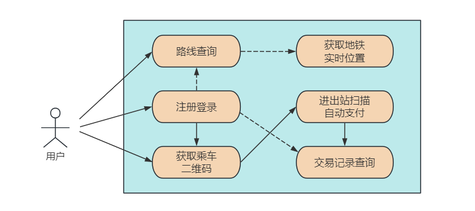
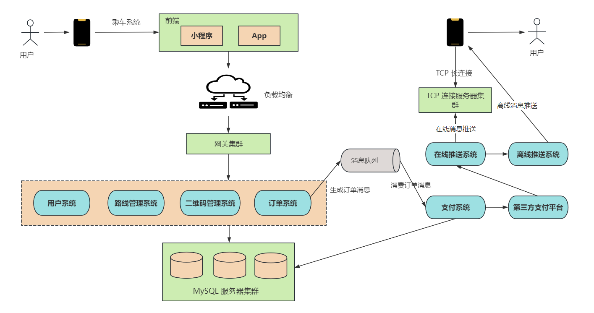

# 1. 引言

## 1.1 上班通勤的日常

“叮铃铃”，“叮铃铃”，早上七八点，你还在温暖的被窝里和闹钟“斗智斗勇”。

突然，你意识到已经快迟到了，于是像个闪电侠一样冲进卫生间，速洗漱，急穿衣，左手抄起手机，右手拿起面包，边穿衣边啃早餐。

这个时候，通勤的老难题又摆在了你面前：要不要吃完这口面包、刷牙和洗脸，还是先冲出门赶车？

好不容易做出了一个艰难的决定——放下面包，快步冲出门。你拿出手机，点开了熟悉的地铁乘车App或公交地铁乘车码小程序。

**然后，一张二维码在屏幕上亮了起来，这可是你每天通勤的“敲门砖”。**

你快步走到地铁站，将手机二维码扫描在闸机上，"嗖"的一声，闸机打开，你轻松通过，不再需要排队买票，不再被早高峰的拥挤闹心。你走进地铁车厢，挤到了一个角落，拿出手机，开始计划一天的工作。

## 1.2 公交&地铁乘车系统

正如上文所说，人们只需要一台手机，一个二维码就可以完成上班通勤的所有事项。

那这个便捷的公交或地铁乘车系统是如何设计的呢？它背后的技术和架构是怎样支撑着你我每天的通勤生活呢？

今天让我们一起揭开这个现代**都市打工人通勤小能手**的面纱，深入探讨**乘车系统的设计与实现**。

在这个文章中，小❤将带你走进乘车系统的世界，一探究竟，看看它是如何在短短几年内从科幻电影中走出来，成为我们日常生活不可或缺的一部分。

# 2. 需求设计

## 2.1 功能需求

- **用户注册和登录：** 用户可以通过手机应用或小程序注册账号，并使用账号登录系统。
- **路线查询：** 用户可以查询地铁的线路和站点信息，包括发车时间、车票价格等。
- **获取乘车二维码：** 系统根据用户的信息生成乘车二维码。
- **获取地铁实时位置：** 用户可以查询地铁的实时位置，并查看地铁离当前站台还有多久到达。
- **乘车扫描和自动支付：** 用户在入站和出站时通过扫描二维码来完成乘车，系统根据乘车里程自动计算费用并进行支付。
- **交易记录查询：** 用户可以查询自己的交易历史记录，包括乘车时间、金额、线路等信息。

## 2.2 乘车系统的非功能需求

乘车系统的用户量非常大，据《中国主要城市通勤检测报告-2023》数据显示，一线城市每天乘公交&地铁上班的的人数普遍超过千万，平均通勤时间在 45-60 分钟，并集中在早高峰和晚高峰时段。

所以，设计一个热点数据分布非均匀、人群分布非均匀的乘车系统时，需要考虑如下几点：

- **用户分布不均匀**，一线城市的乘车系统用户，超出普通城市几个数量级。
- **时间分布不均匀**，乘车系统的设计初衷是方便上下班通勤，所以早晚高峰的用户数会高出其它时间段几个数量级。
- **高并发：** 考虑到公交车/地铁系统可能同时有大量的用户在高峰时段使用，系统需要具备高并发处理能力。
- **高性能：** 为了提供快速的查询和支付服务，系统需要具备高性能，响应时间应尽可能短。
- **可扩展性：** 随着用户数量的增加，系统应该容易扩展，以满足未来的需求。
- **可用性：** 系统需要保证24/7的可用性，随时提供服务。
- **安全和隐私保护：** 系统需要确保用户数据的安全和隐私，包括支付信息和个人信息的保护。

# 3. 概要设计

## 3.1 核心组件

- **前端应用：** 开发手机 App 和小程序，提供用户注册、登录、查询等功能。
- **后端服务：** 设计后端服务，包括用户管理、路线查询、二维码管理、订单处理、支付系统等。
- **数据库：** 使用关系型数据库 MySQL 集群存储用户信息、路线信息、交易记录等数据。
- **推送系统：** 将乘车后的支付结果，通过在线和离线两种方式推送给用户手机上。
- **负载均衡和消息队列：** 考虑使用负载均衡和消息队列技术来提高系统性能。

## 3.2 乘车流程

### 1）用户手机与后台系统的交互

**1. 用户注册和登录：** 用户首先需要在手机应用上注册并登录系统，提供个人信息，包括用户名、手机号码、支付方式等。

**2. 查询乘车信息：** 用户可以使用手机应用查询公交车/地铁的路线和票价信息，用户可以根据自己的出行需求选择合适的线路。

**3. 生成乘车二维码：** 用户登录后，系统会生成一个用于乘车的二维码，这个二维码可以在用户手机上随时查看。这个二维码是城市公交系统的通用乘车二维码，同时该码关联到用户的账户和付款方式，用户可以随时使用它乘坐任何一辆公交车或地铁。

### 2）用户手机与公交车的交互

1. **用户进站扫码：** 当用户进入地铁站时，他们将手机上的乘车码扫描在进站设备上。这个设备将扫描到的乘车码发送给后台系统。
2. **进站数据处理：** 后台系统接收到进站信息后，会验证乘车码的有效性，检查用户是否有进站记录，并记录下进站的时间和地点。
3. **用户出站扫码：** 用户在乘车结束后，将手机上的乘车码扫描在出站设备上。
4. **出站数据处理：** 后台系统接收到出站信息后，会验证乘车码的有效性，检查用户是否有对应的进站记录，并记录下出站的时间和地点。

### 3）后台系统的处理

1. **乘车费用计算：** 基于用户的进站和出站地点以及乘车规则，后台系统计算乘车费用。这个费用可以根据不同的城市和运营商有所不同。
2. **费用记录和扣款：** 系统记录下乘车费用，并从用户的付款方式（例如，绑定的银行卡）中扣除费用。
3. **乘车记录存储：** 所有的乘车记录，包括进站、出站、费用等信息，被存储在乘车记录表中，以便用户查看和服务提供商进行结算。
4. **通知用户：** 如果有需要，系统可以向用户发送通知，告知他们的乘车费用已被扣除。
5. **数据库交互：** 在整个过程中，系统需要与数据库交互来存储和检索用户信息、乘车记录、费用信息等数据。

# 3. 详细设计

详细设计除了要设计出表结构以外，我们还针对三个核心问题进行讨论：

1. 起止位置路线查询
2. 生成乘车二维码
3. 车辆实时位置查询

### 3.1 数据库设计

- **用户信息表（User）**，包括用户ID、手机号、密码、支付方式、创建时间等。
- **二维码表 (QRCode)**，包括二维码ID、用户ID、城市ID、生成时间、有效期及二维码数据等。
- **车辆&地铁车次表 (Vehicle)**，包括车辆ID、车牌或地铁列车号、车型（公交、地铁）、扫描设备序列号等。
- **乘车记录表 (TripRecord)**，包括记录ID、用户ID、车辆ID、上下车时间、起止站点等。
- **支付记录表 (PaymentRecord)**，包括支付ID、乘车记录ID、交易时间、交易金额、支付方式、支付状态等。

以上是一些可能在公交车&地铁乘车系统中需要设计的数据库表及其字段的基本信息，后续可根据具体需求和系统规模，还可以进一步优化表结构和字段设计，以满足性能和扩展性要求。

此外，还需要考虑数据库索引、表之间的关联关系等方面的设计来确保系统的高效运行。

### 3.2 起止位置路线查询

当用户输入起止地点并发起路线查询时，系统的系统设计和数据流走向如下：

1. **用户界面输入起止地点：** 用户通过手机App或自助机器界面输入起点和终点地点信息。
2. **前端请求处理：** 用户输入的信息通过前端界面传递到后台服务器。
3. **路线查询请求接收：** 后台服务器接收到用户的路线查询请求，包括起始地点的坐标或地址信息。
4. **地理编码服务：** 系统使用地理编码服务将用户输入的地址信息转换为地理坐标。这一步骤是为了后续的路线规划和导航做准备。
5. **路线规划：** 一旦获得了起始地点的地理坐标，系统调用路线规划引擎来查找最佳的公交或地铁路线。路线规划引擎根据地铁和公交线路数据、起点和终点的坐标，以及用户的偏好（最短时间、最少换乘等）来计算最佳路线。
6. **路线推荐：** 路线规划引擎找到一条或多条可行的路线后，将推荐的路线信息返回给后台服务器。
7. **后台数据处理：** 后台服务器接收到路线信息后，可能会进行额外的数据处理，例如计算票价、估计到达时间等。
8. **路线推荐返回给前端：** 处理完毕后，后台服务器将最佳路线的推荐信息返回给前端用户界面。
9. **用户界面展示路线：** 前端用户界面展示路线推荐给用户，包括起止地点、途径站点、预计到达时间、票价等。
10. **导航引擎启动：** 一旦用户选择了一条路线，导航引擎启动并提供实时导航指引。导航引擎可能会使用地图数据和GPS定位来指导用户前往起始站点。
11. **用户乘车记录：** 当用户按照推荐的路线乘车时，系统会记录乘车信息，包括起止位置、路线、时间等，这些数据可以存储在乘车记录表中。
12. **数据库交互：** 在整个过程中，系统需要与数据库交互来存储和检索站点、线路、用户查询记录等数据。

这个系统设计确保了用户输入的起止地点被准确转换为地理坐标，并通过路线规划引擎找到最佳的路线推荐。同时，导航引擎提供实时导航指引，帮助用户顺利到达目的地。乘车记录的存储也有助于后续的数据分析和服务改进。

### 3.3 生成乘车二维码

乘车码是通过QR码（Quick Response Code）技术生成的。以下是该功能下用户和系统之间的交互、二维码信息存储、以及高并发请求处理的详细说明：

1. **用户与系统交互：** 用户首先在手机App上登录，系统会验证用户的身份和付款方式。一旦验证成功，系统会为该用户生成一个独特的乘车二维码。
2. **乘车码生成：** 后台系统使用QR码生成库，根据用户的身份信息和付款方式，动态生成一个QR码。这个QR码包含了用户的标识信息和相关的乘车参数。
3. **二维码信息存储：** 生成的二维码信息需要在后台进行存储和关联。通常，这些信息会存储在一个专门的数据库表中，该表包含以下字段：
   - 用户ID：与乘车码关联的用户唯一标识。
   - 二维码数据：QR码的内容，包括用户信息和乘车参数。
   - 生成时间：二维码生成的时间戳，用于后续的验证和管理。
   - 有效期限：二维码的有效期，通常会设置一个时间限制，以保证安全性。
4. **高并发请求处理：** 在高并发情况下，大量的用户会同时生成和扫描二维码，因此需要一些策略来处理这些请求：
   - **负载均衡：** 后台系统可以采用负载均衡技术，将请求分散到多个服务器上，以分担服务器的负载。
   - **缓存优化：** 二维码的生成是相对耗时的操作，可以采用缓存来存储已生成的二维码，避免重复生成。缓存可以使用诸如Redis等内存数据库来实现。
   - **请求队列：** 可以使用消息队列系统，如RabbitMQ或Kafka，来处理生成和验证请求的队列。这有助于控制并发请求，确保每个请求都得到处理。
   - **限制频率：** 为了防止滥用，可以限制每个用户生成二维码的频率，例如，每分钟只允许生成一次。这可以通过请求频率限制器来实现。

总之，通过QR码技术生成乘车码，后台系统需要具备高并发处理的能力，包括负载均衡、缓存、消息队列和频率限制等策略，以确保用户能够快速获得有效的乘车二维码。同时，二维码信息需要被安全地存储和管理，以保护用户的隐私和付款信息。

### 3.4 实时位置查询

在软件架构层面，公交车或地铁系统通常使用以下方法来存储定位信息并将车辆距离当前站还有多久的信息发送给用户手机：

1. **数据存储**：位置数据通常存储在专门的地理信息系统（GIS）数据库中，这些数据库可以是关系型数据库（如MySQL、PostgreSQL）或NoSQL数据库（如MongoDB、Cassandra）。GIS数据库具备地理空间数据处理的能力，可以有效地存储和查询车辆位置信息。
2. **核心组件**：
   - **车辆装备**：每辆公交车或地铁装备有GPS设备，用于实时定位并将位置数据发送给中央服务器。
   - **中央服务器**：中央服务器是整个系统的核心，它接收来自车辆的实时位置数据，处理这些数据并计算车辆距离当前站点的时间。中央服务器还存储了站点、路线、车辆信息等数据，以支持定位和计算过程。
   - **用户手机应用**：用户的手机上安装了专门的应用程序，用于接收实时车辆位置信息和到站时间的估算。用户可以通过该应用查看车辆的实时位置、下一站的预计到站时间等信息。
3. **业务交互流程**：
   - **数据采集**：每辆公交车或地铁都装备有GPS设备，定期发送位置数据到中央服务器。
   - **位置处理**：中央服务器接收到车辆的位置数据后，使用车辆追踪算法计算车辆的实时位置、速度和行进方向。
   - **到站时间计算**：基于车辆的实时位置、路线数据和车速，中央服务器计算出车辆距离下一个站点还有多远以及预计到站时间。
   - **信息推送**：中央服务器将实时位置和到站时间信息发送到用户的手机应用，用户可以查看这些信息。
4. **数据库表设计**：数据库通常包括以下表：
   - **车辆位置表**：存储每辆车的实时位置信息，包括经纬度、速度、时间戳等。
   - **站点表**：存储公交车或地铁的站点信息，包括站点名称、坐标、站点顺序等。
   - **路线表**：存储车辆的路线信息，包括路线名称、站点顺序等。
   - **用户信息表**：存储用户的注册信息和偏好设置。
5. **自动支付**：自动支付通常是通过与第三方支付系统（如支付宝、微信支付）集成来实现的。用户可以在手机应用上绑定支付方式，系统会根据用户的实际乘车情况自动扣费。

# 4. 乘车系统的发展

总之，公交车或地铁的定位和到站时间计算系统涉及车辆装备、中央服务器、数据库、用户手机应用等核心组件，并通过实时数据采集、位置处理、到站时间计算和信息推送等流程来为用户提供准确的乘车信息。同时，自动支付也是为了方便用户的重要功能，可以通过与第三方支付系统的集成来实现。

公交车/地铁乘车系统的发展可以包括以下方向：

- **智能化乘车：** 引入智能设备，如人脸自动识别乘客、人脸扣款等。
- **大数据分析：** 利用大数据技术分析乘车数据，提供更好的服务。

在设计和发展过程中，要不断考虑用户体验、性能和安全，确保系统能够满足不断增长的需求。

文章结束，希望读者能够对设计地铁乘车系统有更深入的了解，并期待更多创新的交通出行解决方案的出现。如果觉得这篇文章有趣或者有所启发，不妨点赞、分享，让更多人了解这个有趣的领域吧！