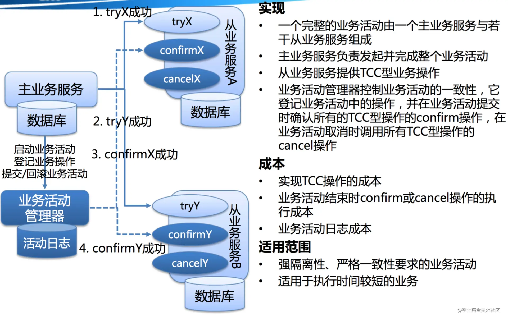
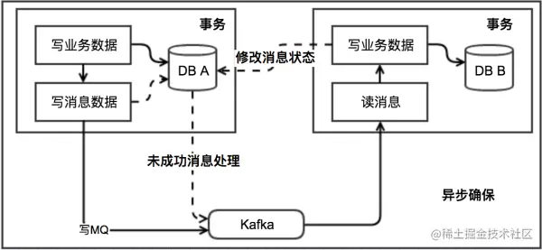

## 1. 引言

大家好，我是小❤，一个漂泊江湖多年的 985 非科班程序员，曾混迹于国企、互联网大厂和创业公司的后台开发攻城狮。

在上篇文章中，我们已经谈到了分布式中至关重要的两个理论： **CAP 理论和 BASE 理论**。

> 时光穿梭机：深入浅出分布式、CAP 和 BASE 理论

今天，小❤将带大家探讨分布式事务的常见解决方案，帮助大家更好地理解分布式系统的奥秘。

## 2. 分布式事务常见的解决分案

分布式事务是在分布式系统中，跨越多个计算机节点或数据存储系统进行的事务，在这种环境下保证事务的ACID（原子性、一致性、隔离性、持久性）属性是一大挑战。

我们常常有以下几种解决方案。

### 1）2PC

二阶段提交协议（Two-phase commit protocol），简称 2PC。两阶段提交是一种强一致性事务协议，它分为准备阶段和提交阶段。

在准备阶段，协调者节点询问所有参与者是否准备好提交事务，如果所有参与者都答应准备好了，那么在提交阶段，协调者会通知所有参与者提交事务。如果有任何一个参与者在准备阶段没有准备好，那么协调者会通知所有参与者回滚事务。

有熟悉 MySQL 的同学可能马上想到了，MySQL 的事务提交就是通过几种日志来实现二阶段提交的。

> 不了解MySQL执行流程的可以看我之前写的这篇文章：一张图看懂SQL执行流程

#### 优点

2PC 尽量保持了数据强一致性，实现成本低，各大主流数据库都有实现，比如 MySQL 从 5.5 版本开始支持。

#### 缺点

1. 单点故障问题：各参与者都依赖协调者来决定是否执行事务，若协调者节点发生故障或者宕机，就会导致参与者处于阻塞状态；
2. 数据不一致：当协调者在判断事务是否提交后，像各参与者发送处理命令，若此时节点挂掉，会导致只有一部分参与者收到了提交或者回滚的命令，会导致数据不一致；
3. 不支持高并发：二阶段提交过程是同步阻塞的，效率低下。

#### 实用场景

- **项目/公司**: 银行和金融机构的交易系统。
- **实用场景**: 在金融领域，比如跨行转账，需要在多个银行之间保持账务的强一致性。
- **推荐场景**: 当业务场景要求数据的一致性非常高，且可以接受一定程度的性能损失时，2PC是一个合适的选择。

### 3PC

三阶段提交协议（Three-phase commit protocol），简称 3PC。三阶段提交是两阶段提交的改进版本，增加了一个预提交阶段来减少阻塞时间，提高系统的可用性。

在预提交阶段，协调者询问参与者是否可以提交事务，只有当所有参与者都同意后，才会进入到准备阶段。

#### 实用场景

- **项目/公司**: 由于3PC相比2PC提供了更好的容错性，一些分布式数据库系统如XA协议扩展可能会使用3PC。
- **实用场景**: 在数据库分布式事务管理中，用于提高分布式事务的可靠性。
- **推荐场景**: 在需要比2PC更好的容错性和减少阻塞的分布式系统中，3PC是更好的选择。

#### TCC

TCC是一种应用层的分布式事务解决方案。它将事务分为三个步骤：尝试（Try）、确认（Confirm）和取消（Cancel）。

在Try阶段，会预留必要的业务资源；在Confirm阶段，如果所有相关的业务操作都成功了，则正式执行业务操作；如果有操作失败，则在Cancel阶段执行补偿操作，回滚之前的预留资源。

#### 实用场景

- **项目/公司**: 在电子商务平台如阿里巴巴中用于处理订单、支付等业务。
- **实用场景**: 用户在电商平台下单购买商品，涉及到库存、账户余额、积分等多个服务的数据变更。
- **推荐场景**: 对于复杂业务流程中的分布式事务，需要在业务层进行更细粒度控制时，TCC是一个好的选择。

TCC（Try-Confirm-Cancel）引入业务活动管理器，管理各节点事务的一致性，它将事务处理分为三个阶段：

1. Try 阶段：尝试执行，完成所有业务检查，预留必须的业务资源；
2. Confirm 阶段：确认执行业务（满足幂等性），不做任务业务检查，只使用 Try 阶段预留的业务资源，失败后会进行重试；
3. Cancel 阶段：取消执行，释放 Try 阶段预留的业务资源，也满足幂等性。

举例说明：比如你用 100 元买一瓶水：

- Try：检查钱包的钱是否大于等于 100，并锁住资源（100 元和这瓶水）；
- Cancel：如果有一个资源锁定失败，则进行 cancel 释放资源，这个过程中无论 cancel 还是其它操作失败都进行重试 cancel，所以需要保证幂等性；
- Confirm：如果资源锁定都成功，则进行 confirm，资源交换，这个过程中无论 confirm 还是其它操作失败都进行重试 confirm，需保证幂等性。

TCC 的出现解决二阶段提交的几个缺点：

1. 单点故障问题：引入了多个业务活动管理器，集群下高可用；
2. 数据不一致问题：引入超时补偿机制，由业务活动管理器来控制一致性；
3. 同步阻塞问题：引入超时补偿机制，不会锁定同步，将资源转换为业务逻辑形式，粒度更小。

### 分布式补偿事务（Saga）

Saga是一种长事务的解决方案，它将一个大的分布式事务拆分成多个较小的本地事务，这些本地事务通过异步消息传递串联起来。

每个本地事务执行成功后，会发送消息触发下一个事务的执行。如果某个本地事务失败，Saga会执行一系列补偿操作（回滚之前的操作）来保持数据的一致性。

#### 实用场景

- **项目/公司**: 在微服务架构中常见，如Uber、Netflix等。
- **实用场景**: 在订单服务中创建订单后，需要依次调用库存服务、支付服务和通知服务，每个服务调用都可能失败并需要回滚。
- **推荐场景**: 对于长事务和跨多个微服务的业务流程，Saga模式能够提供更好的故障隔离和服务自治。

### 分布式锁

在某些情况下，可以使用分布式锁来确保多个分布式节点不会同时操作同一资源。这可以通过Redis、ZooKeeper等分布式协调服务来实现。

- **项目/公司**: 使用Redis、ZooKeeper等实现分布式锁的系统。
- **实用场景**: 在电商秒杀活动中，防止超卖现象，确保同一时间只有一个请求能够对库存数量进行修改。
- **推荐场景**: 当需要协调多个节点对共享资源进行访问控制时，分布式锁是一个有效的解决方案。

### 最终一致性（BASE, Basically Available, Soft state, Eventually consistent）

最终一致性是对CAP定理中一致性和可用性之间权衡的结果。它允许系统在一段时间内是不一致的，但最终会达到一致状态。

这种方式通常通过使用消息队列、事件驱动架构等异步方式来实现。

- **项目/公司**: 微博、微信等社交网络服务，亚马逊的分布式存储系统Dynamo。
- **实用场景**: 用户发表一个微博，微博信息需要被分发到他的粉丝的时间线上，这个过程可以异步完成。
- **推荐场景**: 当系统要求高可用性和可扩展性，且可以容忍短时间的数据不一致时，最终一致性是合适的。

本地消息表（Local Message Table）、消息事务和最大努力通知（Maximum Effort Notification）是分布式事务的3种解决方案，它们都属于确保分布式系统中事务最终一致性的方法。

下面分别介绍这3种方法：

#### 本地消息表

本地消息表是一种确保分布式事务最终一致性的方法。它的工作原理是：

1. 在执行本地事务的同时，将需要异步执行的远程服务调用相关信息存储在同一个本地数据库的消息表中。
2. 本地事务和消息表的写入操作在同一个数据库事务中完成，这样可以保证要么都成功，要么都失败，从而保证了数据的一致性。
3. 本地事务提交后，一个独立的消息发布程序会定期扫描消息表，对于未处理的消息，发布到消息队列或直接调用远程服务。
4. 远程服务处理完成后，消息会被标记为已处理，从而确保每条消息只被处理一次。

本地消息表是 ebay 公司提出的事务解决方案（完整：https://queue.acm.org/detail.cfm?id=1394128），它的核心原理是将需要分布式处理的任务通过消息日志的方式来异步执行。消息日志可以存储到本地文件、数据库或消息队列，再通过业务规则或人工发起重试。

本地消息表基于 BASE 理论，实现数据的最终一致性，实现过程中需要注意幂等性原则。

**实用场景**:

- 电商平台中，用户下单操作涉及到修改订单数据库和通知库存系统减少库存，可以在订单数据库中建立消息表来确保库存系统最终会收到减库存的消息。

#### 可靠消息最终一致性

通过可靠消息服务保证消息的可靠传输，并在消息消费者那里进行本地事务处理，从而实现最终一致性，所以又被称作**消息事务**。如果消息处理失败，可以重试或者进行人工干预。

执行流程：

- 发送prepare消息到消息中间件
- 发送成功后，执行本地事务
  - 如果事务执行成功，则commit，消息中间件将消息下发至消费端
  - 如果事务执行失败，则回滚，消息中间件将这条prepare消息删除
- 消费端接收到消息进行消费，如果消费失败，则不断重试

这种方案也是实现了**「最终一致性」**，对比本地消息表实现方案，不需要再建消息表，**「不再依赖本地数据库事务」**了，所以这种方案更适用于高并发的场景。目前市面上实现该方案的**「只有阿里的 RocketMQ」**。

##### 实用场景

- **项目/公司**: 电商平台如京东、淘宝，在订单和库存系统之间保持数据一致性。
- **实用场景**: 用户下单成功后，订单系统发送消息到消息队列，库存系统订阅消息后进行库存扣减。
- **推荐场景**: 当业务流程可以异步处理，且需要保证业务操作最终一致性时，可靠消息服务是一个好的选择。

#### 最大努力通知

最大努力通知也是一种基于消息的分布式事务解决方案，但它不保证100%的消息传递成功。它的工作原理是：

1. 在本地事务执行成功后，系统会尝试通知其他的参与者或服务。
2. 通知操作会尽最大努力去执行，但如果失败，系统不会无限重试。
3. 该方案通常结合人工干预，例如，如果通知失败，系统可能会记录日志、发送报警、或者提供管理界面供操作人员手动处理。

本地消息表，或者通过 MQ 对事务进行通知都可以算作最大努力。本地消息表通过后台定时任务去异步保证数据的一致性，就是一种最大努力通知的思想：代表系统各模块之间已经最大程度地保证事务的最终一致性了。

**实用场景**:

- 在金融系统中，当用户进行转账操作后，银行系统会尽最大努力通知用户转账成功，比如通过短信、邮件等方式。如果通知失败，银行可能会记录失败事件，供客服人员后续跟进。

#### 推荐使用场景

- **本地消息表**适用于对数据一致性要求较高的业务场景，它可以保证即使服务调用失败，消息也不会丢失，后续可以通过重试等手段完成业务逻辑。
- **最大努力通知**适用于对实时性要求不高且可以容忍偶尔失败的业务场景，通常需要结合人工干预来处理失败的情况。

在选择解决方案时，需要根据业务的特点和容错需求来决定。上述3种对于保证数据由强到弱？

如果需要数据相对强一致性的场景，本地消息表可能是更好的选择，而对于可以接受偶尔失败并通过人工处理的场景，最大努力通知可能更合适。

## 小结

在选择分布式事务解决方案时，需要根据业务需求、系统复杂度、性能要求等因素进行权衡。例如，对于强一致性要求很高的业务，可能需要选择两阶段提交或三阶段提交；而对于可容忍短时间内数据不一致的业务，则可以考虑最终一致性相关的解决方案。

参考：

腾讯云：https://cloud.tencent.com/developer/article/1806989

