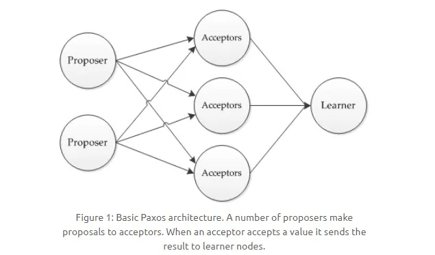
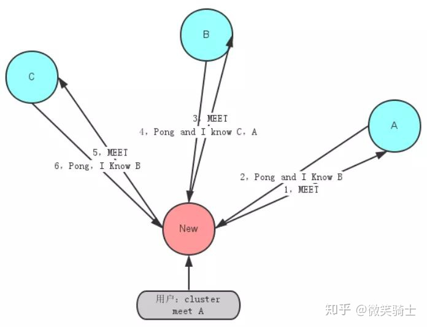

### 4）分布式算法

#### 1）Paxos 算法【读音：pksos】

Paxos 算法将系统中的节点分为三类：

- 提议者（Proposer）：提议一个值
- 接受者（Aceeptor）：对每个提议进行投票
- 告知者（Learner）：被告知投票的结果，不参与投票过程。

提议的时候，包含俩字段：[n, v]，其中 n 为序号，v 为提议值。每个 Aceeptor 在接收提议请求的时候，会比对其中的序号 n：

- 当前序号小于已存在的 n 时，则不予理会；
- 当前序号大于 n 时，会返回响应，表示接受了这个序号为 n 的提议。

当一个 Proposer 接收到超过半数的 Aceeptor 响应时，说明该提议值被 Paxos 选择了出来，就可以发送通知给所有的 Learner。

#### 2）Raft 算法

引入主节点，通过竞选来获取主节点。节点分为三类：

- 领头结点 Leader
- 从节点 Follower
- 候选节点 Candidate

1. Leader 变为 Candidate

每个 Follower 都会接收 Leader 周期性的心跳，一般为 150~300ms，如果一段时间之后还未收到心跳包，Follower 就变为 Candidate。

1. Candidate 竞选 Leader

Follower 变为 Candidate 后，开始发送投票消息给其它所有存活节点，其它节点会对其请求进行回复，如果超过半数的节点回复了竞选请求，那么该 Candidate 就会变成 Leader 节点。如果平票，则每个节点设置一个随机时间后开始竞选，所有节点重新进行投票。

1. 新 Leader 开始工作

新 Leader 周期性发送心跳包给 Follower，Follower 收到心跳包以后重新计时。这时，Leader 如果接收到了客户端请求，会将数据变更写入日志中，并把数据复制到所有 Follower。当大多数 Follower 进行修改后，将数据变更操作提交。然后，Leader 会通知所有的 Follower 让它们提交修改，此时所有节点的数据达成一致。

#### 3）Gossip算法

Gossip 又被称为流行病算法，它与流行病毒在人群中传播的性质类似，由初始的几个节点向周围互相传播，到后期的大规模互相传播，最终达到一致性。

Gossip 协议被广泛应用于 P2P 网络，同时一些分布式的数据库，如 Redis 集群的消息同步使用的也是 Gossip 协议，另一个重大应用是被用于比特币的交易信息和区块信息的传播。

Gossip传输示意图

Gossip 协议的整体流程非常简单，传输示意图见上图.初始由几个节点发起消息，这几个节点会将消息的更新内容告诉自己周围的节点，收到消息的节点再将这些信息告诉周围的节点。依照这种方式，获得消息的节点会越来越多，总体消息的传输规模会越来越大，消息的传偶速度也越来越快。

虽然不是每个节点都能在相同的时间达成一致，但是最终集群中所有节点的信息必然是一致的，Gossip 协议确保的是分布式集群的最终一致性。

预先设定好消息更新的周期时间 T，以及每个节点每个周期能够传播的周围节点数 2，我们可以得到大致的消息更新流程如下：

1. 节点 A 收到新消息并更新
2. 节点 A 将收到的消息传递给与之直接相连的 B,C
3. B,C 各自将新更新的消息传给与之直接相连的两个节点，这些节点不包含 A
4. 最终集群达成一致

#### 4）一致性hash算法

解决hash算法的迁移成本，向集群中添加节点时，有一致hash算法，可以极大地降低迁移数据量。

1）不带虚拟节点的一致性hash算法，和普通的hash算法一样，都是将节点取模进行路由寻址。不同的是，一致性hash算法通过对 2^32进行取模，形成一个硕大的hash环，节点取模后将位置映射到hash环上。读取key值时，通过hash函数，将key对应的位置在环上找出来，并沿一个方向进行查找，遇到的第一个节点就是key对应的节点。这时，如果其中某个节点宕机了，只需要在环上的相近位置扩容一个节点就可，此时的数据迁移仅仅是新节点和宕机节点之间的数据。它的问题是，可能会存在很多访问请求只集中在少量的几个节点上，数据分布不均。

带虚拟节点的一致性 hash 算法，对每个服务器计算多个 hash 值，在每个计算结果对应的位置上，都放置一个虚拟的节点。而当新的访问到虚拟节点时，会映射到真实的节点上。

2）项目场景，某个region区的缓存达到上限？新增缓存节点，为了保证缓存数据的均匀，一般会采用key值hash，然后取模的方式。最后根据结果，确认数据落到哪个节点上。	这时有个问题，我们在删减服务器的时候，大部分缓存都会失效。我们希望增删缓存服务器时，大部分的key依旧在原来的缓存服务器上不变，用“一致性hash算法”。