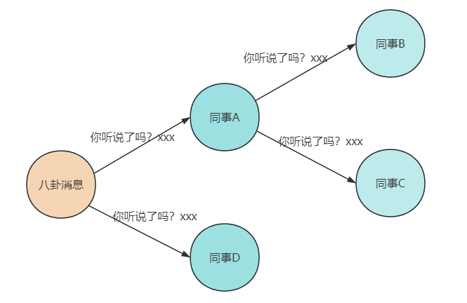

大家好，我是小❤，一个漂泊江湖多年的 985 非科班程序员，曾混迹于国企、互联网大厂和创业公司的后台开发攻城狮。

### 引言

前面我们已经讲了分布式 CAP、BASE 理论及分布式事务的 8 种解决方案，今天我们来聊一聊常见的几种分布式算法。

> 深入浅出：分布式、CAP 和 BASE 理论
>
> [数据齐舞：深入浅出分布式事务的八奇技](https://mp.weixin.qq.com/s?__biz=MzI5Nzk2MDgwNg==&mid=2247485762&idx=1&sn=7770c1de5e22b62a5cee1658432e8ff5&chksm=ecac5d4bdbdbd45dd071c9f08a47cb93649773af9170ab41dd719be4c4708c3e67cc82132fff&token=1824443284&lang=zh_CN#rd)

### 1. Paxos 算法

Paxos 算法的业务场景就好比是在一个大公司的董事会选举中心选出新董事长，但这个过程是在乌云密布的风雨天进行，**通信极度不稳定**，董事们时不时被困在电梯里或是在高尔夫球场打不了电话。

在 Paxos 算法中，每个董事（参与者）都是独立操作的，而这个算法就是确保即便在通信可能失败，董事们也能达成一致。

它通过一系列的**提议（proposal）和承诺（promise）**来保证最终的一致性。

#### 业务场景

假设，现在有 3 个董事候选人在争夺董事长职位，用 Paxos 算法来表示这个过程，可分为三个阶段：

1. **准备阶段（Prepare）**:
   - 候选董事 A 向所有董事会成员（不包含其它候选人）发送一个带有特定提议编号的请求。
   - 其他董事会成员在确保该提议编号高于任何之前收到的提案编号的情况下，会承诺不会接受编号更低的提议，它们响应说：“好的，你是编号最高的候选人，我听听你的是啥提案”。
2. **批准阶段（Accept）**:
   - 当候选董事 A 收到了多数董事会成员的承诺后，它会向那些承诺过的成员发送详细的提案内容。
   - 如果这些董事会成员没有对更高编号的提案做出过承诺，它们就会接受这个提案。
3. **学习阶段（Learn）**:
   - 一旦提案被多数董事会成员批准，这个候选人就被选为新董事，每个董事会成员会记录下来这个结果。
   - 此时，所有其他员工或股东都需要知道这个结果，这样新董事的确立就在全公司范围内达到了一致。

在这过程中，Paxos 算法又将系统中的节点分为三类：

- 提议者（Proposer）：提议者负责创建提案，并向 `Acceptor（接受者）` 发送提案。提案包括一个序号和提议值，假设为 [n, v]，提议者需要确保它提出的提案编号 n 是独一无二的，例如董事候选人和他的候选编号。
- 接受者（Aceeptor）：接受或拒绝提案，当接受提案后，接受者会作出 `承诺（Promise）`不再接受比当前提案接受者编号更低的提案，并继续接受具有更高编号的提案，就像例子中的董事会成员那样。
- 告知者（Learner）：被告知投票的结果，不参与投票过程，公司股东或者其他员工。

提议的时候，包含俩字段：[n, v]，其中 n 为序号，v 为提议值。每个 Aceeptor 在接收提议请求的时候，会**比对其中的序号 n**：

- 当前序号小于已存在的 n 时，则不予理会；
- 当前序号大于 n 时，会返回响应，表示接受了这个序号为 n 的提议，并承诺（Promise）不再接受比当前提案编号更低的提案。

当一个 Proposer 接收到超过半数的 Aceeptor 响应时，说明该提议值被 Paxos 选择了出来，这时候，**由 Acceptor 负责通知给所有的 Learner。**

### 2. Raft 算法

引入主节点，通过竞选来获取主节点。节点分为三类：

- 领头结点 Leader
- 从节点 Follower
- 候选节点 Candidate

想象咱们身处一个居民社区里面，这个社区需要选举出一位业委会主任来负责新年的社区大事，Raft 算法会经历如下 3 个阶段。

#### 1）业委会主任选举 —— 领导选举（Leader Election）

- 业委会主任的选举开始了，大家需要从众多热心的业主中选出一位来担任这个角色。
- 就在这时，业主张三挺身而出，他告诉大家：“我愿意担任业委会主任，大家看我行不行”？这就相当于 **Raft 算法中的一个节点（Candidate）发起了一次领导选举**。
- 随后，张三需要让大家投票支持他。如果在规定的时间内，大多数业主（即节点的多数）都支持张三，那么张三就当选成为了新的业委会主任。这个过程类似于 Raft 算法中通过选票获得多数同意后，成为 `领导者（Leader）`。

`Candidate` 发送投票消息给其它所有存活节点，其它节点会对其请求进行回复，**如果超过半数的节点回复了竞选请求，那么该 Candidate 就会变成 Leader 节点**。

#### 2）管理社区大事 —— 日志复制（Log Replication）

- 当张三当选为业委会主任后，他就要开始负责社区的日常大事了，比如决定花园里要种些什么花，什么时候修缮社区的健身设施。
- 张三会把他的想法写在公告板上，然后请其他业主（即其他节点）照着去做——就像在 Raft 算法中领导者（Leader）把要**执行的操作作为日志条目（Log Entry）复制给其它节点**。
- 业主们看到公告板的内容后，会按照张三的计划去执行，并把执行的情况反馈给张三。这一过程对应于 Raft 算法中从节点（Follower）接受并应用日志条目，并**反馈成功的消息给领导者**。

新 Leader 周期性发送心跳包给 Follower，Follower 收到心跳包以后重新计时。这时，Leader 如果接收到了客户端请求，会将数据变更写入日志中，并把数据复制到所有 Follower。

当大多数 Follower 进行修改后，将数据变更操作提交。然后，**Leader 会通知所有的 Follower 让它们提交修改，此时所有节点的数据达成一致。**

#### 3）主任更替 —— 容错和恢复

- 如果张三因为某些原因突然不能担任业委会主任的职责了，比如他长时间没有发表任何公告或指示，大家就会认为需要再选一个新的业委会主任来接替张三。
- 这时候业主李四站出来，并说：“咱们再来选一次主任吧，我愿意尝试这个角色”。如果李四也得到了大多数业主的支持，那他就会成为新的业委会主任。
- 在这期间，无论主任是张三还是李四，社区的日常运营都要继续，这就要求整个选举过程快速进行，不影响其他社区事务，确保社区管理不受影响。这和 Raft 算法强调系统**可用性和稳定性**的目的完全一致。

每个 Follower 都会接收 Leader 周期性的心跳，一般为 150~300ms，**如果一段时间之后还未收到心跳包，Follower 就变为 Candidate，又开始重复第 1）步**。

### 3. Gossip算法

众所周知，八卦是无处不在的！`Gossip` 算法，顾名思义，正是闲话家常、传闻秘事的大师，就像在某些公司的八卦圈子，你可以在里面听到各种各样奇葩的公司传闻。

Gossip 算法在网络世界中的角色，就像是各个小圈子中的消息传递者。一开始，只有几个人知道秘密，然后开始低声嘀咕，紧接着全场都知道了，传播速度之快，就像病毒一样，所以它又被称为**流行病算法**。

虽然不是每个圈子都能在相同的时间得知消息，但最终服务器群的所有节点都会知晓同一个事实，Gossip 协议确保的是分布式集群的**最终一致性**。

Gossip 协议被广泛应用于 P2P 网络，同时一些分布式的数据库，如 Redis 集群的消息同步使用的也是 Gossip 协议，另一个重大应用是被用于比特币的交易信息和区块链里信息的传播。

Gossip 协议在工作时会设定一个**周期时间 T**，以及每个节点每个周期传播消息的**节点数 K**，然后，我们就能大致绘出这个八卦圈子的传播路线了：

1. 节点 A 得知了八卦，并立即更新了状态。
2. 然后，A 会把这个八卦告诉紧挨着的 B 和 C（直连的节点）。
3. B 和 C 各自把这个消息告诉自己周围的小伙伴们，但不会再传回给 A。
4. 经过一段时间，整个群体都知晓了这个八卦，达到了一种奇妙的一致性。

### 4. 一致性hash算法

`一致性哈希（Consistent Hashing）`算法，乍一听大家可能觉得这是高大上的技术名词，但其实它在分布式系统中无疑是个解决大难题的土方法，就像是中国的传统医术在现代仍能医治各种疑难杂症一样。

这个算法自从 1997 年由麻省理工学院的博士生提出后，就在分布式系统中扮演着至关重要的角色。一致性哈希算法在分布式系统中的地位可比咱们生活中的在线记账软件，解决了**数据存放位置**的大问题。

传统的哈希算法在节点增减时面临着数据重新分配的巨大代价，就像如果你用纸质的账本，每次账目中间有变动（比如，中间有几天忘了记账）时都得整本重写一遍，想想都头疼。而**一致性哈希通过精妙地圆环结构使得节点变动只影响邻近的一小部分数据，大大降低了系统维护的复杂度**。

说到一致性哈希算法的基本概念，想象我们有一张圆桌，桌面上标着从 0 到 2^32（假设用的是 32 位的哈希函数）的数字，形成一个闭环：

* 每当有个新服务器来了，我们就给它一个或多个哈希值，让它在这张圆桌的某个地方坐下
* 每次我们有数据要存储时，就按照数据的哈希值找到在此值之后的第一个服务器，把数据放在那儿
* 如果这个服务器忙碌了，它会找一个最近的邻居节点来帮助存储数据
* 这样，每当服务器来来去去时，我们只需要重新调整它们附近的数据即可

这个算法的魅力在于，不管你的网络多么巨大，**每次添加或删除一个节点，都只涉及到节点旁边的一小部分数据**，而不是整个网络。这就像在一个巨大的停车场里找车位，即便是一个区域的停车位满了，你也不用担心其他地区的车位会被迁移。

当然，这个算法也有它的缺点。有时候，所有人似乎都想停在同一个车位上，这就造成了负载不均，即**哈希环倾斜**的情况。

这时，你可能需要一些“虚拟车位”，也即是**虚拟节点**，让这个停车场的车辆更加均匀地分布。

这种情况我们可以这么理解：项目中某个区域的缓存快满了怎么办？

那就是加新节点！

为了让缓存数据均匀分布，我们通常会采用**哈希后取模**的方式来确定数据归属的节点。而在加减节点的过程中，一致性哈希算法可以**保证大多数 key 照旧停留在原有的车位上**，而不需要把整个车场的车全部重新停一遍。

### 5. 小结

本文首先从 Paxos 算法说起，其通过**提案和承诺**机制，巧妙地保证在故障频发的环境下达成一致性。

接着，Raft 算法以其直观的**领导选举**和**日志复制**机制，为分布式一致性提供了通俗易懂的实现。

Gossip 算法的**非正式信息传播**特性，使得数据在节点间传递就像病毒般迅速，确保了数据的**最终一致性**。

最后，我们探讨了一致性哈希算法，这个算法优雅地解决了分布式存储中的**数据平衡和动态伸缩**问题。

这些算法和 CAP、BASE 等理论一样，构成了分布式系统稳定运行的基础，不了解 CAP、BASE 以及分布式事务的可以看我之前的文章。

> [深入浅出：分布式、CAP 和 BASE 理论](https://mp.weixin.qq.com/s?__biz=MzI5Nzk2MDgwNg==&mid=2247484896&idx=1&sn=60dd09486fc9ecc652af917d8a311419&chksm=ecac51e9dbdbd8ffc10b79699ea7e4a8fb00aabc743b15cc5c3311970a9e3046592cbb879364#rd)
>
> [数据齐舞：深入浅出分布式事务的八奇技](https://mp.weixin.qq.com/s?__biz=MzI5Nzk2MDgwNg==&mid=2247485762&idx=1&sn=7770c1de5e22b62a5cee1658432e8ff5&chksm=ecac5d4bdbdbd45dd071c9f08a47cb93649773af9170ab41dd719be4c4708c3e67cc82132fff&token=1824443284&lang=zh_CN#rd)

好了，以上就是本文的全部内容了，如果觉得文章有所启发或收获，不妨点赞、分享，加入在看，这对我是最大的鼓励！

如果你有任何问题或想了解更多，也随时在评论区提问，谢谢你的阅读！

ღ( ´･ᴗ･` )比心

我是小❤，我们下期再见。