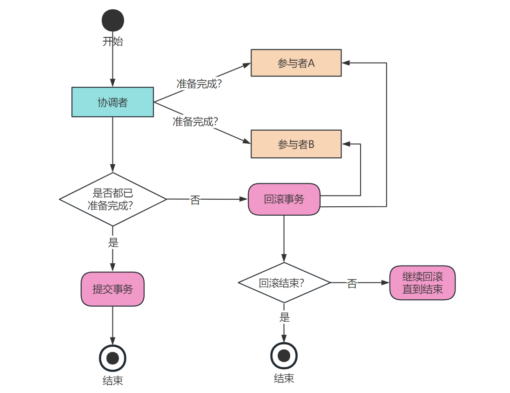
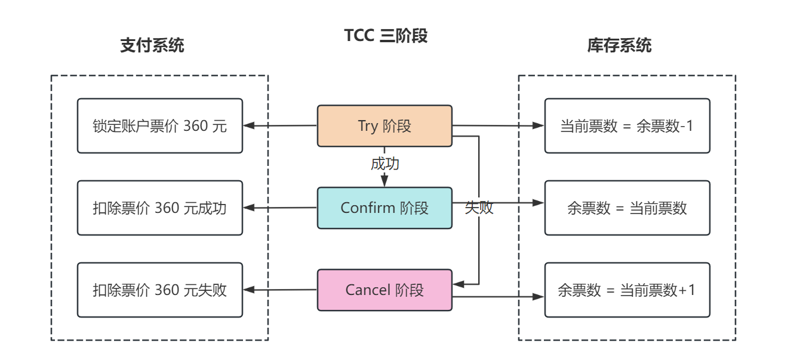
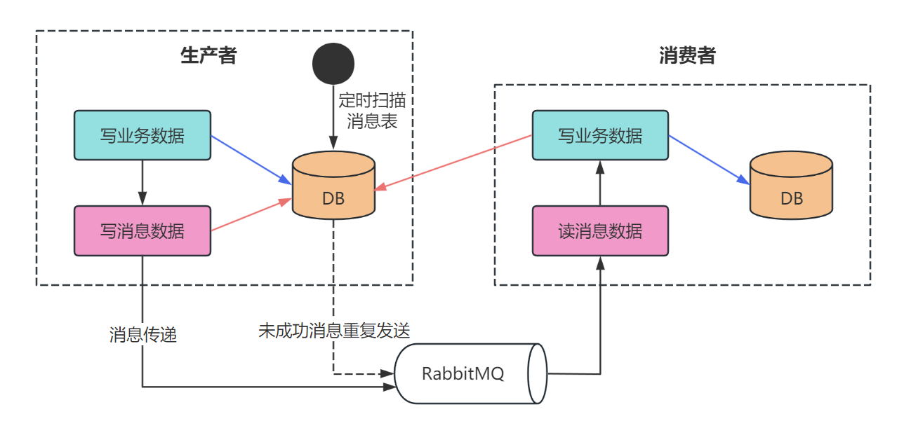

## 1. 引言

大家好，我是小❤，一个漂泊江湖多年的 985 非科班程序员，曾混迹于国企、互联网大厂和创业公司的后台开发攻城狮。

在上篇文章中，我们已经谈到了分布式中至关重要的两个理论： **CAP 理论和 BASE 理论**。

> 时光穿梭机：深入浅出分布式、CAP 和 BASE 理论

今天，小❤将带大家探讨解决分布式事务的“八奇技”，帮助大家在实际的分布式系统中更好地运用事务。

## 2. 分布式事务常见的解决分案

分布式事务是在分布式系统中，跨越多个计算机节点或数据存储系统进行的事务，在这种环境下保证事务的ACID（原子性、一致性、隔离性、持久性）属性是一大挑战。

对此，业界有以下 8 种常见的解决方案，俗称 “八奇技”。

### 奇技1）2PC

二阶段提交协议（Two-phase commit protocol），简称 2PC。两阶段提交是一种强一致性事务协议，它分为准备阶段和提交阶段。

在准备阶段，协调者节点询问所有参与者是否准备好提交事务，如果所有参与者都答应准备好了，那么在提交阶段，协调者会通知所有参与者提交事务。

如果有任何一个参与者在准备阶段没有准备好，那么协调者会通知所有参与者回滚事务。

有熟悉 MySQL 的同学可能马上想到了，MySQL 的事务提交就是通过几种日志来实现二阶段提交的。

> 不了解MySQL执行流程的可以看我之前写的这篇文章：一张图看懂SQL执行流程

#### 优点

1. **原子性保证**
   2PC 协议可以保证所有参与者要么全部提交成功，要么全部失败回滚，从而实现跨多个分布式节点的事务的原子性。
2. **简单直观**
   2PC 的设计思路简单，逻辑清晰，容易理解，这使得它在很多传统的数据库和分布式系统中得到了广泛的应用，比如 MySQL 从 5.5 版本开始支持。

#### 缺点

1. **同步阻塞**
   在 2PC 的第一阶段，所有参与者在响应协调者的准备请求后，必须等待最终的提交或回滚指令。这期间，所有参与者都处于阻塞状态，无法进行其他操作，导致资源锁定时间较长，在高并发场景下很明显不太适用。
2. **单点故障**
   如果协调者在第二阶段崩溃，参与者可能会无限期地等待指令，因为它们不知道应该提交还是回滚。这使得整个系统容易受到单点故障的影响。
3. **数据不一致**
   如果在第二阶段中协调者向某些参与者发送了提交指令，而其他参与者因为网络问题没有收到指令，那么这些没有收到指令的参与者可能会选择回滚，导致数据不一致。
4. **复杂的恢复机制**
   当系统崩溃后，恢复过程非常复杂，所有参与者必须保持足够的信息以便在系统恢复后能够继续完成 2PC 协议。

### 奇技2）3PC

三阶段提交协议（Three-phase commit protocol），简称 3PC。三阶段提交（3PC）是两阶段提交（2PC）的改进版本，它旨在减少在协调者和参与者之间的阻塞时间，同时增加系统在某些故障情况下的容错能力，以下是 3PC 的三个阶段：

1. **CanCommit 阶段**
   - **协调者行动**: 发送 CanCommit 请求到所有参与者，并等待回应。
   - **参与者行动**: 如果参与者可以提交事务，它就返回 Yes，并进入预备状态；如果不能提交，则返回 No。
2. **PreCommit 阶段**
   - **协调者行动**: 如果所有参与者回答 Yes，协调者发送 PreCommit 请求给所有参与者，并进入 Prepared 阶段；如果有任何参与者回答 No，或者等待超时，协调者发送 abort 请求。
   - **参与者行动**: 在收到 PreCommit 请求后，参与者会执行事务操作，写入日志，但不提交，然后响应 ACK，并等待最终指令。如果参与者在这个阶段超时没有收到协调者的消息，它将中止事务。
3. **DoCommit 阶段**
   - **协调者行动**: 一旦协调者收到所有参与者的 ACK，它会进入 DoCommit 阶段，发送 commit 请求给所有参与者。
   - **参与者行动**: 参与者在收到 commit 请求后，提交事务，释放所有事务锁定的资源，并向协调者发送完成消息。

与 2PC 相比，3PC 在 PreCommit 阶段引入了超时机制，允许参与者在没有接收到协调者的最终指令时自行决定中止事务，这减少了协调者成为单点故障的可能性。

#### 实际业务场景

3PC通常用于需要较高可靠性的分布式系统中，尤其是在那些不能接受长时间锁定资源的场景。例如：

1. **分布式数据库系统**
   分布式数据库可能使用 3PC 来确保跨多个数据中心的事务一致性。例如，一个全球性的银行可能需要在不同国家的分支机构之间处理账户转账，这时3PC可以减少在网络延迟或某个分支机构失去响应时的影响。

2. **电信网络**
   在电信运营商的计费系统中，可能会使用 3PC 来同步跨多个服务点的账单信息，这些系统通常要求高可用性和快速响应，因此不能长时间阻塞。

3. **大型分布式系统**
   对于需要跨多个服务和组件协调工作的大型分布式系统，比如云计算平台，3PC可以在保持事务一致性的同时，减少参与者等待协调者指令的时间。

#### 使用 3PC 的考虑因素

虽然 3PC 提供了比 2PC 更好的容错性和减少了阻塞的时间，但它仍然有一些缺点：

- **复杂性**：3PC 比 2PC 更复杂，需要更多的消息交换和更多的状态管理。
- **性能开销**：3PC 引入了额外的阶段和网络通信，可能会导致更大的性能开销。
- **极端情况**：即使是 3PC，在某些极端的网络分区或多点故障情况下也可能无法保证事务的正确性。

因此，在实际应用中，需要权衡 3PC 带来的好处与其复杂性和性能开销之间的关系，确保它适合特定的业务场景和系统需求。

在某些情况下，其他的事务模型，如最大努力通知等最终一致性模型，可能会是更合适的选择。

#### 奇技3）TCC

TCC（Try-Confirm-Cancel）是一种应用层的分布式事务解决方案，它将事务分为三个步骤：**尝试（Try）、确认（Confirm）和取消（Cancel）**：

* 在 Try 阶段，会预留必要的业务资源；
* 在 Confirm 阶段，如果所有相关的业务操作都成功了，则正式执行业务操作；
* 如果有操作失败，则在 Cancel 阶段执行补偿操作，回滚之前的预留资源。

假设我们买一张从深圳到北京的火车票，票价为 360 元，TCC 分为这三个步骤：

- Try：检查钱包的钱是否大于等于 360，并锁住资源（360 元和这张车票）；
- Cancel：如果有一个资源锁定失败，则进行 cancel 释放资源，这个过程中无论 cancel 还是其它操作失败都进行重试 cancel，所以需要保证幂等性；
- Confirm：如果资源锁定都成功，则进行 confirm，资源交换，这个过程中无论 confirm 还是其它操作失败都进行重试 confirm，都需保证幂等性。

#### 优势

TCC 的出现解决二阶段提交的几个缺点：

1. 单点故障问题：引入了多个业务活动管理器，集群下高可用；
2. 数据不一致问题：引入超时补偿机制，由业务活动管理器来控制一致性；
3. 同步阻塞问题：引入超时补偿机制，不会锁定同步，将资源转换为业务逻辑形式，粒度更小。

### 奇技4）分布式补偿事务（Saga）

Saga 是一种长事务的解决方案，它将一个大的分布式事务拆分成多个较小的本地事务，这些本地事务通过异步消息传递串联起来。

每个本地事务执行成功后，会发送消息触发下一个事务的执行。如果某个本地事务失败，Saga 会执行一系列补偿操作（回滚之前的操作）来保持数据的一致性。

假设有一个旅游网站，用户可以通过它预订机票、酒店和租车服务。每个预订步骤都可以视为一个 Saga 中的小事务：

1. 用户预订机票。
2. 用户预订酒店。
3. 用户预订租车服务。

如果用户成功完成了所有预订步骤，那么整个旅行预订就完成了。但如果在预订租车服务时失败了，那么 Saga 会开始执行补偿操作：

1. 取消酒店预订。
2. 取消机票预订。

通过这种方式，Saga 确保了用户不会因为部分服务预订失败而损失金钱或留下未处理的预订。

#### 优点

1. **灵活性**：Saga 允许每个小事务独立管理，提高了系统的灵活性。
2. **减少资源锁定**：由于 Saga 不需要在事务执行过程中持续占用资源，因此可以减少长时间的资源锁定，提高系统的并发能力。
3. **容错性**：Saga 通过定义补偿操作来处理失败，增强了系统的容错能力。
4. **适用于微服务架构**：在微服务架构中，Saga 可以跨服务边界管理事务，每个服务独立处理自己的事务和补偿逻辑。

#### 缺点

1. **复杂性**：实现 Saga 需要定义每个小事务的补偿操作，这可能会增加系统的复杂性。
2. **数据一致性**：Saga 不能提供 2PC 那样的即时一致性保证，它只能保证最终一致性，这在某些业务场景中可能是不够的。
3. **补偿操作的难度**：在某些情况下，补偿操作可能很难实现，尤其是当事务有副作用时（比如发送了一个不可撤销的通知）。
4. **测试和调试**：由于 Saga 涉及多个服务和补偿逻辑，测试和调试可能会更加困难。

在选择使用 Saga 模式时，需要仔细考虑业务场景是否适合最终一致性，以及是否能够有效地实现和管理补偿逻辑。对于那些需要高度一致性保证的场景，可能需要考虑其他事务管理机制。

### 奇技5）分布式锁

在某些情况下，可以使用分布式锁来确保多个分布式节点不会同时操作同一资源。这可以通过 Redis、ZooKeeper 等分布式协调服务来实现。

> 不知道分布式锁或者不了解如何实现的，可以看这篇文章：说出来你可能不信，分布式锁竟然这么简单...

- **项目/公司**: 使用 Redis、ZooKeeper 等实现分布式锁的系统。
- **实用场景**: 在电商秒杀活动中，防止超卖现象，确保同一时间只有一个请求能够对库存数量进行修改。
- **推荐场景**: 当需要协调多个节点对共享资源进行访问控制时，分布式锁是一个有效的解决方案。

### 奇技6）本地消息表

本地消息表是一种确保分布式事务最终一致性的方法。它的工作原理是：

1. 在执行本地事务的同时，将需要异步执行的远程服务调用相关信息存储在同一个本地数据库的消息表中。
2. 本地事务和消息表的写入操作在同一个数据库事务中完成，这样可以保证要么都成功，要么都失败，从而保证了数据的一致性。
3. 本地事务提交后，一个独立的消息发布程序会定期扫描消息表，对于未处理的消息，发布到消息队列或直接调用远程服务。
4. 远程服务处理完成后，消息会被标记为已处理，从而确保每条消息只被处理一次。

本地消息表是 ebay 公司提出的事务解决方案，它的核心原理是将需要分布式处理的任务通过消息日志的方式来异步执行。消息日志可以存储到本地文件、数据库或消息队列，再通过业务规则或人工发起重试。

本地消息表基于 BASE 理论，实现数据的最终一致性，实现过程中需要注意幂等性原则。

### 奇技7）可靠消息最终一致性

通过可靠消息服务保证消息的可靠传输，并在消息消费者那里进行本地事务处理，从而实现最终一致性，所以又被称作**消息事务**。如果消息处理失败，可以重试或者进行人工干预。

执行流程：

- 发送 prepare 消息到消息中间件
- 发送成功后，执行本地事务
  - 如果事务执行成功，则 commit，消息中间件将消息下发至消费端
  - 如果事务执行失败，则回滚，消息中间件将这条 prepare 消息删除
- 消费端接收到消息进行消费，如果消费失败，则不断重试

这种方案也是实现了**「最终一致性」**，和本地消息表类似，但是对比本地消息表实现方案，消息事务不需要再建消息表，而是将消息中间件的机制去做的，**「不再依赖本地数据库事务」**了。

所以这种方案更适用于高并发的场景，目前市面上实现该方案的**「只有阿里的 RocketMQ」**。

### 奇技8）最大努力通知原则

最大努力通知也是一种基于消息的分布式事务解决方案，但它不保证 100% 的消息传递成功。它的工作原理是：

1. 在本地事务执行成功后，系统会尝试通知其他的参与者或服务。
2. 通知操作会尽最大努力去执行，但如果失败，系统不会无限重试。
3. 该方案通常结合人工干预，例如，如果通知失败，系统可能会记录日志、发送报警、或者提供管理界面供操作人员手动处理。

本地消息表，或者通过 MQ 对事务进行通知都可以算作最大努力。

本地消息表通过后台定时任务去异步保证数据的一致性，就是一种最大努力通知的思想：代表系统各模块之间已经最大程度地保证事务的最终一致性了。

## 3. 小结

在选择分布式事务解决方案时，需要根据业务需求、系统复杂度、性能要求等因素进行权衡。

例如，对于业务场景要求**数据的一致性非常高**，且可以接受一定程度的性能损失时，2PC 或者 3PC 是很好的选择。

对于**复杂业务流程中的分布式事务**，需要在业务层进行更细粒度控制时，TCC 是一个好的选择。比如，用户在电商平台下单购买商品，涉及到库存、账户余额、积分等多个服务的数据变更。

而对于**可容忍短时间内数据不一致的业务**，则可以考虑最终一致性相关的解决方案，如：本地消息表、消息事务及最大努力通知方案等等。

因此，当我们探讨分布式事务时，不仅要把握好用户痛点和实际需求，还要结合每个分布式事务解决方案的特点，才能把 “八奇技” 用到出神入化之境。

好了，以上就是本文的全部内容了，如果觉得文章有所启发或收获，不妨点赞、分享，加入在看，这对我是最大的鼓励！

如果你有任何问题或想了解更多，也随时在评论区提问，谢谢你的阅读！

ღ( ´･ᴗ･` )比心

我是小❤，我们下期再见。