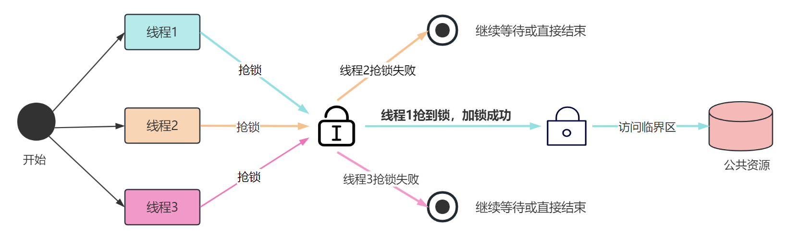
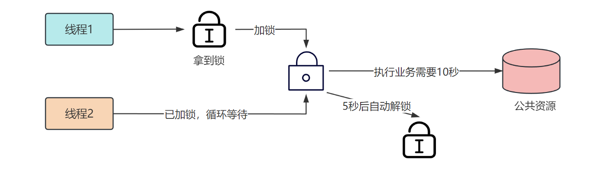
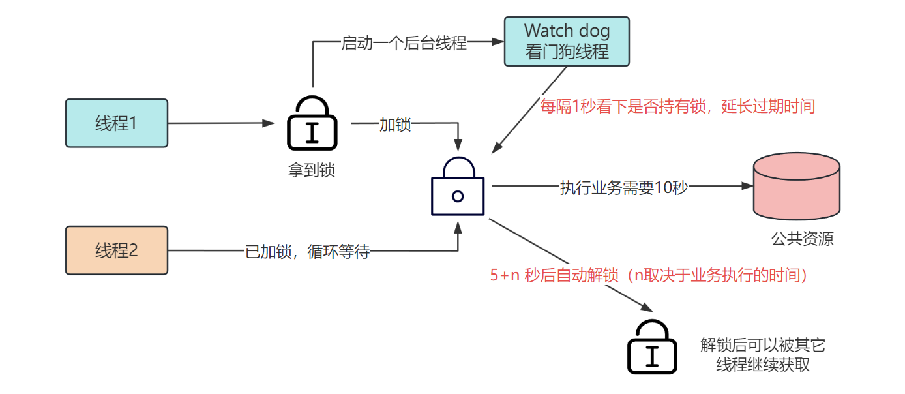
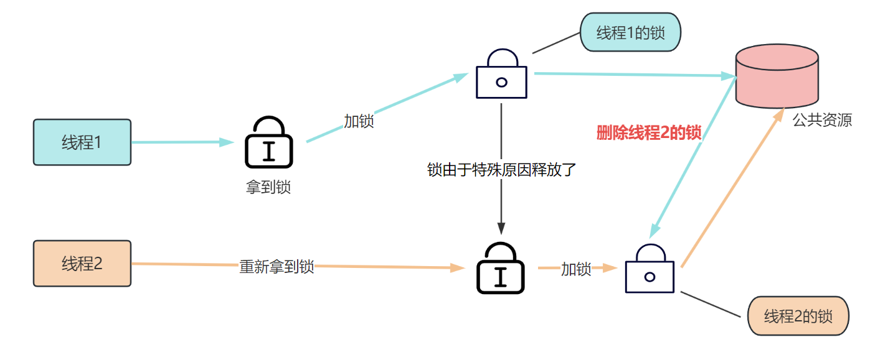
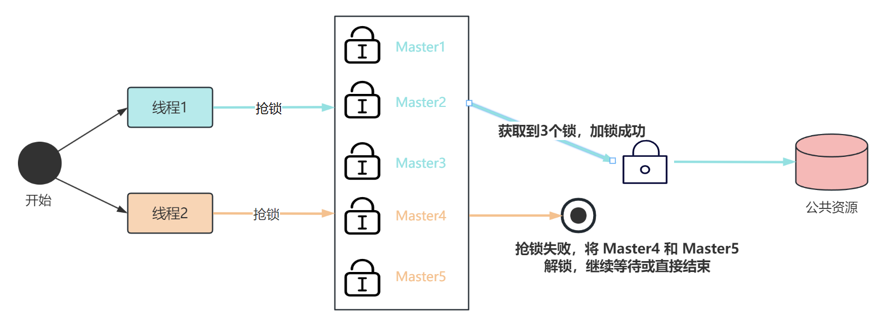

大家好，我是小❤。

作为一个后台开发，不管是工作还是面试中，**分布式一直是一个让人又爱又恨的话题**。它如同一座神秘的迷宫，时而让你迷失方向，时而又为你揭示出令人惊叹的宝藏。

今天，让我们来聊聊分布式领域中那位不太引人注意却功不可没的角色，它就像是**分布式系统的守卫**，保护着资源不被随意访问——这就是分布式锁。

想象一下，如果没有分布式锁，多个分布式节点同时涌入一个共享资源的访问时，就像一群饥肠辘辘的狼汇聚在一块肉前，谁都想咬一口，最后弄得肉丢了个精光，大家都吃不上。



而有了分布式锁，就像给这块肉上了道坚固的城墙，只有一只狼能够穿越，享受美味。

那它具体是怎么做的呢？这篇文章中，小❤将带大家一起了解分布式锁是如何解决分布式系统中的并发问题的。


## 什么是分布式锁？

在分布式系统中，分布式锁是一种机制，用于协调多个节点上的并发访问共享资源。

这个共享资源可以是数据库、文件、缓存或任何需要互斥访问的数据或资源。**分布式锁确保了在任何给定时刻只有一个节点能够对资源进行操作，从而保持了数据的一致性和可靠性。**


## 为什么要使用分布式锁？

### 1. 数据一致性

在分布式环境中，多个节点同时访问共享资源可能导致数据不一致的问题。分布式锁可以防止这种情况发生，确保数据的一致性。


### 2. 防止竞争条件

多个节点并发访问共享资源时可能出现竞争条件，这会导致不可预测的结果。分布式锁可以有效地防止竞争条件，**确保操作按照预期顺序执行**。


### 3. 限制资源的访问

有些资源可能需要限制同时访问的数量，以避免过载或资源浪费。分布式锁可以帮助**控制资源的访问**。


## 分布式锁要解决的问题

分布式锁的核心问题是如何在多个节点之间协调，以确保只有一个节点可以获得锁，而其他节点必须等待。


这涉及到以下关键问题：

### 1. 互斥性

只有一个节点能够获得锁，其他节点必须等待。这确保了资源的互斥访问。


### 2. 可重入性

指的是在同一线程内，外层函数获得锁之后，内层递归函数仍然可以获取到该锁。 

说白了就是同一个线程再次进入同样代码时，可以再次拿到该锁。 它的作用是：**防止在同一线程中多次获取锁产生竞性条件而导致死锁发生**。


### 3. 超时释放

确保即使节点在业务过程中发生故障，锁也会被超时释放，既能防止不必要的线程等待和资源浪费，也能避免死锁。


## 分布式锁的实现方式

在分布式系统中，有多种方式可以实现分布式锁，就像是锁的品种不同，每种锁都有自己的特点。

* 有基于数据库的锁，就像是厨师们用餐具把菜肴锁在柜子里，每个人都得排队去取。
* 还有基于 ZooKeeper 的锁，它像是整个餐厅的门卫，只允许一个人进去，其他人只能在门口等。
* 最后，还有基于缓存的锁，就像是一位服务员用号码牌帮你占座，先到先得。


### 1. 基于数据库的分布式锁

使用数据库表中的一行记录作为锁，通过事务来获取和释放锁。

例如，使用 `MySQL` 来实现事务锁。首先创建一张简单表，在某一个字段上创建唯一索引（保证多个请求新增字段时，只有一个请求可成功）。

``` sql
CREATE TABLE `user` (   
    `id` bigint(20) NOT NULL AUTO_INCREMENT,   
    `uname` varchar(255) DEFAULT NULL,   
    PRIMARY KEY (`id`),   
    UNIQUE KEY `name` (`uname`) USING BTREE
) ENGINE=InnoDB AUTO_INCREMENT=4 DEFAULT CHARSET=utf8mb4
```

当需要获取分布式锁时，执行以下语句：

``` sql
INSERT INTO `user` (uname) VALUES ('unique_key')
```

由于 `name` 字段上加了唯一索引，所以当多个请求提交 `insert` 语句时，只有一个请求可成功。

使用 `MySQL` 实现分布式锁的优点是可靠性高，但性能较差，而且这把锁是**非重入的，同一个线程在没有释放锁之前无法获得该锁**。


### 2. 基于ZooKeeper的分布式锁

**Zookeeper（简称 zk）是一个为分布式应用提供一致性服务的中间组件**，其内部是一个分层的文件系统目录树结构。

zk 规定其某一个目录下只能有唯一的一个文件名，其分布式锁的实现方式如下：

1. **创建一个锁目录（ZNode）**：首先，在 zk 中创建一个专门用于存储锁的目录，通常称为锁根节点。这个目录将包含所有获取锁的请求以及用于锁协调的节点。
2. **获取锁**：当一个节点想要获取锁时，它会在锁目录下创建一个临时顺序节点（Ephemeral Sequential Node）。zk 会为每个节点分配一个唯一的序列号，并根据序列号的大小来确定锁的获取顺序。
3. **查看是否获得锁**：节点在创建临时顺序节点后，需要检查自己的节点是否是锁目录中序列号最小的节点。如果是，表示节点获得了锁；如果不是，则节点需要监听比它序列号小的节点的删除事件。
4. **监听锁释放**：如果一个节点没有获得锁，它会设置一个监听器来监视比它序列号小的节点的删除事件。一旦前一个节点（序列号小的节点）释放了锁，zk 会通知等待的节点。
5. **释放锁**：当一个节点完成了对共享资源的操作后，它会删除自己创建的临时节点，这将触发 zk 通知等待的节点。

zk 分布式锁提供了良好的一致性和可用性，但部署和维护较为复杂，需要仔细处理各种边界情况，例如节点的创建、删除、网络分区等。

而且 zk 实现分布式锁的性能不太好，主要是获取和释放锁都需要在集群的 `Leader` 节点上执行，同步较慢。


### 3. 基于缓存的分布式锁

使用分布式缓存，如 Redis 或 Memcached，来存储锁信息，缓存方式性能较高，但需要处理分布式缓存的高可用性和一致性。

接下来，我们详细讨论一下在 Redis 中如何设计一个高可用的分布式锁以及可能会遇到的几个问题，包括：

1. 死锁问题
2. 锁提前释放
3. 锁被其它线程误删
4. 高可用问题


#### 1）死锁问题

早期版本的 `redis` 没有 `setnx` 命令在写 key 时直接设置超时参数，需要用 `expire` 命令单独对锁设置过期时间，这可能会导致死锁问题。

比如，设置锁的过期时间执行失败了，导致后来的抢锁都会失败。


#### Lua脚本或SETNX

为了保证原子性，我们可以使用 Lua 脚本，保证`SETNX + EXPIRE`两条指令的原子性，我们还可以巧用`Redis` 的 `SET` 指令扩展参数：`SET key value[EX seconds][PX milliseconds][NX|XX]`，它也是原子性的。

> SET key value \[EX seconds] \[PX milliseconds] [NX|XX]
>
> - NX：表示 `key` 不存在的时候，才能 `set` 成功，即保证只有第一个客户端请求才能获得锁，而其他客户端请求只能等待锁释放后，才能获取
> - EX seconds :设定 `key` 的过期时间，默认单位时间为秒
> - PX milliseconds: 设定 `key` 的过期时间，默认单位时间为毫秒
> - XX: 仅当 `key` 存在时设置值


在 Go 语言里面，关键代码如下所示：

``` go
func getLock() {     
    methodName := "getLock"     
    val, err := client.Do("set", methodName, "lock_value", "nx", "ex", 100) 	
    if err != nil {         
        zaplog.Errorf("%s set redis lock failed, %s", methodName, err)
        return
    }     
    if val == nil { 		
        zaplog.Errorf("%s get redis lock failed", methodName)         
        return 	
    }
    ... // 执行临界区代码，访问公共资源
    client.Del(lock.key()).Err() // 删除key，释放锁
}
```


#### 2）锁提前释放

上述方案解决了加锁过期的原子性问题，不会产生死锁，但还是可能存在锁提前释放的问题。

如图所示，假设我们设置锁的过期时间为 5 秒，而业务执行需要 10 秒。



在线程 1 执行业务的过程中，它的锁被过期释放了，这时线程 2 是可以拿到锁的，也开始访问公共资源。

很明显，这种情况下导致了**公共资源没有被严格串行访问，破坏了分布式锁的互斥性**。

这时，有爱动脑瓜子的小伙伴可能认为，既然加锁时间太短，那我们把锁的过期时间设置得长一些不就可以了吗？

其实不然，首先我们没法提前准确知道一个业务执行的具体时间。其次，公共资源的访问时间大概率是动态变化的，时间设置得过长也不好。


#### Redisson框架

所以，我们不妨给加锁线程一个自动续期的功能，即**每隔一段时间检查锁是否还存在，如果存在就延长锁的时间，防止锁过期提前释放**。

这个功能需要用到守护线程，当前已经有开源框架帮我们解决了，它就是——Redisson，它的实现原理如图所示：



当线程 1 加锁成功后，就会启动一个 `Watch dog` 看门狗，它是一个后台线程，每隔 1 秒（可配置）检查业务是否还持有锁，以达到线程未主动释放锁，自动续期的效果。


#### 3）锁被其它线程误删

除了锁提前释放，我们可能还会遇到锁被其它线程误删的问题。



如图所示，加锁线程 1 执行完业务后，去释放锁。但线程 1 自己的锁已经释放了，此时分布式锁是由线程 2 持有的，就会误删线程 2 的锁，但线程 2 的业务可能还没执行完毕，导致异常产生。 


#### 唯一 Value 值

要想解决锁被误删的问题，我们需要给每个线程的锁加一个唯一标识。

比如，在加锁时将 `Value` 设置为线程对应服务器的 IP。对应的 Go 语言关键代码如下：

``` go
const (   
    // HostIP，当前服务器的IP   
    HostIP = getLocalIP()
)

func getLock() {     
    methodName := "getLock"     
    val, err := client.Do("set", methodName, HostIP, "nx", "ex", 100) 	
    if err != nil {         
        zaplog.Errorf("%s redis error, %s", methodName, err)
        return
    }     
    if val == nil { 		
        zaplog.Errorf("%s get redis lock error", methodName)         
        return 	
    }
    ... // 执行临界区代码，访问公共资源
    if client.Get(methodName) == HostIP {
        // 判断为当前服务器线程加的锁，才可以删除
        client.Del(lock.key()).Err()
    }
}
```

这样，在删除锁的时候判断一下 `Value` 是否为当前实例的 IP，就可以避免误删除其它线程锁的问题了。

为了保证严格的原子性，可以用 `Lua` 脚本代替以上代码，如下所示：

``` lua
if redis.call('get',KEYS[1]) == ARGV[1] then 
   return redis.call('del',KEYS[1]) 
else
   return 0
end;
```


#### 4）Redlock高可用锁

前面几种方案都是基于单机版考虑，而实际业务中 Redis 一般都是集群部署的，所以我们接下来讨论一下 Redis 分布式锁的高可用问题。

试想一下，如果线程 1 在 Redis 的 `master` 主节点上拿到了锁，但是还没同步到 `slave` 从节点。

这时，如果主节点发生故障，从节点升级为主节点，其它线程就可以重新获取这个锁，**此时可能有多个线程拿到同一个锁。即，分布式锁的互斥性遭到了破坏。**

为了解决这个问题，Redis 的作者提出了专门支持分布式锁的算法：Redis Distributed Lock，简称 Redlock，其核心思想类似于注册中心的*选举机制*。



Redis 集群内部署多个 `master` 主节点，它们相互独立，即每个主节点之间不存在数据同步。

且节点数为单数个，每次当客户端抢锁时，需要从这几个 `master` 节点去申请锁，当从一半以上的节点上获取成功时，锁才算获取成功。


## 优缺点和常用实现方式

以上是业界常用的三种分布式锁实现方式，它们各自的优缺点如下：

- **基于数据库的分布式锁**：可靠性高，但性能较差，不适合高并发场景。
- **基于ZooKeeper的分布式锁**：提供良好的一致性和可用性，适合复杂的分布式场景，但部署和维护复杂，且性能比不上缓存的方式。
- **基于缓存的分布式锁**：性能较高，适合大部分场景，但需要处理缓存的高可用性。

其中，业界常用的分布式锁实现方式通常是基于缓存的方式，如`使用 Redis 实现分布式锁`。这是因为 Redis 性能优秀，而且可以满足大多数应用场景的需求。


## 小结

尽管分布式世界曲折离奇，但有了分布式锁，我们就像是看电影的观众，可以有条不紊地入场，分布式系统里的资源就像胶片一样，等待着我们一张一张地观赏。

这就是分布式的魅力！它或许令人又爱又恨，但**正是科技世界的多样复杂性，才让我们的技术之旅变得更加精彩。**


最后，希望这篇文章能够帮助大家更深入地理解分布式锁的重要性和实际应用。

> 想了解更多分布式相关的话题，可以看我另一篇文章：深入浅出：分布式、CAP和BASE理论

如果大家觉得有所收获或者启发，不妨动动小手关注我，然后把文章分享、点赞、加入在看！这会让我有充足的动力，持续输出大家喜爱的技术内容哦~


我是小❤，我们下期再见！