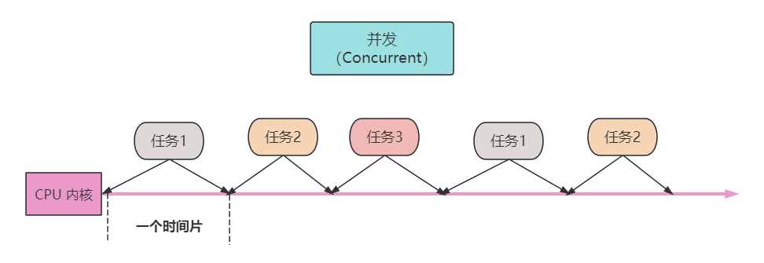

## 1.引言

大家好，我是小❤，一个漂泊江湖多年的 985 非科班程序员，曾混迹于国企、互联网大厂和创业公司的后台开发攻城狮。

作为开发者，不管是求职面试，还是在日常工作中，相信大家对高并发和多线程都不会陌生。

求职面试时，卷出天际的后台招聘要求，往往都会要求我们熟悉高并发、多进程/多线程：


日常工作中，随着移动互联网应用的兴起和发展，我们面对的任务和问题变得越来越复杂。

无论是构建大规模的Web应用、处理庞大的数据集，还是开发高性能的游戏，都需要应对一个共同的挑战：高并发。


### 1.1 什么是高并发？

**高并发是指在同一时间段内有大量用户或程序在访问和使用某个服务或资源。**

这意味着我们需要在同一时间内处理大量的请求、数据和任务。如何高效地处理这种情况，就成了一项关键的技术任务。


### 1.2 多线程和高并发有啥关系？

高并发是一个充满挑战的领域，但同时也是一个充满机会的领域。解决高并发问题不仅能够提高系统的性能，还能够改善用户体验，为企业带来更多的商机。

而**多线程技术，正是应对高并发挑战的重要工具之一。**

所以，在本篇文章中，小❤将带大家一起深入探讨高并发和多线程，并熟悉多线程的工作原理、应用场景以及解决高并发问题的实际方法。

相信无论你是初级程序员还是有一定经验的开发者，都能够在这篇文章中找到有用的信息。


## 2. 高并发

### 2.1 并发与并行

#### 并发

并发是指多个任务在相同的时间段内执行。在单核处理器上，多个线程之间通过时间片轮转方式切换执行，造成了并发。



相当于我们的录像，当视频帧数够高时（即一秒内切换多张图片），我们的肉眼就会把它当成是一个连续而流畅的视频。


#### 并行

在多核处理器上，真正的并发可以实现多个线程同时执行不同的任务——也就是并行。


并行是指多个任务在同一时刻执行，通常需要多核处理器。并行是并发的一个子集，只有当硬件支持多个并行执行单元时才能实现真正的并行。


#### 思考题

**场景1：**为什么我们在玩游戏时，很难一边激烈团战，一边集中注意接电话？

**场景2：**我们在开车时，可以一边听音乐，一边拨弄方向盘而互不影响。大家不妨猜一下，我们的大脑是并发还是并行运行的呢？


### 2.2 多高的并发才算高并发？

了解了并发的概念，现在我们来聊一聊高并发。

或许和我们平常想象的不同，不是说 `QPS（Queries Per Second）每秒查询率` 或 `HPS（Hits Per Second）每秒点击数` 等指标多高才算是高并发。

高并发是一个相对的概念，它取决于系统的性能和处理能力。**通常，当系统需要处理的请求或事务数量超出其正常负载的范围时，就可以称之为高并发。**


### 2.3 高并发的挑战

高并发虽然带来了许多机会，但也伴随着挑战。

高并发系统需要在短时间内处理大量请求，而不降低系统的性能或响应速度。

这可以涉及到**多个用户**同时访问一个网站、**多个客户端**同时请求服务器数据、或**多个线程**同时访问共享资源。

在分布式系统中，不管是多个用户访问，还是多个客户端访问服务器，归根到底都是各服务器的业务线程来访问共享资源，所以，高并发的挑战都是和多线程相关的。

在面对高并发时，可能出现以下几个问题。


#### 1. 竞态条件

多个线程同时访问共享资源，可能导致数据不一致问题。例如，多个线程同时向同一个银行账户存款，可能导致余额错误。


#### 2. 死锁

多个线程相互等待对方释放资源，导致系统停滞。例如，线程 A 等待线程 B 释放锁，而线程 B 又等待线程 A 释放锁，就形成了死锁。


#### 3. 资源争用

多线程访问共享资源时，可能导致资源争夺问题，降低性能。例如，多个线程同时竞争数据库连接，导致数据库响应变慢。


#### 4. 线程安全

需要确保多线程访问共享数据时不会引发错误。例如，在多线程环境下，需要确保对数据的读写是安全的。


#### 5. 调试难度

由于多线程的执行顺序是不确定的，问题可能出现在不同的时机。所以多线程程序的调试相对复杂，问题难以重现。


### 2.4 解决高并发问题

为了解决高并发问题，需要采用适当的技术和方法。

#### 1. 锁机制

使用锁来保护共享资源，确保同时只有一个线程可以访问。

锁可以分为互斥锁和读写锁，互斥锁用于独占资源，读写锁允许多个线程同时读取资源，但只允许一个线程写入。

具体实现细节可以使用编程语言提供的锁机制，如 Java 中的 `synchronized` 关键字或 Python 中的 `threading.Lock`。


#### 2. 并发数据结构

使用并发数据结构，如并发队列和哈希表，减少资源争用。这些数据结构经过优化，能够在多线程环境下高效工作。

例如，Java提供了`ConcurrentHashMap`，它是一个线程安全的哈希表，可以在高并发环境下使用而无需显式加锁。


#### 3. 线程池

管理和重用线程，提高性能。线程池可以控制线程的数量，避免线程过多导致资源浪费。

在 Java 中，你可以使用`ExecutorService`来创建和管理线程池。这样可以避免线程的频繁创建和销毁，提高效率。


#### 4. 消息传递

通过消息传递模型进行线程间通信，避免共享内存。消息传递可以确保线程之间的数据安全传递，减少竞态条件。

例如，在 Go 语言中，你可以使用通道（`channel`）进行消息传递，确保数据的安全传递。


#### 5. 原子操作

原子操作是不可分割的操作，它们可以确保多个线程对共享变量的操作是安全的。原子操作通常由硬件支持，可以用于实现各种同步机制。

在 C/C++ 中，你可以使用原子操作来操作共享变量，例如使用`atomic`库。


## 3. 多线程

### 3.1 进程与线程

当并发工作中的某一个任务完成后，会从一段程序切换到另一段程序上执行，而上一段程序运行的一系列状态如果不保存，就会丢失，因此操作系统引入了进程来进行资源隔离。

#### 1. 进程

**进程是用来划分程序运行时所需的基本资源单位**，它拥有独立的地址空间，独立的堆栈，当进程切换时，就可以保证各自的数据存储不受影响。

由于进程涉及到大量资源的消耗，所以由计算机操作系统严格管控（可以理解为：每个省市的土地资源审批，都是十分谨慎的，特别是一线城市，所以由国家政府统一管控）。

因此，**进程的切换都发生在内核态，由计算机核心程序来统一调度。**


> **小知识：**
>
> 操作系统分为内核态与用户态，处于内核态的 CPU（Central Processing Unit，核心处理器）可以访问任意的数据。
>
> 包括网卡、硬盘等外围设备，并且在占用的 CPU 不会发生抢占的情况。
>
> 而处于用户态的 CPU 只能受限地访问内存，不允许访问外围设备，用户态下的 CPU 可能会被其它程序抢占。


#### 2. 线程

当进程切换时，由于要切换内核状态，因此资源消耗比较大，对此又引入了线程的概念。

**线程是操作系统调度的最小单位，是程序内部的一个执行流程**。一个进程可以包含多个线程，它们共享进程的资源，如内存空间和文件句柄，但各自有独立的栈内存。

线程本身几乎不占用任何资源，它和本进程的其它线程共享地址空间，共享堆，所以调度时耗费比较小，但是它拥有独立的 CPU 上下文（包括 CPU 寄存器、程序计数器等）。

相当于线程与同一个进程里面的线程共享同一片土地资源，但是线程有各自的办公楼，线程之间切换时也是由操作系统统一调度。

> 小知识：线程分为内核态线程与用户态线程，用户态线程必须要绑定到内核态线程中，才可运行。


### 3.2 多线程概念

多线程是一种并发执行的方式，它可以让一个程序分为多个独立的线程，每个线程可以独立执行任务。这就好比在一块土地资源上，可以同时施工而互不影响。


#### 1. 创建和管理线程

多线程的创建和管理涉及到操作系统的调度机制，在不同编程语言中有不同的实现方式。让我们以 Python 为例：

```python
import threading

def my_function():
    # 线程要执行的任务

thread = threading.Thread(target=my_function)
thread.start()  # 启动线程
```


#### 2. 线程同步与互斥

当多个线程同时访问共享资源时，可能会导致竞态条件，即多个线程之间相互竞争资源，可能导致数据不一致。

为了解决这个问题，我们使用锁机制，保证在同一时间只有一个线程可以访问共享资源。

```python
import threading

lock = threading.Lock()

def my_function():
    lock.acquire()  # 获取锁
    # 访问共享资源
    lock.release()  # 释放锁
```


### 3.3 多线程应用

多线程不仅可以提高程序的性能，还可以改善用户体验。在现实生活中，我们经常遇到多线程应用的场景。

#### 1. Web服务器

想象一个热门的社交媒体网站，数百万用户同时在不同时间访问该网站。

这些用户会请求不同的页面、上传照片、发表帖子，同时还有一些后台任务，如数据备份、新帖子推送等。

此时，**Web 服务器需要同时处理来自多个用户的请求。每个用户的请求可以看作一个线程，多线程允许服务器同时响应多个请求。**

例如，一个用户可以请求查看自己的个人资料，而另一个用户可以请求发布新的状态更新。这两个请求可以由不同的线程同时处理，提高了服务器的响应速度。


#### 2. 数据库系统

假设一个在线银行系统，数千名客户同时访问其账户信息，检查余额、转账等。此外，银行系统还需要处理客户的存款和取款操作。

此时，数据库系统需要同时处理多个客户的请求。每个客户请求可以看作一个线程，多线程可以同时查询数据库，确保每个客户的账户信息都是最新的。

此外，多线程还可以确保在多个客户之间进行资金转移时的数据一致性。


#### 3. 游戏开发

一个多人在线游戏，数十名玩家同时参与游戏。这个游戏需要同时处理玩家的操作、物理模拟、AI计算和多人游戏互动。

此时，游戏引擎可以使用多线程来处理不同方面的任务。一个线程可以负责渲染游戏画面，另一个线程可以处理玩家的操作，还有一个线程可以负责模拟游戏中的物理效果。

多线程使游戏更加流畅，玩家可以享受到高度互动的游戏体验。


## 4. 总结

多线程和高并发是数字世界的魔法，它们让我们能够更高效地处理任务、改善用户体验，带来商机。然而，这个魔法也伴随着挑战，需要小心谨慎地处理。

在技术的世界里，多线程和高并发是我们不断探索的领域，也是我们不断挑战自己的机会。通过深入理解多线程的工作原理、应用场景以及解决高并发问题的方法，我们可以更好地驾驭这项数字世界的魔法，为我们的工作和生活创造更多的可能性。

无论你是一名初级程序员还是有一定经验的开发者，多线程和高并发都是值得探索的领域。愿你也能学会这项魔法，让时间成为你的朋友，而不是限制。

时间，总是不够用，但魔法，总是可以创造。让我们一起探索这个魔法的奇妙世界吧！