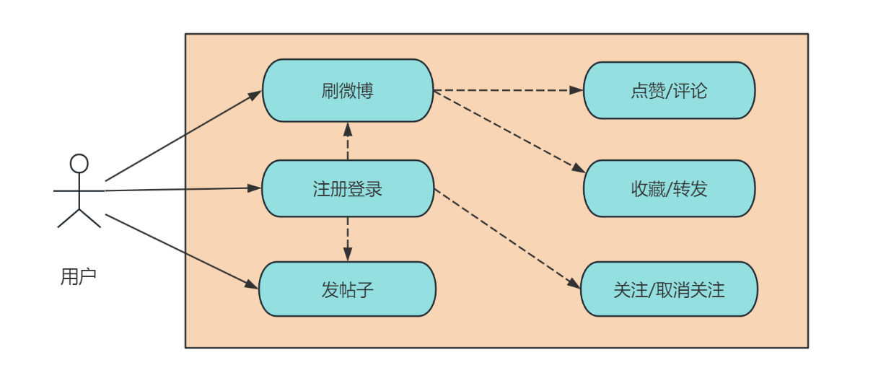
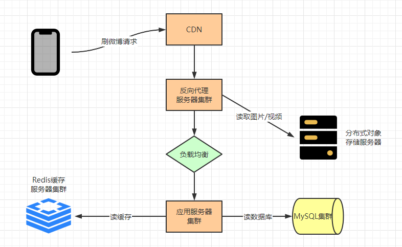
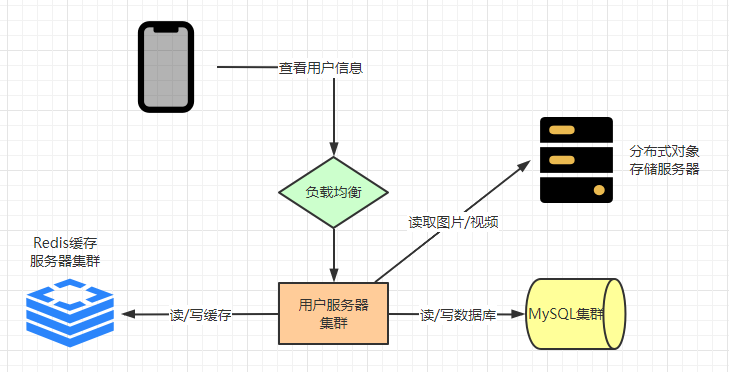
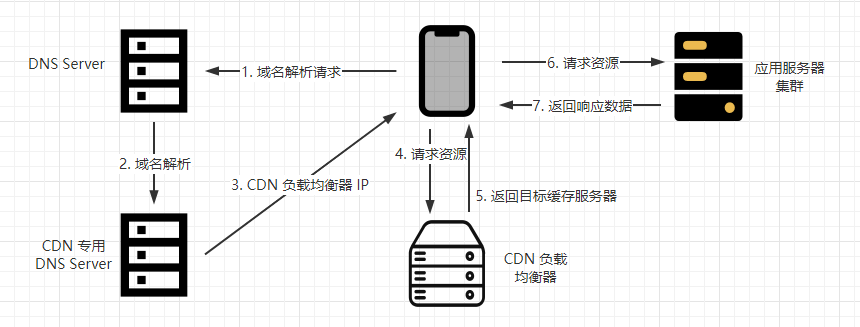
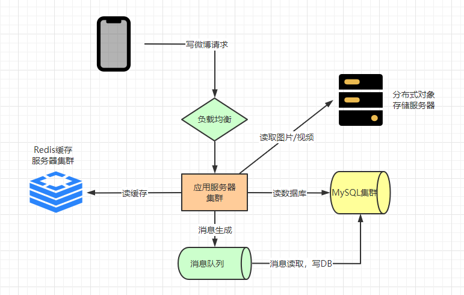

目录

> 1. 引言
>
> 2. 需求分析
>
> 3. 概要设计
> 4. 详细设计
> 5. 发布/订阅问题
> 6. 小结

## 1. 引言

### 自我介绍

屏幕前的观众朋友们大家好，今天我给分享 **架构设计** 相关的话题。

小❤，一个本科毕业多年的 985 非科班程序员，曾混迹于国企、互联网大厂和创业公司的后台开发攻城狮。

我的公众号：xin 猿意码，讲义和课件我后面放上去，今天讲课的脚本来自于之前写的一篇架构文章：听说你会架构设计？来，弄一个微博系统。

### 什么是架构设计

架构设计关注整个系统的高层次结构，强调系统的组成部分、它们之间的关系以及如何满足系统的需求。

比如，我在设计一个系统时，我需要关注哪些组件，哪些微服务，关注高可用，可扩展等能力。

### 为什么要学架构设计

系统设计是一个很宽泛的话题。在互联网上，**关于系统设计原则的资源也是多如牛毛。**

在很多科技公司中，除了代码面试，系统设计也是**技术面试过程**中的一个**必要环节**。

## 2. 微博系统

**抢答环节：**微博作为国民常用的社交类 APP，平时用吗？可以说一下微博常用的几个功能吗？

### 需求分析

微博常见功能有刷微博，发帖子以及用户关注，此外，用户还可以点赞、评论、收藏和转发微博。

如果现在让你设计一个微博系统，结合刚才说的几个核心功能，你会怎么设计？需要考虑系统高并发、高性能以及高可用性。

拿到 “产品需求” 之后，我们首先可以在脑海中构建了一个核心功能的用例图，如下：

每个需求说明如下：

- 注册登录：用户通过手机号注册登录，然后可以刷微博、关注好友、发帖子；
- 刷微博：用户打开手机 APP 端的微博主页，显示关注的好友最近发表的微博，按最近时间排序；
- 发微博：用户可以发表不超过 140 字文本的内容，可以包含图片和视频；
- 关注好友：用户可以关注其他用户，被关注者可以看到粉丝信息和粉丝数。

### 核心组件

1. **网关**：

   * 通用定义：网关是一个用于管理和控制进出系统的入口点。它负责路由请求到正确的内部服务、鉴权、安全性、协议转换、请求转发、缓存等任务。

   * 通俗解释：想象你要进入一个大型体育场，体育场有很多入口，但是你必须通过安检才能进入。这个安检通道就是网关。网关像一个门卫，它会检查你的票，确保你有权进入，然后让你通过。同时，它还会检查你的背包，确保里面没有危险物品。一旦你通过了安检，你就可以自由进入体育场观看比赛。

     在计算机世界中，网关的作用类似于这个安检通道。它位于你和互联网上的服务之间，负责确保只有授权的用户能够访问服务，同时还可以提供安全性、性能优化和流量控制等功能。

   

2. **负载均衡**：

   - 通用定义：负载均衡是一种技术，用于分配网络流量到多个服务器，以确保它们都能高效工作。
   - 通俗解释：就像把一个人的工作均匀分给不同的人一样，以确保所有服务器都不会过载，保持应用的速度和可用性。

   

3. **关系型数据库**：

   - 通用定义：关系型数据库（RDBMS）是一种用表格和行的形式组织数据的数据库，通常使用 SQL 语言进行查询和管理。
   - 通俗解释：就像使用电子表格来整理数据一样，可以方便地存储和查找各种信息，比如用户信息或订单记录，最常见的是 MySQL。

   

4. **分布式对象存储服务**：

   - 通用定义：分布式对象存储服务是一种 NoSQL 中的一类云存储技术，用于存储大规模数据和文件，分布在多个地点。
   - 通俗解释：就像将文件存放在云端的大文件柜中，可以随时从任何地方访问和管理这些文件。

> NoSQL：NoSQL 是**键-值数据库**、**文档型数据库**、**列型数据库**或**图数据库**的统称。数据库是非规范化的，表联结大多在应用程序代码中完成。大多数 NoSQL 无法实现真正符合 ACID 的事务，支持最终一致性。
>
> **BASE** 通常被用于描述 NoSQL 数据库的特性。相比 CAP，BASE 强调可用性超过一致性。
>
> - **基本可用** - 系统保证可用性。
> - **软状态** - 即使没有输入，系统状态也可能随着时间变化。
> - **最终一致性** - 经过一段时间之后，系统最终会变一致，因为系统在此期间没有收到任何输入。
>
> <a href="https://mp.weixin.qq.com/s?__biz=MzI5Nzk2MDgwNg==&mid=2247484896&idx=1&sn=60dd09486fc9ecc652af917d8a311419&chksm=ecac51e9dbdbd8ffc10b79699ea7e4a8fb00aabc743b15cc5c3311970a9e3046592cbb879364#rd">深入浅出：分布式、CAP 和 BASE 理论</a>

4. **缓存**：

   * 通用定义：缓存是用来临时存储数据的快速访问区域，以提高数据检索速度。
   * 通俗解释：就像把常用的书放在桌子上，而不是放在书架上，以便更快地找到并阅读它们。一般情况下，MySQL 磁盘的读取速度是 100次/s，而 Redis 的读取速度是 110000 次/s，悬殊 1100 倍。

   

5. **CDN（内容分发网络）**：

   * 通用定义：CDN 是一种全球分布的网络，用于存储和传送网站和应用的内容，以提供更快的访问速度。
   * 通俗解释：就像在不同地方都有快递中转站，可以更快地将包裹送到你家门口，CDN 帮助网站内容更快地传送到用户手中。

   

6. **反向代理**：
   * 通用定义：反向代理是一种服务器，位于用户和网络应用之间，用于接收用户请求并将其传递给应用服务器。并且可以在反向代理设置业务数据缓存，当用户查询的内容被命中时，就可以直接返回缓存数据，避免了每次到应用服务器请求，提升响应速度并减轻服务器压力。

> 1. **正向代理**：
>    - **通俗解释**：正向代理就像你找了一位朋友代表你做事。例如，你在国内，但访问某些国外网站需要翻墙，你可以使用一个国外服务器（代理服务器）帮助你访问这些网站。这个服务器就像你的“朋友”，它将你的请求发送到目标网站，并将响应传递回你。
> 2. **反向代理**：
>    - **通俗解释**：反向代理就像商店的前台。考虑一个大型网站，它有多台服务器来提供服务。反向代理服务器位于这些服务器之前，接收来自用户的请求，然后将请求路由到合适的服务器上。用户只知道反向代理，不知道背后的服务器。
>
> 3. **二者区别**：
>    1. 正向代理是代表客户端向服务器请求资源，客户端知道代理服务器并向其发出请求。
>    2. 反向代理代表服务器接收并分发来自客户端的请求，客户端不知道实际提供服务的服务器。
>
> 总之，正向代理是代表客户端访问资源，而反向代理是代表服务器提供资源。这两种代理在网络和服务器架构中有各自的用途和优势。

## 3. 概要设计

微博的业务功能不难理解，但是**并发量和数据量**都非常大：

- 10 亿级别的用户量，平均每个用户上千个帖子数，每个用户可关注上千个好友；
- 高并发量，每秒十万级的平均页面访问，每秒万级的帖子发布量；
- 用户分布不均匀，部分明星用户的帖子数量或者粉丝数量，超出普通用户几个数量级；
- 时间分布不均匀，某个用户可能突然在某个时间点成为热点用户，其粉丝也可能陡增几个数量级。

其具有一个典型社交类系统的特征，可归结为三点：==海量数据，高访问量，非均匀性==，由于篇幅有限，接下来从其最常见的关注好友、刷微博、发帖子三个功能来做概要设计。

### 3.1 关注好友

如上图微博打开某个博主的主页面，页面包含最基础的关注功能：包括 Ta 的关注用户、Ta 的粉丝数，以及我们可以点击关注此博主。而从博主的主页面，我们还可以进入他的关注和粉丝两个子页面：

- 关注（attention，后文同）页，展示该用户关注的所有用户信息
- 粉丝（follower，后文同）页，展示该用户的所有粉丝用户信息

在上述页面中，用户可以关注某个用户，也可以删除粉丝，即取消其他某个用户对自己的关注，功能的业务交互如下：

用户关注好友时，需要先经过负载均衡服务器，然后把请求发送到微博的用户服务器集群，这里涉及到用户信息的展示，所以用户服务器可能会**访问对象存储服务器获取图片和视频，以及从 Redis 或 MySQL 中取出文本数据**。

最后，如果修改了用户的关注状态，就会把信息写入到 Redis 及 MySQL 集群中。

### 3.2 刷微博

刷微博系统的核心是解决高并发问题。系统整体部署模型如下：

首先，我们采用 CDN（Content delivery network，内容分发网络）来快速返回用户请求，它的原理是将服务器部署在用户广泛使用的地区节点，当用户访问系统的时候，通过**全局负载技术**将请求分发到最近的服务器上，由它们直接给用户提供服务：

当没有采用 CDN 时，每次用户请求都会直接到达系统的应用服务器集群，这将对系统服务器产生极大的流量压力；而**采用 CDN 后，用户请求会根据 CDN 负载均衡器返回的目标服务器，将访问发配到这些用户邻近的节点上**。

采用 CDN 的优势是能够极大地**避免网络拥堵，使得内容传输更快、更稳定**，CDN 可以看作是系统缓存，对于微博这种很少更改数据的场景下尤为适用，正常情况下 CDN 可以过滤掉 90% 以上的请求，直接返回数据。

因此，当用户通过 CDN 访问微博系统时，绝大部分都可以被 CDN 缓存命中。也就是说，图片以及视频等极耗带宽的请求压力，90% 以上可以通过 CDN 消化掉。

没有被 CDN 命中的请求，会到达数据中心的反向代理服务器，反向代理服务器检查本地缓存是否有请求需要的内容。如果有就直接返回；若没有，才到分布对象存储集群中获取相关图片和视频，或者从应用服务器应用获取微博文字内容。

从微博应用服务器集群获取内容时，会先从 Redis 缓存服务器中，检索当前用户关注的好友发布的最新微博，并构建一个结果页面返回。如果 Redis 中缓存的微博数量不够 20 条，则继续从 MySQL 数据库中查找数据。

### 4.3 写微博

写微博时不需要 CDN 和反向代理，而是直接通过负载均衡服务器到达应用服务器集群。应用服务器一方面会把发布的微博写入 Redis 缓存集群，另一方面写入 MySQL 分片数据库中。

注意，我们在写入数据库时，**如果直接写库，当有高并发的写请求突然到来，可能会导致数据库过载，进而引发系统阻塞或崩溃**（参照 “缓存雪崩” 问题）。所以，数据库写操作可以先写入消息队列里（比如 Kafka集群），由消息队列的消费者程序从消息队列中按照一定的速度消费消息，并写入数据库中，以保证 DB 的负载压力不会激增引发异常。

## 4. 详细设计

### 4.1 表设计

用户、粉丝、关注和帖子表：

- user 表：主键id，用户信息（名称，头像，注册时间，大v认证，手机号等）
- relation 表：主键id，followId，attentionId[粉丝和被关注者ID]
- post 表：主键id，userId，postTime[发布时间（精确到毫秒即可）]，content

#### 索引优化

post 表可以用组合索引 userId+postTime 查询某个用户最近的帖子，这里组合索引作为二级索引，故需要回表。**为了减少回表次数，我们可以把 userId 和时间戳拼接位 postId 作为主键**：比如，前 20 位作为时间戳精确到毫秒+用户Id， 转成 62 进制（0-9a-zA-Z）的字符串作为 postId，也能保证主键是递增。

但这样会导致索引树占用更多空间，且查询时没有纯数字主键那么快，所以最后可以根据实际情况比对两者的优劣选择最合适的主键类型。

### 4.2 分库分表

当 follow、attention、user 表数据量突破千万级、亿万级之后，微博读写数据库的压力非常大，对于单机数据库肯定是无法承受的。所以微博 DB 需要采用分片部署的分布式数据库。

#### 垂直拆表

上述 relation 表 [id, followId, attentionId] 存储粉丝和关注信息，当用户增多时就会出现一个问题，那就是分库分表的拆分 key 不好选择：

* 如果选择 followId 做 hashKey，查询当前用户的关注列表时都在同一个分片，但查询用户所有粉丝时就需要在多个分片上；
* 如果选择 attentionId 做 hashKey，查询某个用户的所有粉丝列表时都在同一个分片，但查询当前用户的关注列表时又需要分片。

所以我们将 relation 表拆分为：

- follow 表：主键id，userId，followId
- attention 表：主键id，userId，attentionId

#### 水平拆表

水平拆分即采用 hash 分片的方式部署分布式数据库，分片规则可采用用户 ID 或者帖子 ID。

如果按用户 ID 分片，同一个用户发表的全部帖子都会保存到同一台数据库服务器上，好处是**当系统需要查找某个用户发表的微博时，只需要访问一台服务器即可完成**。缺点是，对于明星用户，其数据访问会非常多，热点数据的访问导致该服务器负载压力过大。同样地，如果一个用户频繁发布微博，也会导致单个服务器数据增长过快。

如果按帖子 ID 分片，虽然可以避免上述用户 ID 分片带来的热点聚集问题，但是**当查找某个用户的所有微博时，需要访问的分片数据库服务器是随机的**，对整个数据库服务器集群的压力太大。

综合考虑，用户 ID 分片带来的热点问题，可以通过优化缓存来改善。某个用户频繁发表微博的问题，可以通过设置每日发表帖子上限来解决（比如每天每个用户最多发表 50 条微博）。最终，微博采用按用户 ID 分片的策略。

分片逻辑可以用 hash 取模，也可以用一致性 hash 映射等方式。

### 4.3 热点用户问题

拆完表之后，虽然一定程度解决了快速查表的问题，但是对一些热点明星用户的查询还需要优化。比如以下几种场景：

- 明星热点用户有很多粉丝，在查询粉丝数量时通过 follow 表查询 count 时扫描的行数非常多，而且这种低效的操作会由于粉丝数的增多而扩大。
- 刷微博时，明星用户有很多帖子都是重复被查看的，如果每次粉丝去查询时都到 DB 中获取，无疑会出现严重的性能压力。

解决以上两种场景下的 DB 查询问题，可以引入缓存。但是缓存空间有限，我们必然不能把所有数据都缓存起来，设置一个好的缓存淘汰策略是我们讨论的重点。

#### 时间淘汰策略

对于热点话题来说，无论是热点帖子、热点用户，都需要加入缓存，缓存的淘汰策略可以设置为时间淘汰算法。

将最近 n 天内发布的微博全部缓存起来，用户刷新微博时，只需要在缓存中查找。某用户获取的微博列表如果有 10 条，就直接返回给用户；如果缓存中的微博数量不足，再去数据库中查找。

所以，我们可以缓存 7 天内发布的全部微博文本，其中缓存 key 为用户 ID，value 为最近 7 天发表的帖子 ID 列表。同时，帖子 ID 和帖子内容也分别作为 key 和 value 缓存起来。

#### 本地缓存模式

此外，对于特别热门的微博，比如明星结婚/离婚/出 GUI 等情况，由于高并发访问全都集中在一个 key 上，会给单台 redis 服务器带来极大的负载压力。所以微博系统可以启用**本地缓存模式**，即应用服务器将特别热门的微博内容缓存在服务器内存中，当用户在刷微博时，会优先检查帖子 ID 对应的微博内容是否在本地缓存中。

我们可以针对 500w 以上粉丝数的大 V 用户，缓存其 48 小时内发表的全部微博，进一步减轻热点数据带来的查库压力。

## 5. 微博发布/订阅问题

微博用户关注好友后，如何快速得到所有好友的最新发布内容，即发布/订阅问题，是微博的核心业务问题。

### 5.1 推模式

当用户发布一条帖子以后，立即将消息推送给粉丝。但是此时粉丝不一定在线，那么就需要将数据存储起来。这样，用户每新增一条帖子，都需要将帖子推到它的粉丝所在 DB 的分片上，粉丝每次浏览新消息时，直接查询自己分片所存储的数据即可。

推模式一个明显的问题：**如果一个用户有上千万的粉丝，那用户每发布一条微博，就需要在订阅表中插入上千万条记录，即 “写扩散”**。粉丝之中不乏有很多的僵尸粉（上线频率极低的用户），带来的后果就是数据库压力非常大，导致阻塞或崩溃。

### 5.2 拉模式

当用户发布一条帖子以后，只保存在自己的业务表。当粉丝上线以后再去关注的人业务表里读取帖子，然后按照时间顺序排序后返回。

拉模式的问题是：如果一个用户关注了 500 个明星用户，每次查询时都需要到各分片中查询不同明星发表的帖子，**一个明星有千万级甚至亿万级的粉丝数，意味着可能会同时有千万级甚至亿万级的读数据操作，即 “读扩散”**，带来的问题就是数据库分片的读数据减压效果体现不出来。

所以，微博系统首先需要限制用户的关注数，微博普通用户的关注上限是 2000 人，VIP 用户上限为 5000 人。其次，尽量减少刷新微博页面时查询数据库的次数，多用缓存读取帖子。

### 5.3 推拉结合

我们发现，即便对微博用户限制好友数，但单一的 “推模式” 或者 “拉模式” 都难以解决微博系统的订阅/发布问题，所以我们最终采用 “推拉结合” 的模式，具体有如下两种实现方式。

#### 1）区分大 v 明星

对于大 v 明星用户（粉丝数大于 500w）来说，为了防止写扩散，我们只需要将数据同步到 100 个数据库分片上即可（假设有 100 个数据分片），它至少需要三个字段：userId，postId，postTime。无论多少粉丝，就只复制 100 份，这样就避免了很多几乎永远不会上线的僵尸粉因为数据写浪费网络性能和存储资源。

对于普通用户来说，还是继续采用推的模式，这样大多数用户在读取最新帖子的时候只需要在自己用户对应的分片上就可以获取到数据了。

这样设计的方式较为简单，但是用户在刷微博的时候，**查询过程可能需要查询两次，分别是自己订阅表下的帖子信息，和关注用户发布表下的帖子信息**。

#### 2）区分在线状态

第二种方式是根据用户状态来判断推拉：如果用户当前在线，就使用推模式，系统会在 Redis 缓存中为其创建一个好友最新发表的微博列表。关注的好友如果有新微博发布，就立即将帖子信息插入列表的头部，当该用户刷新微博时，只需要将这个列表返回即可。

**如果用户不在线，系统就将列表删除，当用户再次登录刷新时，用拉模式为其重新构建列表**。

如何确定用户在线呢？一方面可以通过用户操作时间间隔来判断，即心跳机制；另一方面也可以通过机器学习，预测用户的上线时间，利用系统空闲时间，提前为其构建最新的微博列表。

## 6. 小结

架构设计是每个程序员都应该学习的一门必修课，无论你身处校园，还是刚入职场，还是工作多年的老油条。

扫描二维码关注，领取课件，免费学习资源，以及其它架构分享。

<a href="https://mp.weixin.qq.com/s?__biz=MzI5Nzk2MDgwNg==&mid=2247484230&idx=1&sn=89cd8cc063700baa28d2190287742a38&chksm=ecac574fdbdbde591a43b97147cd4e201eff5b0f8a16e607ea0e82885db0226481ad10e60911#rd">短链系统</a>

<a href="https://mp.weixin.qq.com/s?__biz=MzI5Nzk2MDgwNg==&mid=2247484653&idx=1&sn=44bef7d1e9530018da6be609fc4e57d2&chksm=ecac50e4dbdbd9f23ac9d1ce81628662e482ff57c95c51b8a6fb9858f8128793066128acbca7#rd">打车系统</a>

<a href="https://mp.weixin.qq.com/s?__biz=MzI5Nzk2MDgwNg==&mid=2247484740&idx=1&sn=a92c71bf4b70d611ca880ee38d4393bf&chksm=ecac514ddbdbd85b6c8ca03e900d2f7850fb2795aa7d1e8b1d73a4bb9a1c4e527eb309b480cf#rd">评论系统</a>

<a href="https://mp.weixin.qq.com/s?__biz=MzI5Nzk2MDgwNg==&mid=2247484952&idx=1&sn=baa9da16bb52cbf6ee17d9868cacc5c6&chksm=ecac5211dbdbdb07ea31acb4fbf77cfab87c2d45bd89637d86b23499b0e2f6bc101686883748#rd">网盘系统</a>

交友系统等

更多编程知识、架构设计、面试经验、生活分享。

详见 **xin猿意码** 公众号：

