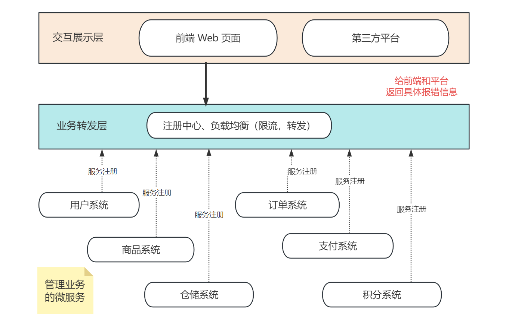
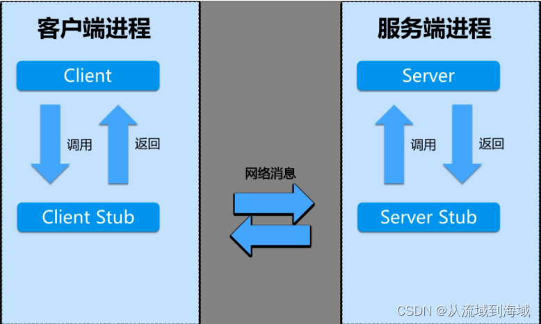
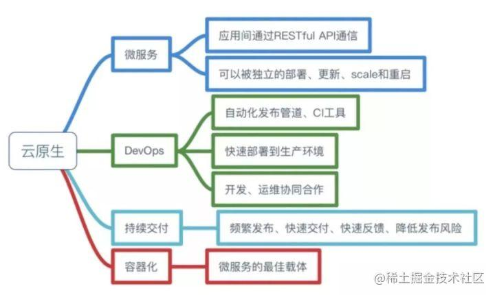

**目录**

> 1. 引言
> 2. 为什么需要微服务
> 3. 服务发现
> 4. 服务间通信
> 5. 微服务常见的问题

# 1. 引言

## 1.1 微服务的地位

当前互联网界，不管是做 2B 端【面向企业】，还是 2C 端【面向个人用户】产品，微服务开发已经是遍地开花，单体结构的系统大多只存在于传统软件和中大型国企架构里。

但是，你真的了解微服务吗？我们来看一则招聘 JD 里，关于微服务的要求：

> **候选人需熟练使用微服务框架，深刻理解微服务原理及运行机制，并对服务拆分，服务间调用，服务治理有着独特的见解。**

## 1.2 什么是微服务

微服务的定义有很多，官方说法如下：

> 微服务是**一种开发软件的架构和组织方法**，其中软件由通过明确定义的 API 进行通信的小型独立服务组成， 这些服务由各个小型独立团队负责。 微服务架构使应用程序更易于扩展和更快地开发，从而加速创新并缩短新功能的上线时间。

通俗来说，微服务就是一种**架构模式**，或者说是一种**架构风格**。它提倡的是将**单一的应用程序划分为一些更小的服务，每个服务独立进行管理**，服务和服务之间互相配合、协调，最终给用户提供快速迭代的上线产品。

比如一个电商系统，可能会包含用户、商品、仓储、订单、支付以及积分系统等微服务：

今天我们就来详细聊一聊微服务，以及微服务相关的面试题型。看了这篇文章之后，不管是大小公司的面试，只要问到微服务就是赚到。

# 2. 为什么需要微服务

## 1.1 单体架构的问题

最开始，没有微服务之时，互联网界的应用程序都使用了单体架构，即将一个系统下所有的模块都放进一个服务中。

通常，这些服务大的有十几个模块，团队数十人一起进行开发。此时，单体架构的问题逐渐暴露出来：

1. 系统间通常以 API 方式互相访问，耦合紧密导致难以维护扩展；
2. 各业务领域需要采用相同技术栈，难以快速应用新技术，比如都用 Java 或 PHP；
3. 系统修改必须整个系统一起部署/升级，运维复杂且容易出错；
4. 系统负载增加时，难以水平扩展；
5. 系统一处出现问题，可能会影响整个系统，出现连带问题。

于是，2012 年微服务概念被提出，作为加快 Web 和移动应用程序开发的一种方法，开始备受关注。

时间来到 2015 年，越来越多的互联网社区、论坛、以及互联网巨头开始使用微服务，从 2018 年起，越来越多的中小型企业也开始进行微服务架构升级。

到 2023 年的今天，据最新市场研究报告表明，市面上 95% 的应用程序都已经使用微服务架构进行开发。

## 1.2 微服务的特点&原理

### 1）单一职责

一般按业务逻辑划分微服务，每个微服务仅负责归属自己业务领域的功能，逻辑清晰，模块内聚性高。比如上述的用户系统、商品系统、订单系统、支付系统等。

### 2）自治

微服务是独立的实体，可以独自进行部署、升级，各微服务之间通过 RESTful 等形式的标准接口进行通信，且微服务可以不同技术栈实现，其它模块不受影响。

最常见的，现在很多算法推荐模块用了 Python 实现，后台业务使用 Go 或者 Java 实现，模块间的业务调用和技术栈无关，大家可以友好进行 API 调用。

通过隔离、熔断等技术保证某服务异常时不影响别的模块，而且部署方便，快速发布成本低。

### 3）可扩展

业务增长，可以单独对某一个模块进行横向或纵向扩展，方便实现弹性伸缩，和灰度发布等。

在不同业务场景下，不同模块的压力是不一致的，比如电商系统的限时秒杀业务下：商品系统和仓储系统就承受了大部分流量压力，而支付系统可能就会比较轻松。

为了应对类似场景，我们可以将商品系统和仓储系统的模块分布式多台机器部署，将流量压力平分到不同的业务机器上，缓解模块的高并发压力。

### 4）灵活组合

微服务架构下，可以通过组合已有的微服务达到功能重用的目的。

## 1.3 微服务的缺点

### 1）代码复杂度高

**微服务间通过 HTTP、RPC 等方式交互**，相对于单体架构下的 API 形式，需要考虑被调用方故障、过载、消息丢失等情况，代码逻辑更复杂。

微服务间的事务性操作，需要解决分布式事务的问题，可能需引入二阶段、最大努力通知等思路来解决。

各微服务之间存在少部分功能（或数据库字段）重合，但又无法提取成微服务时，通常需要重复开发，或者代码复制，增加了开发和维护成本。

### 2）运维任务重

上线时，可能有服务耦合的关系，需要依次有序地进行服务部署。最常见的情况是，A 服务调用 B 服务的接口，即 A 依赖 B，上线时就必须先升级 B 系统，后升级 A 系统。

而且，由于系统独立，故需要一个设计良好的监控系统对各个微服务运行状态进行监控。实时监控是为了防止业务系统中有模块临时掉链子，影响整体业务的使用。

### 3）影响性能

相对单体架构，各微服务之间 REST、RPC 通信时延更高，特别是调用链路比较长的时候。而且当业务链长时，问题排查较为困难，可能涉及到多个服务的问题。

# 3. 服务发现

## 3.1 服务治理的概念

应用从单体架构向微服务演进的过程中，由于细粒度的微服务应用数理大幅度增长，微服务之间的服务发现、负载均衡、熔断限流等服务治理需求显著提高。

微服务场景下，每个服务有多个实例，需要一种机制将请求的服务名解析到对应的服务实例地址上，这就需要服务发现和负载均衡机制。

## 2.2 服务发现

服务发现包含两部分：

- 服务注册：各服务名将服务实例的信息发送到注册中心，并提供心跳机制保证服务在线；
- 服务发现：从注册中心获取服务对应的实例列表。

服务发现的常见策略：

1. ETCD 做注册中心，各服务模块将服务名和实例信息注册到 ETCD，并保持自己的租约不过期，维持服务在线；
2. Redis 做注册中心，各模块维持一个定时器，定期向注册中心模块发送实例信息和时间，注册中心模块根据心跳时间和网络波动时间，得出最大超时时间。如果某模块最后一次心跳的时间超过最大值，就将其踢出服务集群；
3. Istio 服务注册与发现，由控制面 Pilot 和数据面 Envoy 协作完成，Pilot 通过 K8s APIServer 接口获取 service 和 endpoint 等服务资源信息，将其转换为 xDS 消息下发给数据面的 Envoy 组件。Envoy 收到请求后根据配置的负载均衡策略，选择一个服务实例进行请求转发。

Istio 是一个开源的服务网格平台，它可以控制微服务之间数据的共享方式。Istio 的架构分为数据面 Envoy 和控制面 Pilot。

数据面上，通过在环境中部署 sidecar 边车代理，即可为服务添加 istio 支持。该 sidecar 与服务共存，但是对代码无侵入，它的作用是和其它代理进行路由请求。这些代理共同构成了一个服务网格，可拦截微服务之间的网络通信。

控制面上，负责管理和配置代理来实现流量转发，此外它还可以配置一些检测组件，对服务进行实时监控。

总之，Istio 提供了流量管理、安全防护、可监控性的代理，使得微服务向云原生应用转型变得更容易。

## 2.3. 负载均衡

### 1）什么是负载均衡

负载均衡一般和服务发现配合使用，从服务发现解析的实例中选择一个实例发起请求，这个过程用到了负载均衡策略。

### 2）负载均衡算法

#### **1、轮询法**

将请求按顺序轮流分配到后端服务器上，均衡对待每一台后端服务器，不关心服务器的连接数和当前系统负载。

#### **2、随机法**

随机选择一台机器进行访问，由概率统计得知，当调用次数越多，其分配调用越接近平均，也就是轮询的结果。

#### **3、加权轮询法**

根据服务器的硬件配置和负载，给性能高、负载低的机器加上更高的权重，使得权重高的机器更容易被访问到。请求数量很大时，每个服务处理的请求数量之比会趋向于权重之比。

算法说明：Nginx 的加权轮询算法中，每个节点都有 3 个权重变量：

- weight：初始化权重，从配置文件读取；
- currentWeight：节点当前权重，根据请求处理的情况，权重会发生变更；
- effectiveWeight：有效权重，初始权重为 weight，请求过程中如果发现节点异常，则-1；之后再次选择该节点，调用成功则+1，直到恢复 weight。

举例：https://segmentfault.com/a/1190000039799210

代码：https://juejin.cn/post/6871169933150486542

#### **4、源地址哈希法**

获取客户端的 IP 地址，通过 hash 取模的方式访问某一个服务器。当后端服务器列表和 hash 算法不变时，同一个客户端每次请求都会映射到同一台服务器上。

# 4. 服务间调用

我们上述在介绍微服务特点时已经介绍：**微服务间通过 HTTP、RPC 等方式交互**。

HTTP（HyperText Transfer Protocol，超文本传输协议） 和 RPC（Remote Procedure Call，远程过程调用），前者是一种协议，后者是一种方法，两者都常用于服务调用。

RPC 主要工作在 TCP 协议之上（也可以是 HTTP），而 HTTP 工作在 HTTP 协议之上，而 HTTP 又基于 TCP 传输层协议之上，所以 RPC 天然比 HTTP 更轻量，效率更胜一筹。

## 4.1 HTTP

### 1）简介

HTTP 服务开发即开发 RESTful 风格的服务接口，在接口不多、系统之间交互较少的情况下，是一种信息传递的常用通信手段。

### 2）优势

HTTP 接口的优点是简单、直接、开发方便，且利用现成的 HTTP 协议就可以进行传输。服务开发时，约定一个接口文档，严格定义输入和输出，明确接口的请求方法和参数即可进行开发。

## 4.2 RPC

### 1）基本组件

RPC 服务基本架构包含四个核心组件，分别是 Client，Server，Client Stub 以及 Server Stub。

Client、Server：服务调用方、提供方；

Client Stub：客户端存根，存放了服务端的地址信息，负责将 Client 的请求参数打包成网络消息，发送给 Server；

Server Stub：服务端存根，接收客户端发送的消息......

### 2）优势

RPC 效率优势明显，实际开发中，C 端和 S 端分别约定调用参数和返回参数以后就可以各自开发，实现了 C 端和 S 端的解耦，也使得 RPC 接口可以在多个项目中重复利用。

RPC 分为同步调用和异步调用，同步调用即客户端等待调用完成并返回结果，异步调用无需等待完成，属于单向调用或者通过回调函数等方式接收通知。

在内部子系统较多，接口较多的情况下，RPC 框架好处明显。首先是长连接，不必每次通信都三次握手建立连接，减少了网络开销；其次 RPC 框架一般都有注册中心，丰富的监控发布方法；最后，RPC 接口的发布、下线和动态扩展对调用方是无感知的、统一化的操作。

### 3）流行的 RPC 框架

- gRPC：基于 HTTP2.0 协议，底层使用了 Netty 框架；
- Thrift：跨语言的服务开发框架，通过代码生成器来节省一系列基础开发工作；
- Dubbo：协议和序列化框架都可以插拔。

## 4.3 HTTP 和 RPC 的区别

RPC 主要用于公司内部服务调用，性能消耗低，传输效率更高，服务治理也方便；HTTP 主要用于对外的异构环境，浏览器调用，APP 接口调用，第三方接口调用等。

- 从速度来看，RPC 更快，虽然底层都是 TCP，但是 HTTP 协议的信息往往比较臃肿；
- 难度上看，RPC 较为复杂，HTTP 更简单；
- 灵活性看，HTTP 更胜一筹，因为它不关心细节，跨平台，跨语言。

最近新兴的微服务概念更加强调独立、自治、灵活，而 RPC 限制较多。因此微服务框架中，一般都采用 HTTP 的 RESTful 方式调用，除非对效率要求较高的系统。

# 5. 微服务拆分

微服务各模块的边界问题，怎么拆分

通用拆分方式：

1. 先按业务领域拆，如社区、用户、商城、慢病、工单，如果有相同功能需要聚合，则进行下沉（垂直）。
2. 再按功能定位拆（水平），如商城业务复杂度提高之后可进一步拆分为商品、订单、物流、支付。
3. 按重要程度拆，区分核心与非核心，如订单核心，订单非核心。

# 6. 云原生

Pivotal【ˈpɪvətl】公司官网对云原生概括的 4 个要素分别是：

- 微服务：RESTful API 通信、独立部署更新；
- DevOps：自动化发布管道，CI（持续集成）工具；快速部署到生产环境；开发运维协同合作；
- 持续交付（CD）：频繁发布、快速交付、快速反馈、降低发布的风险；
- 容器化：微服务的最佳载体。

CI/CD 主要指的是持续集成、部署和持续交付这 3 个环节。