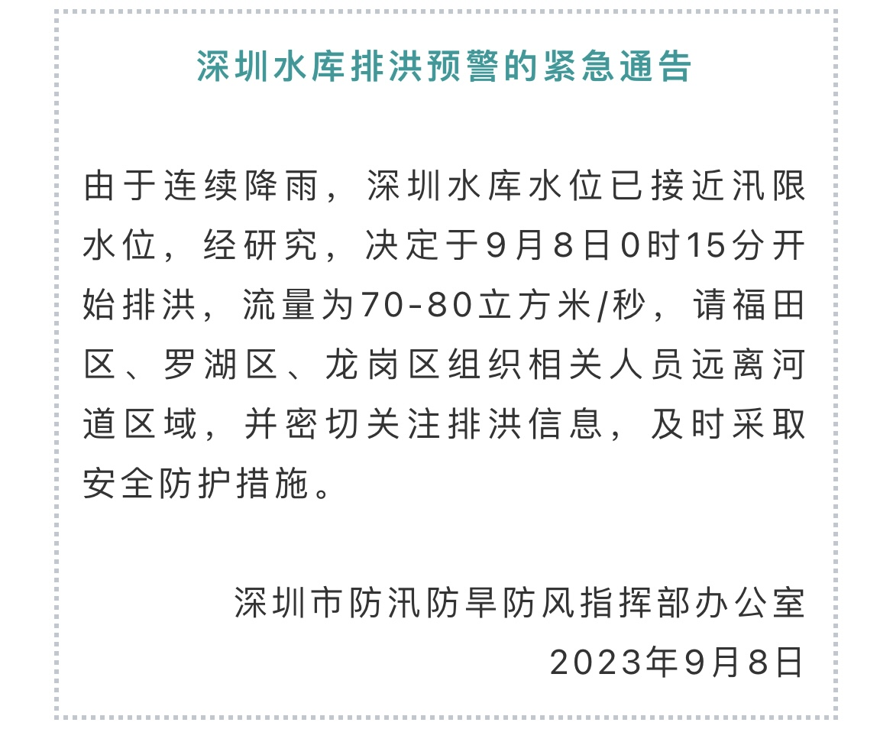
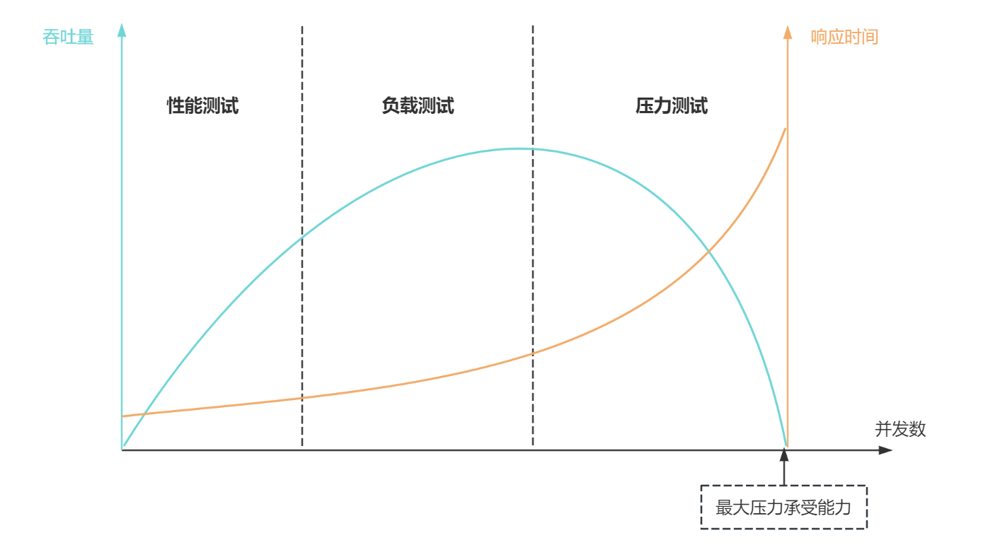
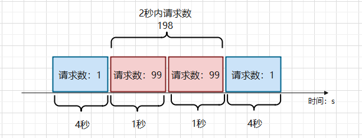
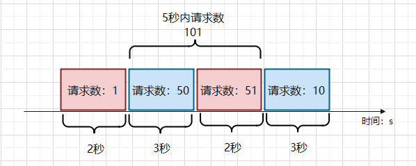
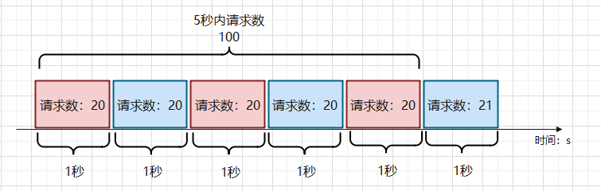
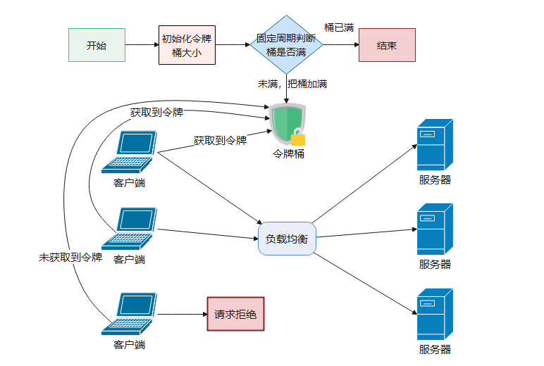
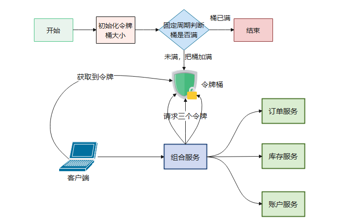
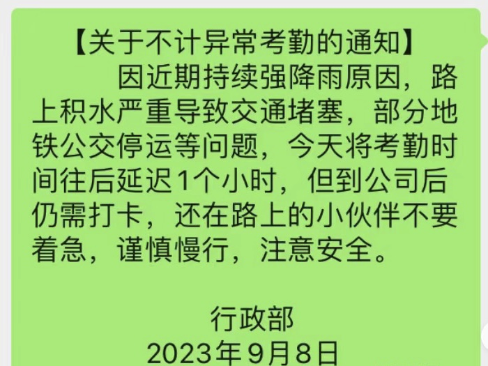
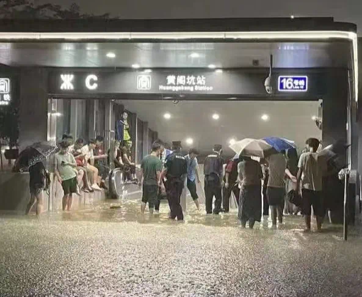

# 1. 引言

## 1.1 水库泄洪

深圳刚送走了台风 “苏拉”，又迎来了 “海葵”。

9 月 8 日，距离上一次台风过去还不到一周的时间，深圳又发布了泄洪预警信号：

暴雨来袭，罗湖区、龙岗区和福田区一副 “水漫金山” 的场景：

同一天，深圳的学校再次宣布停课。

> 有学生反馈：在深圳上学太 “艰难” ，开学一周，停课两次。

打工人内心 OS：你们就偷着乐吧，毕竟只要交通不歇业，我们是不会停工的。

> 深圳交通：水库满了，关我交通什么事？毕竟我们的高可用设计不是盖的。

## 1.2 深圳交通的可用性设计

如果把深圳水库当做一个应用系统，从软件研发的角度来看，洪水就是流量和数据，深圳水库泄洪事件其实就是维持系统稳定进行批量数据删除的工作。

这让我一下子就想起了服务的高可用设计问题，虽然流量很大，导致深圳的交通系统出现了短暂的不可用。但是，通过排水系统的运转，临时疏导等措施，深圳交通这台大机器又很快运转起来了。

不得不说，这很强！

### 面试复盘

和交通可用性对比，软件可用性有什么共通之处呢？

思维无限蔓延，让我想起了很久以前腾讯二面的一道面试题。

面试官：我们知道，分布式系统有三高，高性能、高并发和高可用，**兼顾到系统的性能和并发量，你会从哪些方面设计出高可用的系统呢**？

结合深圳交通的处理方式，接下来我将从高可用的整体概念，性能估算，系统测试，及注意事项来分别介绍。

# 2. 高可用设计

## 2.1 什么是高可用

软件系统的高可用（High Availability，简称 HA）是分布式系统架构设计中必须考虑的因素之一，它通常用系统提供服务的时间来衡量。

如果把深圳交通当成一个系统，假设交通一直可以运转，系统的可用性就是 100%。

当然，和暴雨洪水一样，系统也可能遭受突然的流量激增，或者黑客攻击等情况，所以系统的 100% 可用性是很难保证的。

系统每运行 100 个时间单位，就会有 1 个时间单位无法提供服务，系统的可用性就是 99%。

大型的软件系统，比如淘宝、微信等，追求的高可用目标一般是 99.9999%，俗称 6 个 9，即全年停机不超过 31.5 秒。

## 2.2 性能指标

我们在设计系统时，需要先将系统负载能力做一个测算，即性能估算，然后再针对性做高可用设计。

在做性能估算时，我们得先了解几个指标。

#### 响应时间

响应时间是指客户机从发出请求到最后收到响应数据时所需的时间，是**系统最重要的性能指标**，直接反映了系统处理请求的快慢。

为什么说响应时间是最重要的指标，我们拿深圳交通举栗子，响应时间就是在乘客打车所需等待的排队时间，或者在地铁站排队等地铁的时间。

响应时间的长短，直接反映了交通的转运状况。

#### 并发数

并发数是指系统同时处理的请求数，反映了系统的负载压力情况。我们在做性能测试时，通常会用多线程模拟并发的用户数，每个线程充当一个用户请求，线程数就是性能指标中得到并发数。

交通系统的并发数，可以理解为所有交通运输中的乘客数量总和。

#### 吞吐量

吞吐量是指单位时间内系统处理请求的数量，它体现了系统对业务的处理能力大小。一般用 HPS（每秒请求数，Hits Per Second）、QPS（每秒查询数，Qeries Per Second）以及 TPS（每秒事务数，Transaction Per Second）等指标来衡量。

在系统正常运行阶段，这三个指标的关系是：吞吐量 = 并发数/响应时间。

交通系统中的吞吐量反映了交通是否通畅，系统是否运行正常。

## 2.3 系统测试

为了实现高可用目标，我们在系统设计时通常需要先做系统测试。

具体流程为：不断提升系统的并发量，以此测试出系统的抗压能力，以及系统的性能临界值。系统测试分为三个阶段，包括**性能测试、负载测试**和**压力测试**。

#### 性能测试

在系统设计初期，我们会先规划一个性能的预期目标。测试期间，不断对系统施加压力，来验证系统在资源可接受的范围内是否达到了性能预期目标。

拿深圳交通来举例，我们设计一个地铁系统初期，会通过调研估算等方式，根据每天的人流量大小来设计这个地铁系统。

性能测试可以理解为在计算机模型下，不断增加乘客数量，来估算地铁系统是否可以达到预期的目标。

#### 负载测试

对系统不断施加并发请求，增加系统的压力，直到系统的某项或多项指标达到安全临界值。

交通系统也是如此，如果参与交通的对象（人或者车）过多，整体的运输能力就会受到影响！这也是为什么一线城市都会限号上路的原因了。

#### 压力测试

超过安全负载的情况下，增加并发请求数，对系统继续施加压力，直到系统崩溃或不再处理任何请求，此时的并发数就是系统的最大压力承受能力。

压力测试是为了测出系统的最大承受瓶颈，拿交通系统来举例，如果一瞬间乘客人数达到这个最大承受值，深圳的交通就会立即瘫痪【这是一个理论值，实际上可能达不到】。

# 3. 高可用设计之“限流”术

## 3.1 限流

限流在系统设计初期一般不用考虑，等用户量增大时，当系统的处理能力不能应对外部突增的流量访问后，为了让系统保持稳定，必须采取限流措施。

在交通系统里面，最常见的限流就是外地车限行。比如在深圳，外地车只能在规定日期（周末或者节假日）出行，或者在规定的的高峰时间段（工作日上午 7 点至 9 点，下午 5 点半至 7 点半）不允许出行，都是维持交通系统正常运转的限流方式。

### 1）限流指标

#### TPS

Transactions Per Second，**每秒完成的事务数**。用这个值来做限流是最合理的，但是不太现实，因为在分布式业务系统中，事务往往需要多个模块配合完成。

按照 TPS 来限流，时间粒度可能会很大，很难准确评估系统的响应性能。

交通系统里面，如果把乘客从福田区的华强北，到南山区的科兴园作为一个事务，那限制从华强北到南山区

的乘客数量显然是不太可能的。因为这个过程中，乘客可能会经过地铁、公交等交通工具，即**一个事务需要多个模块配合完成**。

#### HPS

Hits Per Second，**每秒请求数**。如果每笔事务完成一个请求，那 TPS 和 HPS 是等同的。但分布式场景下，完成一笔事务可能需要多次请求，所以 TPS 和 HPS 不能等同看待。

和 TPS 中的例子一样，若乘客从华强北到科兴园只需要坐一趟车直达，那完成这个事务就只需要一次交通工具的参与（一次请求）。

#### QPS

Query Per Second，每秒能响应客户端查询的数量，也是衡量服务器整体性能的一个重要标准。

在交通系统里面，QPS 可以理解为容纳乘客数量的总和。

目前，主流的限流方法多采用 HPS 作为限流指标，和交通系统也正好能对应上，即限制车辆的出行。

### 2）限流方法

#### 1. 流量计数器

最简单直接的限流方法，比如限制 5 秒内最大请求数量为 100 次，超过这个数量就拒绝访问。交通系统里面的流量计数限流，就是在一定时间内，只允许多少辆车通行。

这种限流方法存在两个明显的问题。

##### 集中访问

单位时间很难把控，容易出现集中时间访问。比如出现以下场景：

  

前 4 秒只有一个访问量，第 5 秒有 99 个访问量；第 6 秒有 99 个访问量，接下来的 4 秒又只有 1 个访问量。从全局看，10 秒内 200 个请求流量没有超出，但从图中来看，这种流量情况肯定是异常的。

##### 非必要限流

有一段时间超了，但是并不一定真的需要限流。比如以下场景：

如果中间两块访问正好在一个 5 秒的周期内，那流量就超出限制了。这种情况下，后续的 10 个请求可能就会被丢弃，不太合理。

在交通系统里面，如果产生了集中访问或非必要限流，就会使得整个系统的使用体验直线下降。

#### 2. 滑动时间窗口

滑动时间窗口是目前比较流行的限流算法，主要思想是把时间看作是一个向前滚动的窗口，如下图：

它的特点是，将时间分片处理，滑动窗口每次统计一个总时间周期内的请求数。下一个时间段时，就把前面的时间片抛弃，加入后面时间片的请求数，解决了流量计数器可能出现的问题。

它的缺点在于对流量控制不够精细，不能限制集中在短时间内的流量，且一旦到达限流后，请求都会直接暴力被拒绝。

在交通系统里面这可能会导致损失一部分通行流量，对于体验感来说，并不太友好。

#### 3. 漏桶算法

漏桶算法的思想如下图：

漏桶是一个大小固定的队列，会把客户端发送的请求缓存起来，然后再均匀地发送到服务器上。

如果客户端请求速率太快，漏桶的队列满了，就会直接拒绝掉，或者走降级处理逻辑，不会冲击到服务器端。

漏桶算法的优点是实现简单，可以使用**消息队列**来削峰填谷。但是它也有几个问题：

- 漏桶大小不容易控制，太大会给服务器带来较大压力，太小可能会导致大量请求被丢弃；
- 漏桶给服务端的请求速率难以控制；
- 使用缓存请求的方式，会让请求的响应时间变长。

#### 4. 令牌桶算法

令牌桶算法和去医院挂号是差不多的逻辑，看医生之前需要先挂号，而医院每天放的号是有限的：

令牌桶算法中的令牌也是一样，客户端在发送请求之前，都需要先从令牌桶中获取令牌。如果取到了，就发送请求；如果取不到令牌，就只能被拒绝需要等待。

令牌桶算法解决了漏桶算法的三个问题（速率难控制，漏桶大小难控制和请求周期变长的问题），而且实现并不复杂，使用信号量就可以实现。在实际的限流场景中使用最多，比如 Google 和 Guava 中就使用了令牌桶限流。

在交通系统里面，车牌摇号就是令牌桶的限流思路。所以说，**软件系统服务于生活，软件设计亦来源于生活**。

#### 5. 分布式场景下如何限流

在分布式场景中，上述限流方案还能否适用呢？举个栗子：

如果我们把令牌放到一个单独的中间件（比如 Redis）中供整个分布式系统用，那客户端在调用组合服务，组合服务调用订单、库存和账户服务时都需要和令牌桶交互，交互次数明显增加了很多。

有一种改进是，客户端在调用服务之前首先获取 4 个令牌，调用组合服务时减去一个令牌并传递给组合服务三个令牌，调用子服务时分别消耗一个令牌。

在交通系统中，分布式令牌桶设计相当于一次交通运输需要过多个关卡，每个关卡都需要一个限行令牌，以此来维持整个系统的稳定性。

# 4. 小结

对于限流，选择合适的限流算法很重要，令牌桶算法的优势较为明显，也是很多大型项目中采用的限流算法。

在系统设计的时候，这些模式需要配合业务量的评估、性能测试的数据进行阈值的修改，而这些阈值最好保存在可热更新的配置中心，方便实时修改。

**限流、熔断和服务降级是系统高可用的重要设计模式**，由于篇幅有限，此章只写了限流相关的指标和方式，熔断、降级将会在后续的文章中详细介绍，欢迎点赞。

熔断和服务降级主要是针对非核心业务，而核心业务如果流量超过预估峰值，最好提前通过性能测试找到这个峰值，对其进行限流。

当日，在暴雨地区的打工人该上班就上班，只是可以适当延迟打卡：

但坐在去公司的车上时，刷到这个朋友圈还是没忍住：

为坚强上班的打工人致敬！当然，最需要致敬的是那些在前线抗险的工作人员：

