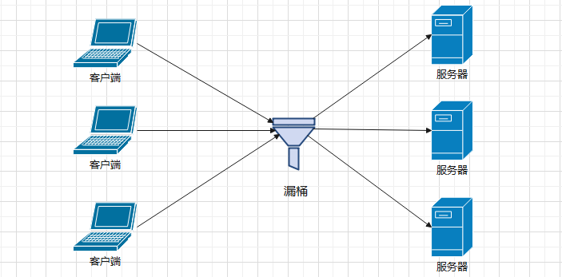

1.引言

1.1 水库泄洪

刚送走了 “苏拉”，又迎来了 “海葵”。暴雨来袭，深圳罗湖、龙岗和福田已经水漫金山：


深圳 9 月 8 日，距离上一次台风过去还不到一周的时间，又发布了泄洪预警信号，深圳水库于 9 月 8 日零点十五分开始泄洪。


同一天，深圳的学校再次宣布停课。

> 有学生反馈：在深圳上学太 “艰难” ，开学一周，停课两次。

对打工人的影响是，在暴雨地区的上班族可以适当延迟打卡：


本来觉得很正常的，毕竟打工人就是**交通不歇业，我们不停工**。但看到这个朋友圈还是没忍住：


为坚强上班的打工人致敬！当然，最需要致敬的是那些在前线抗险的工作人员：


1.2 深圳交通的可用性设计

如果把深圳水库当做一个应用系统，从软件研发的角度来看，洪水就是流量和数据，深圳水库泄洪事件其实就是维持系统稳定进行批量数据删除的工作。

这让我一下子就想起了服务的高可用设计问题，虽然流量很大，导致深圳的交通系统出现了短暂的不可用。但是，通过排水系统的运转，临时泄洪等措施，深圳交通这台大机器又很快运转起来了。

我们做分布式的软件设计时，如何搭建出如此高可用的系统呢？


# 2.高可用设计

## 2.1 什么是高可用

软件系统的高可用（High Availability，简称 HA）是分布式系统架构设计中必须考虑的因素之一，它通常用系统提供服务的时间来衡量。

如果把深圳交通当成一个系统，假设交通一直可以运转，系统的可用性就是 100%。

当然，和自然灾害一样，系统也可能遭受突然的流量激增，或者黑客攻击等情况，所以系统的 100% 可用性是很难实现的。

系统每运行 100 个时间单位，就会有 1 个时间单位无法提供服务，系统的可用性就是 99%。

大型的软件系统，比如淘宝、微信等，追求的高可用一般是 99.9999%，俗称 6 个 9，即全年停机不超过 31.5 秒。


## 2.2 性能估算

为了实现高可用目标，我们在系统设计时通常需要经过性能测试、负载测试和压力测试。

在做性能估算时，我们得先了解几个指标。


QPS等概念：https://zhuanlan.zhihu.com/p/111914041

什么是高可用：https://zhuanlan.zhihu.com/p/43723276


#### QPS

QPS，每秒查询数（Qeries Per Second），是指系统在单位时间内可以正常响应的请求个数，也叫最大吞吐能力。

#### TPS

TPS，每秒事务数（Transaction Per Second），一个事务是指一个客户机向服务器发送请求并获取响应的过程。客户机在发送请求开始，到响应后结束，以此来计算单位时间内完成的事务个数。

#### QPS 比对 TPS

简单来说，我们假设一个页面访问是一个 TPS 的话，一个 TPS 


1. 性能测试：以系统设计初期规划的性能指标为预期目标，对系统不断施加压力，验证系统在资源可接受的范围内是否达到了性能预期目标。
2. 负载测试：对系统不断施加并发请求，增加系统的压力，直到系统的某项或多项指标达到安全临界值。
3. 压力测试：超过安全负载的情况下，增加并发请求数，对系统继续施加压力，直到系统崩溃或不再处理任何请求，此时的并发数就是系统的最大压力承受能力。


### 2.1 限流

当系统的处理能力不能应对外部突增的流量访问时，为了让系统保持稳定，必须采取限流措施。

#### 1）限流指标

- TPS，Transactions Per Second，每秒完成的事务数。用这个值来做限流是最合理的，但是不太现实，因为在分布式业务系统中，事务往往需要多个模块配合完成。按照 TPS 来限流，时间粒度可能会很大，很难准确评估系统的响应性能。
- HPS，Hits Per Second，每秒请求数。如果每笔事务完成一个请求，那 TPS 和 HPS 是等同的。但分布式场景下，完成一笔事务可能需要多次请求，所以 TPS 和 HPS 不能等同看待。
- QPS，Query Per Second，每秒能响应客户端查询的数量。一般指数据库系统的查询次数，也是衡量服务器整体性能的一个重要标准。

目前，主流的限流方法多采用 HPS 作为限流指标。


#### 2）限流方法

##### 1. 流量计数器

最简单直接的方法，比如限制 5 秒内请求数量最大为 100，超过这个数量就拒绝访问。但这个方法存在两个明显的问题：

1. 单位时间（比如：为什么是 5 秒内）很难把控，容易出现集中时间访问。比如出现以下场景：

  

前 4 秒只有一个访问量，第 5 秒有 99 个访问量；第 6 秒有 99 个访问量，接下来的 4 秒又只有 1 个访问量。从全局看，10 秒内 200 个请求流量没有超出，但从图中来看，这种流量情况肯定是异常的。


1. 有一段时间超了，但是并不一定真的需要限流。比如以下场景：


如果中间两块访问正好在一个 5 秒的周期内，那流量就超出限制了。这种情况下，后续的 10 个请求可能就会被丢弃，不太合理。


##### 2. 滑动时间窗口

滑动时间窗口是目前比较流行的限流算法，主要思想是把时间看作是一个向前滚动的窗口，如下图：


它的特点是，将时间分片处理，滑动窗口每次统计一个总时间周期内的请求数。下一个时间段时，就把前面的时间片抛弃，加入后面时间片的请求数，解决了流量计数器可能出现的问题。它的缺点在于**对流量控制不够精细，不能限制集中在短时间内的流量**。


##### 3. 漏桶算法

漏桶算法的思想如下图：



漏桶是一个大小固定的队列，会把客户端发送的请求缓存起来，然后再均匀地发送到服务器上。

如果客户端请求速率太快，漏桶的队列满了，就会直接拒绝掉，或者走降级处理逻辑，不会冲击到服务器端。

漏桶算法的优点是实现简单，可以使用**消息队列**来削峰填谷。但是它也有几个问题：

- 漏桶大小不容易控制，太大会给服务器带来较大压力，太小可能会导致大量请求被丢弃；
- 漏桶给服务端的请求速率难以控制；
- 使用缓存请求的方式，会让请求的响应时间变长。


##### 4. 令牌桶算法

令牌桶算法和去医院挂号是差不多的逻辑，看医生之前需要先挂号，而医院每天放的号是有限的：


令牌桶算法中的令牌也是一样，客户端在发送请求之前，都需要先从令牌桶中获取令牌。如果取到了，就发送请求；如果取不到令牌，就只能被拒绝需要等待。

令牌桶算法解决了漏桶算法的三个问题（速率难控制，漏桶大小难控制和请求周期变长的问题），而且实现并不复杂，使用信号量就可以实现。在实际的限流场景中使用最多，比如 Google 和 Guava 中就使用了令牌桶限流。


##### 5. 分布式场景下如何限流

在分布式场景中，上述限流方案还能否适用呢？举个栗子：


如果我们把令牌放到一个单独的中间件（比如 Redis）中供整个分布式系统用，那客户端在调用组合服务，组合服务调用订单、库存和账户服务时都需要和令牌桶交互，交互次数明显增加了很多。

有一种改进是，客户端在调用服务之前首先获取 4 个令牌，调用组合服务时减去一个令牌并传递给组合服务三个令牌，调用子服务时分别消耗一个令牌。


##### 6. hystrix 限流 

在 Go 服务中，可以采用 hystrix-go 开源包来限流，只需配置关键字信息：

```go
Timeout: int(3 * time.Second),// 执行command的超时时间为3s
MaxConcurrentRequests: 500,// command的最大并发量，限流个数
```

### 2.2 熔断

##### 1. 熔断相关的概念

熔断，相当于在请求和服务之间加了保险丝。当服务扛不住持续的访问压力时，保险丝就断开，防止服务器扛不住压力而崩溃。

服务熔断是指在访问服务时先通过断路器做代理进行访问，断路器会持续观察服务返回的状态是正常还是异常，当失败次数超过设置的阈值（比如：100次请求有50次都是异常的）时断路器打开，接下来一段时间的请求就不能真正访问服务了。


断路器有三种状态：

- CLOSE：默认关闭状态。断路器观察到请求失败的比例没有达到阈值，断路器继续处于关闭状态；
- OPEN：开启状态。请求失败比例已达阈值，断路器打开，请求不再到达服务器，而是直接返回；
- HALF OPEN：半开启状态。断路器打开一段时间过后，切换为半打开状态，这时断路器会尝试去请求服务器以查看请求是否已正常。若成功，则断路器转为 CLOSE 状态；否则转为 OPEN 状态。

##### 2. hystrix 熔断

熔断机制有很多，Go 语言里的 hystrix-go 开源包可以完美支持，它提供如下字段：

```go
Timeout: int(3 * time.Second),// 执行command的超时时间为3s
MaxConcurrentRequests: 10,// command的最大并发量
RequestVolumeThreshold: 5000,// 统计窗口10s内的请求数量，达到这个请求数量后才去判断是否要开启熔断
SleepWindow: 20,// 当熔断被打开后，多久以后去尝试服务是否可用了
ErrorPercentThreshold: 30,// 错误百分比，请求数量>=RequestVolumeThreshold，并且错误率到达这个百分比后启动熔断
```

使用 hystrix-go 需要考虑的问题：

- 针对不同异常，定义不同的熔断处理逻辑（比如：订单服务需要给用户良好的反馈信息，服务器正忙请稍后再试）；
- 服务器故障或者升级时，让客户端知晓目前正在升级，不影响其它模块使用。

### 2.3 服务降级

##### 1. 常见场景

相比限流和熔断，服务降级是站在系统全局的视角来考虑的。在服务发生熔断以后，一般会让请求走实现配置的处理方法，这个处理方法就是一个降级逻辑。

服务降级是对非核心、非关键的服务进行降级。有如下使用场景：

- 服务处理异常，把请求缓存下来，给客户返回一个中间态，事后再重试缓存里的请求；
- 系统监控检测到突增流量，为了避免非核心功能消费系统资源，临时关闭这些非核心业务功能；
- 对于耗时的同步任务，可以改为异步处理；
- 暂时关闭批处理任务，以节省系统资源。

##### 2. hystrix 简介

Hystrix 是 Netflix 开源的一款服务治理框架，包含常用的容错方法：

- 线程池隔离
- 信号量隔离
- 支持限流、熔断、降级回退

### 2.4 总结

限流、熔断和服务降级是系统容错的重要设计模式，从一定意义上讲限流和熔断也是服务降级的手段。

熔断和服务降级主要是针对非核心业务，而核心业务如果流量超过预估峰值，最好提前通过性能测试找到这个峰值，对其进行限流。对于限流，选择合适的限流算法很重要，令牌桶算法的优势较为明显，也是很多大型项目中采用的限流算法。

在系统设计的时候，这些模式需要配合业务量的评估、性能测试的数据进行阈值的修改，而这些阈值最好保存在可热更新的配置中心，方便实时修改。


### 5.3 架构优化的三板斧

#### 1. 负载均衡

通过分布式集群扩展服务器节点，降低单一节点的负载压力。

#### 2. 分布式缓存

负载均衡降低了服务器节点的访问压力，但是没法降低数据库的负载压力。所以引入分布式缓存来降低系统的读负载压力。

高并发架构中常见的分布式缓存有三种：CDN、反向代理和分布式对象缓存。

#### 3. 消息队列

降低系统的写负载压力。