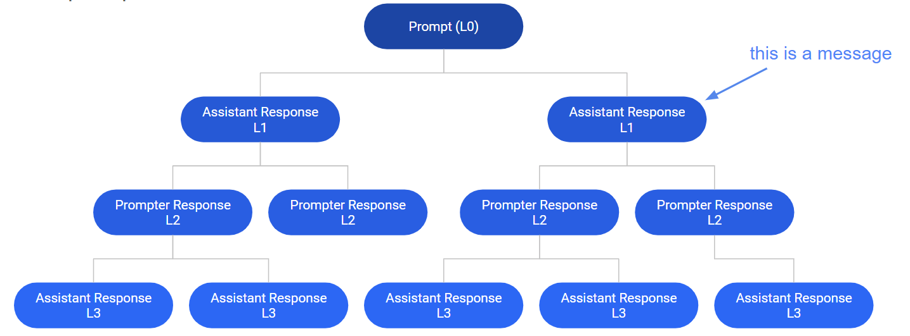

目录

> 1. 人工智能是什么
> 2. 标注是什么
> 3. 标注人员

## 1. 背景

说起 AI（人工智能），大家都不陌生。

有趣的是，大部分圈外人员都不了解一个常识，包括我自己：那就是，人工智能本身并不智能。例如机器学习，通常依赖低薪众包工人进行手工标注和微调。

而我最近又正好在研究大模型相关的标注系统，所以把最近梳理的一些标注相关的知识点和各位分享一下。

## 2. 标注系统

这个标注系统叫开放助手（Open Assistant），是一个旨在让每个人都能访问基于聊天的语言大模型项目。

这个项目在 GitHub 上已经开源了，:star:在短短的几个月已经突破了 32k，有兴趣的可以关注一下：https://github.com/LAION-AI/Open-Assistant。

在这个标注系统上，可以模拟机器学习的几个过程，包括对话树扩展、会话标注及最终的打分，然后筛选出分数最高的对话，继续学习。

### 2.1 对话树

在标注系统中，对话树是最基础的数据结构，它模拟了机器学习的对话过程，其结构如下：

一、树的根节点为初始指令，即一个用户（Prompt）给出的第一句话，可能是一个提示，也可能抛出了一个问题。

二、然后是聊天机器人给出的回复，聊天机器人基于不同的处理维度，包括自身的知识量，归纳总结能力等，会对用户的问题给出回复（Assistant Response）。

三、当聊天机器人给出回复后，用户继续询问（Prompt Response），此时的对话树已经有来有回了。

四、接着再由聊天机器人给出回复（Assistant Response），继续扩充这棵对话树。

当对话树的节点，或者用户不再回复时，这棵对话树就算结束了。但是，这些聊天机器人会根据所有已生成的对话树，即和所有用户的对话来继续学习，以变得更聪明，对话时的答案也更优。

### 2.2 任务

