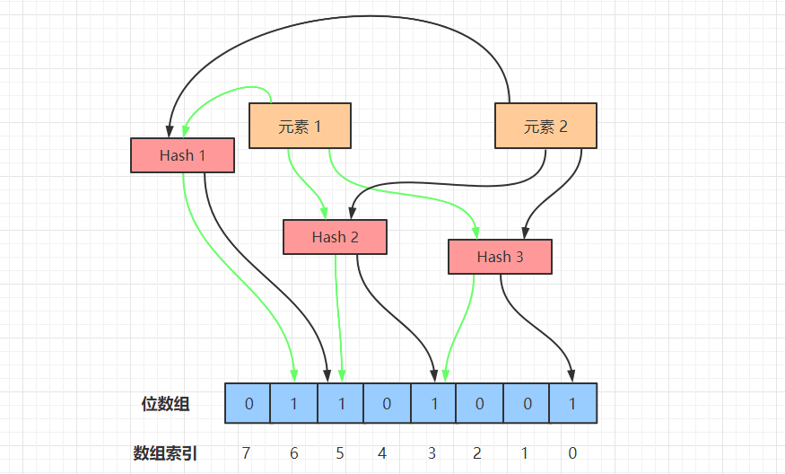
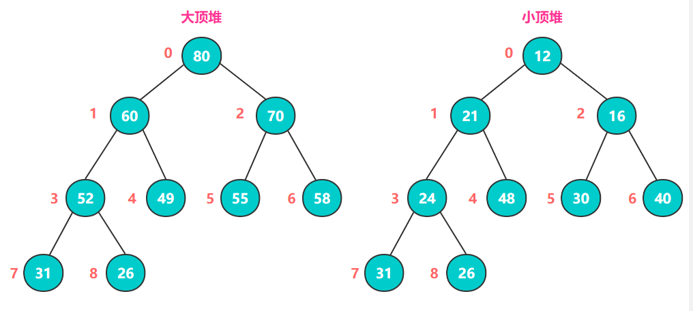

目录

> 1. 引言
> 2. 解决海量数据问题的五种方法
> 3. 经典场景举例
> 4. 小结


## 1. 引言

近年来，高并发、分布式以及大数据成了后端开发者绕不开的话题。当招聘软件上都写着有高并发、大数据等项目经历优先时，想必很多人都在暗暗心惊，**项目都是 CRUD，也没机会接触到这些场景啊。**

但是，有位伟人曾经说过：没有条件，要创造条件。既然工作中接触不到高并发和大数据，我们可以弯道超车——平时在学习的时候多关注类似的场景。

本文讲述了解决大数据问题的常用手段，以及一些经典的大数据场景和解决方式。看完以后，相信咱们下次在项目上或者面试中遇到这些大数据相关的问题时，都能驾轻就熟。


## 2. 解决海量数据问题的五种方法

#### 2.1 分治

众所周知，**任何一个可用计算机求解的问题，其所需的计算时间都与其规模有关。**问题规模越小，越容易求解，且所需的计算时间也越少。所以，对于大规模的数据问题，我们也可以分而治之，再合并结果即可。


分治算法是一个解决复杂问题的高效工具，它可以把问题分解成若干个子问题，把这些子问题逐个解决，再组合到一起形成大问题的答案。

计算机处理海量数据的问题，分治思想基本都是能够解决的，只不过一般情况下不会是最优方案，但可以作为一个 baseline。比如，在某些场景下我们可能需要逐渐优化子问题去达到一个最优解。**传统的归并排序就是分治思想，涉及到大量无法加载到内存的文件、排序等问题都可以用这个方法解决**。

分治算法的经典场景：数据量大无法加载到内存，为节省时间开销并行同步解决问题等。


#### 2.2 哈希（Hash）

Hash，散列函数，维基百科定义 hash 是一种从任何数据中创建小数字 “指纹” 的方法。通俗来讲就是：通过 hash 算法，数据元素可以被更快速地定位和查询。


Hash 获取某个 key 的时间复杂度是 O(1)，假设有 n 个数通过 hash 函数存储到内存里，我们可以在常数时间内获取到某个 key 对应的 value。

可以如此高效地访问数据，hash 很明显是我们解决大数据问题的一大利器。

而用 hash 来解决数据访问问题，也是相当粗暴的一种方式，存入取出即可！但粗暴却高效，**hash 唯一的缺点是耗内存，需要将数据全部载入内存。**

Hash 适用场景：快速查找，但需要足够大的内存可以存下所有数据。这时，要是数据量太大使得内存不足以存储所有数据，可以结合分治+hash来处理。事实上，我们在解决实际问题时，经常采用这样的方式。


#### 2.3 位图（BitMap）

BitMap 算法的核心思想是利用比特（bit）位组成的列表来记录 0-1 两种状态，然后再将具体数据映射到这个比特数组的具体位置，比特位置 0 表示数据不存在，置为 1 表示数据存在。

**位图通过数组来表示某些元素是否存在，它可以用于快速查找、判重和排序**等。位图在大数据的场景下用途较为广泛，因为它能节省很大的空间利用率。

接下来用最经典的两种场景，判重和排序看下 bitMap 在其中起到的功效。


场景1：在 2 亿个整数中找出不重复的正整数 

**位图判重**

由于内存不足以容纳这些整数，我们就可以用位图的方式来处理。采用 2-BitMap（每个数分配 2 个 bit，00 表示不存在，01 表示出现一次，10 表示出现多次），遍历所有元素，将已遍历的元素位置置为 01，如果再次遍历到就将其置为 10。最后，统计所有位置上为 01（只出现一次）的元素。


场景2：对某些整数元素 [6,4,2,1,5] 进行排序

**位图排序**

由于待排序的数组元素都小于 8（真实场景下可能远远超过这个值），我们可以申请一个 8bit 的数组（一个字节），然后遍历这几个元素，将存在元素的位置下标置为1【0 1 1 1 0 1 1 0】。

遍历以后，我们再次遍历这个位数组，就可以得到最终的排序结果了：

```go
for i := 0; i < len(bitMap); i++ {
    if bitMap[i] == 1 {
       println(i)
   }
}
```


#### 2.4 布隆过滤器（Bloom Filter）

布隆过滤器由布隆在 1970 年提出，它实际上是由一个很长的**二进制向量**和一系列**随机 Hash 函数**组成。

布隆过滤器主要用于判定目标数据是否存在于一个海量数据集以及集合求交集。以存在性判定为例：布隆过滤器通过对目标数据的映射，能够以 O(k) 的时间复杂度判定目标数据的存在性，其中 k 为使用的 Hash 函数个数，这样就能大大缩减遍历查找所需的时间。



布隆过滤器的工作流程如上图所示，我们接下来模拟布隆过滤器做元素添加、查询操作。

##### 1）添加元素

使用布隆过滤器添加元素时，会使用不同的 Hash 函数对元素值进行哈希计算，从而得到多个哈希值。

比如上图中的元素 1，在经过 3 次哈希以后，经过一系列计算取余的操作，得到 3 个数 3、5、6。然后，我们将位数组里的 3、5、6 三个下标置为 1，元素 1 的添加操作就完成了。


##### 2）搜索元素

在使用布隆过滤器查询元素是否存在时，首先对给定元素执行多次哈希运算，得到与添加元素时相同的位数组位置。

比如对元素 1 执行三次 Hash 操作，位数组的位置分别为 3、5、6，判断这几个位置的值是否都为 1，如果其中有一个为 0，说明元素不存在；若都为 1，说明元素大概率存在。


##### 3）元素误判

布隆过滤器在添加元素时，由于元素经过 Hash 后的数组位可能被其它元素置为 1，比如元素 x 经过 3 次 Hash 以后，命中的位数组下标为 0、3、6，而这三个下标的值由于插入元素 1 和元素 2 时被置为 1 了。

所以在查询元素 x 时，就会误判元素 x 已经存在，这就是误判的根本原因——元素的多个 Hash 值都可能被别的元素意外命中，故无法判定元素一定存在。

虽然 BloomFilter 有一定的误判率，但这个概率很小，大约在 0.01%~0.05% 之间，所以在一些大数据场景下，使用布隆过滤器可以明显地提升判重的效率，前提是可以接受小幅度的误判。


#### 2.5 堆（Heap）

堆是一种完全二叉树，有大顶堆和小顶堆两种结构。大顶堆的特点是它的父节点都大于或等于其左右孩子节点的值，小顶堆正好相反，其父节点都小于或等于其左右孩子节点的值。



当构建**大顶堆**或者**小顶堆**时，我们需要用到堆排序。

堆排序（大顶堆举例）的核心思想是：不断比对所有父节点和孩子节点的值，将更大数交换到父节点中，完成一轮对比以后，**整个序列的最大值就是堆顶的根节点**。

然后，将根节点和末尾节点（图中下标为 8 的节点）交换，此时末尾节点就为最大值。

接着，把剩下的 n-1 个元素重新构造成一个大顶堆，这样得到 n-1 个元素的最大值，循环往复，就得到一个升序序列了。

> Q：为什么升序不用小顶堆实现？
>
> A：因为没法保证每一层的递增性。比如上图中小顶堆的第 5 个元素和第 8 个元素，26<30，说明层序之间不是递增的关系。

在海量数据中，**堆排序是一种常用的 TopN 问题解决方案**，能够满足绝大部分的求最值问题。


## 3. 经典场景举例

### 1）海量个数字中，找出不重复的整数

#### 问题描述

在 100 亿个整数中找出不重复的数字，注意：内存不足以容纳这么多个整数。

#### 问题解答

**1. 分治+HashMap**

100 亿个整数，每个 int 整数占 4 个字节，100 x 10^8 x 4B 约为 400GB。如果以文件的形式读入内存，那肯定是装不下的。

所以我们可以把大文件拆分成小文件，比如通过 Hash 运算，将 100 亿个整数分配到 1000 个文件中，每个文件存储 1000 万个整数，将这些文件编号 0~999，再分别将它们遍历存入 HashMap，其中 key 为整数，value 为出现的次数。

接着，分别统计出这 1000 个 HashMap 中只出现 1 次的整数，再合并出最终结果。


**2. 位图法**

由于整数占用内存较大，所以我们可以采用一个或多个 bit 来标记某个元素是否出现及出现的次数，这样可以大大节省存储空间。

我们用 2 个 bit 来表示数字出现的状态：00 表示没出现过、01 表示出现过一次、10 表示出现了多次。100 亿整数都是 int 类型，每个整数占 4 个字节，即 32 个 bit，需要的内存为 2^32 x 2bit = 1GB。

当可用内存大于 1GB 时，可用位图法解决本题。通过遍历这 100 亿个数，将对应下标 00->01（整数出现 1 次），01->10（整数出现多次），最后统计 01（只出现了一次）的个数即可。


**3. 布隆过滤器**

遍历这 100 亿个整数，将它们存入布隆过滤器里面，在存入之前通过多次 Hash 判断位数组的值是否存在，若存在说明该整数大概率存在；若某一次 Hash 后的值不存在于位数组中，说明该整数一定不存在。


### 2）两个大文件里找到重复URL

#### 问题描述

给定 a.txt，b.txt 两个文件，各存放 50 亿个 URL，每个 URL 各占 64B，内存限制是 4G。请找出 a、b 两个文件共同的 URL。

#### 问题解答

文件大小为 50 x 10^8 x 64B 约为 320GB，所以 4G 内存不足以一次性加载所有 URL 到内存中。

**分治+HashMap**

这道题和上一道题非常类似，只是把整数换成了 URL，我们处理的方式也类似。

首先，把存储 URL 的文件分为多个小文件，使得每个小文件大小不超过 4G，这样就可以把 a、b 对应的两个小文件放入内存处理，最终合并结果。

首先遍历文件 a，对遍历到的 URL 通过哈希取模的方式：hash（URL）%100，根据计算结果把 URL 放入 a0，a1 ... a99.txt 这 100 个文件中，每个文件大小约为 3.2 GB。用同样的方法遍历文件 b，将 URL 拆分到 b0, b1 ... b99.txt 文件中。

拆分过后，所有可能相同的 URL 都在对应的小文件中，即 a0 对应 b0，...，a99 对应 b99。接下来只需求出这 100 对小文件中相同的 URL 就好了。

求相同的 URL，可以用 HashSet/HashMap 的方式，当 URL 存在 Set/Map 中时，说明 URL 重复，就可以把重复的 URL 保存在单独的文件中，最终合并所有相同的 URL 即可。


### 3）大会话文件求频率Top100

#### 问题描述

有一个 1 亿对话的文件，文件的每一行是一句对话，每句对话大小不超过 1KB，内存大小限制为 1.5 GB，要求返回频率最高的 100 句对话（Top100）。

#### 问题解答

由于内存限制，无法将大文件一次性读到内存中。因此，同样采用分治策略，将大文件拆分为小文件处理。

**1. 分治+HashMap**

首先，我们采用和上道题相同的方式，将文件分治处理。

1.5 GB/1 KB 约为 150 万句，每个文件内存不能超过 150 万句对话，所以我们将每句话进行哈希取模 hash(句子) % 100，将结果存放到 a[i]（0<=i<=99） 个文件中，每个文件存放大约 100 万句对话。

接着使用 HashMap 来统计各文件频数最高的 100 句对话，key 为对话的 md5 值，value 为出现的频率。最终得到 100*100 = 1万句对话，再对这 1 万个单词进行堆排序，找出 Top100 频率的对话。

**2. 小顶堆**

构建一个大小为 100 的小顶堆，堆顶元素为对话出现的最小频率值，如果在遍历 HashMap 的过程中，发现当前会话的 value（会话出现次数）大于堆顶会话的出现次数，则用新会话替换旧会话，然后重新调整小顶堆。

遍历结束后，小顶堆上的 100 个词就是我们需要统计的会话频率出现最高的 100 句对话。


### 4）海量日志数据提取频率最高的 IP

#### 问题描述

这是面试百度时的一道原题，题意是有一个装着访问 IP 的海量日志数据保存在一个超大文件中，无法读入内存，要求从中提取某天访问百度次数最多的那个 IP。

#### 问题解答

**分治+HashMap**

我们先采用分治策略，把存储 IP 数据的文件拆分成多个小文件，然后遍历所有小文件，把这天所有访问百度的 IP 提取到一个单独的文件中。

再用 HashMap 统计每个 IP 访问的次数，通过一个变量 maxCount 存储访问次数最多的值，不断比对就可以找出访问次数最多的 IP 了。


### 5）海量电话号码中，统计不同号码的个数

#### 问题描述

在存有大约 100 亿个电话号码的文件中，统计号码的具体个数，注意：电话号码可能是重复的。

#### 问题解答

**位图法**

由于电话号码长度为 11 位，每一位上的数字有 10 种情况，因此需申请长度为 1 千亿（10^11）的 bit 数组，大约需要内存 10^11 x 1bit 约为 12.5GB。遍历所有的号码，当出现该号码时将该数组位置为 1，用一个数 count 记录第一次置为 1 的位图元素，遍历结束后得出最终结果。


## 4. 小结

海量数据的问题，基本上都是由上述几种经典问题变形而来，**常见的解决方式，就是分治、Hash、BitMap、布隆过滤器以及堆排序**。其它类型的大数据问题，可能就是各种解决手段的组合方式不同。

更复杂的可能就是基于文本来变形，比如搜索引擎的前缀树结构、大数据文本检索的倒排索引等等，由于篇幅有限，本文中就没有一一列出了。

但是，对于上述的经典问题，这几种解决方法已经够用了。如果遇到类似的面试题目或者问题场景，大家都能信手拈来了吗：）


**参考资料：**

海量问题六种解决思路：https://www.cnblogs.com/GarrettWale/p/14478347.html

堆排序算法：https://www.cnblogs.com/chengxiao/p/6129630.html

