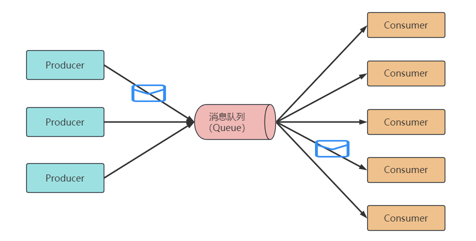

### 1. 引言

大家好，我是小❤。

周末和朋友一起自驾去海边玩，去过杨梅坑的应该都知道，从杨梅坑到鹿嘴山庄需要坐快艇过去。

不愧是深圳景点的受欢迎度，下午四五点的时候排队坐艇的人还是非常多，买好票后我们被叫到一个岸边阶梯上等待上船，现场略微有些混乱。

**人流量有点大，到站载客的船却不是很多。**

就在我为维持秩序的工作人员捏一般汗时，我看到他们来来回回点了好几拨人，让这些人有序上船。

不多会儿，便有一个瘦黑的中年人来叫我们，说一条船只能装 10 个人，就点了我们前面的 10 个人，让其他人原地不动，点到的 10 个人可以上船。

果然，软件设计都来源于生活，此情此景，不就是系统里面经典的数据消费问题嘛！

### 2. 消息中间件

当数据量（乘客）过多，系统（载客的快艇）来不及立刻消费时，会把数据先放到一个**消费队列**里（岸边阶梯）等待，起到一个流量削峰的作用。

**在分布式系统里面，实现消费队列的一种主要方式就是采用消息中间件**。

#### 什么是消息中间件

消息中间件（Message Broker）是一种在分布式系统中用于传递消息、通知和事件的基础架构组件。

它允许不同组件、应用程序或系统之间异步地交换数据和信息，以实现削峰、解耦和可扩展的通信。

消息中间件的基本原理包括以下几个关键概念：

1. **消息生产者（Producer）：** 这是消息的发送方，通常是一个应用程序或组件，它将消息发送到消息中间件。
2. **消息消费者（Consumer）：** 这是消息的接收方，通常也是一个应用程序或组件，它从消息中间件中接收和处理消息。
3. **消息队列（Message Queue）：** 这是消息中间件的核心组件，它是一个存储消息的队列，消息生产者将消息放入队列，消息消费者从队列中获取消息。消息队列通常采用先进先出（FIFO）的原则。
4. **消息主题（Topic）：** 除了消息队列，消息中间件还支持消息主题，它允许发布-订阅模式的消息通信。消息发布者将消息发布到主题，而订阅者可以订阅特定主题以接收相关消息。

消息中间件的优点包括：

- **解耦性：** 消息中间件允许生产者和消费者独立操作，它们不需要直接知道对方的存在。这种解耦性使系统更加灵活和可维护。
- **可扩展性：** 通过增加消息中间件的容量，可以轻松应对更多的消息流量和消费者。
- **异步通信：** 消息中间件允许异步通信，生产者可以继续工作而不必等待消息被处理，从而提高系统的性能和响应速度。
- **消息持久性：** 消息通常会被持久化，即使消息中间件或消费者出现故障，消息也不会丢失。

消息中间件有许多不同的实现和协议，其中一些流行的消息中间件包括 ActiveMQ、RocketMQ、RabbitMQ、Kafka 等。

它们在不同的使用场景和需求下有不同的特点和优势。

消息中间件在各种应用中广泛使用，包括**微服务架构、大数据处理、实时数据分析、日志收集、事件驱动架构**等。

接下来我们分别介绍常见的消息中间件以及它们的优缺点和适用场景，帮助大家在应用开发中作出明智的选择。

### 3. ActiveMQ

**特点：**

- ActiveMQ 是一个基于 Java 的开源消息中间件，实现了 JMS（Java Message Service）规范。
- 支持多种消息传递模型，包括点对点和发布-订阅。
- 提供高可用性和负载均衡，支持主从复制，可用于构建高可用性系统。
- 适用于 Java 应用程序，但也有一些支持其他编程语言的客户端。

**优点：**

- 简单易用，适合快速开发和原型构建。
- 集成了 Spring 框架，可以轻松与 Spring 应用集成。
- 适用于中小型系统和企业内部通信。

**缺点：**

- 性能相对较低，不适合高吞吐量和延迟要求较高的场景。
- 不支持大规模的消息流，不适合大数据和实时分析应用。

**适用场景：** ActiveMQ 适用于需要简单的消息传递和中小型系统的内部通信。它在企业内部通信和轻量级应用中表现良好，但不适合高性能、高吞吐量和大规模数据处理。

总的来说，ActiveMQ 国内互联网公司落地较少，多是传统企业在使用。

### 4. RocketMQ

**特点：**

- RocketMQ 是阿里巴巴早些年开源的 MQ 框架，基于 Java 语言写的，后来捐给了Apache，是一款快速、可靠、可扩展的分布式消息中间件。
- 支持发布-订阅和点对点消息传递模型。
- 具有高性能、低延迟的特点，适用于大规模的消息传递。
- 支持丰富的客户端语言，包括 Java、C++、Python、Go 等。

**优点：**

- 高性能和低延迟，适用于高吞吐量的大规模应用。
- 支持多种消息传递模型，适用于不同的业务场景。
- 具有强大的监控和管理工具。

**缺点：**

- 部署和配置相对复杂，需要一些专业知识。
- 社区相对较小，相比一些其他消息中间件，文档和生态系统相对不够成熟。

**适用场景：** RocketMQ 适用于需要高性能、低延迟、可扩展性的大规模应用，如电商平台、金融系统、物联网应用等。

### 5. RabbitMQ

**特点：**

- RabbitMQ 是一款开源的消息中间件，实现了 AMQP（高级消息队列协议）规范。
- 支持广泛的消息传递模型，包括点对点、发布-订阅和 RPC。
- 提供可靠性消息传递，支持事务和消息确认。
- 有多种客户端库，支持多种编程语言。

**优点：**

- 成熟的技术，稳定性高，广泛用于企业级应用。
- 提供高可用性和负载均衡机制。
- 支持多种编程语言，适用于跨语言的应用。

**缺点：**

- 性能相对较低，不适合高吞吐量的大规模应用。
- 部署和配置复杂，需要一些学习成本。
- 自身是 erlang 语言开发，源码比较难分析，需要扎实的 erlang 语言功底。

**适用场景：** RabbitMQ 适用于企业级应用，需要可靠性和事务支持的场景，但对性能要求不是特别高的应用。

### 6. Kafka

**特点：**

- Kafka 是一款高吞吐量、低延迟的分布式消息中间件，适用于大规模数据处理和实时流处理。

- 主要用于发布-订阅模型，将消息以日志形式存储。

- 具有高度可伸缩性和可用性，适合构建大规模的实时数据流应用。

- 支持多种客户端，包括 Java、Python、Go 等。

  **优点：**

  - 高吞吐量和低延迟，适用于大规模数据处理和实时流处理。
  - 可伸缩性强，支持构建大规模数据管道。
  - 数据持久化和数据复制，确保数据的可靠性。

  **缺点：**

  - 部署和配置复杂，需要专业知识。
  - 不适合小规模应用，相对复杂度高。

  **适用场景：** Kafka 适用于需要高吞吐量、低延迟和大规模数据处理的应用，如日志收集、实时数据分析、事件驱动架构等。

### 7. 技术选型

#### RabbitMQ 和 Kafka

其中，RabbitMQ 和 Kafka 是最常用的两种消息中间件，它们两者的主要区别有：

- **性能：**消息中间件的性能主要衡量吞吐量，Kafka 单机 QPS 能达到百万级别，RabbitMQ 单机 QPS 万级别，kafka 更高；
- **数据可靠性：**kafka 和 rabbitMQ 都具备多副本机制，数据可靠性都比较高；
- 消费模式：Kafka 由客户端主动拉取，RabbitMQ 支持主动拉取和服务器推送两种模式。所以 RabbitMQ 的消息实时性更高，且对于消费者来说更简单；而 kafka 可以由消费者根据自身情况去拉取消息，吞吐量更高；
- **幂等性：**kafka 支持单个生产者，单分区单会话的幂等性，而 RabbitMQ 不支持；
- **其它特性：**RabbitMQ 支持优先级队列，延迟队列，死信队列（**存储无法被消费的消息队列**）等等。

#### 如何选择合适的消息中间件

在应用开发中，选择适合的消息中间件取决于具体需求：

- 如果你的应用是一个**中小型系统**，对性能要求不高，而更关注简单的使用和快速开发，那么 ActiveMQ 可能是不错的选择。
- 如果你需要处理**大规模消息传递**，追求高性能和低延迟，那么 RocketMQ 或 Kafka 可能更适合，具体选择取决于你的应用类型和需求。
- 如果你的应用是**企业级应用**，需要可靠性和事务支持，但对性能要求不高，那么 RabbitMQ 可能是一个不错的选择。
- 最终的选择还取决于你的技术栈、团队的经验以及具体的业务需求。建议在选择消息中间件之前仔细评估你的应用需求，并根据具体情况进行选择。

当然，无论选择哪种消息中间件，都需要深入了解其特点和使用方式，以确保它能够满足应用需求，以构建高效、可靠的分布式系统。

### 8. 结语

不管用哪种消息中间件，我们在日常生活中都可以常常见到消费队列的妙用。

**有了这些缓冲方式，我们的日常出行和消费秩序才能够很好地得到保障。**

最终，我们在鹿嘴山庄赏玩了一会，去了《美人鱼》的拍摄基地，然后准备乘坐观光车回杨梅坑。

这时，天色已经变黑，但排队的人数还是很多。看过文章后，想必大家已经知道此时我们需要用到什么方式来解决高峰流量的问题了，你学废了吗？

由于篇幅有限，文章到此结束了，**后续我们会接着分享常用消息中间件的底层架构原理，关键组件交互，以及面试中的一些常见问题**。

如果大家觉得有所收获或者启发，不妨动动小手关注我，然后把文章分享、点赞、加入在看！这会让我有充足的动力，持续输出大家喜爱的技术内容哦~

我是小❤，我们下期再见！