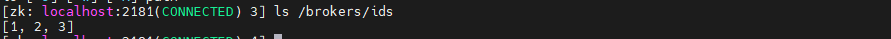
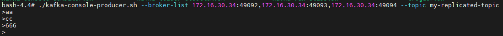
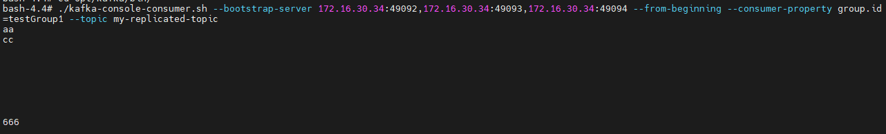
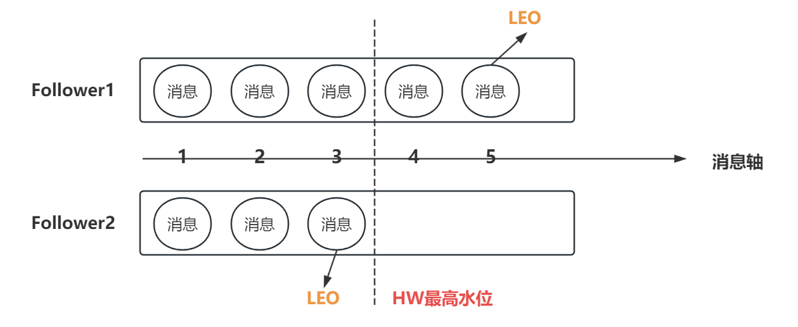
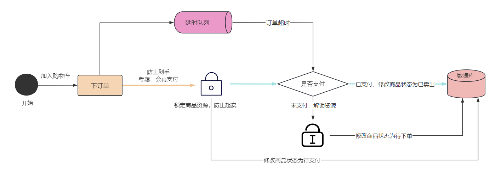

大家好，我是小❤，一个漂泊江湖多年的 985 非科班程序员，曾混迹于国企、互联网大厂和创业公司的后台开发攻城狮。

## 1. 引言

在我们旅行于数据海洋的途中，如果把 Kafka 比作是一艘承载无数信息航行的快船，前文《[Kafka实战漫谈：大数据领域的不败王者](https://mp.weixin.qq.com/s?__biz=MzI5Nzk2MDgwNg==&mid=2247485668&idx=1&sn=df37577dcd24d4a7cc32408af7b18be7&chksm=ecac5ceddbdbd5fb3fca2ddf12f7e3e8d81a0f1fa33bc2cadd5284e2c3b9c925eeb3b864e9fe&token=157216676&lang=zh_CN#rd)》已经讲述了如何搭建起这艘快船，让它在起风的早晨开始了第一次航行。

但随着大浪的拍打，我们必须让它做好准备，以应对那些未知的暴风雨。

今天，我们来谈谈如何让这艘快船变得更强壮——让它有能力在风急浪高时稳稳地前行，不至于让宝贵的数据货物沉入海底。

在 Kafka 这艘数据游轮载着数据航行时，我们这些开发者——也就是船上的水手来说，**Kafka 集群的高可用性、消息消费的一致性和延时队列**等都是确保数据航行安全的关键特性。


所以，拿起你的望远镜，让我们来一探 Kafka 高级知识的奥秘吧！


### 1.1 背景

说到 Kafka，许多人第一反应可能是：噢，一个消息中间件？

是的，但它远不止如此。Kafka 的力量在于它的可伸缩性、可靠性以及高吞吐。

很多在业务中使用过 Kafka 的小伙伴肯定知道，搭建起一个高效的 Kafka 集群，就像在你的航船上装备强大的引擎。


而恰当地处理消息的重复消费与延时，则犹如在粗犷的海浪中找到了平稳的航道。


#### 坚不可摧的集群舰队：Kafka 高可用

在高海拔时，Kafka 能够展现它的“高”——高可用。

集群化部署后，即便是有节点失联，系统也能自我修复。如同海中的舰队，一艘舰船的失事并不意味着整个航线的中断。


#### 精确把握所有货物：消费去重

重复消费在消息队列中犹如误投递包裹。

在 Kafka 的运送数据时，要确保每条消息只被消费一次，我们得有高超的“航海术”——幂等性与事务。


#### 总有延时的风浪：延时队列处理

和海底的珍珠一样，每个船上的数据包都有其“价值”，然而在时间的尺度上，它们的价值是变化的。

所有才有诗人说：人生遇到的每个人，出场顺序真的很重要！这在消息中间件里也同样适用。


人生没有时光机，但 Kafka 的延时队列有：它不仅可以发送实时消息，还能处理那些需要“重复呈现”的信息。


## 2. 乘风破浪的Kafka

接下来，让我们更深入地探索这艘快船的强大之处，以及如何利用它。首先，我们搭建一个 Kafka 集群。


### 2.1 创建三个broker

我们启动了三个容器，配置都略微不同——记住，每艘船都有其独特的身份（`broker.id`）和自己的泊位（`listeners`）。

通过进入 `Zookeeper` 的客户端检查 `Kafka` 的状态，就如同站在灯塔上检查舰队——确保每艘船都已就绪并在正确的位置。

启动三个容器，server.properties 文件分别为：

```shell
# 1,2,3
broker.id = 3
# 49092，49093,49094
listeners=PLAINTEXT://172.16.30.34:49094
```

校验是否启动成功，进入 zookeeper，查看：

```shell
# 进入客户端
./bin/zkCli.sh

# 查看broker
ls /brokers/ids
```

可以看到各自的 ID 都不同，说明 3 个节点启动成功了：




### 2.2 集群中的副本

我们在上篇文章中已经介绍了分区和副本的概念，现在，结合集群中的节点，我们进一步来理解它们。

有备无患，副本就好比是同型船的兄弟，一旦领军的船只（`leader`）遇难，它们（`follower`）中的一员就会站出来，扛起大旗。


在这里，Kafka 的调度能力展露无遗。

> kafka 的读写操作都发生在 leader 上，leader 还负责把数据同步给 follower。当 leader 挂了，经过主从选举，从 follower 中选出一个新的 leader。


### 2.3 关于集群消费

就像团队合作的捕鱼作业，一个 `message` 可能会被多个消费者（在不同的船上）处理，但恰到好处的通信保证了鱼群的精确分配。

在集群中，我们可以借助以下命令来发送、消费消息：

```shell
# 向集群发送消息
./kafka-console-producer.sh --broker-list 172.16.30.34:49092,172.16.30.34:49093,172.16.30.34:49094 --topic my-replicated-topic

# 消费集群消息
./kafka-console-consumer.sh --bootstrap-server 172.16.30.34:49092,172.16.30.34:49093,172.16.30.34:49094 --topic my-replicated-topic

# 指定消费组消费集群消息
./kafka-console-consumer.sh --bootstrap-server 172.16.30.34:49092,172.16.30.34:49093,172.16.30.34:49094 --from-beginning --consumer-property group.id=testGroup1 --topic my-replicated-topic
```

可以看到，消息发送成功了：



消息消费成功：




## 3. kafka 集群中的关键角色

### 3.1 controller

控制器如船队的指挥官，遇见有需要改变的情况时能及时做出应答，无论是船只的增减，抑或是航线的变更。


每个 broker 在启动时会向 zk 创建一个临时序号节点【比如上面创建的broker节点 1,2,3】，获得的最小序号 broker 会作为集群中的 controller，负责以下几件事：

- 当集群中有一个副本的 leader 挂掉，需要在集群中选举出一个新的 leader，选举的规则是从 ISR 集合的最左边元素获取（比如 ISR 集合为 【2,1,3】，当 leader 为 2 并且挂了时，ISR 为 【1,3】，就将 broker-1 上的副本作为新的 leader）；
- 当集群中的 broker 新增或减少时，controller 会同步信息给其他 broker；
- 当集群中有分区新增或减少时，controller 会同步信息给其他 broker。


### 3.2 rebalance 机制

每一个水手都有其特定的岗位，如同 Kafka 在消费者与分区间实现的再平衡——这是一种资源优化的艺术，和分配负载均衡的请求类似。

在 Kafka 中，再平衡需要一个**前提就是：消费组中的消费者没有指定分区来消费**。如果对消息指定了分区，rebalance 就不会生效。

并且，当消费组中的**消费组和分区关系发生变化**时，rebalance 才会触发。这时，消息的分区会遵循以下几个策略中的一种（可配置）：

- `range`：根据公式计算得到每个消费者去消费哪个分区，前面的消费者分区 = 分区总数/消费者数量+1，后面的消费者 = 分区总数/消费者数量；
- `轮询`：几个消费者轮流消费分区；
- `sticky`：粘合策略，当需要 rebalance 时，会在之前已经分配的基础上调整，且不会改变之前的分配情况。如果这个策略未打开，则需要重新进行全部分区的分配。


### 3.3 HW 和 LEO



HW（high-weight，高水位）和 LEO（log-end-offset）是衡量副本最后消息位置的两个重要指标，它们就像是船上的测深仪，确保了数据不被过早或不当地处理。

HW 是已完成 lead-follower 同步的位置，消费者无法消费到 HW 线之前的消息。并且，在完成同步以后，HW 线才更新，以防止消息丢失。

LEO 是指某个副本最后消费消息的位置，根据木桶效应，HW 一定不高于 LEO。


## 4. kafka 中的优化问题

### 4.1 如何防止消息丢失

在 Kafka 的海域里，防止消息的丢失恰至关键。这就需要水手精准的操作——生产者要如同技术精湛的引导者，消费者像观望远方的瞭望者，及时地做出反馈。


对于生产者来说，可以采用以下方式来防止：

1. 使用同步发送
2. 把 ack 设为 1（0为异步进行数据复制，-1为保证有一个副本复制完成，1为全同步）
3. 同步的分区数 >= 2

对于消费者来说，需要将**自动提交改为手动提交，并且当消费完成后再进行 ack 应答**。

这相当于网络中的握手过程，消息包收到以后，给出反馈；如果没有收到消息，就让发送端或者 Kafka 重新发一次，以防止消息还没消费就丢失了。


### 4.2 如何防止重复消费

再精确的海图也免不了失误时出现。为避免消息被重复消费，生产者可能需要更谨慎，而消费者需要有追踪每条消息唯一性的能力。

为了防止消息丢失，当生产者发送完消息后，会**根据有无收到 ack 应答去决定是否重新发送消息**。

当网络抖动或者其它原因，导致生产者没有收到 ack 时，消费者可能会收到两条或多条相同的消息，造成重复消费。

解决方案有以下两种：

1. 生产者关闭重试机制；

2. 消费者消费消息时用幂等性保证：1）数据库唯一索引；2）Redis 分布式锁。

由于生产者关闭重试后，可能会造成消息丢失，所以我们更**推荐让消费者用幂等性或者事务来防止重复消费**，这在其它的消息队列中也同样适用。


### 4.3 如何做到消息的顺序消费


就像在粗犷的风浪中维持航道一样困难，Kafka 的有序消费要求很高。有时需要牺牲性能，专注于单一的分区和消费者。

- 生产者：使用同步发送，ack 设置为 1
- 消费者：主题只能设置为一个 partition 分区，消费组中只能有一个消费者

Kafka 的顺序消费会严重地牺牲性能，所以使用时需要做出权衡。


### 4.4 如何解决消息积压的问题

消息积压如同海上的风暴，短时间内的消费者可能支撑不过生产者的速度，这时候可能需要更多的船只和船员加入作业。

当**消费者的消费速度，远远赶不上生产消息的速度一段时间后，kafka 会堆积大量未消费的消息**。

这会导致消费者寻址的速度越来越慢，kafka 对外提供服务的性能也越来越差，从而可能会造成整个服务链变慢，导致服务雪崩。

一般，我们通过多线程或横向扩展的方式来解决：

- 消费者使用**多线程**消费，充分利用机器的性能；
- 在同一个消费组中**创建多个消费**者，部署到其它机器上，一起消费。


### 4.5 实现延时队列

有时，信息需要在特定的时刻获取，就比如火车票待支付订单 30min 后会自动过期。



Kafka 也可设定的延时队列，就像是烹饪师傅精准控制火候，让美食在最佳时间完美呈现。

方案如下：

1. Kafka 中创建相应的主题，并创建消费者消费该主题的消息，消息中带有创建的**时间戳**；

2. 消费消息时判断，未支付订单消息的创建时间是否已经超过 30 分钟：1）如果是，就修改订单状态为超时取消；2）否则，记录当前消息的 offset，并等待 1 分钟后，再次向 kafka 中拉取该 offset 的消息进行判断，**直到支付订单或超时取消**。


## 5. 总结

过去，信号火一点即传，如今，Kafka 使数据能在毫秒之间抵达世界的任何角落。

高可用性的秘密不在于单舰的坚固，而在于整个舰队的协同。

**去重、延时、消费顺序的保证，使得 Kafka 成为一个强大且灵活的通信工具。**

Kafka 也不仅仅是一个消息队列，它是大数据时代的一艘高速航船，随时准备穿梭于信息的海洋，破浪前行。而我们，作为水手和指挥官，应当熟悉船上每一个细节，以确保我们的货物——数据，能安全、准确地到达预定的港口。

好了，现在，各位船长，让我们起航吧！

如果觉得文章有所启发或收获，不妨点赞、分享，加入在看，这对我是最大的鼓励！

如果你有任何问题或想了解更多，也随时在评论区提问，谢谢你的阅读！

ღ( ´･ᴗ･` )比心

我是小❤，我们下期再见。