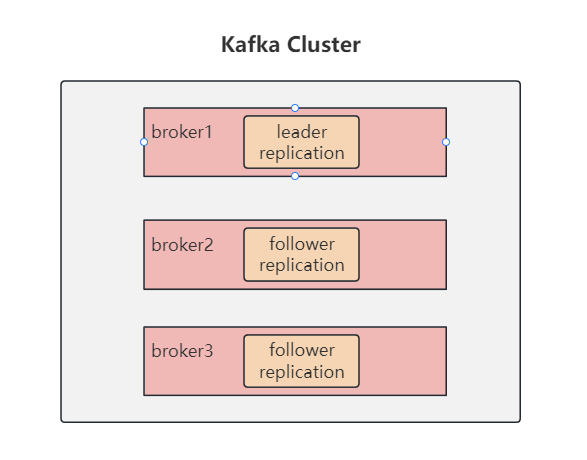

## 1. 引言

腾讯云：https://cloud.tencent.com/developer/article/1775065

知乎：https://zhuanlan.zhihu.com/p/420967811


## 6. 搭建 kafka 集群

### 6.1 创建三个broker

启动三个容器，server.properties 文件分别为：

```shell
# 1,2,3
broker.id = 3
# 49092，49093,49094
listeners=PLAINTEXT://172.16.30.34:49094
```


校验是否启动成功，进入 zookeeper，查看

```shell
# 进入客户端
./bin/zkCli.sh

# 查看broker
ls /brokers/ids
```


#### 2）副本的概念

分区的多个备份，备份分别存放在集群不同的 broker 中，有一个 leader，多个 follower。




**leader和follower**

kafka 的读写操作都发生在 leader 上，leader 还负责把数据同步给 follower。当 leader 挂了，经过主从选举，从 follower 中选出一个新的 leader


**ISR**

可以同步和已同步的节点，会被存入 isr 集合中。如果 ISR 中的节点性能较差，会被踢出 ISR集合。


#### 3）关于集群消费

集群发送、消费消息

```shell
# 向集群发送消息
./kafka-console-producer.sh --broker-list 172.16.30.34:49092,172.16.30.34:49093,172.16.30.34:49094 --topic my-replicated-topic

# 消费集群消息
./kafka-console-consumer.sh --bootstrap-server 172.16.30.34:49092,172.16.30.34:49093,172.16.30.34:49094 --topic my-replicated-topic

# 指定消费组消费集群消息
./kafka-console-consumer.sh --bootstrap-server 172.16.30.34:49092,172.16.30.34:49093,172.16.30.34:49094 --from-beginning --consumer-property group.id=testGroup1 --topic my-replicated-topic
```


【中间的空隙不用管，手动换行了 】


### 6.kafka 集群中的一些概念

#### 1）controller

每个 broker 在启动时会向 zk 创建一个临时序号节点【比如上面创建的broker节点 1,2,3】，获得的最小序号 broker 会作为集群中的 controller，负责以下几件事：

- 当集群中有一个副本的 leader 挂掉，需要在集群中选举出一个新的 leader，选举的规则是从 ISR 集合的最左边元素获取（比如 ISR 集合为 【2,1,3】，当 leader 为 2 并且挂了时，ISR 为 【1,3】，就将 broker-1 上的副本作为新的 leader）；
- 当集群中的 broker 新增或减少时，controller 会同步信息给其他 broker；
- 当集群中有分区新增或减少时，controller 会同步信息给其他 broker。


#### 2）rebalance 机制

前提：消费组中的消费者没有指定分区来消费

触发条件：当消费组中的消费组和分区关系发生变化时

分区分配的策略：

- range，根据公式计算得到每个消费者去消费哪个分区，前面的消费者分区 = 分区总数/消费者数量+1，后面的消费者 = 分区总数/消费者数量；
- 轮询，几个消费者轮流消费分区；
- sticky，粘合策略，当需要 rebalance 时，会在之前已经分配的基础上调整，且不会改变之前的分配情况。如果这个策略未打开，则需要重新进行全部分区的分配，建议开启。


#### 3）HW 和 LEO

LEO（log-end-offset）是指某个副本最后消息的位置。

HW（high-weight）是已完成 lead-follower 同步的位置，消费者无法消费到 HW 线之前的消息。在完成同步以后，HW 线才更新，以防止消息丢失。


### 7.kafka 中的优化问题

#### 1）如何防止消息丢失

- 生产者：1）使用同步发送；2）把 ack 设为 1（0为异步进行数据复制，-1为保证有一个副本复制完成，1为全同步），且同步的分区数 >= 2
- 消费者：自动提交改为手动提交，当消费完成后再进行 ack 应答。


#### 2）如何防止重复消费

为了防止消息丢失，当生产者发送完消息后，会根据有无收到 ack 应答去决定是否重新发送消息。当网络抖动或者其它原因，导致生产者没有收到 ack 时，消费者可能会收到两条或多条相同的消息，造成重复消费。解决方案：

- 生产者关闭重试机制，可能会造成消息丢失（不建议）；
- 消费者消费消息时用幂等性保证：1）数据库唯一索引；2）Redis 分布式锁。


#### 3）如何做到消息的顺序消费

- 生产者：使用同步发送，ack 设置为 1；
- 消费者：主题只能设置为一个 partition 分区，消费组中只能有一个消费者。

Kafka 的顺序消费会严重地牺牲性能，所以使用场景不多，不像 RabbitMQ 等消息中间件内置的消费机制，可以更好地保证消息的顺序。


#### 4）如何解决消息积压的问题

当消费者的消费速度，远远赶不上生产消息的速度一段时间后，kafka 会堆积大量未消费的消息。导致消费者寻址的速度越来越慢，kafka 对外提供服务的性能也越来越差，从而可能会造成整个服务链变慢，导致服务雪崩。解决方案如下：

- 消费者使用多线程消费，充分利用机器的性能；
- 在同一个消费组中创建多个消费者，部署到其它机器上，一起消费；


#### 5）实现延时队列

应用场景：订单创建后，超过 30 分钟没有支付就自动取消。

具体实现：

- kafka 中创建相应的主题，并创建消费者消费该主题的消息，消息中带有创建的时间戳；
- 消费消息时判断，未支付订单消息的创建时间是否已经超过 30 分钟：1）如果是，就修改订单状态为超时取消；2）否则，记录当前消息的 offset，并等待 1 分钟后，再次向 kafka 中拉取该 offset 的消息进行判断，直到支付订单或超时取消。