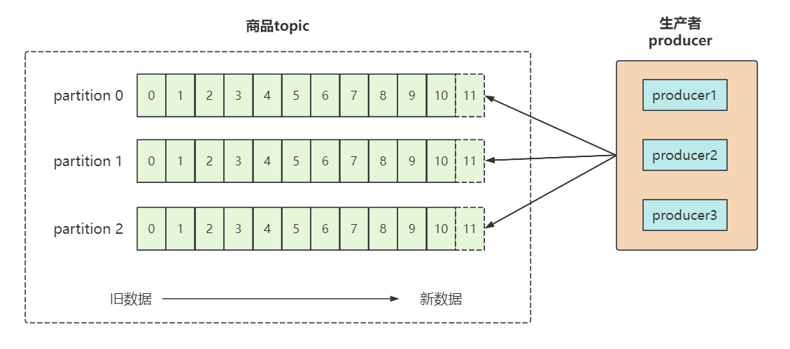

## 1. 引言

### 1.1 Kafka 什么地位？

Kafka（全称 `Apache Kafka`）是一个分布式发布-订阅消息系统，是大数据领域消息队列中的最强王者。

自 `Apache` 2010 年开源这个顶级实用项目以来，至今已有十数年，它仍然是大数据领域中至关重要的一个组件。

Kafka 以其速度快（`ms 级的顺序写入和零拷贝`）、性能高（`TB级的高吞吐量`）、高可靠（`有热扩展，副本容错机制能力`）和高可用（`依赖Zookeeper作分布式协调`）等特点闻名于世，它非常适合消息、日志和大数据业务的存储和通信。

### 1.2 Kafka 结构

Kafka 具有主要结构组件：

* broker：Kafka 集群中的消息处理节点，⼀个 Kafka 节点就是⼀个 broker，broker.id 不能重复；
* producer：消息生产者，向 broker 发送消息的客户端；
* consumer：消费者，从 broker 读取消息的客户端

除此之外，Kafka 还有一些消息和数据相关的组件：

#### topic 主题

Kafka 根据 topic 对消息进⾏归类，发布到 Kafka 集群的每条消息都需要指定⼀个 topic。

#### partition 分区

将一个 topic 的消息存放到不同分区，好处是方便扩展和提升并发。

#### replication 副本

分区的多个备份，备份分别存放在集群不同的 broker 中，有一个 leader，多个 follower。

腾讯云：https://cloud.tencent.com/developer/article/1775065

知乎：https://zhuanlan.zhihu.com/p/420967811

## 2. Kafka工作流程