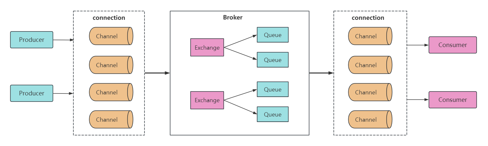
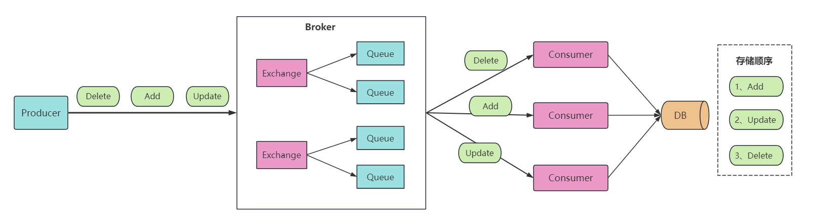
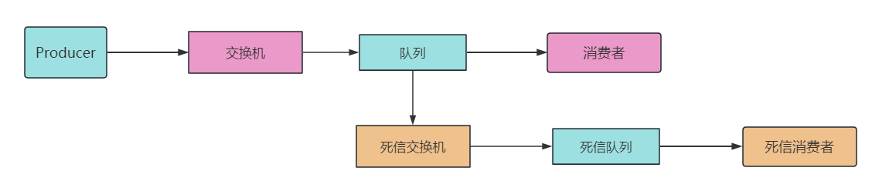
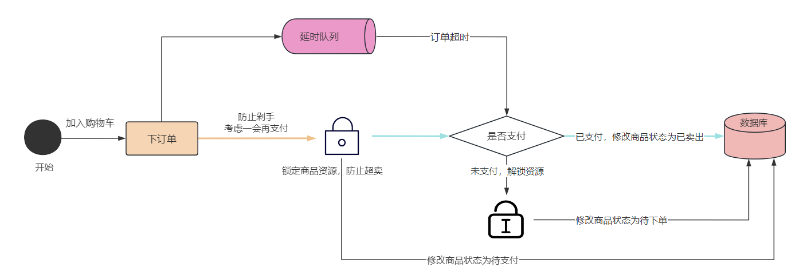

大家好，我是小❤，一个漂泊江湖多年的 985 非科班程序员，曾混迹于国企、互联网大厂和创业公司的后台开发攻城狮。

## 1. 引言

上篇文章（应对流量高峰的利器——消息中间件）中，我们已经介绍了消息中间件的用途，主要用作：解耦、削峰、异步通信、应用解耦，并介绍了业界常用的几种消息中间件，优劣对比和使用场景。

在今天的文章中，我们来聊一聊 `RabbitMQ`，这是小 ❤ 在工作中用的最早的消息中间件，主要用于大量数据的异步消费。


## 2. RabbitMQ

### 2.1 核心组件

RabbitMQ 是一个开源的消息中间件，它实现了高级消息队列协议（AMQP），同时提供了各种重要组件来支持消息的生产、传输和消费。



1. **Producer（生产者）：** 生产者是消息的发送方，负责将消息发布到 RabbitMQ 服务器。消息可以包含任何内容，例如任务、日志、通知等。
2. **Channel（信道）：**消息推送与接收时使用的通道。
3. **Exchange（交换机）：** 交换机是消息的中转站，它接收来自生产者的消息并将其路由到一个或多个队列。不同类型的交换机，如 `fanout，direct，topic，headers`，支持不同的路由规则。
4. **Queue（队列）：** 队列是消息的缓冲区，消息在发送到消费者之前存储在队列中，消费者从队列中获取消息并进行处理。
5. **Consumer（消费者）：** 消费者是消息的接收方，它从队列中获取消息并进行处理。消费者可以是多个，它们可以在不同的应用程序或服务器上运行。


### 2.2 工作流程

RabbitMQ 的工作方式是基于生产者、交换机和队列之间的协作。这是一个简单的消息传递过程：

1. 将队列与交换机绑定（`Binding`）起来，定义了消息的路由规则；
2. 生产者将消息发布到交换机，交换机根据绑定规则将消息路由到一个或多个队列；
3. 消费者从队列中获取消息并进行处理。

这种模型具有高度的灵活性，可以轻松处理大量消息，同时确保消息的可靠传递。


### 2.3 特性

说到消息中间件，很多人首先想到的就是 `Kafka`，但 `RabbitMQ` 也是许多金融或互联网公司构建可靠、可伸缩和高性能系统的首选。

这是为什么呢？

主要得从 RabbitMQ 的特性说起，主要有二：一个是功能强大，另一个是可靠性！

RabbitMQ 注重消息的可靠性和灵活性，适合任务排队和消息传递。而 Kafka 是分布式流式平台，注重日志存储和数据分发。

**顺序消费也是可靠性的一种，RabbitMQ 可以使用单一队列或多个单一队列来确保顺序消费。**

除此之外，RabbitMQ 还提供持久性队列和消息，以确保消息在 RabbitMQ 服务器宕机后不会丢失。另外，生产者可以使用发布确认机制来确认消息是否被接收。

RabbitMQ 相对 kafka 可靠性更好，数据更不易丢失，这对于一些数据敏感型的业务来说，显然更适合用前者。

并且，RabbitMQ 中原生支持**死信队列**，可以更好地处理未完成的业务消息，以及实现**延时队列**等特性，接下来我们一一介绍。


## 3. 保证顺序消费

RabbitMQ 提供了多个队列模型来保证消息的顺序消费。这对于某些应用程序非常重要，例如处理订单、支付和库存管理。

#### 消息错乱消费的场景



如上图所示，有三条业务消息分别是`删除、增加和修改`操作，但是 `Consumer` 没有按顺序消费，最终存储的顺序是`增加、修改和删除`，就会发生数据错乱。

针对消息有序性的问题，RabbitMQ 的解决方法是分三个阶段来保证。


#### 1、发送消息：入队列

消息发送时，需要业务来保证顺序性，就是保证生产者入队的顺序是有序的。

在分布式的场景下如果难以保证各个服务器的入队顺序，则可以加分布式锁的方式来解决。或者在业务生产方的消息里带上`消息递增 ID`，以及消息产生的时间戳。


#### 2、队列中的消息

在 RabbitMQ 的消息会保存在队列（Queue）中，在同一个队列里的消息是`先进先出（FIFO）`的，这个**由 RabbitMQ 来帮我们保证顺序**。

而不同队列中的消息，RabbitMQ 无法保证其顺序性，就像我们在食堂打饭一样，站在不同的排队队列，我们也无法保证会比其他队列的人先打上饭。


#### 3、消费消息：出队

一般来说，出队后的顺序消费交给消费者去保证。我们说的保证消费顺序，通常也是指消费者消费消息的顺序。

**有多个消费者的情况下，通常是无法保证消息顺序的。**

这就相当于我们在排队打饭时，有多个打饭阿姨，但是每个阿姨打饭的速度不一致，对应我们消费者的消费能力也不同。

所以，为了保证消息的顺序性，我们可以只使用一个消费者来接收业务消息。

就好比只有一个阿姨在打饭，来得早就一定能早点打上饭。但很明显，这样效率不是很高，所以在使用时我们需要权衡利弊：**看业务更需要顺序性，还是更需要消费效率**。


### 优先级队列

在保证顺序消费时，另一个迂回策略是可以使用优先级队列（Priority Queue）。

在 RabbitMQ3.5 之后，**当消费者数量较少，如果服务器检测到消费者不能及时消费消息的情况下，优先级队列就会生效。**

具体有两种优先级策略：

1. 设置队列的优先级
2. 设置消息的优先级

在声明队列时，我们可以通过 `x-max-priority` 属性来设置队列的最大优先级，或通过 `Priority` 属性来设置消息的优先级，从 1~10。

Golang 实现代码如下：

``` go
// 队列属性
props := make(map[string]interface{})
// 设置队列最大优先级
props["x-max-priority"] = 10

ch.Publish(
    "tizi365",     // 交换机
    "", // 路由参数
    false,
    false,
    amqp.Publishing{
        Priority:5, // 设置消息优先级
        DeliveryMode:2,  // 消息投递模式，1代表非持久化，2代表持久化，
        ContentType: "text/plain",
        Body:        []byte(body),
    })
```

当优先级队列消费生效时，**会首先消费高优先级队列中的优先级高的消息，以此来实现顺序消费**。

但需要注意的是，优先级队列触发的条件比较苛刻，在需要严格保证业务消息顺序的情况下最好不要使用！


## 4. 死信队列

RabbitMQ 里，当消息在队列中变成死信（`消费者无法正常处理的消息`）之后，它会被重新投递到一个交换机上（即死信交换机），**死信交换机上绑定的消费队列就是死信队列**。




### 死信的产生

死信产生需要满足如下条件：

1. 消息被消费者手动拒绝接收，并且 `requeue`（重新加入队列）策略为 False；
2. 消息已经过期（TTL）；
3. 队列达到最大长度，消息装不下了。


### 死信的处理步骤

当死信产生时，如果我们定义了一个`死信交换机`（其实就是一个普通的交换机，只是用于处理死信，所以叫死信交换机），然后在死信交换机上绑定了一个队列（称作`死信队列`）。

最后，如果死信队列有消费者监听时，死信消息的处理就会和正常业务消息一样，从交换机到队列，再由`死信消费者`（监听死信队列的消费者）正常消费。


## 5. 延时队列

RabbitMQ 本身不支持延时队列，但是我们可以通过 RabbitMQ 的插件 `rabbitmq-delayed-message-exchange`，或者使用 `死信队列 + 消息过期` 的方式来实现。


### 5.1 应用场景

当我们在电商里购物，或者在 12306 买票时，大概都会遇到这样一个场景：每次下订单后，到支付订单中间有一段商品锁定时间，**超过时间后未支付订单就会关闭**。

状态转换图如下：


### 5.2 插件实现

#### 1.安装插件

`Github` 地址：

```ruby
https://github.com/rabbitmq/rabbitmq-delayed-message-exchange/releases
```

从 github 的 release 页面的 assets, 下载 `rabbitmq_delayed_message_exchange-3.8.9-0199d11c.ez` 文件，把文件放到 rabbitmq 插件目录（plugins目录）

> 提示：版本号可能跟本教程不一样，如果你的 rabbitmq 就是最新版本，插件也选择最新版本就行。


#### 2.激活插件

```bash
rabbitmq-plugins enable rabbitmq_delayed_message_exchange
```


#### 3.定义交换机

通过 `x-delayed-type` 设置自定义交换机属性，支持发送延迟消息：

```go
    props := make(map[string]interface{})
    //关键参数，支持发送延迟消息
    props["x-delayed-type"] = "direct"

    // 声明交换机
    err = ch.ExchangeDeclare(
        "delay.queue",   // 交换机名字
        "fanout", // 交换机类型
        true,     // 是否持久化
        false,    
        false,
        false, 
        props,      // 设置属性
    )
```


#### 4.发送延迟消息

通过消息头（x-delay），设置消息延迟时间。

```go
        msgHeaders := make(map[string]interface{})
        // 通过消息头，设置消息延迟时间，单位毫秒
        msgHeaders["x-delay"] = 6000

        err = ch.Publish(
            "delay.queue",     // 交换机名字
            "", // 路由参数
            false,
            false, 
            amqp.Publishing{
                Headers:msgHeaders, // 设置消息头
                ContentType: "text/plain",
                Body:        []byte(body),
            })
```


### 5.3 死信队列 + 消息过期方案

该方案的核心思想是，先创建死信交换机、队列和消费者，来监听死信消息。

然后创建定时过期的消息，比如订单支付的时间为 30min，则将消息的 `TTL`（最大存活时间）设置为 30min，**将消息放到一个没有消费者消费的队列中，当消息过期后就会成为死信。**

死信消息被重新发送到死信交换机，然后我们在死信队列中消费该消息，根据商品 ID 判断该商品是否被支付。

如果没有支付，就取消订单，修改订单状态为`待下单`。如果已经支付，就将商品状态修改为`已完成`，并丢掉这条死信消息。


## 5. 小结

RabbitMQ 是一个功能强大的消息中间件，它在许多互联网应用中扮演了关键角色，比如华为摄像机 SDK 的监控图像数据上报，大部分电商系统的异步消费等等。

希望今天的文章能帮助你更深入地了解 RabbitMQ，并在工作中运用它来构建可靠的消息传递系统，下一篇文章小❤将带来 Kafka 的核心工作流程、底层原理及常见面试题，敬请期待！


如果觉得文章有所启发或收获，不妨点赞、分享，加入在看，这对我是最大的鼓励！ღ( ´･ᴗ･` )比❤

如果你有任何问题或想了解更多，也随时在评论区提问，谢谢你的阅读！

我是小❤，我们下期再见。


#### 参考资料

RabbitMQ 保证顺序执行：https://www.cnblogs.com/-wenli/p/13047059.html

RabbitMQ 教程：https://www.tizi365.com/topic/35.html

RabbitMQ 怎么保证可靠性、幂等性、消费顺序：https://cloud.tencent.com/developer/article/2143164

