大家好，我是小❤，一个漂泊江湖多年的 985 非科班程序员，曾混迹于国企、互联网大厂和创业公司的后台开发攻城狮。

## 1. 引言

### 1.1 背景

和 RabbitMQ 类似，Kafka（全称 `Apache Kafka`）是一个分布式发布-订阅消息系统。

> 想了解更多关于 RabbitMQ 知识的小伙伴，可以看我上一篇文章：深入浅出RabbitMQ：顺序消费、死信队列和延时队列

自 `Apache` 2010 年开源这个顶级实用项目以来，至今已有十数年，Kafka 仍然是非常热门的一个消息中间件，在互联网应用里占据着举足轻重的地位。

甚至，技术圈一度将 Kafka 评为消息队列大数据领域中的最强王者！

Kafka 以其速度快（`ms 级的顺序写入和零拷贝`）、性能高（`TB级的高吞吐量`）、高可靠（`有热扩展，副本容错机制能力`）和高可用（`依赖Zookeeper作分布式协调`）等特点闻名于世，它非常适合消息、日志和大数据业务的存储和通信。

本文接下来将会从**下载安装，配置修改，收发消息等理论和实践**入手，带大家一起探索 kafka 的核心组件，以及业务中常见的数据消费问题。


## 2. kafka下载与安装

### 2.1 安装准备

#### 1）前提条件

由于 kafka 需要 **JDK 环境**来收发消息，并通过 **ZooKeeper 协调服务**，将 `Producer，Consumer，Broker` 等结合在一起，建立起生产者和消费者的订阅关系，实现负载均衡。

所以安装 kafka 之前，我们需要先：

- 安装 JDK
- 安装 Zookeeper

网上安装教程很多，而本文主要探讨 kafka，所以就不再这里给出 JDK 和 zk 的详细安装步骤了。


#### 2）下载安装

安装 Kafka 时，主要有以下两种方式（更推荐使用 docker 安装）：

1.  虚机安装
   官网下载 kafka 压缩包 [https://kafka.apache.org/downloads]，或者使用 docker 下载
   解压缩至如下路径 `/opt/usr/kafka` 目录下。
2.  docker安装（需先在虚机上安装 docker） ：

```shell
# 拉取镜像，默认最新版本
docker pull bitnami/kafka

# 创建网络环境，保证zk和kafka在同一个网络中
docker network create kafka-network

# 运行zookeper
docker run -d --name zookeeper --network kafka-network bitnami/zookeeper:latest

#运行kafka，其中：环境变量KAFKA_CFG_ZOOKEEPER_CONNECT指定ZooKeeper的连接信息，KAFKA_CFG_ADVERTISED_LISTENERS是Kafka对外的访问地址
docker run -d --name kafka --network kafka-network \
  -e KAFKA_CFG_ZOOKEEPER_CONNECT=zookeeper:2181 \
  -e KAFKA_CFG_ADVERTISED_LISTENERS=PLAINTEXT://localhost:9092 \
  -p 9092:9092 \
  bitnami/kafka:latest
```


#### 3）修改配置文件

进入目录 `/opt/usr/kafka/config`，如果是 docker 安装方式，需先用命令 `docker exec -it containerID bash` 进入容器，修改 `server.properties` 文件：

```bash
#broker.id属性在kafka集群中必须要是唯⼀
broker.id=0

#kafka部署的机器ip和提供服务的端⼝号，根据自己服务器的网段修改IP
listeners=PLAINTEXT://192.168.65.60:9092 

#kafka的消息存储⽂件
log.dir=/opt/usr/data

#kafka连接zookeeper的地址，根据自己服务器的网段修改IP
zookeeper.connect=192.168.65.60:2181
```


## 3. 启动Kafka

### 3.1 启动 kafka 服务器

进入 `/opt/kafka/bin` 目录下，使用命令启动：

```shell
./kafka-server-start.sh -daemon ../config/server.properties
```


使用 `ps -ef |grep server.properties` 命令查看是否启动成功

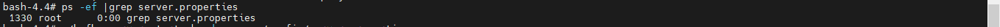


### 3.2 启动 Zookeeper

查看 `zookeeper` 是否正常添加好节点，首先，进入 `zookeeper` 的某一个容器内【这里进的是 `zookeeper:zoo1` 节点】

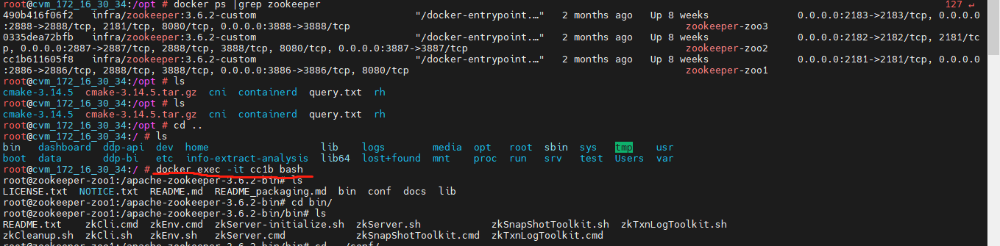


进入 `bin` 目录下，使用 `zkCli.sh` 命令，启动客户端

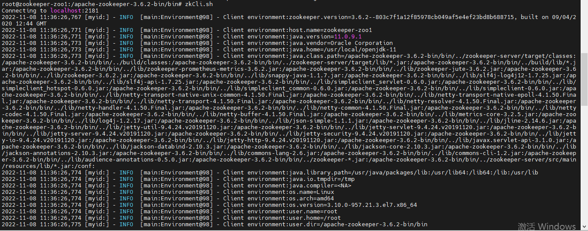


### 3.3 判断是否正常启动

使用 `ls /brokers/ids` 命令查询对应的 **kafka broker**：

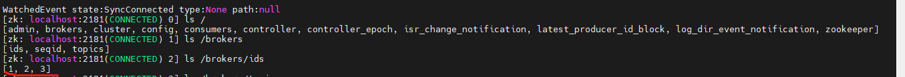

如果看到有对应的 broker.id，如上图的 `1,2,3`，就说明已经启动成功了！

如果有启动报错，一般是 `server.properties` 配置文件有误：比如，broker Id 不唯一，IP 端口不正确导致。


## 4. Kafka常见概念与核心组件

以下是 Kafka 中的一些核心组件：

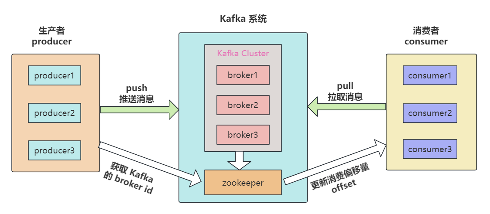

| 名称        | 解释                                                         |
| ----------- | ------------------------------------------------------------ |
| Broker      | Kafka 集群中的消息处理节点，⼀个 Kafka 节点就是⼀个 broker，broker.id 不能重复 |
| Producer    | 消息生产者，向 broker 发送消息的客户端                       |
| Consumer    | 消费者，从 broker 读取消息的客户端                           |
| Topic       | 主题，Kafka 根据 topic 对消息进⾏归类                        |
| Partition   | 分区，将一个 topic 的消息存放到不同分区                      |
| Replication | 副本，分区的多个备份，备份分别存放在集群不同的 broker 中     |


### 1）主题Topic

#### 什么是Topic

Topic 在 kafka 中是一个逻辑概念，**kafka 通过 topic 将消息进行分类**，消费者需通过 topic 来进行消费消息。

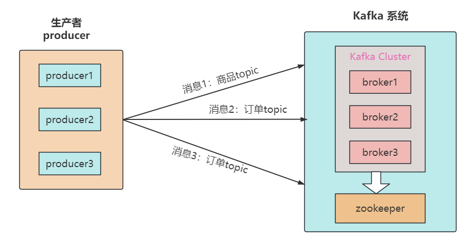

注意：发送到 Kafka 集群的每条消息都需要指定⼀个 topic，否则无法进行消费。


#### 如何创建Topic

我们可以通过以下命令创建一个名为 `hello-world`  的 topic，在创建 topic 时可以指定分区数量和副本数量。

```shell
# 创建 topic
./kafka-topics.sh --create --zookeeper 172.16.30.34:2181 --replication-factor 1 --partitions 1 --topic hello-world

# 通过命令查看 zk 节点下所有的主题
./kafka-topics.sh --list --zookeeper 172.16.30.34:2181
```

以下是在 docker 容器里创建 topic 的例子：

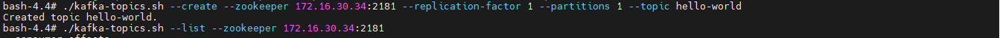


#### 查看 topic 的具体信息

我们可以通过以下命令来查看名为 `my-replicated-topic` 这个主题的详细信息：

```shell
./kafka-topics.sh --describe --zookeeper 172.16.30.34:2181 --topic my-replicated-topic
```

可以看出该 topic 的**名称，分区数量，副本数量，以及配置信息**等：

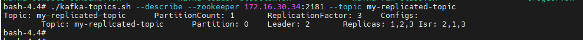


并且，我们也可以直接在 **zookeeper 客户端查看已创建的主题**，通过以下命令查看：

```shell
# 进入客户端
./bin/zkCli.sh

# 查看主题
ls /brokers/topics
get /brokers/topics/hello-world
```

可以看到，`hello-world` 主题已经被创建成功了：


### 2）Partition 分区

由于单机的 CPU、内存和磁盘等瓶颈，因此引入分区概念，类似于分布式系统的横向扩展。


通过分区，一个 topic 的消息可以放在不同的分区上，好处是：

- **分离存储：**解决一个分区上日志存储文件过大的问题；
- **提高性能：**读和写可以同时在多个分区上进行，方便扩展和提升并发。


#### 创建多分区的主题

以下命令创建一个名称为 `hello-world` 的 topic，指定 zookeeper 内网节点地址为：172.16.30.34:2181（注意：如果在自己的内网机器上部署，这个地址需要改成自己的服务器 IP）。

> `--partitions 3`：指定分区数量为 3

```shell
# 创建topic，replication-factor副本数为3，partitions分区数为1
./kafka-topics.sh --create --zookeeper 172.16.30.34:2181 --replication-factor 1 --partitions 3 --topic hello-world
```


### 3）Replication 副本

副本，就是主题中分区创建的多个备份，多个备份在 kafka 集群的多个 broker 中，会**有一个 leader，多个 follower**。


副本类似于冗余的意思，是保障系统高可用的有效应对方案。


#### 指定副本数量

当新建主题时，除了可指定分区数，还可以指定副本数。

> `--replication-factor 3`：指定副本数量为 3

```shell
# 创建topic，replication-factor副本数为3，partitions分区数为1
./kafka-topics.sh --create --zookeeper 172.16.30.34:2181 --replication-factor 3 --partitions 1 --topic my-replicated-topic
```


## 5. 在Kafka中收发消息

### 5.1 发送消息

当创建完 topic 之后，我们可以通过 kafka 安装后自带的客户端工具 `kafka-console-producer.sh`，向已创建的主题中发消息：

```shell
# 打开hello-world主题的消息发送窗口
./kafka-console-producer.sh --bootstrap-server 172.16.30.34:49092 --topic hello-world
```

消息发送窗口打开后，向 `hello-world` 主题中发送消息：

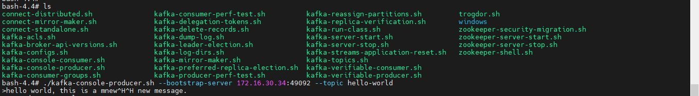


### 5.2 消费消息

当消息发送成功后，我们新开一个窗口，通过 kafka 安装后自带的客户端工具 `kafka-console-consumer.sh` 创建一个消费者，并监听 `hello-world` 这个 topic，以消费消息：

```shell
# 打开hello-world主题的消息消费窗口
./kafka-console-consumer.sh --bootstrap-server 172.16.30.34:49092 --topic hello-world
```

在 kafka 中，消费者默认从**当前主题的最后一条消息的 offset（偏移量位置）+1 位置开始监听**，所以当消费者开始监听时，只能收到 topic 之后发送的消息：

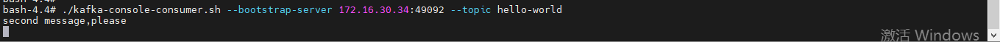


#### 从头开始消费

这时，如果 topic 消息已经发送有一会了，但我们想要从头开始消费该怎么办呢？

只需要在开启消费者监听时，加一个 `--from-beginning` 命令即可：

```shell
# 从当前主题的第一条消息开始消费
./kafka-console-consumer.sh --bootstrap-server 172.16.30.34:49092 --from-beginning --topic hello-world
```

从第一条消息开始消费：

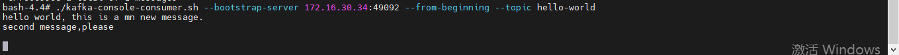


## 6. 消息收发相关

### 6.1 消息的存储和顺序性

生产者将消息发给 broker，broker 会将消息保存在本地的日志文件中。

在 config 文件中，日志目录为 `/opt/usr/data`，文件名为 `主题-分区/00000000.log`。

在存储和消费消息时，kafka 会用 `offset` 来记录当前消息的顺序：

* 消息存储有序：通过 **offset 偏移量来描述消息的有序性**；

- 消费有序：消费者消费消息时也是通过 offset 来描述当前要消费的消息位置。


### 6.2 消费组

#### 1）创建消费组

当创建消费者时，我们可以为消费者指定一个组别（group）。

> `--consuemr-property group.id=testGroup`：指定 group 名称为 testGroup

``` sh
./kafka-console-consumer.sh --bootstrap-server 172.16.30.34:49092 --consuemr-property group.id=testGroup --topic hello-world
```

指定组别后，在消费消息时，同一个消费组 `group` 只有一个消费者可以收到订阅的 topic 消息。


#### 2）查看消费组信息

我们可以通过 `describe` 命令查看消费组信息，命令如下：

```shell
# 消费组testGroup的详细信息
./kafka-consumer-groups.sh --bootstrap-server 172.16.30.34:49094 --describe --group testGroup
```

消费者信息如下：

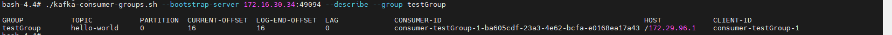

我们需要关注的重点字段如下：

- **CURRENT-OFFSET：**最后被消费的消息偏移量（offset）；
- **LOG-END-OFFSET：**消息总量（最后一条消息的偏移量）；
- **LAG：**积压了多少条消息。

在同一个消费组里面，任何一个消费者拿到了消息，都会改变上述的字段值。


### 6.3 单播/多播消息

当创建消费组后，我们根据**消费组的个数来判断消息是单播还是多播**。这俩名词源于网络中的请求转发，单播就是一对一发送消息，多播就是多个消费组同时消费消息。

```shell
# 注意，当两个消费者都不指定消费组时，可以同时消费
./kafka-console-consumer.sh --bootstrap-server 172.16.30.34:49092 --topic hello-world
```

每次创建消费者时，如果没有指定消费组，则相当于创建了一个默认消费组，kafka  会为这些默认消费组生成一个随机的 group id。

所以多次创建默认消费组时，就是多播。

``` sh
./kafka-console-consumer.sh --bootstrap-server 172.16.30.34:49092 --consuemr-property group.id=testGroup --topic hello-world
```

而单播消费时，只有一个消费组，**所以 group_id 相同**。

多播消费时，**分别指定不同的消费组名称或者不指定消费组名称**即可。


### 6.4 kafka消息日志文件

在 kafka 中，为了持久化数据，服务器创建了多个主题分区文件来保存消息，其中：

- `主题-分区/00000000.log` 日志文件里保存了某个主题下的消息；
- Kafka 内部创建了 50 个分区 `consumer-offsets-0 ~ 49`，用来存放消费者消费某个 topic 的偏移量，这些偏移量由消费者消费 topic 的时候主动上报给 kafka。 
  - 提交到哪个分区由 hash 后取模得出：hash（consumerGroupId）% 50；
  - 提交的内容为：key = `consumerGroupId + topic + 分区号`，value 为当前 offset 的值，为正整数。

在 Kafka 中，消费者的偏移量（consumer offset）是指消费者在分区中已经读取到的位置。消费者偏移量是由 Kafka 自动管理的，以确保**消费者可以在故障恢复后继续从上次中断的位置开始消费**。

如果大家在日常业务时想要跳过某些不消费的消息，或者重复消费，可以使用 Kafka 提供的 `kafka-consumer-groups.sh` 脚本，来查看和修改消费者组的偏移量。


## 7. 尾声

### 7.1 小结

本文介绍了 Kafka 以其高速、高性能、高可靠性和高可用性在大数据领域中占据重要地位。

并且从**下载安装** Kafka 开始，到修改配置、**服务启动**，通过命令行验证其是否启动成功。

接着，我们详细介绍了 Kafka 的核心组件，包括 **Broker、Producer、Consumer、Topic、Partition 和Replication**。

然后特别强调了 Topic 的创建和管理，展示了如何**创建 Topic、指定分区和副本数量**，以及如何查看 Topic 的详细信息。我们还讲述了 **Partition 分区的优势**，如分离存储和提高性能，并解释了 **Replication 副本**的概念和重要性。

接着，我们展示了在 Kafka 中**发送和消费消息**的过程，然后讨论了消息存储、顺序性、消费组的创建和查看消费组信息，以及单播和多播消息的概念。

最后，文章提到了 Kafka 中消息日志文件保存的内容，包括消息本身和**消息偏移量**，以及如何修改消息偏移量的位置。

相信看了这部分内容，大家已经学会如何搭建自己的 kafka 消息队列了~


### 7.2 后续

Kafka 系列文章分为上下篇，上篇主要是**核心组件的介绍和实践上手**等内容，包含对 Kafka 做了一个全面介绍，包括其安装、配置、核心组件和消息收发机制，本文是上篇内容。

下篇内容主要讨论**集群高可用、消息重复消费、延时队列**等常见的高级用法，敬请期待。


如果觉得文章有所启发或收获，不妨点赞、分享，加入在看，这对我是最大的鼓励！

如果你有任何问题或想了解更多，也随时在评论区提问，谢谢你的阅读！


ღ( ´･ᴗ･` )比心

我是小❤，我们下期再见。