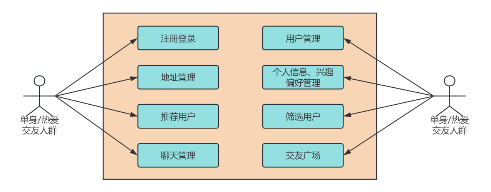
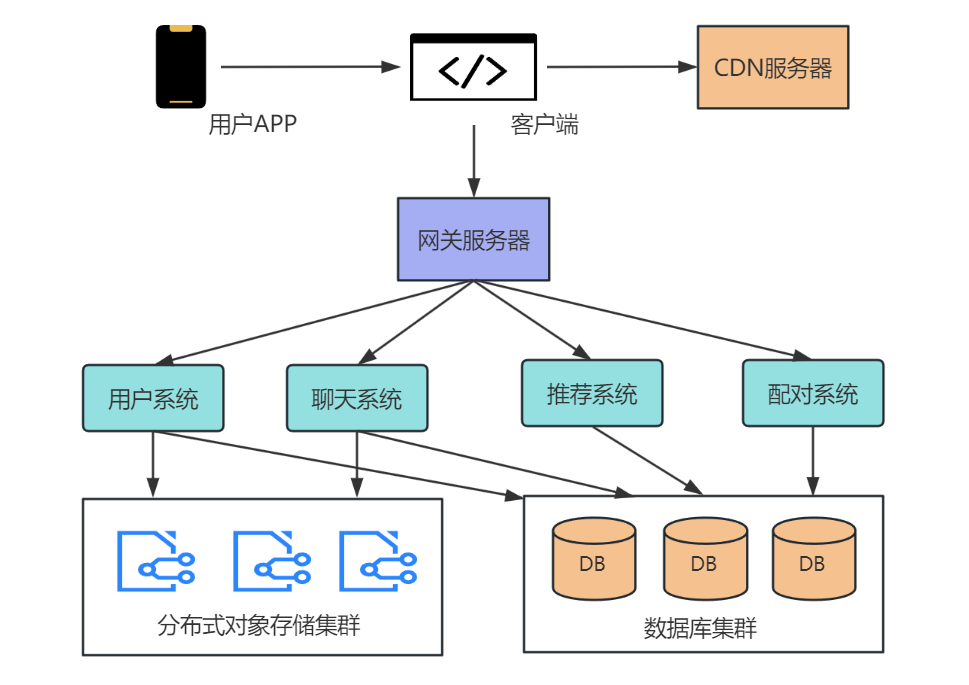
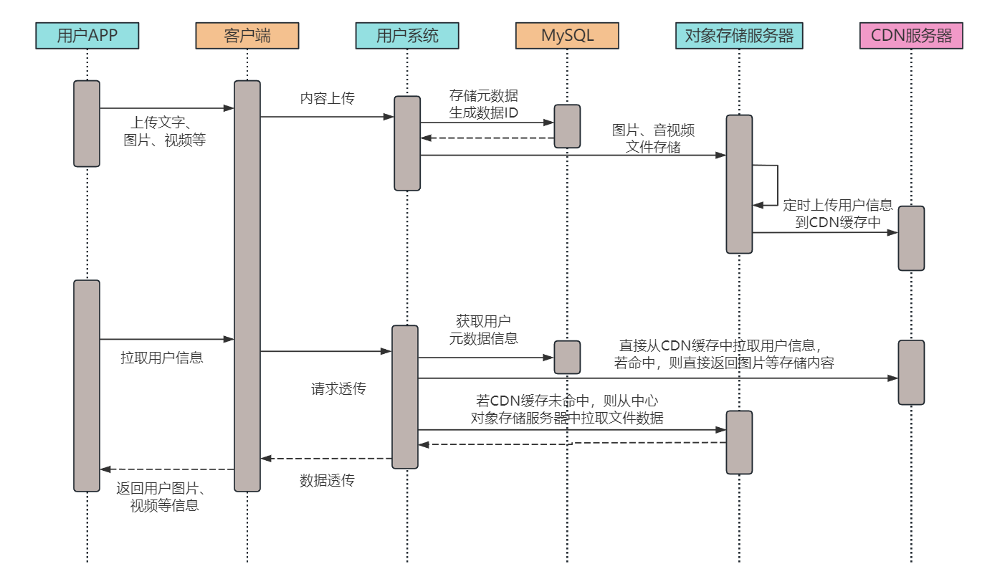
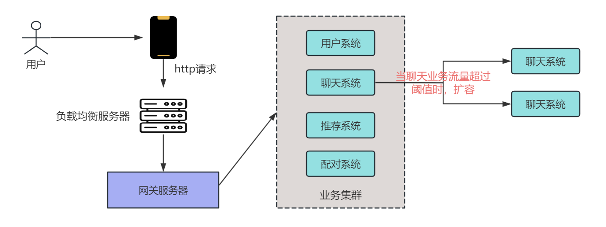
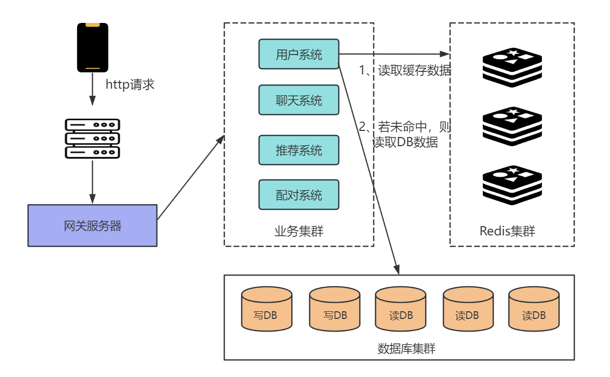
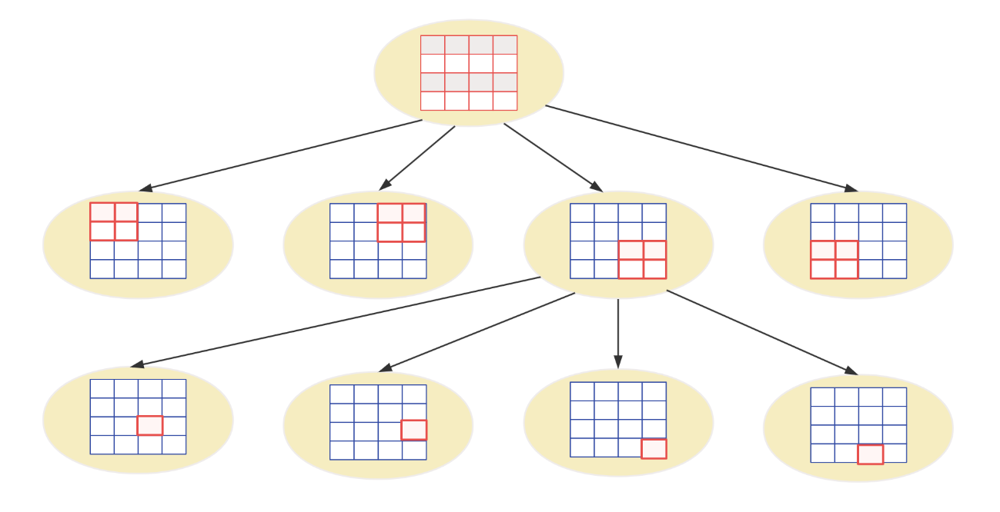
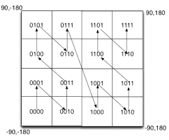

# 1. 引言

大家好，我是小❤，一个流浪江湖多年的 985 非科班程序员，曾混迹于国企、互联网大厂和创业公司的后台开发攻城狮。

## 1.1 寻找电影般的浪漫

“嘀嗒嘀嗒”，“嘀嗒嘀嗒”，当夜幕降临，你还在代码的海洋中与BUG进行着“持久战”。

突然，你意识到，生活中不应只有键盘和屏幕，于是像个待充电的电子宠物一样，决定给自己来点人际交流的活力补给。右手挥舞鼠标，左手掏出手机，边关闭 IDE 边滑动 App。

这个时候，寻找知己的老难题又闪现在脑海：要不要先检查一遍今日代码、再做一次单元测试，还是直接跳入“寻缘池”？（真实情况可能考虑的是，具体跳入哪个寻缘池 :dog: ）


好不容易做出了一个勇敢的决定——关闭电脑，从椅子一跃而起。你拿出手机，点开了熟悉的交友 App。

**然后，个人资料页面在屏幕上亮了起来，这可是你走出虚拟世界的敲门砖。**

你快速浏览着，现实世界中其他的编程爱好者、摄像迷、文艺青年...，都在这个小小的舞台中绽放着个性的光芒。


不需排队买饮料，不再担心交友聚会上的尴尬沉默。你滑过一个又一个感兴趣的头像，终于，停留在某个共鸣的话题上，准备展开一次思想的交锋。


## 1.2 技术支撑下的交友系统

就像前文所述，人们想要跳出孤独的循环，唯一需要的是一台手机，一个友好的交互界面。

那这个诱人的**交友系统**是如何诞生的呢？它背后的算法和架构又是如何支撑起你我情感交流的桥梁呢？

今天，让我们一同撩开这个现代**代码世界中的爱情骇客**的神秘面纱，深度解码**交友系统的设计与实现**。

在这篇文章中，小❤将带你穿梭于交友系统的逻辑，探索它是如何在短短几年内从程序员的单片机作品演变成我们日常生活中分享闪耀故事的舞台。


# 2. 需求分析

### 2.1 Small Chat

在一个宇宙般无垠的数字海洋中，浮现了名为 `Small Chat` 的爱情小岛。


这座岛不是用岩石建成，而是由一群单身狗（咳咳，我是指单身男女）手机里的一个个 App 打造而成。说起这个 App，它简直是孤独心灵的救星，一个纸杯电话 2.0 版，或者说是一扇带你邂逅爱情奇遇的神奇窗户。


### 2.2 功能需求



打开这款叫做 `Small Chat` 的App，就如启动太空艇的第一步，用户得先登录自己的小小太空艇——上传星球生活照，装饰个人舱室（啊，这不是自我介绍么~）。此时，这位宇航员您可以种下自己的位置信标，并根据个人偏好装配指南 needle（这里是指推荐算法）。

算法这个家伙和那位算命先生有点像，据说它会依据您的星际坐标和您那闪闪发亮的个人信息（咳咳，**据说每个程序员都以为自己是全村最靓的仔**），匹配茫茫宇宙中的其他太空艇，它们都和你泊在相邻的星域。

现在，您就可以在手机荧光屏上批量欣赏这些来自银河系各个角落的宇航员的舱室（就是他们的照片和资料）。

要是心中一动，想要走得更近一些，您就可以大胆地向右滑动这张星际许可证——就像在说：“嘿，你在宇宙中并不孤单”。

当然，如果两个孤独的太空艇都向右转了舵，哦，这不就意味着星际之船即将交汇了吗？这个时候，系统就会像个热心的宇航局一样，发来一条信息：“恭喜，你们已经成功配对！”

这时，爱情的宇宙轨道就开启了哦！

于是，两位宇航员就可以开始在私人频道上畅所欲言，探索彼此的宇宙，看看是否能点燃繁星。


### 2.3 非功能需求

现在，让我们来分析一下 `Small Chat` 星球的潜在居民数量。

我们估算在这片浩渺的银河系中，有超过 1 亿颗孤单的心正在寻找彼此的引力波。因此，我们从 1 亿个星际交流频道出发，为 `Small Chat` 的后台系统做设计。

想象一下，那是一个可以让 1 亿颗心交织在一起的宇宙网络啊！

这不仅是技术的挑战，也是对爱情信号强度的考验。而这，就是我们今天要介绍的 `Small Chat` ——不只是一个交友 App，而是银河系统中一个关于爱情的奇妙设计。


# 3. 概要设计

在数字化的银河系中， `Small Chat` 是一个独特的星球，拥有着精妙绝伦的生态系统。


## 3.1 整体架构

不妨把它想象为一座由微服务构成的未来城市，这里的每一个角落都通过智能网关保护着，就像是银河巡警，确保通道畅通无阻。

这座未来城市的每个街区都是一个专门的小微服务工厂：用户工厂、邻近算法工厂、配对工厂、聊天工厂、还有那个精确匹配你可能邂逅爱情坐标的推荐工厂。



在 `Small Chat` 的系统架构中，我们采取了被广泛认可的微服务架构设计。

简单来说，用户通过一个集中的网关服务来接入不同的微服务，你可以将其视为一个高效的调度中心，既能保安全，又能提高效率。

具体来讲，用户的所有请求首先被发送到这个网络门卫——也就是**网关服务器**。这个网关服务器的任务范围相当广泛，它既要做好流量的管制工作，保护系统免受过多请求的压垮，也要时刻警惕潜在的网络攻击，同时对用户的身份和权限进行校验。

此外，网关服务器还起到了一个'中介'的角色，把用户的请求引导到相应的微服务，并将返回的数据整合后再展现给用户。

根据预估的用户级，这个网关服务器需要能够应对每天高达千万甚至亿万次的访问量。


## 3.2 业务系统

然后是微服务的各个具体组件，**用户系统**是负责管理和存储用户个人信息的模块，包括用户的登录认证，所有的用户都必须通过这个服务来验证身份才能使用系统的其他功能。

并且为了处理庞大的数据量，这里用到了**分片技术的 MySQL 数据库**系统，并将它们放在一个集群里面，方便弹性伸缩。

分布式对象存储集群主要存储了用户上传的图片、音视频信息，以及聊天时用到的表情包图片或者其它文件信息，文件的元数据放置在 DB 存储。



此外，为了更高效地提供图片，我们通过 CDN 服务缓存了用户访问频率较高的热门图片，以加速图片加载速度。

至于**配对系统**，它则是负责用户互相"右划"表示喜欢后进行配对的模块，如果两个人互相"右划"了对方，这个服务就会将这对用户加入到对方的通讯录中。

最后，**推荐系统**的责任是将可能相互感兴趣的用户推荐给对方，这需要结合用户的行为、兴趣爱好和前述的"配对"情况来进行智能推荐。

同时，考虑到地理位置的亲近性因素，这个服务时常会与算法团队密切合作，确保推荐的对象在地理上也方便用户进行真实的社交互动。

通过这些微服务的配合， `Small Chat` 的平台可以以模块化的方式灵活地扩展功能，同时保证了用户数据处理的效率和安全。


# 4. 详细设计


## 4.1 高并发挑战

对于交友系统来说，高并发处理是确保用户体验和系统稳定性的首要技术挑战。对于一个可能有着几千万用户同时在线的系统来说，维护系统稳定性需要注意以下几点。


### 1. 水平扩展与负载均衡



- 首先，采用**无状态的设计模式**，让系统后端服务能够在多个处理单元之间进行水平扩展。这意味着任何一个单元都可以独立处理请求，而不依赖于特定的上下文信息。
- 部署**负载均衡器**，将流量分发到多个后端服务器。负载均衡器可以是硬件负载均衡器，也可以是如 Nginx 这样的软件解决方案，其利用算法（如 `轮询、最小连接数、一致性哈希` 等）智能地将用户请求分配到处理能力最佳的服务器节点。
- 实现**自动扩缩容**机制，**监控系统**的负载情况，当流量急剧上升，超过预置阈值时，自动扩展服务器实例；当流量下降时，适当减少实例以节约成本。


### 2. 数据库优化和缓存策略



- **数据库分区和分片**，将数据分布到多个数据库中，每个数据库只负责处理一部分数据，数据库之间可通过分布式事务进行数据一致性控制。

  > 不了解 DB 分库分表的同学可以看这篇文章，讲的很详细：MySQL高可用，分库分表你学废了吗

- 使用**读写分离模型**，通过主从复制的方式摊开读操作的压力。写操作只在主数据库上进行，而读操作则可以在多个从数据库上进行，这样可以大幅提高数据库的读取性能。

- 引入**缓存**系统，如 Redis 或 Memcached，将频繁读取的数据，如用户的基础信息、用户的交互动态缓存起来。对于交友系统来说，用户的动态信息、瞬时状态等可以缓存，减少数据库的请求次数。


### 3. 消息队列和异步处理

- 引入**消息队列**，比如 Kafka 或 RabbitMQ，用来解耦应用服务和后端处理。这允许系统在面对突发流量时把请求排队，而不是直接在数据库或服务层上造成压力，从而提高整体系统的弹性和响应能力。比如，用户聊天时可以把消息通知放到队列中排队处理。
- **异步**执行耗时操作，比如用户的 `匹配运算、数据分析` 等可以放在后台服务中异步执行，用户不需要同步等待这些操作完成。特别是用户匹配机制，可以放到并发量小的时段统一进行。

必须要注意的是，以上策略需要遵循微服务架构的原则，将系统拆分为多个松耦合、易于扩展的小型服务，每个服务可以单独部署，独立扩展。

通过这些架构层面的优化，即便 `Small Chat` 面临几千万到上亿级别的用户并发请求，也能保持服务的高可用性和稳定性。


## 4.2 空间邻近算法

如何根据用户的地理位置寻找距其一定范围内的其他用户，也是交友系统中必不可少的一个考虑点。

空间邻近算法是为了解决 "给定一个点，找出距离其最近的点" 这一问题的算法。在不同的应用背景下，会有不同的考量因素，如精度、效率、存储需求和实施的难易程度等，以下是一些常见的空间邻近算法。


### 1. 常见的空间邻近算法：

#### 1）网格（Grid）算法

这种算法是将地理空间简单划分成网格，可以认为网格内的点是邻近的。


为提高邻近好友查询效率，我们的系统可以按照一定规则把每位用户归类到一个特定的网格，并在他们的用户信息里标记对应的网格ID（gridID），将位置信息存入 MySQL 中。

这样，当需要查找用户附近的人时，我们可以将 `3*3` 的网格视为相近用户，这样仅需搜索目标用户所在的那个网格以及其相邻的八个网格内的用户即可。

但是，即便如此，每当面对 DB 的高频访问时，这类查询仍然可能会带来负担：一方面是太慢，另一方面是不精确，边界处理也比较复杂。

为了进一步优化，我们决定把所有网格及其中的用户信息都存储在内存中，这样就可以避免频繁的 DB 操作。对于邻近用户的查询，通过内存中的数据进行计算即可。

首先，我们可以把所有用户的经纬度信息加载到内存中，实现这一解决方案的关键在于选择合适的网格尺寸，并能快速确定用户所在的网格及其周边网格信息。

实践中，通常会用到 `四叉树网格` 和  `GeoHash 算法` 来优化这一过程。


#### 2）四叉树（Quadtree）网格算法

四叉树网格算法类似网格方法，但是网格的大小是动态分配的。



它底层使用了四叉树结构自适应地调整网格大小，以处理用户密度不同的区域。这种算法对不均匀分布的数据集表现更好，因为它可以根据数据的分布调整网格的大小。

具体来说，在人口密集区，它通过细分网格来减少每个网格的用户量（比如深圳南山、北京海淀）；而在人疏少地，网格则相应扩大（比如一些用户数较少的平原地区）。

这种方法保证了每个网格的用户数不超过设定阈值（例如 500 人），当查询附近用户时，算法从四叉树的根节点开始逐级向下，直至抵达包含目标用户的叶子节点。为了进一步查找邻近网格用户，可通过将所有叶子节点连成一个双向链表来实现。

尽管该算法适应了很多场景，但编程实施较复杂且若网格大小设置不当，会影响效能。


#### 3）Geohash 算法

GeoHash 算法是一种将二维空间坐标编码为一维字符串的方法，它可以有效地表示地理位置信息。



在交友系统中，GeoHash 可以用来索引用户的位置，以便快速查询附近的用户。结合 Redis 这样的内存数据存储，使用 GeoHash 应对大规模地理位置处理成为可能。


##### 1. 用户位置编码

当用户提供自己的位置信息，通常是经度和纬度，系统会使用 GeoHash 算法将这些坐标转换为一个字符串。GeoHash 将地图划分为网格，每次划分会将网格细分为更小的区域。经纬度坐标每一次细分都相应地在 GeoHash 字符串上增加一个字符。


##### 2. 存储用户位置

得到 GeoHash 字符串后，可以使用 Redis 自带的地理空间索引 `GeoSpatial index`（Redis3.2 以后支持），直接使用 `GEOADD` 命令添加用户的地理位置信息。


##### 3. 查询附近的用户

当需要查找一个用户的附近用户时，系统可以做如下操作：

- 首先，获取查询用户的 GeoHash 字符串。
- 使用 Redis 的 `GEOSEARCH` 或类似的命令，通过指定中心点（即查询用户的位置）和搜索半径，查询附近的用户。
- Redis 会返回在该区域内的所有用户 ID 和它们的位置信息。


##### 4. 结果排序和范围限制

Redis 的 GEOSEARCH 命令返回的结果已经根据距离中心点的远近排序，查找到的用户可以进一步按实际距离排序。如果系统需要对结果进行限制，如只显示前10个最近的用户，可以在查询时指定或者在查询后处理。


#### 4）如何选择

在交友系统中，由于地理位置是不断变化的，咱们需要一个可以处理动态数据集的算法。并且，为了在大规模用户中工作，需要考虑算法的效率和扩展性。

GeoHash 由于其简单性和易于与其他存储解决方案结合使用（如 Redis），在许多现代的地理空间应用中非常受欢迎。所以在 `Small Chat` 中，我们使用了 GeoHash 算法来处理定位以及附近用户的匹配机制。


## 4.3 推荐算法

推荐算法在交友平台中至关重要，它直接影响用户的体验和平台的留存率。

下面，在 `Small Chat` 中，我们综合考虑用户的互动、地理位置等因素来给用户打分，并最终生成一个排名（rank）值，用以推荐其他匹配的用户。


### 1. 用户特征与行为因素

用户的每一项行为都可能成为加分项，比如：

- **活跃度加分**：用户登录频率、交互次数等，表示用户对平台的参与度。
- **完善度加分**：用户资料的完整性，包括兴趣、爱好、自我介绍等。
- **正面互动加分**：其他用户对该用户的正面评价，如点赞、喜欢、私信等响应。
- **新鲜度加分**：新注册用户或长时间未登录后重新快乐用户可能会有一定加分。


### 2. 地理位置因素

- **地理邻近加分**：距离用户较近的其他用户会获得额外加分。这可以通过 GeoHash 位置算法计算得出。


### 3. 算法打分机制

设置一个打分系统，每个因素根据其重要性分配权重，例如：

- 活跃度权重：25%
- 资料完善度权重：20%
- 正面互动权重：30%
- 距离权重：25%

用户得分计算公式可表示为：

``` 
\[
    \text{UserScore} = 
    \left(\frac{\text{活跃度分}}{\text{最大活跃度分}} \times 25\right) +
    \left(\frac{\text{资料完善度分}}{\text{最大资料完善度分}} \times 20\right) +
    \left(\frac{\text{正面互动分}}{\text{最大正面互动分}} \times 30\right) +
    \left(\frac{\text{距离分}}{\text{最大距离分}} \times 25\right)
\]
```


### 4. 推荐列表的生成

得到每个用户的得分后，为目标用户生成推荐列表的过程如下：

1. **用户相似性计算**：首先，通过用户的行为和资料完善度找到倾向上相似的用户。
2. **位置筛选**：其次，利用位置信息筛选出距离合适的候选人。
3. **综合得分排序**：根据上述的得分机制对所有筛选后的用户计算得分，得到每个用户的排名值。
4. **推荐列表生成**：最后，根据得分从高到低排列用户，生成推荐列表。


### 5. Rank值的更新

Rank值不是静态的，它应随着用户行为的变化动态更新。比如，用户的活跃度可以是逐日递减的，而一次新的正面互动则能带来即时的得分提升。

在实践中，可以通过设定定时任务，如每日或每周更新一次用户得分。对于即时性较强的操作（如互动行为），可以触发即时的得分更新流程。


### 6. 模型优化

在实施算法之后，要通过A/B测试、用户反馈和持续的数据分析来不断优化模型。平台可能会根据具体的业务需求，动态调整各个因素的权重，并针对不同群体设计独特的打分策略。

需要注意的是，推荐系统在实际部署时会远比这里描述的复杂，算法可能涉及到深度学习模型来捕获更微妙的用户特征，同时要处理大量的数据和应对实时性的需求。最终目标是为用户提供个性化且高质量的匹配推荐，以提升用户满意度和平台吸引力。

