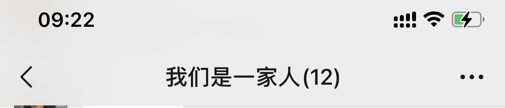
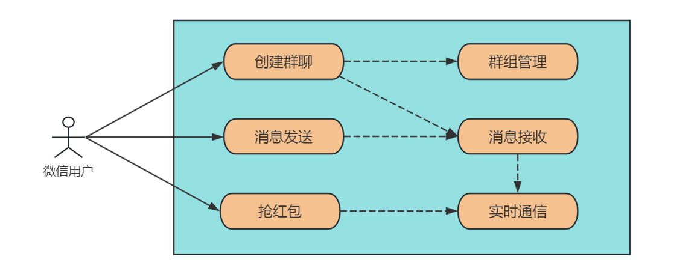
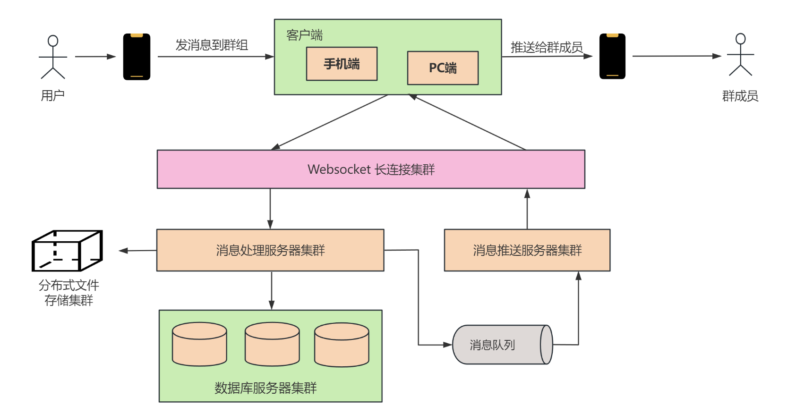
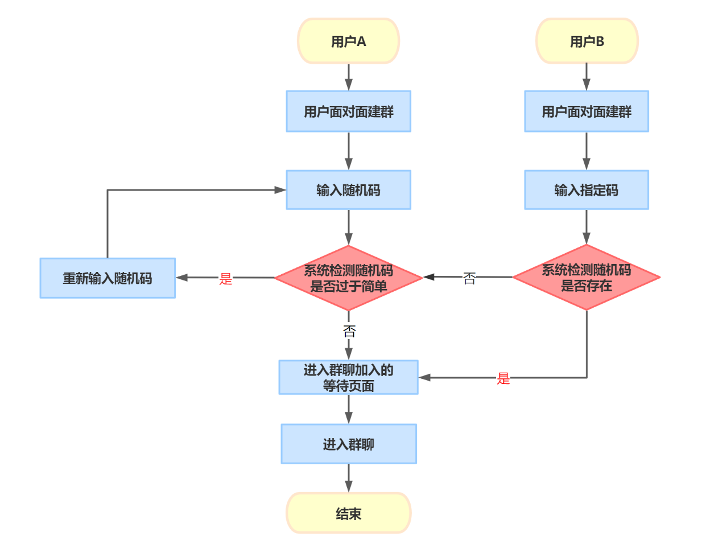
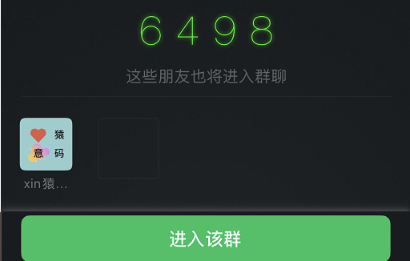
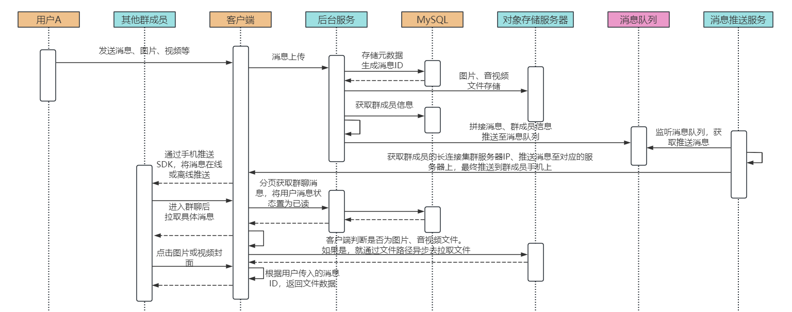
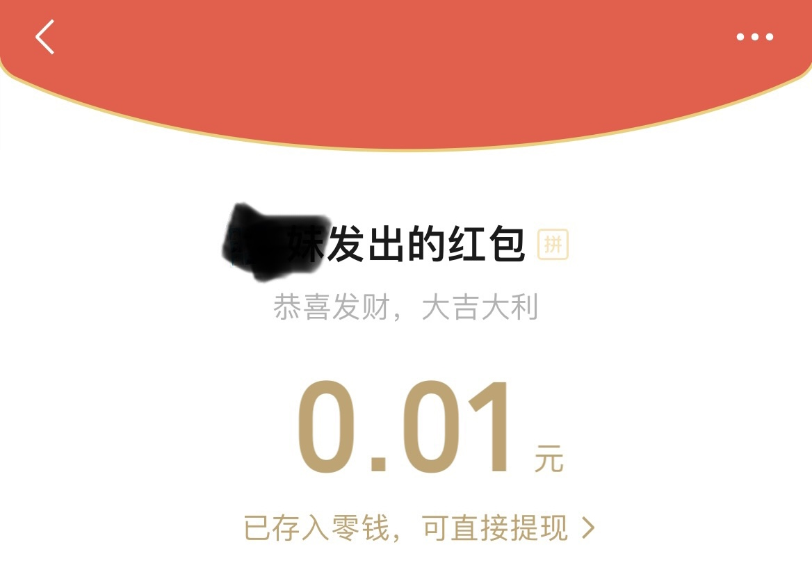

## 1. 引言

大家好，我是小❤。

当我那天拿着手机，正在和朋友们的微信群里畅聊着八卦新闻和即将到来的周末计划时，忽然一条带着喜意的消息扑面而来，消息正中间写着八个大字：**恭喜发财，大吉大利**。


抢红包！！相信大部分人对此都不陌生，那微信的这个群聊系统是如何设计的，让我们可以方便地聊天、分享图片和表情，还有那个神奇的红包功能呢？

这个问题一直困扰着，于是我决定深入了解一下，看看微信的群聊系统背后的设计是怎样的。


### 微信群聊系统设计

微信作为 10 亿用户级别的全民 App，想必大家都用过，微信建群功能是微信里面核心的一个能力，它可以将数百个好友或陌生人放进一个群空间。



或许你已经在微信上体验过很多次群组聊天，但你是否好奇过这个背后的系统是如何设计的呢？

今天我们就来探讨一下。


## 2. 系统需求

### 2.1 系统特点与功能需求

微信群聊功能是社交应用的核心功能之一，它允许用户创建自己的社交圈子，与家人、朋友或共同兴趣爱好者进行友好地交流。

以下是微信群聊系统的核心功能：



- **创建群聊**：用户可以创建新的聊天群组，邀请其他好友用户加入或与陌生人面对面建群。
- **群组管理**：群主和管理员能够管理群成员，设置规则和权限。
- **消息发送和接收**：允许群成员发送文本、图片、音频、视频等多种类型的消息，并推送给所有群成员。
- **实时通信**：消息应该能够快速传递，确保实时互动。
- **抢红包**：用户在群聊中发送任意个数和金额的红包，群成员可以抢到随机金额的红包。


### 2.2 非功能需求：应对高并发、高性能、海量存储

当我们面对 10 亿微信用户每天都可能使用建群功能的情景时，就需要处理大规模的用户并发。这就引出了系统的非功能需求，包括：

- **高并发**：系统需要支持大量用户同时创建和使用群组，以确保无延迟的用户体验。
- **高性能**：快速消息传递、即时响应，是数字社交的关键。
- **海量存储**：系统必须可扩展，以容纳用户生成的海量消息文本、图片及音视频数据。


## 3. 概要设计

在概要设计中，我们考虑了系统的核心组件和基本业务的概要设计。

### 3.1 核心组件

微信群聊系统中，会涉及到如下核心组件或协议。



* **客户端**：接收手机或 PC 端微信群聊的消息，并实时传输给后台服务器
* **Websocket传输协议**：支持客户端和后台服务端的实时交互，开销低，实时性高，常用于微信、QQ 等 IM 系统通信系统
* **长连接集群**：与客户端进行 Websocket 长连接的系统集群，并将消息通过中间件转发到应用服务器
* **消息处理服务器集群**：提供实时消息的处理能力，包括数据存储、查询、与数据库交互等

- **消息推送服务器集群**：这是信息的中转站，负责将消息传递给正确的群组成员
- **数据库服务器集群**：用于存储用户文本数据、图片的缩略图、音视频元数据等
- **分布式文件存储集群**：存储用户图片、音视频等文件数据


### 3.2 业务概要设计

#### 群聊创建

- **唯一ID分配**：当用户请求创建一个新群组时，系统生成一个唯一的群组 ID，通常可以使用分布式 ID 生成器如雪花算法（Snowflake）或直接使用数据库自增 ID。这里我们为了实现简便，采用 MySQL 的自增 ID。
- **群组信息存储**：将群组 ID 和相关信息（例如群名、创建者 ID 等）存储在群组数据库中。
- **成员关联**：将群主添加为群组的创始成员，同时创建者也会成为管理员。
- **消息历史记录**：为了确保新成员能够访问以前的消息，将此新群组的群组 ID 与用户消息关联存储。

除了拉好友建群，微信还实现了面对面建群的能力。

接下来，我们深入探讨了三到四个核心功能的详细设计，包括`面对面建群、消息发送与接收及抢红包`功能。


## 4. 面对面建群

用户发起面对面建群，并输入一个 4 位数的随机码，周围的用户输入该随机码后可加入群聊，面对面建群功能通常涉及数据表设计和核心业务交互流程如下。

### 4.1 数据库表设计

1. **User 表**：存储用户信息，包括用户 ID、昵称、头像等。
2. **Group 表**：存储群组信息，包括群 ID、群名称、创建者 ID、群成员个数等。
3. **GroupMember 表**：关联用户和群组，包括用户 ID 和群 ID。
4. **RandomCode 表**：存储面对面建群的随机码和关联的群 ID。


### 4.2 核心业务交互流程



用户 A 在手机端应用中发起面对面建群，并输入一个随机码，校验通过后，等待周围（50 米之内）的用户加入。此时，系统将用户信息以 `HashMap` 的方式存入缓存中，并设置过期时间为 `3min`。

``` json
{随机码，用户列表[用户A(ID、名称、头像)]}
```

用户 B 在另一个手机端发起面对面建群，输入指定的随机码，**如果该用户周围有这样的随机码，则进入同一个群聊等待页面，并可以看到其它群员的头像和昵称信息**。

此时，系统除了根据随机码获取所有用户信息，也会实时更新缓存里的用户信息。



当第一个用户点击**进入该群**时，就可以加入群聊，系统将生成的随机码保存在 `RandomCode` 表中，并关联到新创建的群 ID，更新群成员的个数。

然后，系统将用户信息和新生成的群聊信息存储在 `Group、GroupMember` 表中


#### 成员加入，刷新群员信息

之后 B、C 用户带着随机码加入群聊时，手机客户端向服务器后端发送请求，验证随机码是否有效。服务器后端验证随机码，检查随机码是否存在于缓存中，以及是否在有效期内。

然后，判断当前群成员是否满员（目前普通用户创建的群聊人数最多为 500 人），如果验证通过，服务器后端将用户 B、C 添加到群成员表 `GroupMember` 中，并返回成功响应。

移动客户端应用收到成功响应后，更新用户 B、C 的群聊列表，展示他们已加入的新群聊。


#### 其它技术组件

这样，用户 A 通过创建随机码和周围的用户扫描二维码的方式成功建立了一个面对面建群。这个功能涉及了多个技术组件，包括分布式缓存、数据库、二维码生成和验证等。

同时，在面对面建群的过程中相当重要的能力是标识用户的区域，比如 50 米以内。这个可以用到 **Redis 的 GeoHash 算法，来获取一个范围内的所有用户信息**。

由于篇幅有限，这里不展开赘述，想了解更多和二维码生成及位置算法的细节，可以看我之前的文章：听说你会架构设计？来，弄一个公交&地铁乘车系统。


## 5. 消息发送与接收

当某个成员在微信群里发言，系统需要**处理消息的分发、通知其他成员、以及确保消息的显示**。以下是这一功能的详细交互步骤，相关技术组件和数据库表存储方案。


### 5.1 交互流程

消息发送和接收时序图如下：



1. 用户A在群中发送一条带有图片、视频或音频的消息。
2. 移动客户端应用将消息内容和媒体文件上传到服务器后端。
3. 服务器后端接收到消息和媒体文件后，将消息内容存储到 Message 表中，同时将媒体文件存储到分布式文件存储集群中。**在 Message 表里，不仅记录了媒体文件的 MediaID，以便关联消息和媒体；还记录了缩略图、视频封面图等等**。
4. 服务器后端会向所有群成员广播这条消息。移动客户端应用接收到消息后，会根据消息类型（文本、图片、视频、音频）加载对应的展示方式。
5. 当用户点击查看图片、视频或音频缩略图时，客户端应用会根据 `MediaID` 到对象存储集群中获取对应的媒体文件路径，并将其展示给用户。

这个流程确保了消息和媒体文件的有效存储和展示。用户可以上传和查看各种类型的媒体数据，而服务器后端通过关联 `Message` 和对象存储服务器中的信息，实现了有效的消息存储和展示。


### 5.2 消息存储和展示

在微信群中保存和展示用户的图片、视频或音频数据，通常需要进行数据存储和展示方面的设计。除了上面面对面建群功能中提到的用户表和群组表以外，还需要以下表结构：

1. **Message表：** 用于存储消息，每个消息都有一个唯一的 MessageID，消息类型（文本、图片、视频、音频），消息内容（文字、图片缩略图、视频封面图等），发送者 UserID、接收群 GroupID、发送时间等字段。
4. **Media表：** 存储用户上传的图片、视频、音频等媒体数据。每个媒体文件都有一个唯一的 MediaID，文件路径、上传者 UserID、上传时间等字段。
3. **MessageState表：** 用于存储用户消息状态，包括 MessageID、用户 ID、是否已读等。在消息推送时，通过这张表计算未读数，统一推送给用户，并在离线用户的手机上展示一个小数字代表消息未读数。

我们知道，MySQL 每次查询 `select count` 类型的语句时，都会触发全表扫描，所以每次加载消息未读数都很慢。

为了查询性能考虑，我们可以将用户的消息数量存入 Redis，并实时记录一个未读数值。并且，当未读数大于 99 时，就将未读数值置为 100 且不再增加。

当推送用户消息时，**只要未读数为 100，就将推送消息数设置为 `99+`，以此来提升存储的性能和交互的效率。**


## 6. 抢红包

抢红包功能允许用户在群聊中发送任意个数和金额的红包，群成员可以抢到随机金额的红包，但要**保证每个用户的红包金额不小于 0.01 元**。



抢红包的详细交互流程如下：

1. 用户接收到抢红包通知，点击通知打开群聊页面
2. 用户点击抢红包，后台服务验证用户资格，确保用户尚未领取过此红包
4. 若用户资格验证通过，后台服务分配红包金额并存储领取记录
5. 用户在微信群中看到领取金额，红包状态更新为“已领取”
5. 异步调用支付接口，将红包金额更新到钱包里

抢红包功能需要关注抢红包的数据库设计，抢红包实时性和红包分配算法。


### 6.1 数据库设计

红包表 `redpack` 的字段如下：

* **id：** 主键，红包ID
* **totalAmount：** 总金额
* **surplusAmount：** 剩余金额
* **total：** 红包总数
* **surplusTotal：** 剩余红包总数
* **userId：** 发红包的用户ID

该表用来记录用户发了多少红包，以及需要维护的剩余金额。


红包记录表 `redpack_record` 如下：

* **id：** 主键，记录ID
* **redpackId：** 红包ID，外键
* **userId：** 用户ID
* **amount：** 抢到的金额

记录表用来存放用户具体抢到的红包信息，也是红包表的副表。


### 6.2 实时性

#### 1、发红包

1. 用户设置红包的总金额和个数后，在红包表中增加一条数据，开始发红包
2. 为了保证实时性和抢红包的效率，在 Redis 中增加一条记录，`存储红包 ID 和总人数 n`
3. 抢红包消息推送给所有群成员


#### 2、抢红包

从 2015 年起，微信红包的抢红包和拆红包就分离了，用户点击抢红包后需要进行两次操作。这也是为什么明明有时候抢到了红包，点开后却发现**该红包已经被领取完了**。


抢红包的交互步骤如下：

1. 抢红包：抢操作在 `Redis` 缓存层完成，**通过原子递减的操作来更新红包个数**，到 0 后就说明抢光了。
2. 拆红包：拆红包时，首先会实时计算金额，一般是通过**二倍均值法**实现（即 0.01 到剩余平均值的 2 倍之间）。
3. 红包记录：用户获取红包金额后，通过数据库的事务操作累加已经领取的个数和金额，并更新红包表和记录表。
4. 转账：为了提升效率，最终的**转账为异步操作**，这也是为什么在春节期间，红包领取后不能立即在余额中看到的原因。


### 6.3 红包分配算法

红包金额分配时，由于是随机分配，所以有两种实现方案：实时拆分和预先生成。

#### 1、实时拆分

实时拆分，指的是在**抢红包时实时计算**每个红包的金额，以实现红包的拆分过程。

这个对系统性能和拆分算法要求较高，例如拆分过程要一直保证后续待拆分红包的金额不能为空，不容易做到拆分的红包金额服从**正态分布**规律。


#### 2、预先生成

预先生成，指的是在红包**开抢之前**已经完成了红包的**金额拆分**，抢红包时只是依次取出拆分好的红包金额。

这种方式对拆分算法要求较低，可以拆分出随机性很好的红包金额，但通常需要结合队列使用。


#### 3、二倍均值法

综合上述优缺点考虑，以及微信群聊中的人数不多（目前最高 500 人），所以我们采用实时拆分的方式，用**二倍均值法**来生成随机红包，只满足随机即可，不需要正态分布。

> 故可能出现很大的红包差额，但这更刺激不是吗:dog:

使用二倍均值法生成的随机数，每次随机金额会在 `0.01 ~ 剩余平均值*2` 之间。

假设当前红包剩余金额为 10 元，剩余个数为 5，`10/5 = 2`，则当前用户可以抢到的红包金额为：`0.01 ~ 4` 元之间。


#### 4、算法优化

用二倍均值法生成的随机红包虽然接近平均值，但之前我在某论坛上看到过类似的说法：**微信红包金额的随机性和领取的时机有关系，尤其是金额不高的情况下**。

于是，小❤耗费巨资在微信群发了多个红包，得出了这样一个结论：如果发出的 `红包总额 = 红包数*0.01 + 0.01`，比如：发了 4 个红包，总额为 0.05，则最后一个人领取的红包金额一定是 `0.02`。


无一例外：


所以，红包金额算法大概率不是随机分配，而是在派发红包之前已经做了处理。比如在红包金额生成前，先生成一个不存在的红包，这个红包的总额为 `0.01 * 红包总数`。

而在红包金额分配的时候，会对每个红包的随机值基础上加上 `0.01`，以此来保证每个红包的最小值不为 0。

所以，假设用户发了总额为 0.04 的个数为 3 的红包时，需要先提取 `3*0.01` 到 "第四个" 不存在的红包里面，于是第一个人抢到的红包随机值是 `0 ~ (0.04-3*0.01)/3`。

由于担心红包超额，所以除数的商是向下取二位小数，`0 ~ (0.04-3*0.01)/3 ==> (0 ~ 0) = 0`，再加上之前提取的保底值 `0.01`，于是前两个抢到的红包金额都是 `0.01`。最后一个红包的金额为红包余额，即 `0.02`。


算法逻辑用 Go 语言实现如下：

``` go
import (
    "fmt"
    "math"
    "math/rand"
    "strconv"
)

type RedPack struct {
    SurplusAmount float64 // 剩余金额
    SurplusTotal int // 红包剩余个数
}

// 取两位小数
func remainTwoDecimal(num float64) float64 {
	numStr := strconv.FormatFloat(num, 'f', 2, 64)
	num, _ = strconv.ParseFloat(numStr, 64)
	return num
}

// 获取随机金额的红包
func getRandomRedPack(rp *RedPack) float64 {
	if rp.SurplusTotal <= 0 {
                // 该红包已经被抢完了
		return 0
	}

	if rp.SurplusTotal == 1 {
		return remainTwoDecimal(rp.SurplusAmount + 0.01)
	}

        // 向下取整
	avgAmount := math.Floor(100*(rp.SurplusAmount/float64(rp.SurplusTotal))) / float64(100)
	avgAmount = remainTwoDecimal(avgAmount)

        // 生成随机数种子
	rand.NewSource(time.Now().UnixNano())

	var max float64
	if avgAmount > 0 {
		max = 2*avgAmount - 0.01
	} else {
		max = 0
	}
	money := remainTwoDecimal(rand.Float64()*(max) + 0.01)

	rp.SurplusTotal -= 1
	rp.SurplusAmount = remainTwoDecimal(rp.SurplusAmount + 0.01 - money)

	return money
}

func main() {
	rp := &RedPack{
		SurplusAmount: 0.06,
		SurplusTotal:  5,
	}
	rp.SurplusAmount -= 0.01 * float64(rp.SurplusTotal)
	total := rp.SurplusTotal
	for i := 0; i < total; i++ {
		fmt.Println(getRandomRedPack(rp))
	}
}
```

打印结果：

> 0.01、0.01、0.01、0.01、0.02

符合预期！


## 7. 总结

微信群聊及抢红包等功能背后蕴藏着复杂的交互技术和精心设计的产品体验，通过这些核心组件、数据库表和详细的交互流程，让用户能够轻松参与并享受群聊系统带来的便利。

并且，添加了这些充满趣味的功能，也是微信用户众多的原因之一吧！

微信建群功能的系统设计不仅仅是一个技术壮丽的展示，更是数字社交的魔法之一。


由于篇幅有限，文章对系统高并发、高性能的设计，以及对海量数据的处理浅尝辄止，后续可能会出一个专栏来详细介绍，感兴趣的朋友可以关注一下。


如果你曾好奇这些社交应用是如何工作的，希望这篇文章帮助你更好地理解了微信建群功能的背后系统设计。

如果觉得文章有所启发或收获，不妨点赞、分享，让更多人了解这个有趣的领域吧！

我是小❤，我们下期再见！