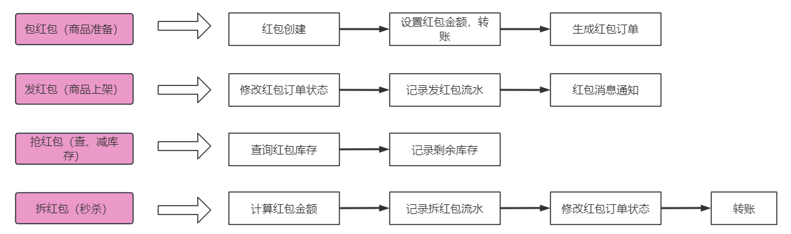
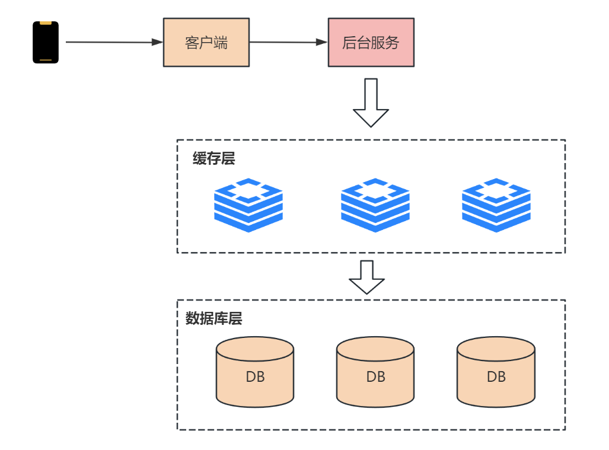
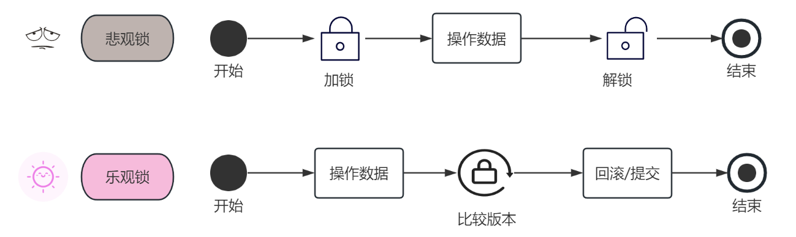
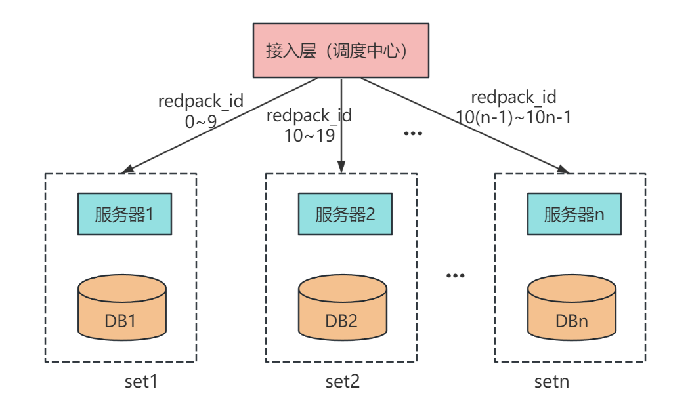

大家好，我是小❤，一个漂泊江湖多年的 985 非科班程序员，曾混迹于国企、互联网大厂和创业公司的后台开发攻城狮。

## 1. 引言

当我那天拿着手机，正在和朋友们的微信群里畅聊着八卦新闻和即将到来的周末计划时，忽然一条带着喜意的消息扑面而来，消息正中间赫然写着八个大字：**恭喜发财，大吉大利**。


抢红包！！相信大部分人对此都不陌生，自 2015 年春节以来，微信就新增了各类型抢红包功能，吸引了数以亿万级的用户参与体验，今天，我们就来聊一聊这个神奇的红包系统。


## 2. 概要设计

### 2.1 功能特点


抢红包系统从功能拆分，可以分为包红包、发红包、抢红包和拆红包 4 个功能。

对于系统特性来说，抢红包系统和秒杀系统类似。



每次发红包都是一次商品秒杀流程，包括商品准备，商品上架，查库存、减库存，以及秒杀开始，最终的用户转账就是红包到账的过程。


### 2.2 难点

相比秒杀活动，微信发红包系统的用户量更大，设计更加复杂，需要重视的点更多，包括以下几点。

#### 1、高并发

海量并发请求，秒杀只有一次活动，但红包可能同一时刻有几十万个秒杀活动。

比如 2017 鸡年除夕，微信红包抢红包用户数高达3.42亿，收发峰值 76 万/秒，发红包 37.77 亿个。


#### 2、安全性要求

红包业务涉及资金交易，所以一定不能出现超卖、少卖的情况：

* 超卖：发了 10 块钱，结果抢到了 11 块钱，多的钱只能系统补上，如此为爱发电应用估计早就下架了
* 少卖：发了 10 块钱，只抢了 9 块，多的钱得原封不动地退还用户，否则第二天就接到法院传单了


#### 3、严格事务

参与用户越多，并发 DB 请求越大，数据越容易出现事务问题，所以系统得做好事务一致性。

这也是一般秒杀活动的难点所在，而且抢红包系统涉及金钱交易，所以事务级别要求更高，不能出现脏数据。


## 3. 概要设计

### 3.1 功能说明

抢红包功能允许用户在群聊中发送任意个数和金额的红包，群成员可以抢到随机金额的红包，但要**保证每个用户的红包金额不小于 0.01 元**。


抢红包的详细交互流程如下：

1. 用户接收到抢红包通知，点击通知打开群聊页面
2. 用户点击抢红包，后台服务验证用户资格，确保用户尚未领取过此红包
3. 若用户资格验证通过，后台服务分配红包金额并存储领取记录
4. 用户在微信群中看到领取金额，红包状态更新为“已领取”
5. 异步调用支付接口，将红包金额更新到钱包里


### 3.2 数据库设计

红包表 `redpack` 的字段如下：

* **id：** 主键，红包ID
* **userId：** 发红包的用户ID
* **totalAmount：** 总金额
* **surplusAmount：** 剩余金额
* **total：** 红包总数
* **surplusTotal：** 剩余红包总数

该表用来记录用户发了多少红包，以及需要维护的剩余金额。


红包记录表 `redpack_record` 如下：

* **id：** 主键，记录ID
* **redpackId：** 红包ID，外键
* **userId：** 用户ID
* **amount：** 抢到的金额

记录表用来存放用户具体抢到的红包信息，也是红包表的副表。


### 3.3 发红包

1. 用户设置红包的总金额和个数后，在红包表中增加一条数据，开始发红包
2. 为了保证实时性和抢红包的效率，在 Redis 中增加一条记录，`存储红包 ID 和总人数 n`
3. 抢红包消息推送给所有群成员


### 3.4 抢红包

从 2015 年起，微信红包的抢红包和拆红包就分离了，用户点击抢红包后需要进行两次操作。

这也是为什么明明有时候抢到了红包，点开后却发现**该红包已经被领取完了**。


抢红包的交互步骤如下：

1. 抢红包：抢操作在 `Redis` 缓存层完成，**通过原子递减的操作来更新红包个数**，到 0 后就说明抢光了。
2. 拆红包：拆红包时，首先会实时计算金额，一般是通过**二倍均值法**实现（即 0.01 到剩余平均值的 2 倍之间）。
3. 红包记录：用户获取红包金额后，通过数据库的事务操作累加已经领取的个数和金额，并更新红包表和记录表。
4. 转账：为了提升效率，最终的**转账为异步操作**，这也是为什么在春节期间，红包领取后不能立即在余额中看到的原因。


## 4. 详细设计

由于是秒杀类设计，以及 money 分发，所以我们重点关注抢红包时的高并发解决方案和红包分配算法。


### 4.1 高并发解决方案

首先，抢红包系统的用户量很大，如果几千万甚至亿万用户同时在线发抢红包，请求直接打到数据库，必然会导致后端服务过载甚至崩溃。

而在这种业务量下，简单地对数据库进行扩容不仅会让成本消耗剧增，另一方面由于存在**磁盘的性能瓶颈**，所以大概率解决不了问题。

所以，我们将解决方案集中在 `减轻系统压力、提升响应速度` 上，接下来会从**缓存、加锁、异步分治**等方案来探讨可行性。


#### 1、缓存

和大多数秒杀系统设计相似，由于抢红包时并发很高，如果直接操作 DB 里的数据表，可能触发 DB 锁的逻辑，导致响应不及时。



所以，我们可以在 DB 落盘之前加一层缓存，先限制住流量，再处理红包订单的数据更新。

这样做的优点是用**缓存操作替代了磁盘操作，提升了并发性能**，这在一般的小型秒杀活动中非常有效！

但是，随着微信使用发&抢红包的用户量增多，系统压力增大，各种连锁反应产生后，数据一致性的问题逐渐暴露出来：

* 假设库存减少的内存操作成功，但是 DB 持久化失败了，会出现红包少发的问题；
* 如果库存操作失败，DB 持久化成功，又可能会出现红包超发的问题。

而且在几十万的并发下，直接对业务加锁也是不现实的，即便是乐观锁。


#### 2、加锁

在关系型 DB 里，有两种并发控制方法：分为**乐观锁**（又叫乐观并发控制，Optimistic Concurrency Control，缩写 “OCC”）和**悲观锁**（又叫悲观并发，Pessimistic Concurrency Control，缩写“PCC”）。



悲观锁在操作数据时比较悲观，认为别的事务可能会同时修改数据，所以每次操作数据时会**先把数据锁住，直到操作完成**。

乐观锁正好相反，这种策略主打一个“信任”的思想，认为事务之间的数据竞争很小，所以在操作数据时不会加锁，直到所有操作都完成到**提交时才去检查是否有事务更新**（通常是通过版本号来判断），如果没有则提交，否则进行回滚。

在高并发场景下，由于数据操作的请求很多，所以**乐观锁的吞吐量更大一些**。但是从业务来看，可能会带来一些额外的问题：

1. 抢红包时大量用户涌入，但**只有一个可以成功**，其它的都会失败并给用户报错，导致用户体验极差；
2. 抢红包时，如果第一时间有很多用户涌入，都失败回滚了。过一段时间并发减小后，反而**让手慢的用户抢到了红包**；
3. 大量无效的更新请求和事务回滚，可能**给 DB 造成额外的压力**，反而影响整体性能。

总的来说，乐观锁适用于数据竞争小，冲突较少的业务场景，而悲观锁也不适用于高并发场景的数据更新。因此对于抢红包系统来说，加锁是非常不适合的。


#### 3、异步分治

综上所述，抢红包时我们要不仅要解决高并发问题、还得考虑并发的**顺序性**，所以可以考虑从队列的角度来解决。

而每次包红包、发红包、抢红包时，也有先后依赖关系，因此我们可以将红包 ID 作为一个唯一 Key，将**发一次红包看作一个单独的 set，各个 set 相互独立处理**。



这样，我们就把海量的抢红包系统分成一个个的小型秒杀系统，在调度处理中，通过对红包 ID **哈希取模**，将一个个请求打到多台服务器上解耦处理。

然后，为了保证每个用户抢红包的先后顺序，我们把一个红包相关的操作**串行**起来，放到一个队列里面，依次消费。

从上述 set 分流我们可以看出，一台服务器可能会同时处理多个红包的操作，所以，为了保证消费者处理 DB 不被高并发打崩，我们还需要在消费队列时用**缓存来限制并发消费数量**。

抢红包业务消费时由于不存储数据，只是用缓存来控制并发。所以我们可以选用大数据量下性能更好的Memcached。

除此之外，在数据存储上，我们可以用红包 ID 进行**哈希分表**，用时间维度对 DB 进行**冷热分离**，以此来提升单 set 的处理性能。

综上所述，抢红包系统在解决高并发问题上采用了 `set 分治、串行化队列、双维度分库分表` 等方案，使得单组 DB 的并发性能得到了有效提升，在应对数亿级用户请求时取得了良好的效果。


### 4.2 红包分配算法

抢红包后，我们需要进行拆红包，接下来我们讨论一下红包系统的红包分配算法。

红包金额分配时，由于是随机分配，所以有两种实现方案：实时拆分和预先生成。


#### 1、实时拆分

实时拆分，指的是在**抢红包时实时计算**每个红包的金额，以实现红包的拆分过程。

这个对系统性能和拆分算法要求较高，例如拆分过程要一直保证后续待拆分红包的金额不能为空，不容易做到拆分的红包金额服从**正态分布**规律。


#### 2、预先生成

预先生成，指的是在红包**开抢之前**已经完成了红包的**金额拆分**，抢红包时只是依次取出拆分好的红包金额。

这种方式对拆分算法要求较低，可以拆分出随机性很好的红包金额，但通常需要结合队列使用。


#### 3、二倍均值法

综合上述优缺点考虑，以及微信群聊中的人数不多（目前最高 500 人），所以我们采用实时拆分的方式，用**二倍均值法**来生成随机红包，只满足随机即可，不需要正态分布。

> 故可能出现很大的红包差额，但这更刺激不是吗:dog:

使用二倍均值法生成的随机数，每次随机金额会在 `0.01 ~ 剩余平均值*2` 之间。

假设当前红包剩余金额为 10 元，剩余个数为 5，`10/5 = 2`，则当前用户可以抢到的红包金额为：`0.01 ~ 4` 元之间。


#### 4、算法优化

用二倍均值法生成的随机红包虽然接近平均值，但之前我在某论坛上看到过类似的说法：**微信红包金额的随机性和领取的时机有关系，尤其是金额不高的情况下**。

于是，小❤耗费巨资在微信群发了多个红包，得出了这样一个结论：如果发出的 `红包总额 = 红包数*0.01 + 0.01`，比如：发了 4 个红包，总额为 0.05，则最后一个人领取的红包金额一定是 `0.02`。


无一例外：


所以，红包金额算法大概率不是随机分配，而是在派发红包之前已经做了处理。比如在红包金额生成前，先生成一个不存在的红包，这个红包的总额为 `0.01 * 红包总数`。

而在红包金额分配的时候，会对每个红包的随机值基础上加上 `0.01`，以此来保证每个红包的最小值不为 0。

所以，假设用户发了总额为 0.04 的个数为 3 的红包时，需要先提取 `3*0.01` 到 "第四个" 不存在的红包里面，于是第一个人抢到的红包随机值是 `0 ~ (0.04-3*0.01)/3`。

由于担心红包超额，所以除数的商是向下取二位小数，`0 ~ (0.04-3*0.01)/3 ==> (0 ~ 0) = 0`，再加上之前提取的保底值 `0.01`，于是前两个抢到的红包金额都是 `0.01`。最后一个红包的金额为红包余额，即 `0.02`。


算法逻辑用 Go 语言实现如下：

``` go
import (
    "fmt"
    "math"
    "math/rand"
    "strconv"
)

type RedPack struct {
    SurplusAmount float64 // 剩余金额
    SurplusTotal int // 红包剩余个数
}

// 取两位小数
func remainTwoDecimal(num float64) float64 {
	numStr := strconv.FormatFloat(num, 'f', 2, 64)
	num, _ = strconv.ParseFloat(numStr, 64)
	return num
}

// 获取随机金额的红包
func getRandomRedPack(rp *RedPack) float64 {
	if rp.SurplusTotal <= 0 {
                // 该红包已经被抢完了
		return 0
	}

	if rp.SurplusTotal == 1 {
		return remainTwoDecimal(rp.SurplusAmount + 0.01)
	}

        // 向下取整
	avgAmount := math.Floor(100*(rp.SurplusAmount/float64(rp.SurplusTotal))) / float64(100)
	avgAmount = remainTwoDecimal(avgAmount)

        // 生成随机数种子
	rand.NewSource(time.Now().UnixNano())

	var max float64
	if avgAmount > 0 {
		max = 2*avgAmount - 0.01
	} else {
		max = 0
	}
	money := remainTwoDecimal(rand.Float64()*(max) + 0.01)

	rp.SurplusTotal -= 1
	rp.SurplusAmount = remainTwoDecimal(rp.SurplusAmount + 0.01 - money)

	return money
}

// 实现主函数
func main() {
	rp := &RedPack{
		SurplusAmount: 0.06,
		SurplusTotal:  5,
	}
	rp.SurplusAmount -= 0.01 * float64(rp.SurplusTotal)
	total := rp.SurplusTotal
	for i := 0; i < total; i++ {
		fmt.Println(getRandomRedPack(rp))
	}
}
```

打印结果：

> 0.01、0.01、0.01、0.01、0.02

符合预期！


## 5. 总结

微信群聊及抢红包等功能背后蕴藏着复杂的交互技术和精心设计的产品体验，通过这些核心组件、数据库表和详细的交互流程，让用户能够轻松参与并享受群聊系统带来的便利。

并且，添加了这些充满趣味的功能，也是微信用户众多的原因之一吧！

微信建群功能的系统设计不仅仅是一个技术壮丽的展示，更是数字社交的魔法之一。


由于篇幅有限，文章对系统高并发、高性能的设计，以及对海量数据的处理浅尝辄止，后续可能会出一个专栏来详细介绍，感兴趣的朋友可以关注一下。


如果你曾好奇这些社交应用是如何工作的，希望这篇文章帮助你更好地理解了微信建群功能的背后系统设计。

如果觉得文章有所启发或收获，不妨点赞、分享，让更多人了解这个有趣的领域吧！

我是小❤，我们下期再见！


参考资料：

阿里云（业务流程）：https://developer.aliyun.com/article/936484

知乎（主要是拆红包算法设计）：https://zhuanlan.zhihu.com/p/240309293

系列文章：http://www.52im.net/thread-2202-1-1.html、http://www.52im.net/thread-2548-1-1.html

产品经理：https://www.woshipm.com/pd/232838.html#toc-6

掘金（关注交互和锁）：https://juejin.cn/post/6925947709517987848