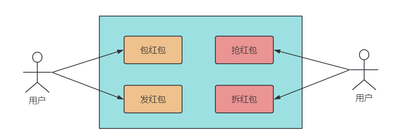
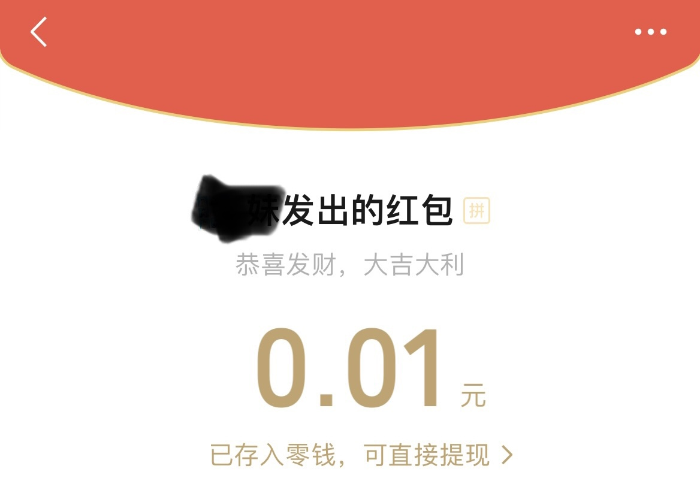

## 1. 引言

当我那天拿着手机，正在和朋友们的微信群里畅聊着八卦新闻和即将到来的周末计划时，忽然一条带着喜意的消息扑面而来，消息正中间写着八个大字：**恭喜发财，大吉大利**。


抢红包！！相信大部分人对此都不陌生，自 2015 年春节以来，微信就新增了各类型抢红包功能，吸引了数以亿万级的用户参与体验，今天，我们就来聊一聊这个神奇的红包系统。


## 2. 概要设计

### 2.1 功能特点



抢红包系统从功能拆分，可以分为包红包、发红包、抢红包和拆红包 4 个功能。

对于系统特性来说，抢红包系统和秒杀系统类似。


每次发红包都是一次商品秒杀流程，包括商品准备，商品上架，查库存、减库存，以及秒杀开始，最终的用户转账就是红包到账的过程。


### 2.2 难点

相比秒杀活动，微信发红包系统的用户量更大，设计更加复杂，需要重视的点更多，包括以下几点。

#### 1. 高并发

海量并发请求，秒杀只有一次活动，但红包可能同一时刻有几十万个秒杀活动。

比如 2017 鸡年除夕，微信红包抢红包用户数高达3.42亿，收发峰值 76 万/秒，发红包 37.77 亿个。


#### 2. 安全性要求

红包业务涉及资金交易，所以一定不能出现超卖、的情况。

* 超卖：发了 10 块钱，结果抢到了 11 块钱，多的钱只能系统补上，这样为爱发电 TX 估计早就倒闭了；
* 发了 10 块钱，只抢了 9 块，多的钱得原封不动地退还用户，不然用户第二天就跑完了。


#### 3. 严格事务

参与用户越多，并发 DB 请求越大，排队越容易出现事务问题，所以系统得做好事务一致性。

这也是一般的秒杀活动存在的问题，而且抢红包系统涉及金钱交易，所以事务级别要求更高，不能出现数据问题。


## 3. 详细设计

由于是秒杀类设计，以及 money 分发，所以我们重点关注抢红包时的高并发解决方案和红包分配算法。


### 3.1 高并发解决方案

首先，抢红包系统的用户量很大，如果几千万甚至亿万用户同时在线发抢红包，请求直接打到数据库，必然会导致后端服务过载甚至崩溃。

而在这种业务量下，简单地对数据库进行扩容不仅会让成本消耗剧增，另一方面磁盘的性能瓶颈大概率解决不了问题。

所以，我们将解决方案集中在减轻系统压力、提升响应速度上，分别用到缓存、异步、分治处理。


#### 缓存

和大多数秒杀系统设计相似，由于抢红包时并发很高，如果同时操作 DB 里的数据表，不仅可能触发 DB 锁的逻辑，导致响应不及时，还有一个问题是数据操作太慢。

内存减库存，异步落盘DB持久化；


http://www.52im.net/thread-2548-1-1.html


memcached：https://segmentfault.com/a/1190000023217491

方案：


在数百倍千倍的业务增长下，存储层很难简单无限扩容，一方面设备成倍增加的成本巨大，另一方面存储层瓶颈堆积不一定能解决问题。

主要思路是缩短关键业务流程，分离可以通过异步、缓存等方式解决的问题，减轻系统压力，加快响应速度，在存储层前面建上一座大坝。


红包set分治、异步、抢红包队列串行、memcached 缓存

由于Redis只使用单核，而Memcached可以使用多核，所以平均每一个核上Redis在存储小数据时比Memcached性能更高。而在100k以上的数据中，Memcached性能要高于Redis，虽然Redis也在存储大数据的性能上进行了优化，但是比起Memcached，还是稍有逊色。


1、内存减库存，异步落盘DB持久化；

2、乐观锁替代悲观锁：提高DB的并发处理能力。但是会从3个方面影响用户：1）并发时大量用户涌入，但只有一个成功，给用户报错，用户体验很差；2）第一时间抢红包的用户有部分直接失败，后面并发减小后，反而便宜了手慢的用户；3）大数量的无效更新请求、事务回滚，给DB造成不必要的额外压力。

3、最终，将红包出现、抢红包、拆红包、查询红包拆分成垂直 SET，都与红包 ID 关联，所以按一定规则（比如哈希取模）对一条链路的红包相关请求排队处理，切分后，各个SET相互独立，互相解耦，将巨大的流量请求分而治之。这个方案解决了同时存在海量事务级操作的问题，将海量化为小量。

3.1 将一个红包的秒杀操作串行起来，严格 FIFO，避免后抢先拿的问题；

3.2 从这个队列里消费数据，原子缓存操作，用 Redis 或者 memcahced 控制并发；

3.3 红包分库分表规则，初期是根据红包ID来哈希处理。随着数据量增大，单表量也逐渐增多，DB 性能大幅下降，影响性能稳定。后来，采用冷热分离，将历史冷数据和当前热数据分开存储，解决了这个问题。

3.4 具体来说，分库分表的规则为双维度分表。db_xxy_dd，其中 xxy 是红包ID哈希值的后三位，dd取值为 01-31，代表一个月最多 31 天。既解决了单表数据膨胀带来的性能下降问题，又让数据迁移变得简洁优雅。


## 6. 抢红包

抢红包功能允许用户在群聊中发送任意个数和金额的红包，群成员可以抢到随机金额的红包，但要**保证每个用户的红包金额不小于 0.01 元**。



抢红包的详细交互流程如下：

1. 用户接收到抢红包通知，点击通知打开群聊页面
2. 用户点击抢红包，后台服务验证用户资格，确保用户尚未领取过此红包
4. 若用户资格验证通过，后台服务分配红包金额并存储领取记录
5. 用户在微信群中看到领取金额，红包状态更新为“已领取”
5. 异步调用支付接口，将红包金额更新到钱包里

抢红包功能需要关注抢红包的数据库设计，抢红包实时性和红包分配算法。


### 6.1 数据库设计

红包表 `redpack` 的字段如下：

* **id：** 主键，红包ID
* **totalAmount：** 总金额
* **surplusAmount：** 剩余金额
* **total：** 红包总数
* **surplusTotal：** 剩余红包总数
* **userId：** 发红包的用户ID

该表用来记录用户发了多少红包，以及需要维护的剩余金额。


红包记录表 `redpack_record` 如下：

* **id：** 主键，记录ID
* **redpackId：** 红包ID，外键
* **userId：** 用户ID
* **amount：** 抢到的金额

记录表用来存放用户具体抢到的红包信息，也是红包表的副表。


### 6.2 实时性

#### 1、发红包

1. 用户设置红包的总金额和个数后，在红包表中增加一条数据，开始发红包
2. 为了保证实时性和抢红包的效率，在 Redis 中增加一条记录，`存储红包 ID 和总人数 n`
3. 抢红包消息推送给所有群成员


#### 2、抢红包

从 2015 年起，微信红包的抢红包和拆红包就分离了，用户点击抢红包后需要进行两次操作。这也是为什么明明有时候抢到了红包，点开后却发现**该红包已经被领取完了**。


抢红包的交互步骤如下：

1. 抢红包：抢操作在 `Redis` 缓存层完成，**通过原子递减的操作来更新红包个数**，到 0 后就说明抢光了。
2. 拆红包：拆红包时，首先会实时计算金额，一般是通过**二倍均值法**实现（即 0.01 到剩余平均值的 2 倍之间）。
3. 红包记录：用户获取红包金额后，通过数据库的事务操作累加已经领取的个数和金额，并更新红包表和记录表。
4. 转账：为了提升效率，最终的**转账为异步操作**，这也是为什么在春节期间，红包领取后不能立即在余额中看到的原因。


### 6.3 红包分配算法

红包金额分配时，由于是随机分配，所以有两种实现方案：实时拆分和预先生成。

#### 1、实时拆分

实时拆分，指的是在**抢红包时实时计算**每个红包的金额，以实现红包的拆分过程。

这个对系统性能和拆分算法要求较高，例如拆分过程要一直保证后续待拆分红包的金额不能为空，不容易做到拆分的红包金额服从**正态分布**规律。


#### 2、预先生成

预先生成，指的是在红包**开抢之前**已经完成了红包的**金额拆分**，抢红包时只是依次取出拆分好的红包金额。

这种方式对拆分算法要求较低，可以拆分出随机性很好的红包金额，但通常需要结合队列使用。


#### 3、二倍均值法

综合上述优缺点考虑，以及微信群聊中的人数不多（目前最高 500 人），所以我们采用实时拆分的方式，用**二倍均值法**来生成随机红包，只满足随机即可，不需要正态分布。

> 故可能出现很大的红包差额，但这更刺激不是吗:dog:

使用二倍均值法生成的随机数，每次随机金额会在 `0.01 ~ 剩余平均值*2` 之间。

假设当前红包剩余金额为 10 元，剩余个数为 5，`10/5 = 2`，则当前用户可以抢到的红包金额为：`0.01 ~ 4` 元之间。


#### 4、算法优化

用二倍均值法生成的随机红包虽然接近平均值，但之前我在某论坛上看到过类似的说法：**微信红包金额的随机性和领取的时机有关系，尤其是金额不高的情况下**。

于是，小❤耗费巨资在微信群发了多个红包，得出了这样一个结论：如果发出的 `红包总额 = 红包数*0.01 + 0.01`，比如：发了 4 个红包，总额为 0.05，则最后一个人领取的红包金额一定是 `0.02`。


无一例外：


所以，红包金额算法大概率不是随机分配，而是在派发红包之前已经做了处理。比如在红包金额生成前，先生成一个不存在的红包，这个红包的总额为 `0.01 * 红包总数`。

而在红包金额分配的时候，会对每个红包的随机值基础上加上 `0.01`，以此来保证每个红包的最小值不为 0。

所以，假设用户发了总额为 0.04 的个数为 3 的红包时，需要先提取 `3*0.01` 到 "第四个" 不存在的红包里面，于是第一个人抢到的红包随机值是 `0 ~ (0.04-3*0.01)/3`。

由于担心红包超额，所以除数的商是向下取二位小数，`0 ~ (0.04-3*0.01)/3 ==> (0 ~ 0) = 0`，再加上之前提取的保底值 `0.01`，于是前两个抢到的红包金额都是 `0.01`。最后一个红包的金额为红包余额，即 `0.02`。


算法逻辑用 Go 语言实现如下：

``` go
import (
    "fmt"
    "math"
    "math/rand"
    "strconv"
)

type RedPack struct {
    SurplusAmount float64 // 剩余金额
    SurplusTotal int // 红包剩余个数
}

// 取两位小数
func remainTwoDecimal(num float64) float64 {
	numStr := strconv.FormatFloat(num, 'f', 2, 64)
	num, _ = strconv.ParseFloat(numStr, 64)
	return num
}

// 获取随机金额的红包
func getRandomRedPack(rp *RedPack) float64 {
	if rp.SurplusTotal <= 0 {
                // 该红包已经被抢完了
		return 0
	}

	if rp.SurplusTotal == 1 {
		return remainTwoDecimal(rp.SurplusAmount + 0.01)
	}

        // 向下取整
	avgAmount := math.Floor(100*(rp.SurplusAmount/float64(rp.SurplusTotal))) / float64(100)
	avgAmount = remainTwoDecimal(avgAmount)

        // 生成随机数种子
	rand.NewSource(time.Now().UnixNano())

	var max float64
	if avgAmount > 0 {
		max = 2*avgAmount - 0.01
	} else {
		max = 0
	}
	money := remainTwoDecimal(rand.Float64()*(max) + 0.01)

	rp.SurplusTotal -= 1
	rp.SurplusAmount = remainTwoDecimal(rp.SurplusAmount + 0.01 - money)

	return money
}

func main() {
	rp := &RedPack{
		SurplusAmount: 0.06,
		SurplusTotal:  5,
	}
	rp.SurplusAmount -= 0.01 * float64(rp.SurplusTotal)
	total := rp.SurplusTotal
	for i := 0; i < total; i++ {
		fmt.Println(getRandomRedPack(rp))
	}
}
```

打印结果：

> 0.01、0.01、0.01、0.01、0.02

符合预期！


## 7. 总结

微信群聊及抢红包等功能背后蕴藏着复杂的交互技术和精心设计的产品体验，通过这些核心组件、数据库表和详细的交互流程，让用户能够轻松参与并享受群聊系统带来的便利。

并且，添加了这些充满趣味的功能，也是微信用户众多的原因之一吧！

微信建群功能的系统设计不仅仅是一个技术壮丽的展示，更是数字社交的魔法之一。


由于篇幅有限，文章对系统高并发、高性能的设计，以及对海量数据的处理浅尝辄止，后续可能会出一个专栏来详细介绍，感兴趣的朋友可以关注一下。


如果你曾好奇这些社交应用是如何工作的，希望这篇文章帮助你更好地理解了微信建群功能的背后系统设计。

如果觉得文章有所启发或收获，不妨点赞、分享，让更多人了解这个有趣的领域吧！

我是小❤，我们下期再见！


参考资料：

阿里云（业务流程）：https://developer.aliyun.com/article/936484

知乎（主要是拆红包算法设计）：https://zhuanlan.zhihu.com/p/240309293

系列文章：http://www.52im.net/thread-2202-1-1.html、http://www.52im.net/thread-2548-1-1.html

产品经理：https://www.woshipm.com/pd/232838.html#toc-6

掘金（关注交互和锁）：https://juejin.cn/post/6925947709517987848