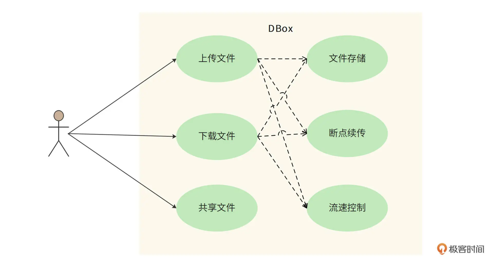
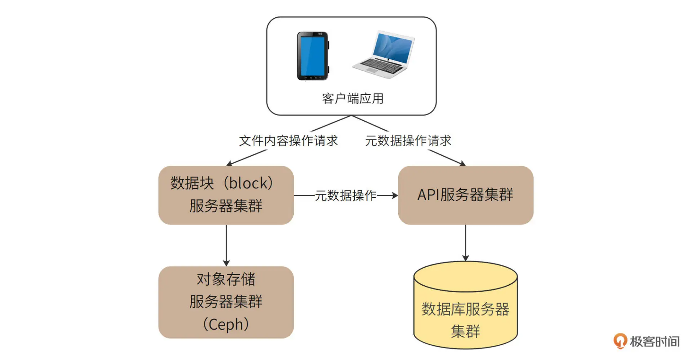
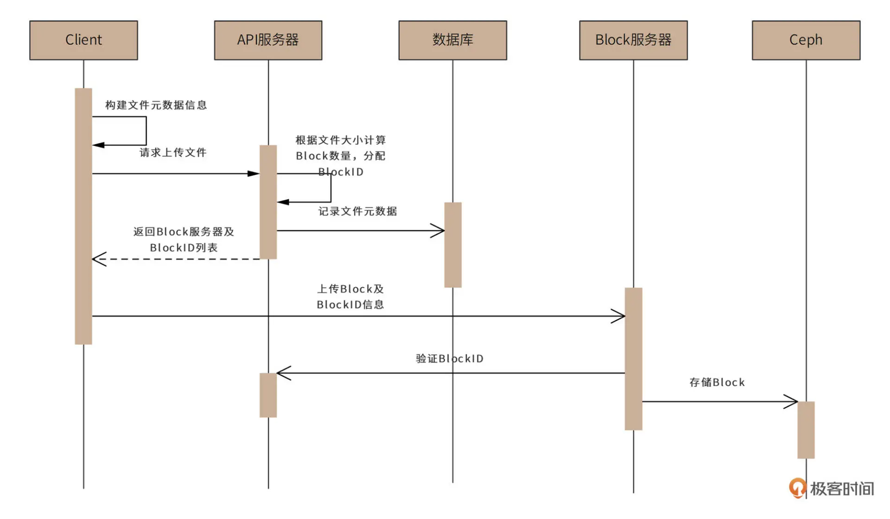
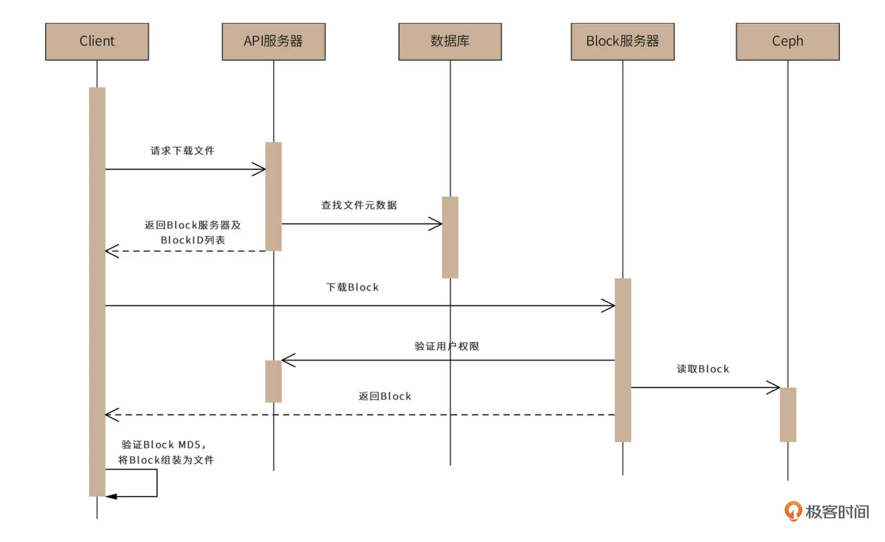
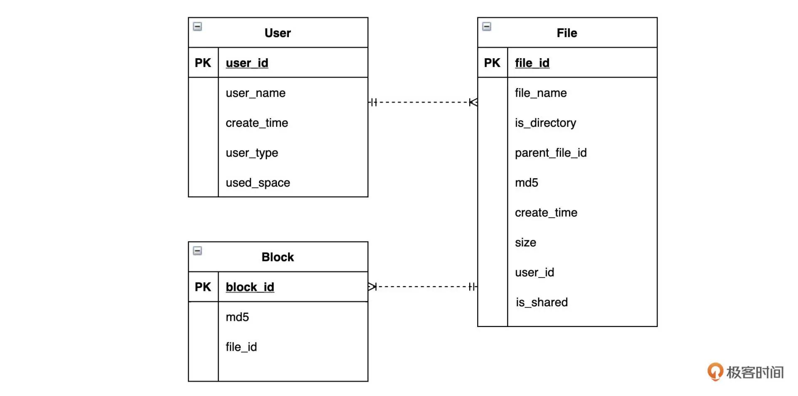
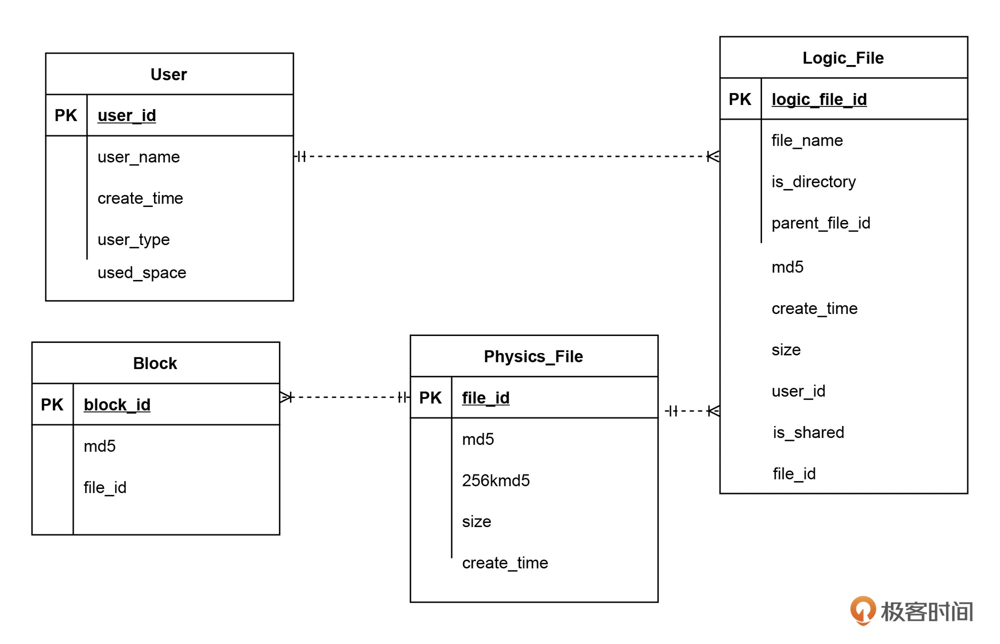

## 5. 网盘系统设计

### 5.1 网盘特点

**目前百度网盘 8 亿用户，存储量超过1000亿GB （2022.09）**

- **存储量大：**目标 10 亿用户，平均每个用户 100 GB，每个非会员用户免费存储空间为 1TB，所以存储空间使用率约为 10%（这里面包含了共享文件的压缩存储等等）。每个用户 100 个文件，1000 亿文件约 1 亿TB 空间；
- **吞吐量高：**每天日活 25%，约 2 亿用户，每个用户访问 4 次，所以 QPS 约为 1 万（2亿*4/(24*3600) ）。高峰期为平均 QPS 的两倍，即 2 万。
- **带宽负载高：**每次上传下载平均 1MB，所以网络带宽负载约 10GB/s，即 80Gb/s。同样，高峰期带宽约为 160Gb/s。

### 5.2 功能需求

1. 上传文件需保证文件存储，断点续传和流速控制；
2. 下载文件；
3. 共享文件（可以只保存文件的 ID）。

### 5.3 非功能需求

1. 海量数据存储：10 亿注册用户，约 25% 的活跃用户，1000 亿文件，约 1亿TB 空间；
2. 高并发访问：平均 1万QPS，高峰期 2 万QPS；
3. 大流量负载：平均网络带宽 80Gb/s，高峰期 160Gb/s；
4. 高可靠存储：文件不能丢失，持久存储的可靠性达到 6个9，即 100万个文件最多丢失或损坏 1 个文件；
5. 高可用服务：用户正常上传，下载功能可用性 4个9，即一年最多 53 分钟（365*24*60*0.0001）不可用；
6. 数据安全：文件需要加密存储，用户本人和共享文件除外，其余文件不能让其他人查看；
7. 不重复上传：相同文件内容不能重复上传，上传文件时通过 MD5 等方法进行判重，如果其他用户/当前用户已经上传过了，该文件就不用再上传了，既减少存储的消耗，又能实现“秒传”功能。

### 5.4 概要设计

网盘设计的关键是元数据与文件内容的分离存储和管理，其中：

- 元数据：包括文件所有者、文件属性、访问控制这些文件的基础信息，存储在关系型数据库里面；
- 文件内容：指文件的具体信息，比如图片、声音、视频等超过 256KB（根据业务判定）的数据，可以保存在对象存储服务里，比如 OBS、Ceph分布式对象存储服务器。

而对元数据和文件内容的访问管理，分成 API 服务器集群和数据块服务集群进行管理。架构图如下：

对于大文件，系统不会上传、存储一整个文件，而是将文件进行切分，变成一个个单独的 block 块，再进行存储。

这样做的核心原因是，首先对象存储服务（例如 OBS、Ceph）不适合存储大文件，需要进行拆分。而大文件拆分的好处还有，可以以 block 为单位进行上传下载，提高文件的传输速度。同时，如果客户端或者网络故障导致文件传输失败，也只需要重新传输失败的 block 即可，进而实现断点续传功能。

Block 服务器就是负责 block 数据块的上传和管理。客户端应用程序根据 API 服务器的返回指令，将文件切分成一些 block，然后将它们发送给 block 服务器，再存入对象存储服务器。

##### 1. 用户上传时序图如下：

这里，对象存储服务器验证 blockID，除此之外，还可以用 token 的形式，API 服务器存储好元数据以后把 token 返回给客户端，客户端再拿着 token 来调用对象存储服务器，避免服务间的调用加快通信。

##### 2. 用户下载时序图

客户端访问 API 服务器，请求下载文件。然后 API 服务器获取文件元数据信息，再将文件 blockID 列表及可访问的 block 服务器列表返回给客户端。

### 5.5 详细设计

为解决网盘的三个重要问题：

- 元数据如何管理
- 网络资源如何向付费用户倾斜
- 如何做到不重复上传

系统设计将关注：

- 元数据库实现
- 上传下载限速
- 秒传的设计实现

##### 1. 元数据库实现

- 用户表：记录用户关键信息，ID，名称，时间，电话，**已用空间，用户类型（VIP、平民）**等；
- 文件表：ID，名称，创建时间，文件大小，所属用户，**是否为共享文件，是否为文件夹，父文件夹，文件 MD5** 等；
- block数据块表：ID，block MD5，文件 ID 等。

##### 2. 上传下载限速

根据用户类型，如果是 VIP 用户可以通过**限制 Block 服务器的数目、开启线程数来控制**。具体过程：客户端程序访问 API 服务器后，根据用户类型返回 block 服务器数目和线程数，以及每个线程的上传、下载速率。

##### 3. 秒传功能

MD5 计算文件内容，但是会有 Hash 冲突，于是通过计算文件长度、文件开头 256KB 的 MD5 值和文件本身的 MD5 值都相同时，才会认为文件相同。当文件相同时，实现秒传，即物理表有数据，就不用上传数据 block 了。

为此，将 file 表分为 Logic_file 和 Physics_file 表

- 逻辑表：之前的文件数据和 is_shared 等
- 物理表：md5，size，256kmd5 等