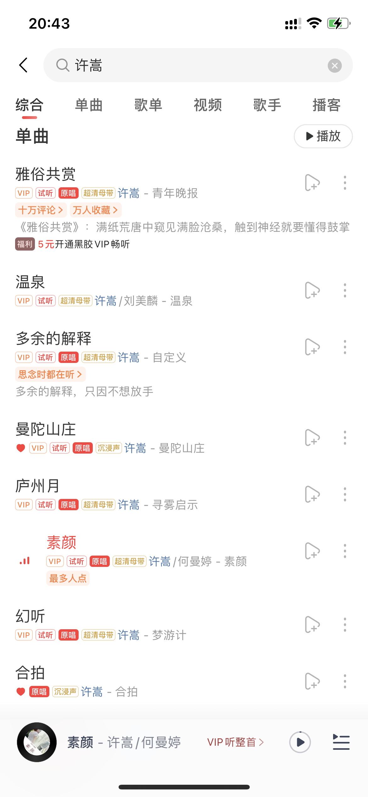
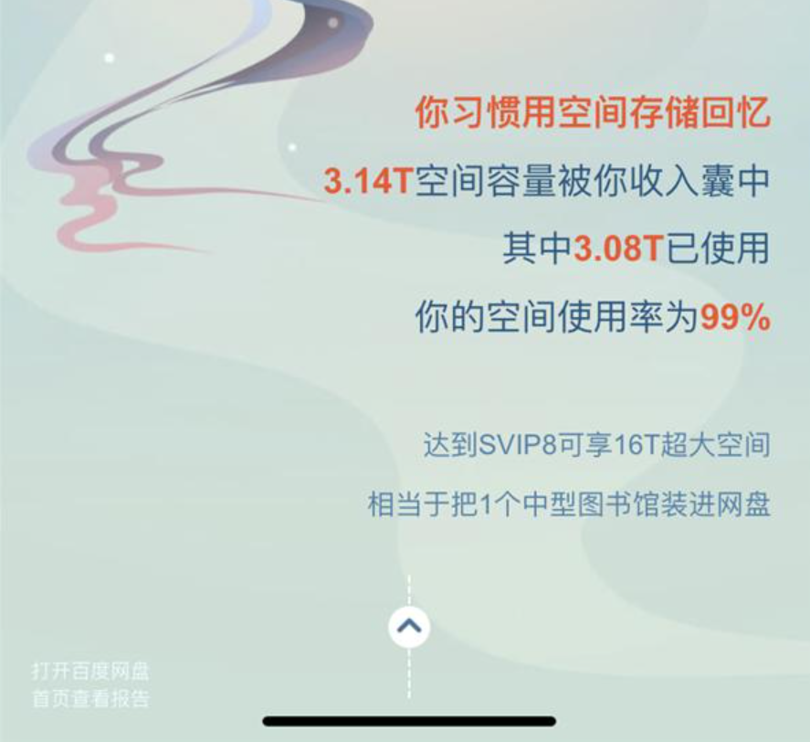
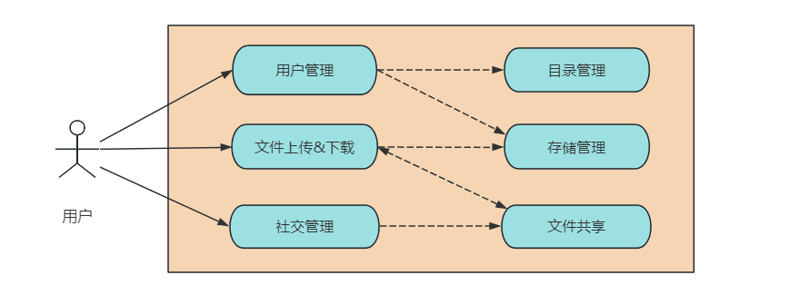
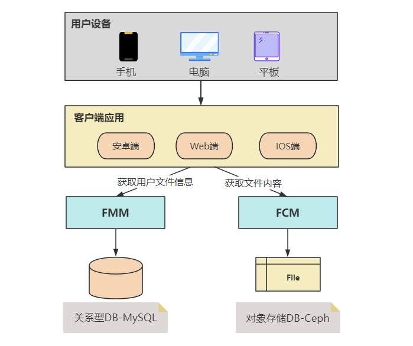
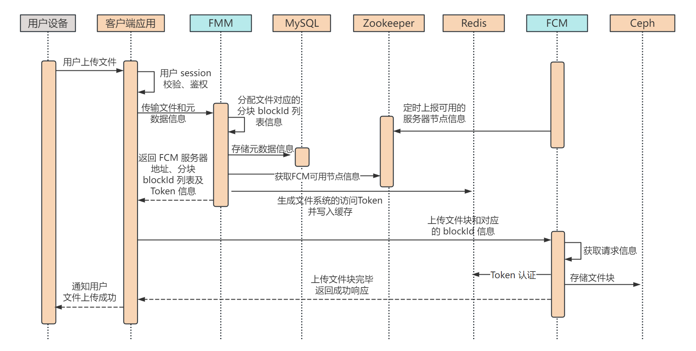
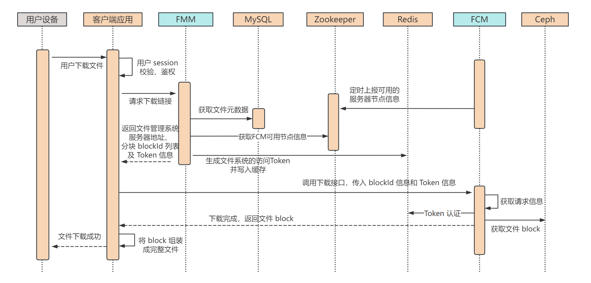

# 1. 引言

## 1.1 青春的旋律

大家好，我是小❤，一个漂泊江湖多年的 985 非科班程序员，曾混迹于国企、互联网大厂和创业公司的后台开发攻城狮。

小❤最近发现，以前初高中时代喜欢的很多歌手，各大平台的歌曲都开始收费了。

比如以前最喜欢的音乐才子 VAE，无论是江南夜色下的小桥屋檐，还是烟火绝、客怎眠的关外野店，亦或是紫烟留香、翩若绝影的惊鸿一面。

都会在某个午睡后的黄昏，或大雨后的清晨里突然萦绕脑海，久久无法散去。



不知道是怀念曾经一起听歌的人，还是怀念那些青春的回忆。

你呢？有曾经一起听歌的人吗~


## 1.2 网盘的妙用

无论怀念与否，歌还是要听的，会员却是不可能充的。

于是，机智（pinqiong）的我开始在各大平台寻找免费的歌曲。不得不说，互联网真是一个伟大的发明，只要通电上网，就没有找不到的资源。

> PS：有和我一样喜欢 vae 的，文末可从网盘里获取免费的歌曲资源，自取。

而今天的主角就是它——网盘。

相信大家都用过网盘，从存储照片到分享工作文档，它已经成为了我们生活中不可或缺的一部分。

但你是否好奇过，背后是怎么样的系统设计在支撑着这些功能？今天，我们就来揭秘一下，网盘系统的架构设计。


迅雷云盘：

> 链接：https://pan.xunlei.com/s/VNemdXjiXzTPblfHExa4Ys2GA1#
> 提取码：9i5p
> 复制这段内容后打开手机迅雷App，查看更方便


# 2. 网盘系统

百度网盘是一个备受欢迎的云存储和文件分享平台，拥有 8 亿多用户和高达 1000亿GB 的存储容量。

在这篇文章中，我们将深入探讨百度网盘系统的核心功能，以及如何应对高并发和海量存储可能引发的挑战。

## 2.1 架构概述

百度网盘的系统设计采用分布式架构，以应对用户庞大的数量和海量的存储需求。核心组件包括：

1. **网关层**：用于接收和分发用户请求，负载均衡至后端服务。
2. **应用微服务**：处理核心业务逻辑，如文件上传、下载、分享等。
3. **存储系统**：用于持久化存储用户的文件和元数据。
4. **缓存层**：提高读取性能，减轻数据库负载。
5. **分布式文件系统**：用于存储大文件，可扩展性好。


## 2.2 亿万级用户的挑战

对于像网盘这样的存储系统，每天都有大量的数据产生和传输。

以百度网盘为例，在 2022 年底用户就已经突破了 8 亿，存储量更是早已超过了 10 万 PB（即 1000 亿 GB）。

所以，设计一个网盘系统有如下挑战。

### 存储量大



百度网盘目前有 8 亿多用户，普通用户最大存储量为 1 TB，存储量就按 1000 亿 GB 来算，每个用户差不多 100+GB【1000GB/8】的存储量，存储空间的平均使用率为 10%。


### 吞吐量高

以百度网盘每天日活量为 2 亿，日活用户占比约 25%，每个用户平均访问 4 次网盘。

所以网盘系统的 QPS 约为 1 万【2亿用户\*4次/(24*3600秒) 】，高峰期为平均 QPS 的两倍，即 2 万。


### 网络带宽


假设用户每次上次下载的文件平均大小为 2MB，网络带宽负载约为 18GB/s【2亿\*4*2M/(24\*3600\*1024G)】，即 144Gb/s。高峰流量带宽约为平均的 2 倍，约为 288Gb/s。


## 2.3 用例设计



通用的功能有以下几点：

1. 支持用户注册登录，开通 VIP，注销账户；
2. 上传文件，下载文件；
3. 添加好友，好友之间可进行文件共享；
4. 新增存储目录；
5. 对文件数据删除，或重命名；
6. 允许向好友发送文件，或对陌生人进行链接共享。


## 2.4 性能测算

当前设计的网盘系统需要有以下要求：

1. 海量数据存储：8 亿注册用户，约 25% 的活跃用户，1 亿 TB 空间；
2. 高并发访问：平均 1万QPS，高峰期 2 万QPS；
3. 大流量负载：平均网络带宽 144Gb/s，高峰期 280Gb/s；
4. 高可靠存储：文件不能丢失，持久存储的可靠性达到 6 个 9，即 100 万个文件最多丢失或损坏 1 个文件；
5. 高可用服务：用户正常上传，下载功能可用性 4个9，即一年最多 53 分钟（365\*24\*60\*0.0001）不可用；
6. 数据安全：文件需要加密存储，用户本人和共享文件除外，其余文件不能让其他人查看。


# 3. 核心功能

## 3.1 文件上传和下载

#### 文件上传

用户通过网盘客户端或网页界面上传文件。上传请求经过网关层后，进入应用微服务处理。为了应对高并发，上传请求可异步处理，文件切片上传可确保大文件上传的可靠性。


#### 文件下载

用户请求下载文件时，网关层将请求路由到应用微服务。为了提高下载速度，百度网盘可采用分布式存储和 CDN 加速。


## 3.2 文件共享

#### 好友分享

用户可以分享文件或文件夹给好友，分享时可以指定好友只读、或者存储权限，并且可指定文件共享的时间期限。

* 只读权限：好友在收到只读分享权限时，只能查看文件或文件夹的内容，不能保存、修改或删除文件。
* 存储权限：好友收到存储权限的文件分享后，可以选择在期限内将文件转存到自己的存储空间，并且可以再次将文件分享出去。


#### 链接分享

用户可以将文件或文件夹通过链接分享出去，通过**链接分享的权限默认为存储权限**，分享范围可以设定为公开、私密或者仅限特定用户访问。

* 公开范围：任何人都可以访问该文件或文件夹，可以转存文件到自己的存储空间；
* 私密范围：生成链接方便打开文件，只有用户自己可以访问；
* 特定用户范围：允许用户的好友或者指定分享给某人，当其它人打开链接时显示无权限访问。


# 4. 详细设计

## 4.1 文件存储和元数据管理

### 分离存储

由于 MySQL 这类关系型数据库不适合存储大数据文件，而像 HDFS、Ceph 这类文件系统在数据查询时又非常缓慢。

所以我们将文件数据分为元数据和文件内容，将它们分开进行存储，其中：

* 元数据：包括文件所有者、文件权限、文件类型、分享信息等基础信息，存储在关系型数据库 MySQL 里面。
* 文件内容：将文件的具体信息，比如图片、音频、视频等超过 256KB（根据业务判定）的数据，保存在对象存储服务里，比如 Ceph 分布式对象存储服务器。

而负责响应元数据和文件内容的请求，也分成文件元数据管理系统（File Metadata Management，简称 FMM）和文件内容管理系统（File Content Management，简称 FCM）两个系统。

架构图如下：



由于用户文件可能包括视频、音频等大文件，但是 Ceph 不适合存储过大文件，所以我们对上传文件内容进行拆分，把大文件分成很多个小块（block），以便更好地上传下载大文件。

这样做还有一个好处，当大文件分块上传下载时，可以并发处理这些文件块，然后在 SDK 端进行文件组装，加快文件的传输速度。并且，当用户网络断连以后，我们只需要重传剩余的文件块即可，实现断点续传功能。


### 文件上传

文件上传的时序图如下：



用户上传文件后，元数据管理系统（FMM）根据用户上传的文件大小，将文件分成一个个 block。并生成一个访问 Token，结合 blockId 列表以及可用的 FMM 服务器列表一起返回给客户端。

当客户端收到 FMM 的响应时，会带着 Token 以及文件块信息，并发传入 FMM 的各节点，将真实的文件 block 存到对象存储系统 Ceph 中。

这里，Token 主要用作鉴权认证用，当客户端带着 blockId 列表到 FCM 时，为了保证 blockId 来自 FMM 而非用户伪造，一般 FCM 需要再调用一次 FMM 做用户鉴权。

但是此处我们为了整体的架构简洁性考虑，用缓存 Token 的方式来替代内部 API 的调用，一方面减少了系统的交互，另一方面提升了整体的响应速度。


### 文件下载

文件下载的时序图如下：



当用户下载文件时，客户端传入文件名、用户等信息，以获取 FMM 获取文件的元数据。然后 FMM 服务器从 MySQL 中查询对应用户的文件 blockId 列表，分别从 ZK 获取可访问的 FMM 服务器列表、从 Redis 生成访问 Token，然后返回给客户端。

由客户端根据 FCM 的服务器列表和响应的 blockId 列表信息，并发调用 FCM 服务器下载文件 block，最终将文件 block 组装成一个完整的文件，返回给用户设备。


### 表设计

1. **User 表**：记录用户关键信息，ID，用户名，手机号，已用空间，用户类型（VIP、平民）等；
2. **File 表**：记录文件元数据信息，存储文件的树形结构，包括文件 ID，名称，所属用户，父文件 ID，子文件个数，创建时间，文件大小等；
3. **File_block 表**：记录文件块的具体信息，ID，文件 ID，block MD5 等。


### 上传下载限速

在设计网盘时，考虑到系统的带宽费用，可以对非会员的普通用户进行限速。

具体实现为：当客户端请求 FMM 系统进行上传或下载任务时，我们先获取用户的用户类型，如果是平民用户，我们在返回客户端可用的 FCM 节点列表时，可将服务器数量适当降低。

比如，VIP 用户可以享受 50 台服务器同时上传下载，而普通用户只分配 5 台服务器来进行上传下载文件。


## 4.2 文件共享

### RBAC 权限控制

由于网盘的文件共享是可以实时修改状态的，所以我们采用 RBAC（*Role-Based Access Control*，基于角色的权限访问控制）的思想来控制用户访问文件的权限。

权限相关的表设计如下：

1. **User 表**：存储系统用户的信息，同上，包括用户ID、用户名等。
2. **Role 表**：定义系统中的角色，每个角色包括角色 ID、角色名称等。常见的角色有超管、普通用户、好友、只读用户、公开用户等。
3. **UserRole 表**：建立用户和角色之间的关联，记录哪些用户拥有哪些角色，包括用户 ID 和角色 ID。
4. **File 表**：表示系统中的文件元数据信息，同上，包括文件 ID、文件名称等。
5. **Permission 表**：定义角色对资源的权限，包括权限ID、角色ID、文件ID，过期时间等。

通过 RBAC 的机制，我们可以轻松管理用户对资源的权限，根据角色分配权限，并在需要时回收权限。这种设计允许灵活的权限控制，同时确保系统的安全性和可维护性。


### 给好友分享文件

#### 权限赋予

有了 RBAC 来进行权限控制，我们注册账号并上传文件，给好友分享的流程如下：

1. **用户注册和登录**：

- - 用户通过注册功能创建帐户，其信息存储在 User 表中。
  - 为用户分配角色，将相关记录插入到 UserRole 表中，初始为普通用户角色，可上传、下载、分享和管理自己的文件。

2. **创建和共享文件**：

- - 用户可以创建文件或文件夹，这些资源的信息存储在 File 表中。
  - 当用户希望共享文件时，可以选择指定共享对象（其他用户或好友）。

3. **权限分配**：

- - 管理员或资源所有者可以将权限授予特定的角色，将记录插入到 Permission 表中。例如，"文件所有者"角色可以有完全访问权限，而"好友"角色可以具有转存权限和继续分享权限，"只读" 角色只具有访问权限。

4. **文件访问**：

- - 当用户尝试访问文件时，系统会检查用户的角色和与文件相关的权限。
  - 如果用户的角色具有文件的特定权限（例如，读取或写入权限），则允许用户访问文件。


#### 权限回收

当资源所有者或管理员决定回收某个用户或角色对资源的权限时，系统会删除相关的权限记录。

这将导致用户或角色无法再访问受影响的资源。


### 链接分享

整体流程和好友共享类似，唯一不同在于将记录插入到 Permission 表时，可以将文件的权限设置为公开访问，默认可访问、可转存，并设置具体的过期时间。

文件系统可以开启定时任务，定期清理已经过期的权限，确保文件只能在有效期内被用户访问。

> 若设置链接为无限期访问，则可以设置过期时间为过去的某个时间点。

``` mysql
insert into permission (file_id, role_id, expire_time) values ('共享文件的ID', '公开角色的ID', '2020-10-10')
```

这样，当用户在访问该文件时，判断出该文件的权限为公开访问，就可以访问或转存共享文件了。

