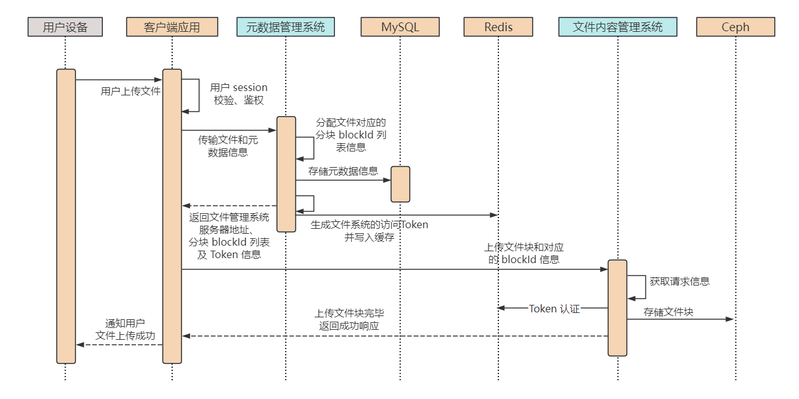

# 1. 引言

## 1.1 青春的旋律

大家好，我是小❤，一个漂泊江湖多年的 985 非科班程序员，曾混迹于国企、互联网大厂和创业公司的后台开发攻城狮。

小❤最近发现，以前初高中时代喜欢的很多歌手，各大平台的歌曲都开始收费了。

比如以前最喜欢的音乐才子 VAE，无论是江南夜色下的小桥屋檐，还是烟火绝、客怎眠的关外野店，亦或是紫烟留香、翩若绝影的惊鸿一面。

都会在某个午睡后的黄昏，或大雨后的清晨里突然萦绕脑海，久久无法散去。

不知道是怀念曾经一起听歌的人，还是怀念那些青春的回忆。

你呢？有曾经一起听歌的人吗~

## 1.2 网盘的妙用

无论怀念与否，歌还是要听的，会员却是不可能充的。

于是，机智（pinqiong）的我开始在各大平台寻找免费的歌曲。不得不说，互联网真是一个伟大的发明，只要通电上网，就没有找不到的资源。

> PS：有和我一样喜欢 vae 的，文末可从网盘里获取免费的歌曲资源，自取。

而今天的主角就是它——网盘。

相信大家都用过网盘，从存储照片到分享工作文档，它已经成为了我们生活中不可或缺的一部分。

但你是否好奇过，背后是怎么样的系统设计在支撑着这些功能？今天，我们就来揭秘一下，网盘系统的架构设计。

迅雷云盘：

> 链接：https://pan.xunlei.com/s/VNemdXjiXzTPblfHExa4Ys2GA1#
> 提取码：9i5p
> 复制这段内容后打开手机迅雷App，查看更方便

# 2. 网盘系统

百度网盘是一个备受欢迎的云存储和文件分享平台，拥有 8 亿多用户和高达 1000亿GB 的存储容量。

在这篇文章中，我们将深入探讨百度网盘系统的核心功能，以及如何应对高并发和海量存储可能引发的挑战。

## 2.1 架构概述

百度网盘的系统设计采用分布式架构，以应对用户庞大的数量和海量的存储需求。核心组件包括：

1. **网关层**：用于接收和分发用户请求，负载均衡至后端服务。
2. **应用微服务**：处理核心业务逻辑，如文件上传、下载、分享等。
3. **存储系统**：用于持久化存储用户的文件和元数据。
4. **缓存层**：提高读取性能，减轻数据库负载。
5. **分布式文件系统**：用于存储大文件，可扩展性好。

## 2.2 亿万级用户的挑战

对于像网盘这样的存储系统，每天都有大量的数据产生和传输。

以百度网盘为例，在 2022 年底用户就已经突破了 8 亿，存储量更是早已超过了 10 万 PB（即 1000 亿 GB）。

所以，设计一个网盘系统有如下挑战。

### 存储量大

百度网盘目前有 8 亿多用户，普通用户最大存储量为 1 TB，存储量就按 1000 亿 GB 来算，每个用户差不多 100+GB【1000GB/8】的存储量，存储空间的平均使用率为 10%。

### 吞吐量高

以百度网盘每天日活量为 2 亿，日活用户占比约 25%，每个用户平均访问 4 次网盘。

所以网盘系统的 QPS 约为 1 万【2亿用户\*4次/(24*3600秒) 】，高峰期为平均 QPS 的两倍，即 2 万。

### 网络带宽

假设用户每次上次下载的文件平均大小为 2MB，网络带宽负载约为 18GB/s【2亿\*4*2M/(24\*3600\*1024G)】，即 144Gb/s。高峰流量带宽约为平均的 2 倍，约为 288Gb/s。

## 2.3 用例设计

通用的功能有以下几点：

1. 支持用户注册登录，开通 VIP，注销账户；
2. 上传文件，下载文件；
3. 添加好友，好友之间可进行文件共享；
4. 新增存储目录；
5. 对文件数据删除，或重命名；
6. 允许向好友发送文件，或对陌生人进行链接共享。

## 2.4 性能测算

当前设计的网盘系统需要有以下要求：

1. 海量数据存储：8 亿注册用户，约 25% 的活跃用户，1 亿 TB 空间；
2. 高并发访问：平均 1万QPS，高峰期 2 万QPS；
3. 大流量负载：平均网络带宽 144Gb/s，高峰期 280Gb/s；
4. 高可靠存储：文件不能丢失，持久存储的可靠性达到 6 个 9，即 100 万个文件最多丢失或损坏 1 个文件；
5. 高可用服务：用户正常上传，下载功能可用性 4个9，即一年最多 53 分钟（365\*24\*60\*0.0001）不可用；
6. 数据安全：文件需要加密存储，用户本人和共享文件除外，其余文件不能让其他人查看。

# 3. 核心功能

## 3.1 文件上传和下载

#### 文件上传

用户通过网盘客户端或网页界面上传文件。上传请求经过网关层后，进入应用微服务处理。为了应对高并发，上传请求可异步处理，文件切片上传可确保大文件上传的可靠性。

#### 文件下载

用户请求下载文件时，网关层将请求路由到应用微服务。为了提高下载速度，百度网盘可采用分布式存储和 CDN 加速。

## 3.2 文件共享

#### 好友分享

用户可以分享文件或文件夹给好友，分享时可以指定好友只读、或者存储权限，并且可指定文件共享的时间期限。

* 只读权限：好友在收到只读分享权限时，只能查看文件或文件夹的内容，不能保存、修改或删除文件。
* 存储权限：好友收到存储权限的文件分享后，可以选择在期限内将文件转存到自己的存储空间，并且可以再次将文件分享出去。

#### 链接分享

用户可以将文件或文件夹通过链接分享出去，通过**链接分享的权限默认为存储权限**，分享范围可以设定为公开、私密或者仅限特定用户访问。

* 公开范围：任何人都可以访问该文件或文件夹，可以转存文件到自己的存储空间；
* 私密范围：生成链接方便打开文件，只有用户自己可以访问；
* 特定用户范围：允许用户的好友或者指定分享给某人，当其它人打开链接时显示无权限访问。

# 4. 详细设计

## 4.1 文件存储和元数据管理

### 分离存储

由于 MySQL 这类关系型数据库不适合存储大数据文件，而像 HDFS、Ceph 这类文件系统在数据查询时又非常缓慢。

所以我们将文件数据分为元数据和文件内容，将它们分开进行存储，其中：

* 元数据：包括文件所有者、文件权限、文件类型、分享信息等基础信息，存储在关系型数据库 MySQL 里面。
* 文件内容：将文件的具体信息，比如图片、音频、视频等超过 256KB（根据业务判定）的数据，保存在对象存储服务里，比如 Ceph 分布式对象存储服务器。

而负责响应元数据和文件内容的请求，也分成文件元数据管理系统（File Metadata Management，简称 FMM）和文件内容管理系统（File Content Management，简称 FCM）两个系统。

架构图如下：

由于用户文件可能包括视频、音频等大文件，但是 Ceph 不适合存储过大文件，所以我们对上传文件内容进行拆分，把大文件分成很多个小块（block），以便更好地上传下载大文件。

这样做还有一个好处，当大文件分块上传下载时，可以并发处理这些文件块，然后在 SDK 端进行文件组装，加快文件的传输速度。并且，当用户网络断连以后，我们只需要重传剩余的文件块即可，实现断点续传功能。

### 文件上传

文件上传的时序图如下：

用户上传文件后，元数据管理系统根据用户上传的文件大小，将文件分成一个个 block。并生成一个访问 Token，和 blockId 列表一起返回给客户端。

当客户端收到元数据管理系统的响应时，

Block 服务器就是负责 block 数据块的上传和管理。客户端应用程序根据 API 服务器的返回指令，将文件切分成一些 block，然后将它们发送给 block 服务器，再存入对象存储服务器。

##### 1. 用户上传时序图如下：

这里，对象存储服务器验证 blockID，除此之外，还可以用 token 的形式，API 服务器存储好元数据以后把 token 返回给客户端，客户端再拿着 token 来调用对象存储服务器，避免服务间的调用加快通信。

##### 2. 用户下载时序图

客户端访问 API 服务器，请求下载文件。然后 API 服务器获取文件元数据信息，再将文件 blockID 列表及可访问的 block 服务器列表返回给客户端。

### 5.5 详细设计

为解决网盘的三个重要问题：

- 元数据如何管理
- 网络资源如何向付费用户倾斜
- 如何做到不重复上传

系统设计将关注：

- 元数据库实现
- 上传下载限速
- 秒传的设计实现

##### 1. 元数据库实现

- 用户表：记录用户关键信息，ID，名称，时间，电话，**已用空间，用户类型（VIP、平民）**等；
- 文件表：ID，名称，创建时间，文件大小，所属用户，**是否为共享文件，是否为文件夹，父文件夹，文件 MD5** 等；
- block数据块表：ID，block MD5，文件 ID 等。

##### 2. 上传下载限速

根据用户类型，如果是 VIP 用户可以通过**限制 Block 服务器的数目、开启线程数来控制**。具体过程：客户端程序访问 API 服务器后，根据用户类型返回 block 服务器数目和线程数，以及每个线程的上传、下载速率。

##### 3. 秒传功能

MD5 计算文件内容，但是会有 Hash 冲突，于是通过计算文件长度、文件开头 256KB 的 MD5 值和文件本身的 MD5 值都相同时，才会认为文件相同。当文件相同时，实现秒传，即物理表有数据，就不用上传数据 block 了。

为此，将 file 表分为 Logic_file 和 Physics_file 表

- 逻辑表：之前的文件数据和 is_shared 等
- 物理表：md5，size，256kmd5 等

