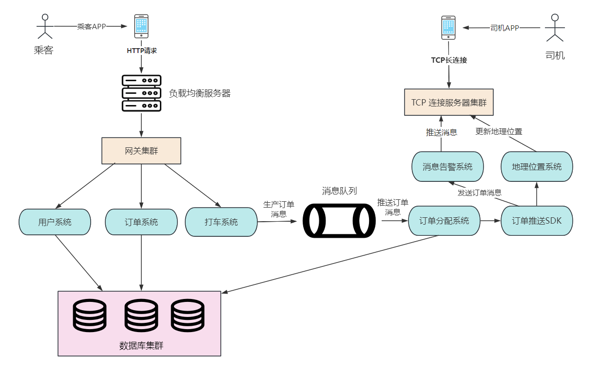
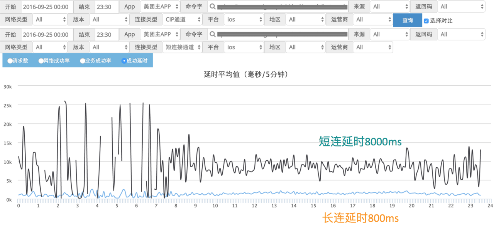
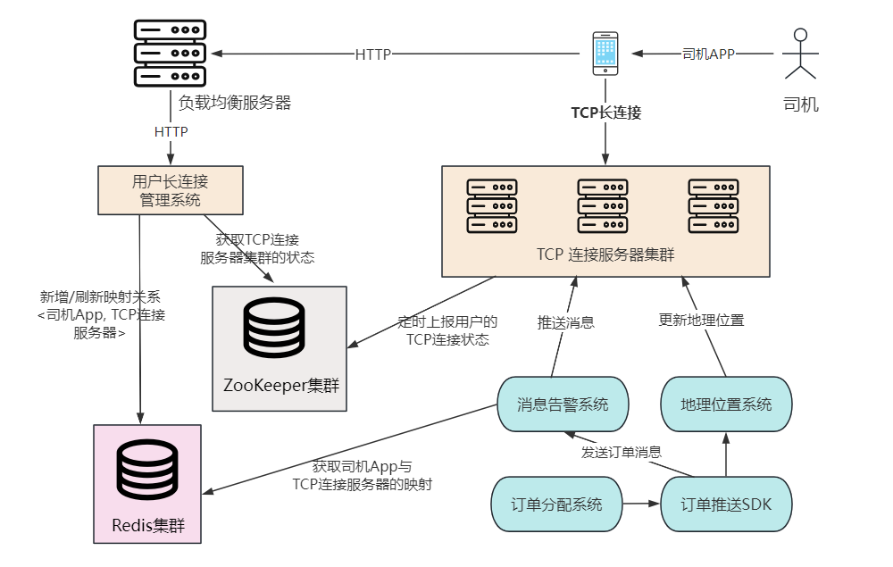
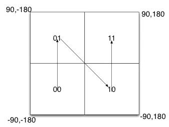

**目录**

> 1. 引言
> 2. 网约车系统
>    1. 需求设计
>    2. 概要设计
>    3. 详细设计
>    4. 体验优化
> 3. 小结

# 1.引言

## 1.1 台风来袭

深圳上周受台风“苏拉”影响，从 9 月 1 日 12 时起在全市启动防台风和防汛一级应急响应。

对深圳打工人的具体影响为，当日从下午 4 点起全市实行 “五停”：停工、停业、停市，当日已经停课、晚上 7 点后停运。

由于下午 4 点停市，于是大部分公司都早早下班。其中有赶点下班的，像这样：

有提前下班的，像这样：

还有像我们这样要居家远程办公的：

## 1.2 崩溃打车

下午 4 点左右，公交和地铁都人满为患。

于是快下班（居家办公）的时候就想着打个车回家，然而打开滴滴之后：

排队人数一百多，这个排队人数和时长，让我的心一下就拔凉拔凉的。

根据历史经验，在雨天打上车的应答时间得往后推半个小时左右。更何况，这还是台风天气！

滴滴啊滴滴，你就不能提前准备一下嘛，这个等待时长，会让你损失很多订单分成的。

但反过来想，这种紧急预警，也不能完全怪打车平台，毕竟，车辆调度也是需要一定时间的。在这种大家争相逃命（bushi 的时候，周围的车辆估计也不太够用。

### 卷起来

等着也是等着，于是就回到公司继续看技术文章。这时我突然想到，经过这次车辆紧急调度之后，如果我是滴滴的开发工程师，需要怎么处理这种情况呢？

如果滴滴的面试官在我眼前，他又会怎么考量候选人的技术深度和产品思维呢？

# 2. 如何设计一个“网约车系统”

面试官：“滴滴打车用过是吧！看你简历里写道会架构设计是吧，如果让你设计一个网约车系统，你会从哪些方面考虑呢？”

## 2.1 需求分析

网约车系统（比如滴滴）的核心功能是把乘客的打车订单发送给附件的网约车司机，司机接单后，到上车点接送乘客，乘客下车后完成订单。

其中，司机通过平台约定的比例抽取分成（70%-80%不等），乘客可以根据第三方平台的信用值（比如支付宝）来开通免密支付，在下车后自动支付订单。用例图如下：

乘客和司机都有注册登录功能，分属于乘客用户模块和司机用户模块。网约车系统的另外核心功能是乘客打车，订单分配，以及司机送单。

## 2.2 概要设计

网约车系统是互联网+共享资源的一种模式，目的是要把车辆和乘客结合起来，节约已有资源的一种方式，通常是一辆网约车对多个用户。

所以对于乘客和司机来说，他们和系统的交互关系是不同的。比如一个人一天可能只打一次车，而一个司机一天得拉好几趟活。

故我们需要开发两个 APP 应用，分别给乘客和司机打车和接单，架构图如下：

### 1）乘客视角

如上所示：乘客在手机 App 注册成为用户后，可以选择出发地和目的地，进行打车。

打车请求通过负载均衡服务器，经过请求转发等一系列筛选，然后到达 HTTP 网关集群，再由网关集群进行业务校验，调用相应的微服务。

例如，乘客在手机上获取个人用户信息，收藏的地址信息等，可以将请求转发到**用户系统**。需要叫车时，将出发地、目的地、个人位置等信息发送至**打车系统**。

### 2）司机视角

如上图所示：司机在手机 App 注册成为用户并开始接单后，打开手机的位置信息，通过 **TCP 长连接定时将自己的位置信息发送给平台**，同时也接收平台发布的订单消息。

> 司机 App 采用 TCP 长连接是因为要定时发送和接收系统消息，如果采用 HTTP 推送，一方面对实时性有影响，另一方面每次通信都得重新建立一次连接会有失体面（耗费资源）

司机 App：每 3~5 秒向平台发送一次当前的位置信息，包括车辆经纬度，车头朝向等。TCP 服务器集群相当于网关，只是以 TCP 长连接的方式向 App 提供接入服务，地理位置服务负责管理司机的位置信息。

### 3）订单接收

网关集群充当业务系统的**注册中心，负责安全过滤，业务限流，请求转发**等工作。

业务由一个个独立部署的网关服务器组成，当请求过多时，可以通过负载均衡服务器将流量压力分散到不同的网关服务器上。

当用户打车时，通过负载均衡服务器将请求打到某一个网关服务器上，网关首先会调用订单系统，为用户创建一个打车订单（订单状态为 “已创建”），并存库。

然后网关服务器调用打车系统，打车系统将用户信息、用户位置、出发地、目的地等数据封装到一个消息包中，发送到消息队列（比如 RabbitMQ），等待系统为用户订单分配司机。

### 4）订单分配

**订单分配系统**作为消息队列的消费者，会实时监听队列中的订单。当获取到新的订单消息时，订单分配系统会将订单状态修改为 “订单分配中”，并存库。

然后，订单分配系统将用户信息、用户位置、出发地、目的地等信息发送给**订单推送 SDK**。

接着，订单推送 SDK 调用地理位置系统，获取司机的实时位置，再结合用户的上车点，选择最合适的司机进行派单，然后把订单消息发送到**消息告警系统**。这时，订单分配系统将订单状态修改为 “司机已接单” 状态。

订单消息通过专门的消息告警系统进行推送，通过 TCP 长连接将订单推送到匹配上的司机手机 App。

### 5）拒单和抢单

订单推送 SDK 在分配司机时，会考虑司机当前的订单是否完成。当分配到最合适的司机时，司机也可以根据自身情况选择 “拒单”，但是平台会记录下来评估司机的接单效率。

打车平台里，司机如果拒单太多，就可能在后续的一段时间里将**分配订单的权重分数降低**，影响自身的业绩。

订单分派逻辑也可以修改为允许附加的司机抢单，具体实现为：

当订单创建后，由订单推送 SDK 将订单消息**推送到一定的地理位置范围内的司机 App**，在范围内的司机接收到订单消息后可以抢单，抢单完成后，订单状态变为“已派单”。

## 2.3 详细设计

打车平台的详细设计，我们会关注网约车系统的一些核心功能，如：长连接管理、地址算法、体验优化等。

### 1）长连接的优势

除了网页上常用的 HTTP 短连接请求，比如：百度搜索一下，输入关键词就发起一个 HTTP 请求，这就是最常用的短连接。

但是大型 APP，尤其是涉及到消息推送的应用（如 QQ、微信、美团等应用），几乎都会搭建一套完整的 **TCP 长连接**通道。

一张图看懂长连接的优势：

图片来源：《美团点评移动网络优化实践》

通过上图，我们得出结论。相比短连接，长连接优势有三：

1. 连接成功率高
2. 网络延时低
3. 收发消息稳定，不易丢失

### 2）长连接管理

前面说到了长连接的优势是实时性高，收发消息稳定，而打车系统里司机需要定期发送自身的位置信息，并实时接收订单数据，所以**司机 App 采用 TCP 长连接的方式来接入**系统。

和 HTTP 无状态连接不同的是，TCP 长连接是有状态的连接。所谓无状态，是指每次用户请求可以随意发送到某一台服务器上，且每台服务器的返回相同，用户不关心是哪台服务器处理的请求。

> 当然，现在 HTTP2.0 也可以是有状态的长连接，我们此处默认是 HTTP1.x 的情况。

而 TCP 长连接为了保证传输效率和实时性，服务器和用户的手机 App 需要保持长连接的状态，即**有状态的**连接。

所以司机 App 每次信息上报或消息推送时，都会通过一个特定的连接通道，司机 App 接收消息和发送消息的连接通道是固定不变的。

因此，司机端的 TCP 长连接需要进行专门管理，处理司机 App 和服务器的连接信息，架构图如下：

为了保证每次消息的接收和推送都能找到对应通道，我们需要维护一个司机 App 到 TCP 服务器的映射关系，可以用 Redis 进行保存。

当司机 App 第一次登录，或者和服务器断开连接（比如服务器宕机、用户切换网络、后台关闭手机 App 等），需要重连时，**司机 App 会通过用户长连接管理系统重新申请一个服务器连接**（可用地址存储在 Zookeeper 中），TCP 连接服务器后再刷新 Redis 的缓存。

### 3）地址算法

当乘客打车后，订单推送 SDK 会结合司机所在地理位置，结合一个地址算法，计算出最适合的司机进行派单。

目前，手机收集地理位置一般是收集经纬度信息。经度范围是东经 180 到西经 180，纬度范围是南纬 90 到北纬 90。

我们设定西经为负，南纬为负，所以地球上的经度范围就是[-180， 180]，纬度范围就是[-90，90]。如果以本初子午线、赤道为界，地球可以分成4个部分。

根据这个原理，我们可以先将二维的空间经纬度编码成一个字符串，来唯一标识司机和乘客的位置信息。再通过 Redis 的 GeoHash 算法，来获取乘客附加的所有司机信息。

GeoHash 算法的原理是**将乘客的经纬度换算成地址编码字符串，表示在某个矩形区域，通过这个算法可以快速找到同一个区域的所有司机**。

它的实现用到了跳表数据结构，具体实现为：

将某个市区的一块范围作为 GeoHash 的 key，这个市区范围内所有的司机存储到一个跳表中，当乘客的地理位置出现在这个市区范围时，获取该范围内所有的司机信息。然后进一步筛选出最近的司机信息，进行派单。

### 4）体验优化

#### 1. 距离算法

作为线上派单，通过距离运算来分配订单效果一定会比较差，因为 Redis 计算的是两点之间的空间距离，但司机必须沿道路行驶过来，在复杂的城市路况下，也许几十米的空间距离行驶十几分钟也未可知。

所以，后续需综合行驶距离（而非空间距离）、司机车头朝向以及上车点进行路径规划，来计算区域内每个司机到达乘客的距离和时间。

更进一步，如果区域内有多个乘客和司机，就要考虑所有人的等待时间，以此来优化用户体验，节省派单时间，提升盈利额。

#### 2. 订单优先级

如果打车订单频繁取消，可根据司机或乘客行为进行判责。判责后给乘客和司机计算信誉分，并告知用户信誉分会影响乘客和司机的使用体验，且关联到派单的优先级。

##### 司机接单优先级

综合考虑司机的信誉分，投诉次数，司机的接单数等等，来给不同信誉分的司机分配不同的订单优先级。

##### 乘客派单优先级

根据乘客的打车时间段，打车距离，上车点等信息，做成用户画像，以合理安排司机，或者适当杀熟（bushi。

PS：目前有些不良打车平台就是这么做的 :dog:  ==甚至之前爆出某打车平台，会根据不同的手机系统，进行差异收费==。

# 4. 小结

## 4.1 网约车平台发展

目前，全球网约车市场已经达到了数千亿美元的规模，主要竞争者包括滴滴、Uber、Grab 等公司。在中国，滴滴作为最大的网约车平台已经占据了绝大部分市场份额。

网约车的核心商业逻辑比较简单，利益关联方主要为平台、司机、车辆、消费者。

平台分别对接司机、车辆【非必选项，有很多司机是带车上岗】和乘客，通过有效供需匹配赚取整个共享经济链省下的钱。

具体表现为：乘客和司机分别通过网约平台打车和接单，平台提供技术支持。乘客为打车服务付费，平台从交易金额中抽成（10%-30%不等）。

据全国网约车监管信息交互平台统计，截至 2023 年 2 月底，全国共有 303 家网约车平台公司取得网约车平台经营许可。

这些平台一部分是依靠高德打车、百度地图、美团打车为代表的**网约车聚合平台**；另一部分则是以滴滴出行、花小猪、T3 为代表的**出行平台**。

## 4.2 网约车平台现状

随着出行的解封，网约车平台重现生机。

但由于部分网约车聚合平台的准入门槛太低，所以在过去一段时间里暴露出愈来愈多的问题。如车辆、司机合规率低，遇到安全事故，产生责任纠纷，乘客维权困难等等。

由于其特殊的模式，导致其与网约车运营商存在责任边界问题，一直游离在法律边缘。

但随着网约车聚合平台的监管不断落地，全国各地都出行了一定的监管条例。

比如某打车平台要求车辆将司机和乘客的**沟通记录留档**，除了司机与乘客的在线沟通记录必须保存以外，还需要一个语音电话或车载录音转换，留存一段时间备查。

有了这些人性化的监管条例和技术的不断创新，网约车平台或许会在未来的一段时间内，继续蓬勃发展。

### 后话

面试官：嗯，又专又红，全面发展！这小伙子不错。