# 1.引言

深圳上周受台风“苏拉”影响，从 9 月 1 日 12 时起在全市启动防台风和防汛一级应急响应。

对我们打工人的具体影响为，从下午 4 点起全市实行 “五停”：停工、停业、停市，当日已经停课、晚上 7 点后停运。

由于下午 4 点停市，于是大部分公司都早早下班。其中有赶点下班的，像这样：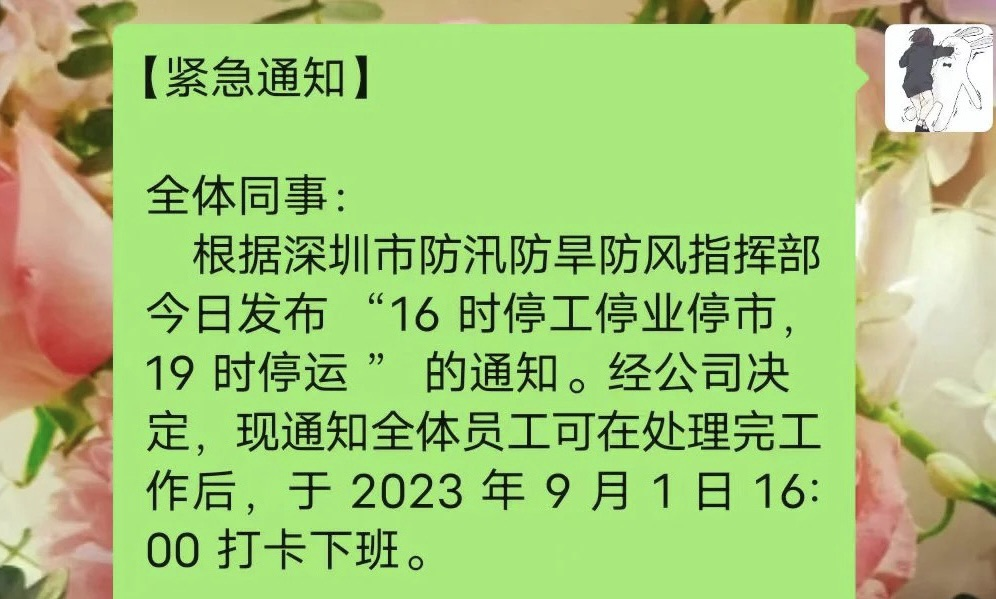

有提前下班的，像这样：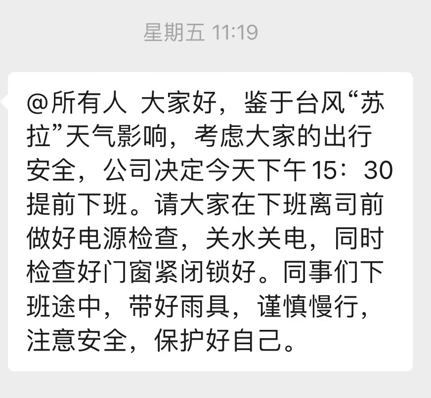

还有像我们这样要居家远程办公的：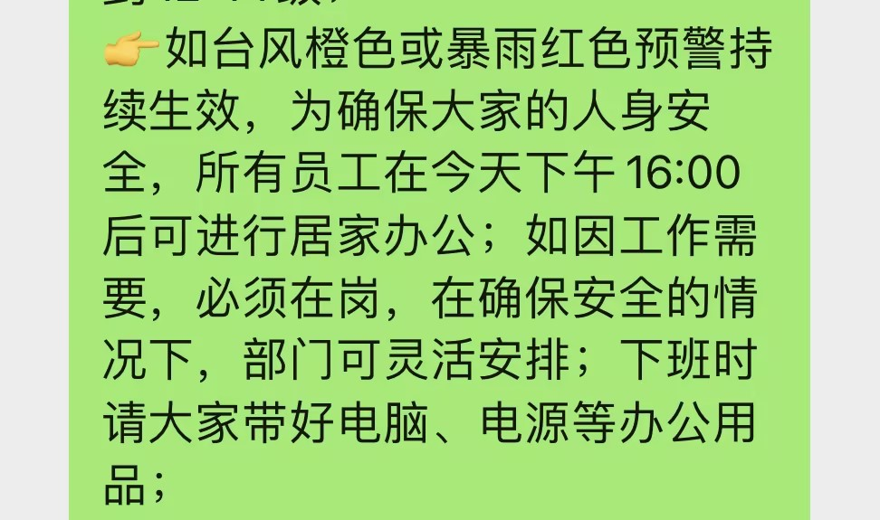

下午 4 点左右，公交和地铁都人满为患。

于是快下班（居家办公）的时候就想着打个车回家，然而打开滴滴之后：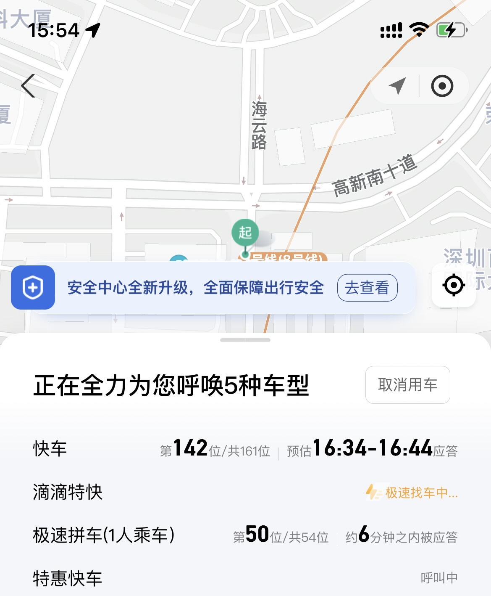

排队人数一百多，这个排队人数和时长，让我的心一下就拔凉拔凉的。

根据历史经验，在雨天打上车的应答时间得往后推半个小时左右。更何况，这还是台风天气！

滴滴啊滴滴，你就不能提前准备一下嘛，这个等待时长，会让你损失很多订单分成的。

但反过来想，这种紧急预警，也不能完全怪打车平台，毕竟，车辆调度也是需要一定时间的。在这种大家争相逃命（bushi 的时候，周围的车辆估计也不太够用。

等着也是等着，于是就回到公司继续看技术文章。这时我突然想到，经过这次车辆紧急调度之后，如果我是滴滴的开发工程师，需要怎么处理这种情况呢？

如果滴滴的面试官在我眼前，他又会怎么考量候选人的技术深度和产品思维呢？

# 2. 如何设计一个“网约车系统”

面试官：“滴滴打车用过是吧！看你简历里写道会架构设计是吧，如果让你设计一个网约车系统，你会从哪些方面考虑呢？”

## 2.1 需求分析

网约车系统（比如滴滴）的核心功能是把乘客的打车订单发送给附件的网约车司机，司机接单后，到上车点接送乘客，乘客下车后完成订单。

其中，司机通过平台约定的比例抽取分成，乘客可以根据第三方平台的信用值（比如支付宝）来开通免密支付，在下车后自动支付订单。用例图如下：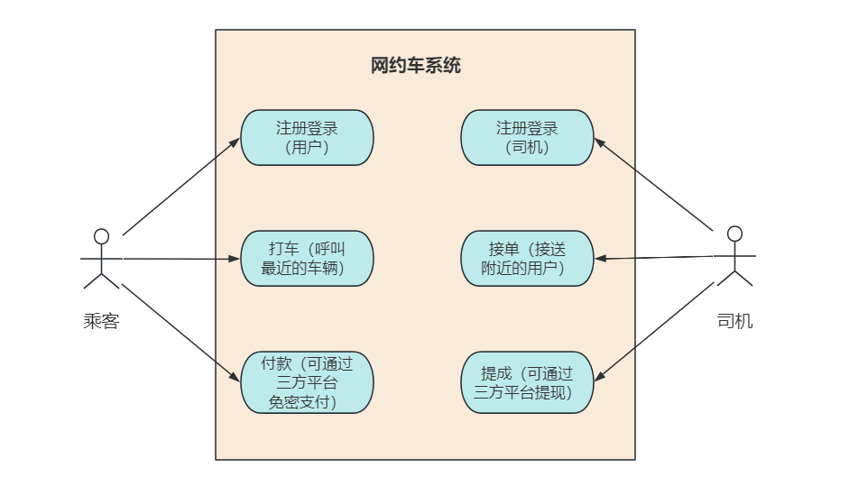

乘客和司机都有注册登录功能，但它们分属于乘客用户模块和司机用户模块。网约车系统的另外核心功能是乘客打车和付款，司机接单和提现。

## 2.2 概要设计

网约车系统是互联网+共享资源的一种模式，目的是要把车辆和乘客结合起来，节约已有资源的一种方式，通常是一辆网约车对多个用户。

所以对于乘客和司机来说，他们和系统的交互关系是不同的。比如一个人一天可能只打一次车，而一个司机一天得拉好几趟活。

所以需要开发两个 APP 应用，分别给乘客和司机打车和接单。

## 3. 网约车系统设计

### 3.1 需求分析

网约车系统（取名 Udi）的核心功能是把乘客的打车订单发送给附件的网约车司机，司机接单后，到上车点接送乘客，乘客下车后支付订单。司机通过平台的规定比例，抽取分成。用例图如下：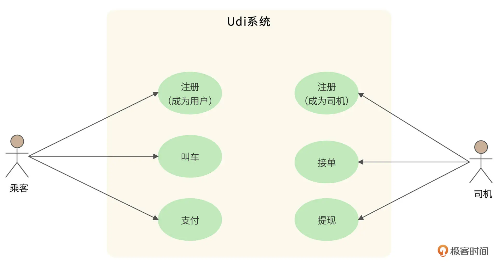

Udi 平台预计注册用户 5 亿，日活用户 5千万，平均每个乘客 1 个订单，日订单 5 千万，平均客单价 30 元。平台每日总营收 15 亿元，平台和司机按 3:7 的比例分成，平台每天可赚取 4.5 亿元。

另外，平台预计注册司机 5 千万，日活司机 2 千万。

### 3.2 概要设计

网约车平台是共享经济的一种，目的是要把司机和乘客撮合起来，所以需要开发两个 APP 应用，分别给乘客和司机打车和接单。Udi 整体架构如下：

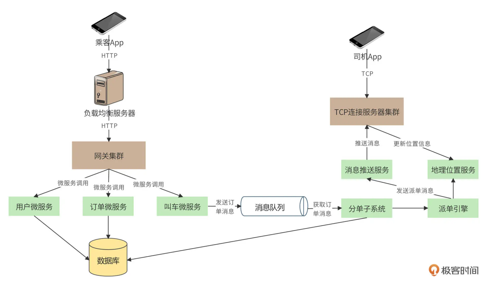

乘客：手机 App 注册成为用户后，可以选择出发地和目的地，进行叫车。打车 HTTP 请求通过负载均衡服务器集群，到达网关集群，再由网关集群调用相应的微服务，完成后续请求，如图所示：

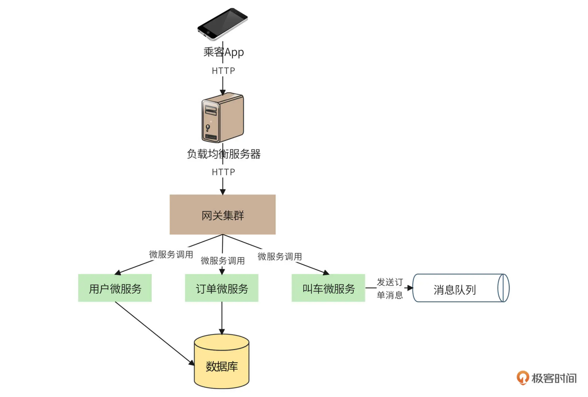

网关：首先调用订单微服务，为用户的打车请求创建一个订单，订单状态为“创建”，并存库。然后网关调用叫车微服务，叫车微服务将用户信息、出发地、目的地等数据封装成一个消息，发送到消息队列，等待系统为订单分配司机。

司机：通过 TCP 长连接定时将自己的位置信息发送给平台，同时也接收平台发布的订单消息，如下图：

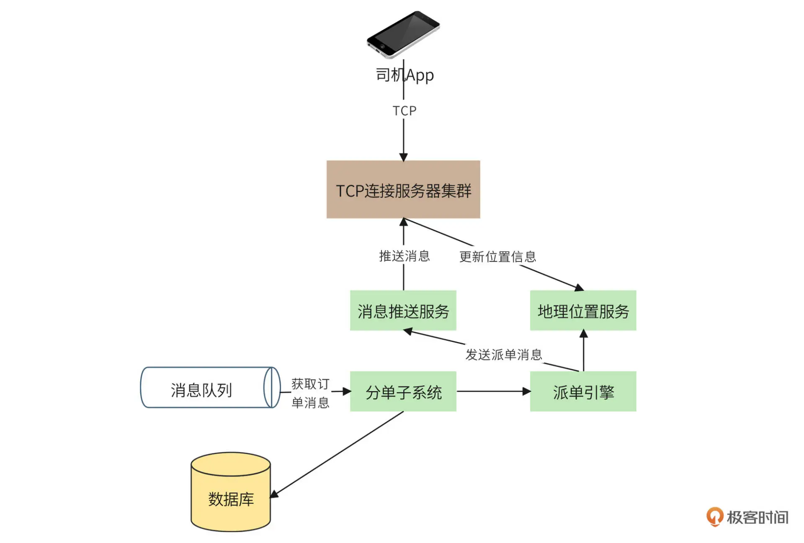

司机App：每 3 秒向平台发送一次当前的位置信息，包括车辆经纬度，车头朝向等。TCP 服务器集群相当于网关，只是以 TCP 长连接的方式向 App 提供接入服务，地理位置服务负责管理司机的位置信息。

订单分派：分单子系统作为消息消费者，首先将获取到的订单状态修改为“派单中”，然后调用派单引擎进行派单。派单引擎根据用户的上车出发点，以及司机的地理位置进行匹配，选择最合适的司机进行派单。派单消息通过一个专门的消息推送服务进行发送，通过 TCP 长连接推送到匹配的司机手机，同时，分单子系统更新数据库的订单状态为“已派单”。

PS：这里的订单分派逻辑可以修改为司机抢单，当订单创建后，由分单子系统推送到一定的地理位置范围，在范围内的司机接收到订单消息后可以抢单，抢单完成后，订单状态变为“已派单”。

### 3.3 详细设计

Udi 的详细设计，我们将关注网约车平台一些独有的特点：长连接管理、派单算法、距离计算以及订单状态模型。

#### 3.3.1 长连接管理

由于司机需要不断向 Udi 系统发送当前位置信息，以及实时接收订单的推送，所以司机 App 需要和 Udi 系统保持 TCP 长连接。

HTTP 和 TCP 不同，HTTP 是无状态的，每次 HTTP 请求都可以通过负载均衡服务器，被分发到不同的网关服务器进行处理，正如乘客 App 和服务器那样。也就是说，HTTP 在发起请求时，无需知道自己要连接的服务器是哪一台。

而 TCP 一旦建立了连接，就需要长期保持连接通道不关闭，不管是司机 App 发送位置信息给服务器，还是服务器推送订单消息给司机 App，都需要用到这个特定的连接通道。也就是说，司机 App 和服务器的连接是特定的，司机 App 需要知道自己连接的服务器是哪一台（后台可通过 Redis 或 zookeeper 把账号和服务器 IP 记录下来，司机每次登录时与特有的服务器进行连接）。

所以，司机端的 TCP 长连接需要进行专门管理，处理司机 App 和服务器的连接信息，架构图如下：

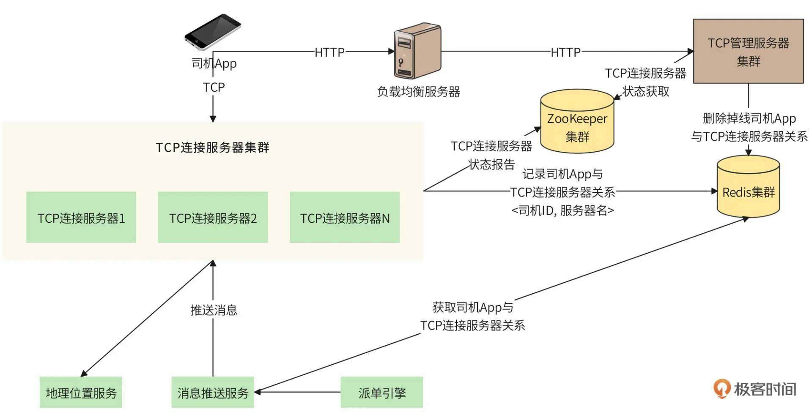

司机在登录时，通过负载均衡服务器，HTTP 请求分配一个可用的 TCP 长连接服务器地址（可用地址存储在 zk 中，TCP 连接服务器存入），并存入 Redis，键值对为<司机账号，服务器 IP>，然后司机 App 与之建立长连接。

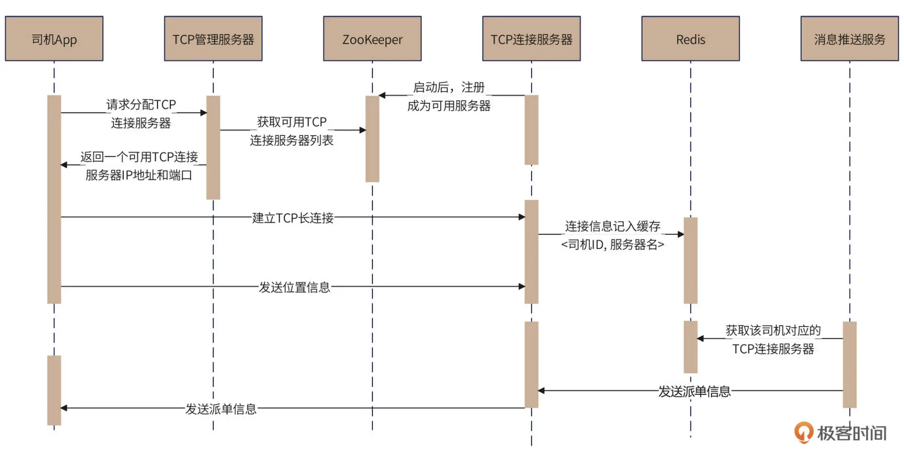

如果 TCP 服务器宕机，司机 App 与它的长连接就丢失了，这时司机 App 需要重新通过 HTTP 请求来分配一个新的 TCP 服务器，并由 TCP 管理服务器更新 Redis 中的对应关系，然后司机 App 重建连接。

#### 3.3.2 距离计算

乘客发起打车请求时，Udi 系统需为其寻找合适的司机进行派单，合适的司机最主要的因素就是距离。所以，我们可以通过 Redis 的 GeoHash 算法进行邻近计算。

首先，将司机的位置信息实时更新到 Redis 中，调用 Redis 的 GeoHash 命令 georadius 计算乘客的邻近司机。

【GeoHash算法：将乘客的经纬度换算成地址编码字符串，表示在某个矩形区域，通过这个算法可以快速找到同一个区域的所有司机】

Redis 使用跳表存储 GeoHash，Udi 日活司机两千万，每 3 秒更新一次位置信息，平均每秒需要对跳表做近 7 百万次的更新。所以，考虑 Redis 的 GeoHash 性能，可以把每个城市作为 GeoHash 的 key，将一个城市范围内的司机存储到一个跳表中。对于北京这样的超级城市，还可以更进一步，以城区作为 key，进一步缩小跳表的单位和单个跳表上的并发量。

#### 3.3.3 订单状态模型

订单状态模型如下：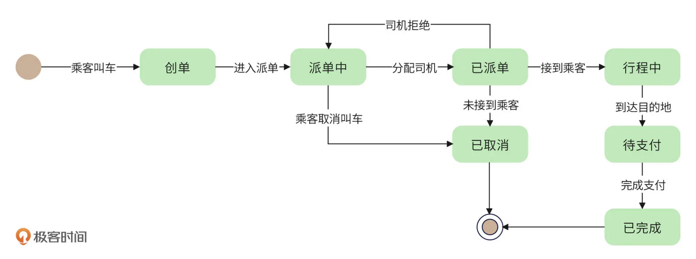

创建订单：用户叫车后，系统创建订单，并通过消息队列发送到派单子系统；

派单中：派单子系统获取订单信息，调用派单引擎分发订单；

已派单：派单引擎将订单分配给司机，一方面发送消息给司机，一方面修改订单状态；

行程中：司机接到乘客，修改订单状态；如果司机拒绝接单，订单就需要重新进入消息队列，同时改变订单状态为“派单中”；如果司机联系不到乘客，或者乘客主动取消，订单状态就修改为“已取消”；

待支付：司机到达目的地以后，通过 App 确认送达；用户支付订单以后，订单变为“已完成”状态。

#### 3.3.4 后续优化

**派单：**作为线上派单，通过距离运算来分配订单效果一定会比较差，因为 Redis 计算的是两点之间的空间距离，但司机必须沿道路行驶过来，在复杂的城市路况下，也许几十米的空间距离行驶十几分钟也未可知。

所以，后续需综合行驶距离（而非空间距离）、司机车头朝向以及上车点进行路径规划，来计算区域内每个司机到达乘客的距离和时间。更进一步，如果区域内有多个乘客和司机，就要考虑所有人的等待时间，以此来优化用户体验，节省派单时间，提升盈利额。

订单取消后的判责和**信用分问题**：订单取消的判责，影响乘客和司机的信用分，并关联到派单优先级。

**派单优先级**问题：考虑司机的评分，投诉次数，司机的接单数等等，来决定订单的优先级，以合理杀熟。

司机乘客**沟通记录留档**：网约车系统是一个法律风险敏感的系统，司机与乘客的在线沟通记录必须保存以外，还需要一个语音电话或车载录音转换，留存一段时间备查。