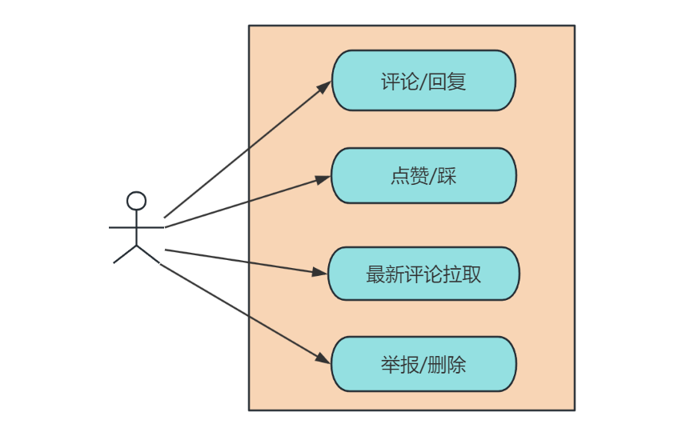

# 1. 引言

大家好，我是小❤，一个漂泊江湖多年的 985 非科班程序员，曾混迹于国企、互联网大厂和创业公司的后台开发攻城狮。

## 1.1 带货风波

近几天，“带货一哥” 李佳琪直播事件闹得沸沸扬扬，稳占各大新闻榜单前 10 名。


虽然小❤平时很少看直播，尤其是带货直播。

但奈何不住吃瓜的好奇心重啊！于是就趁着休息的功夫了解一下，这场风波事件起源于前几天的一场直播。

当时，李佳琪在直播间介绍合作产品 “花西子” 眉笔的价格为 79 元时，有评论区吐槽越来越贵了。

他直言：“哪里贵了？这么多年都是这个价格，不要睁着眼睛乱说，国货品牌很难的，哪里贵了？”


图来源：互联网，侵删

之后，李佳琪接着表示：“有的时候找找自己原因，这么多年了工资涨没涨，有没有认真工作？”


图来源：互联网，侵删

小❤觉得，这件事评论区网友说的没错，吐槽一下商品的价格有什么问题呢？我自己平时买菜还挑挑拣拣的，能省一毛是一毛。

毕竟，这个商品的价格也摆在那是不？


图来源：微博热点，侵删


## 1.2 身份决定立场，立场决定言论

但是，有一说一，从主播的角度呢，我也能理解。毕竟，不同的消费能力，说着自己立场里认可的大实话，也没啥问题。

那问题出在哪呢？

咳咳，两边都没问题，那肯定是评论区的问题！

一边是年收入十多亿的带货主播，一边是普普通通的老百姓，你评论区为啥不甄别出用户画像，再隔离一下评论？

俗话说：“屁股决定脑袋”，**立场不同，言论自然不一样**。所以，这个锅，评论系统背定了！


# 2. 评论系统的特点

正巧，前几天在看关于评论系统的设计方案，且这类架构设计在互联网大厂的面试里出现的频率还是挺高的。所以我们今天就来探讨一下这个热门话题——《海量评论系统的架构设计》。

没有枯燥的专业术语，小❤将以通俗易懂的方式，为你揭开评论系统的神秘面纱，让不熟悉架构设计的小白也能轻松理解和掌握。


## 2.1 需求分析

首先，让我们来了解一下评论系统的特点和主要功能需求。评论系统是网站和应用中不可或缺的一部分，主要分为两种：

* 一种是列表平铺式，只能发起评论，不能回复；
* 一种是盖楼式评论，支持无限盖楼回复，可以回复用户的评论。

为了迎合目前大部分网站和应用 App 的需求，我们设计的评论系统采用盖楼式评论。

需要满足以下几个功能需求：



- **评论发布和回复**：用户可以轻松发布评论，回复他人的评论。
- **点赞和踩**：用户可以给评论点赞或踩，以表达自己的喜好。
- **评论拉取**：评论需要按照时间或热度排序，并且支持分页显示。
- **举报和管理**：系统需要支持用户举报不当评论，并提供管理工具来处理违规内容。


## 2.2 非功能需求

除了功能需求，评论系统还需要满足一系列非功能需求，例如应对**高并发**场景，在**海量数据**中如何保证系统的稳定运行是一个巨大的挑战。

* 海量数据：拿抖音直播举例，10 亿级别的用户量，日活约 2 亿，假设平均每 10 个人/天发一条评论，总评论数约 2 千万/天；
* 高并发量：每秒十万级的 QPS 访问，每秒万级的评论发布量；
* 用户分布不均匀：某个直播间的用户或者评论区数量，超出普通用户几个数量级；
* 时间分布不均匀：某个主播可能突然在某个时间点成为热点用户，其评论数量也可能陡增几个数量级。


# 3. 系统设计

评论系统也具有一个典型社交类系统的特征，可归结为三点：==海量数据，高访问量，非均匀性==，接下来我们将对评论系统的关键特点和需求做功能设计。

## 3.1 功能设计

评论系统的功能设计，一个关键点是如何存储评论数据和如何保证高性能。

- **存储评论数据**：评论数据通常存储在分布式数据库中，如 MySQL 集群或 NoSQL 数据库，以确保高可用性和可扩展性。
- **高性能缓存**：引入高性能缓存，如 Redis，以加速评论的读取和写入操作，减轻数据库负载。

除此之外，我们还可以考虑评论的嵌套结构、用户关系、通知系统以及热门评论等方面的设计。

### 1）评论的嵌套结构

参考微博的评论系统，我们可以支持多级嵌套评论，让用户能够回复特定评论。

对于嵌套评论的存储，我们可以使用递归结构或层次结构的数据库设计，也可以使用关系型数据库表结构。

在查询时，可以使用递归或迭代的方式来获取嵌套评论的层级信息。

为了实现这一点，我们用了业界使用最广泛的关系型数据库 MySQL，设计出评论表的字段如下：

- **comment_id**：评论唯一标识符，主键。
- **user_id**：评论者的用户ID。
- **content**：评论内容，可以是文本或富文本。
- **timestamp**：评论时间戳。
- **parent_comment_id**：如果是回复评论，记录被回复评论的comment_id。
- **post_id**：评论所属的帖子或文章的ID。
- **level**：评论级别，用于标识评论的嵌套层级。

这只是一个基本的评论系统的 MySQL 表结构设计示例。在实际应用中，还可以根据具体需求添加其他字段，如点赞数、踩数、举报数等，以支持更多功能。

此外，合适的索引和分表策略也是确保系统性能的关键因素。设计好的表结构能够提高系统的可维护性和扩展性，从而满足高并发和高性能的要求。


### 2）用户关系

参考微博的关注系统，我们可以引入用户关系表，以便用户可以关注其他用户，并接收其动态和评论通知：

- **follower_id**：关注者的用户ID。
- **followed_id**：被关注者的用户ID。

这个表可以用于构建用户之间的社交网络，并实现评论的动态通知。

用户关系表的设计可以支持关注、取消关注和获取关注列表等功能。在数据库中，可以使用索引来提高关系查询的性能。同时，可以定期清理不活跃的关系，以减少存储和维护成本。


### 3）通知系统

为了提供及时的评论通知，我们可以设计通知系统，当用户收到新评论或回复时，系统可以向其发送通知。通知系统可以支持多种通知方式，包括站内消息、邮件通知、手机推送等。

通知系统需要支持消息的推送和处理。可以使用消息队列或实时数据库更新来实现消息的发送和接收。此外，需要考虑消息的去重、过期处理和用户偏好设置等方面的问题。


### 4）热门评论

参考小红书的热门评论系统，我们可以设计一个热门评论排序算法，以将最受欢迎的评论显示在前面。这可以通过计算点赞数、回复数、浏览量等指标来实现。此外，可以使用缓存来提高热门评论的访问速度。

#### 热门评论排序

为了实现热门评论的排序，可以使用定时任务计算评论的热度指标，然后将热度指标存储在数据库中。在查询时，可以根据热度指标来排序评论。同时，可以使用缓存来存储热门评论的结果，以提高性能。

通过综合考虑这些方面的设计，你可以构建一个强大且功能丰富的评论系统，为用户提供更好的互动体验。在实际实施中，还需要考虑系统的扩展性、容错性和安全性等方面，以确保系统的稳定和可靠运行。


## 3.2 性能和安全

除了最基本的功能设计以外，我们还需要结合评论系统的数据量和并发量，考虑如何解决高并发、高性能以及数据安全的问题。

### 1）高并发处理

评论系统面临着巨大的并发压力，数以万计的用户可能同时发布和查看评论。为了应对这个挑战，我们可以采取以下策略：

#### 分布式架构

采用分布式系统架构，将流量分散到多个服务器上，降低单点故障风险。

#### 消息队列

引入消息队列，如 Kafka，来处理异步任务，例如，当用户发布评论或点赞时，将任务放入消息队列，后台工作线程负责处理这些任务，以降低前端服务器的负担，提升用户体验。

#### 数据缓存

引入缓存层，如 Redis，用于缓存常用的评论数据，减轻数据库负载。例如，可以缓存最热门的评论、点赞数等信息，以减少数据库查询的频率，提高并发量。


### 2）高性能存储

评论数据量庞大，如何保证高性能的存储和检索是关键。我们可以采取以下措施：

#### 存储优化

- **分表存储**：将评论数据按时间分表存储，以减小每个表的数据量，提高查询性能。
- **索引优化**：使用合适的数据库索引，加速评论的检索操作，避免全表扫描。

#### 数据分区

除此之外，随着评论数量的增加，单一的评论表可能会变得庞大，导致查询性能下降。如何进行数据分区以提高查询效率？

使用 MySQL 的分区表功能，将评论表按时间范围进行分区。例如，可以按月或按季度创建新的分区，以减小每个分区的数据量，提高查询性能，这可以通过 MySQL 的分区键来实现。

``` mysql
sqlCopy code
CREATE TABLE Comment (
    comment_id INT PRIMARY KEY AUTO_INCREMENT,
    user_id INT,
    content TEXT,
    timestamp DATETIME,
    parent_comment_id INT,
    post_id INT
) PARTITION BY RANGE (YEAR(timestamp)) (
    PARTITION p0 VALUES LESS THAN (2023),
    PARTITION p1 VALUES LESS THAN (2024),
    PARTITION p2 VALUES LESS THAN (2025),
    ...
);
```

#### 异构数据库存储

考虑使用不同类型的数据库存储不同的评论数据。例如，使用关系型数据库存储基本评论数据，使用分布式数据库存储大规模评论数据，以实现高可扩展性和高性能。


### 3）安全和防护

评论系统需要应对垃圾评论、恶意攻击等安全威胁。我们可以采取以下防护措施：

- **文字过滤**：使用文字过滤技术，过滤垃圾评论和敏感词汇。
- **用户认证**：要求用户登录后才能发布评论，降低匿名评论的风险。


# 4. 如何应对李佳琪事件

## 4.1 文本分析和情感分析

**考虑点：** 如何检测和过滤垃圾评论、恶意攻击或敏感内容？

**解决方案：** 引入文本分析和情感分析技术，使用自然语言处理（NLP）算法来检测不当评论。通过分析评论内容，可以自动过滤垃圾评论，同时可以进行情感分析，以了解用户的情感反馈。

> NLP（自然语言处理技术），是通过情感分析、语义分析和实体识别，对评论内容进行分析和处理。这可以帮助系统更好地理解用户的评论，自动识别情感、主题和关键词，并提供更智能的推荐和过滤功能。

主播可以设置情感趋势，将嫌贵的用户评论设置为不可见（或交由直播间的工作人员处理）。

这样，每次直播时，主播看到的都是情感正向且说话好听的评论，不仅能提升直播激情，还能增加与 “真爱粉” 的互动效果，可谓一箭三雕。


## 4.2 用户行为分析

**考虑点：** 如何了解用户对评论的行为，以改善用户体验？

**解决方案：** 引入用户行为分析工具，如Google Analytics或自定义分析系统，以跟踪用户的评论行为。了解哪些评论受欢迎，哪些评论被忽视，可以帮助优化评论系统的排序和推荐算法，提高用户参与度。

这些新颖的考虑点和解决方案可以帮助你构建一个更强大和高效的评论系统，同时提供更好的用户体验。根据具体的应用场景和需求，你可以选择适合你系统的策略和技术来实现这些功能。


## 4.3 机器学习和推荐算法

引入机器学习算法来分析用户行为，根据用户的历史评论和喜好，推荐个性化的评论内容。这可以提高用户参与度和留存率，增强用户粘性。

为评论添加地理位置信息，允许用户在特定地点发布评论或查看附近的评论。这适用于社交、旅游和本地业务应用。

比如，小红书可能根据用户的性别来筛选出你想看的评论，大家不妨去试一试。


# 5. 小结

通过本文，我们深入了解了评论系统的架构设计，包括功能需求、非功能需求、概要设计和详细设计。评论系统虽然看似简单，但在背后涉及了众多复杂的技术和策略。

架构设计就像是一场充满挑战和创新的游戏，它需要我们不断思考和尝试新的方法，以应对不断变化的需求。如果你有任何问题或想深入了解更多，请留言，我将尽力解答你的疑虑。

别忘了点赞和分享这篇文章，让更多人了解评论系统的架构设计之美。期待与你下次再见，一起探索更多技术的奥秘！🚀✨

