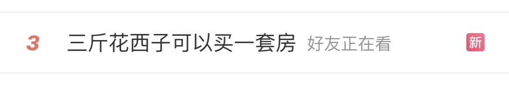
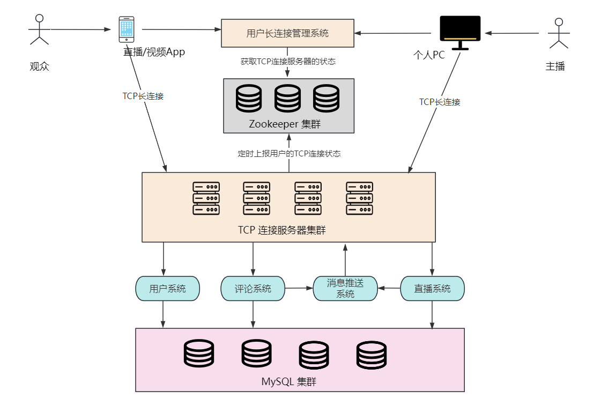

# 1. 引言

大家好，我是小❤，一个漂泊江湖多年的 985 非科班程序员，曾混迹于国企、互联网大厂和创业公司的后台开发攻城狮。

## 1.1 带货风波

近几天，“带货一哥” 李佳琪直播事件闹得沸沸扬扬，稳占各大新闻榜单前 10 名。


虽然小❤平时很少看直播，尤其是带货直播。

但奈何不住吃瓜的好奇心重啊！于是就趁着休息的功夫了解了一下，这场风波事件起源于前几天的一场直播。

当时，李佳琪在直播间介绍合作产品 “花西子” 眉笔的价格为 79 元时，有网友在评论区吐槽越来越贵了。他直言：“哪里贵了？这么多年都是这个价格，不要睁着眼睛乱说，国货品牌很难的，哪里贵了？”


图来源：互联网，侵删

之后，李佳琪接着表示：“有的时候找找自己原因，这么多年了工资涨没涨，有没有认真工作？”


图来源：互联网，侵删

小❤觉得，这件事评论区网友说的没错，吐槽一下商品的价格有什么问题呢？我自己平时买菜还挑挑拣拣的，能省一毛是一毛。

毕竟，这个商品的价格也摆在那是不？



图来源：微博热点，侵删


## 1.2 身份决定立场，立场决定言论

但是，有一说一，从主播的角度呢，我也能理解。毕竟，不同的消费能力，说着自己立场里认可的大实话，也没啥问题。

那问题出在哪呢？

咳咳，两边都没问题，那肯定是评论区的问题！

一边是年收入十多亿的带货主播，一边是普普通通的老百姓，你评论区为啥不甄别出用户画像，再隔离一下评论？

俗话说：“屁股决定脑袋”，**立场不同，言论自然不一样**。所以，这个锅，评论系统背定了！


# 2. 评论系统的特点

正巧，前几天在看关于评论系统的设计方案，且这类架构设计在互联网大厂的面试里出现的频率还是挺高的。所以我们今天就来探讨一下这个热门话题——《海量评论系统的架构设计》。

没有枯燥的专业术语，小❤将以通俗易懂的方式，为你揭开评论系统的神秘面纱，让不熟悉架构设计的小白也能轻松理解和掌握。


## 2.1 需求分析

首先，让我们来了解一下评论系统的特点和主要功能需求。评论系统是网站和应用中不可或缺的一部分，主要分为两种：

* 一种是列表平铺式，只能发起评论，不能回复；
* 一种是盖楼式评论，支持无限盖楼回复，可以回复用户的评论。

为了迎合目前大部分网站和应用 App 的需求，我们设计的评论系统采用盖楼式评论。

需要满足以下几个功能需求：


评论系统中的观众和主播相当于用户和管理员的角色，其中观众用户可以：

- **评论发布和回复**：用户可以轻松发布评论，回复他人的评论。
- **点赞和踩**：用户可以给评论点赞或踩，以表达自己的喜好。
- **评论拉取**：评论需要按照时间或热度排序，并且支持分页显示。

主播可以：

- **管理评论**：主播可以根据直播情况以及当前一段时间内的总评论数，来判断是否打开 “**喜好开关**”。
- **禁言用户**：当用户发布了不当言论，或者恶意引流时，主播可以禁言用户一段时间。
- **举报/删除**：系统需要支持主播举报不当评论，并允许主播删除用户的评论。


## 2.2 非功能需求

除了功能需求，评论系统还需要满足一系列非功能需求，例如应对**高并发**场景，在**海量数据**中如何保证系统的稳定运行是一个巨大的挑战。

* 海量数据：拿抖音直播举例，10 亿级别的用户量，日活约 2 亿，假设平均每 10 个人/天发一条评论，总评论数约 2 千万/天；
* 高并发量：每秒十万级的 QPS 访问，每秒万级的评论发布量；
* 用户分布不均匀：某个直播间的用户或者评论区数量，超出普通用户几个数量级；
* 时间分布不均匀：某个主播可能突然在某个时间点成为热点用户，其评论数量也可能陡增几个数量级。


# 3. 系统设计

评论系统也具有一个典型社交类系统的特征，可归结为三点：==海量数据，高访问量，非均匀性==，接下来我们将对评论系统的关键特点和需求做功能设计。

## 3.1 功能设计

在直播平台或评论系统里，观众可以接收开通提醒，并且评论被回复之后也可以通过手机 App 收到回复消息，所以需要和系统建立 TCP 长连接。

同样地，主播由于要实时上传视频直播流，所以也需要 TCP 连接。架构图如下：



用户或主播上线时，如果是第一次登录，需要从**用户长连接管理系统**申请一个 TCP 服务器地址信息，然后进行 **TCP 连接**。

> 不了解 TCP 连接的同学可以看我之前写的这篇文章：听说你会架构设计？来，弄一个打车系统

当观众或主播（统称用户）第一次登录，或者和服务器断开连接（比如服务器宕机、用户切换网络、后台关闭手机 App 等），需要重连时，**用户可以通过用户长连接管理系统重新申请一个 TCP 服务器地址**（可用地址存储在 Zookeeper 中），拿到 TCP 地址后再发起请求连接到集群的某一台服务器上。


### 用户系统

用户系统的用户表记录了主播和观众的个人信息。包括用户名、头像和地理位置等信息。除此之外，用户还需要记录关注信息，比如某个用户关注了哪些直播间。

用户表设计如下：

* user_id：用户唯一标识
* name：用户名
* portrait：头像压缩存储
* addr：地理位置
* role：观众或主播


### 直播系统

每次开播后，直播系统通过拉取直播流，和主播设备建立 TCP 长连接。这时，直播系统会记录直播信息，包括：

* live_id：一场直播的唯一标识
* live_room_id：直播间的唯一标识
* user_id：主播用户ID

参考微博的关注系统，我们可以引入用户关注表，以便用户可以关注直播间信息，并接收其动态和评论通知：

- **user_id**：关注者的用户ID。
- **live_room_id**：被关注者的直播间ID。

这个表可以用于构建用户之间的社交网络，并实现评论的动态通知。

用户关系表的设计可以支持关注、取消关注和获取关注列表等功能。在数据库中，可以使用索引来提高关系查询的性能。同时，可以定期清理不活跃的关系，以减少存储和维护成本。


### 评论系统

参考微博的评论系统，我们可以支持多级嵌套评论，让用户能够回复特定评论。

对于嵌套评论的存储，我们可以使用递归结构或层次结构的数据库设计，也可以使用关系型数据库表结构。

在查询时，可以使用递归或迭代的方式来获取嵌套评论的层级信息。

为了实现这一点，我们用了业界使用最广泛的关系型数据库 MySQL，设计出评论表的字段如下：

- **comment_id**：评论唯一标识符，主键。
- **user_id**：评论者的用户ID。
- **content**：评论内容，可以是文本或富文本。
- **timestamp**：评论时间戳。
- **parent_comment_id**：如果是回复评论，记录被回复评论的comment_id。
- **live_id**：评论所属的直播ID。
- **level**：评论级别，用于标识评论的嵌套层级。

这只是一个基本的评论系统的 MySQL 表结构设计示例。在实际应用中，还可以根据具体需求添加其他字段，如点赞数、踩数、举报数等，以支持更多功能。

此外，合适的索引和分表策略也是确保系统性能的关键因素。设计好的表结构能够提高系统的可维护性和扩展性，从而满足高并发和高性能的要求。


### 推送系统

为了提供及时的评论通知，我们可以设计消息推送系统，当用户收到关注直播间开播，或者有新评论或回复时，系统可以向其发送通知。

通知系统需要支持消息的推送和处理，当直播间关注人数很多或者用户发出了热点评论时，为了保证系统稳定，可以使用消息队列来处理异步任务。

此外，在推送时需要考虑消息的去重、过期处理和用户偏好设置等方面的问题。


## 3.2 性能和安全

除了最基本的功能设计以外，我们还需要结合评论系统的数据量和并发量，考虑如何解决高并发、高性能以及数据安全的问题。

### 1）高并发处理

评论系统面临着巨大的并发压力，数以万计的用户可能同时发布和查看评论。为了应对这个挑战，我们可以采取以下策略：

#### 分布式架构

采用分布式系统架构，将流量分散到多个服务器上，降低单点故障风险。

#### 消息队列

引入消息队列，如 Kafka，来处理异步任务。例如，当直播间推送开播消息时，将任务放入消息队列，后台工作线程负责处理这些任务，以降低前端服务器的负担，提升用户体验。

#### 数据缓存

引入缓存层，如 Redis，用于缓存最新的评论数据，减轻数据库负载。例如，可以根据 LRU 策略缓存最新的评论、点赞数等信息，以减少数据库查询的频率，提高并发量。


### 2）高性能存储

评论数据量庞大，如何保证高性能的存储和检索是关键。我们可以采取以下措施：

#### 存储优化

- **数据冗余**：当我们获取评论时，一般会带上用户名和头像信息，为了加快查询的效率，我们可以把用户名和压缩头像数据冗余到评论表里。
- **索引优化**：使用合适的数据库索引，加速评论的检索操作，避免全表扫描。比如在评论表里，结合使用场景，我们可以将 **user_id、timestamp 分别添加索引，live_id，level 添加联合索引**。

#### 数据分区

除此之外，随着评论数量的增加，单一的评论表可能会变得庞大，导致查询性能下降。将评论数据按时间分表存储，以减小每个表的数据量，提高查询性能。

具体操作为：使用 MySQL 的分区表功能，将评论表按时间范围进行分区。例如，可以按月或按天创建新的分区，以减小每个分区的数据量，提高查询性能，这可以通过 MySQL 的分区键来实现。

``` mysql
CREATE TABLE Comment (
    comment_id INT PRIMARY KEY AUTO_INCREMENT,
    user_id INT,
    content TEXT,
    timestamp DATETIME,
    parent_comment_id INT,
    live_id INT,
    level INT
) PARTITION BY RANGE (YEAR(timestamp)) (
    PARTITION p0 VALUES LESS THAN (2022-09),
    PARTITION p1 VALUES LESS THAN (2022-10),
    PARTITION p2 VALUES LESS THAN (2022-11),
    ...
);
```


### 3）安全和防护

评论系统需要应对敏感词汇、恶意攻击等安全威胁。我们可以采取以下防护措施：

#### 文字过滤

使用文字过滤技术，过滤垃圾评论和敏感词汇。实现时，为了提升处理的效率，我们可以使用布隆过滤器。

布隆过滤器是一个巧妙设计的数据结构，它的原理是将一个值多次哈希，映射到不同的 bit 位上并记录下来。

当新的值使用时，通过同样的哈希函数，比对各个 bit 位上是否有值：如果这些 bit 位上都没有值，说明这个数不存在；否则，就大概率是存在的。


以上图为例，具体操作流程为：假设敏感词汇有 3 个元素{菜狗，尼玛，撒币}，哈希函数的个数也为 3.

首先将位数组初始化，将每个位都置为 0。

然后将集合里的敏感词语通过 3 个哈希函数进行映射，每次映射都会产生一个哈希值，即位数组里的 1.

当查询词语是否为敏感文字时，用相同的哈希函数进行映射，如果映射的位置有一个不为 1，说明该文字一定不存在于集合元素中。

反之，如果 3 个点都为 1，则该元素大概率存在集合中。

当然，这可能会产生误判，**布隆过滤器一定可以发现重复的值，但也可能将不重复的值判断为重复值**。如上图中的 “天气”，虽然都命中了 1，但是它并没有存在于敏感词集合里。

布隆过滤器在处理大量数据时非常有用，比如网页缓存、拼写检查、黑名单过滤等。虽然它有一定的误判率（约为 0.05%），但是其判重的速度和节省空间的优点足以瑕不掩瑜！

#### 用户限制

除了从评论信息上加以限制，我们也可以从用户侧来限制：

- **用户认证**：要求用户登录后才能发布评论，降低匿名评论的风险。
- **评论限制**：根据用户 ID 和直播 ID 进行限流，比如让用户在一分钟之内最多只能发送 10 条的评论。

> 不知道如何限流的，可以看小❤之前的这篇文章：若我问到高可用，阁下又该如何应对呢？


# 4. 李佳琪该如何应对？

## 4.1 文本分析和情感分析

除了可以用布隆过滤器检测出恶意攻击和敏感内容，我们还可以引入文本分析和情感分析技术，使用自然语言处理（NLP）算法来检测不当评论。

并且，通过分析用户的评论内容，可以进行情感分析，以了解用户的情感反馈。

> NLP（自然语言处理技术），是通过情感分析、语义分析和实体识别，对评论内容进行分析和处理。这可以帮助系统更好地理解用户的评论，自动识别情感、主题和关键词，并提供更智能的推荐和过滤功能。

评论系统加入了这项技术，主播就可以选择设置**喜好开关**，根据评论的情感趋势，将“嫌贵的用户”或者 “评价为负面” 的评论设置为主播直播时不可见。

这样，**每次直播时，主播看到的都是情感正向且说话好听的评论，不仅能提升直播激情，还能增加与 “真爱粉” 的互动效果，可谓一箭三雕** :dog:


## 4.2 机器学习和推荐算法

除了从主播的角度，评论系统还可以引入机器学习算法来分析用户行为，根据用户的历史评论和喜好。

从观众来说，这可以提高观众的参与度和留存率，增强用户粘性。

从主播来说，可以筛选出**真爱粉**，脑残粉，甚至死亡芭比粉 :dog:。这样，每次主播在直播时，只筛选一部分用户可以发表评论，其余的统统禁言，或者设置为不看用户评论。

除了直播领域，社交领域也可以使用推荐算法来获取评论内容。比如之前有 B 站 UP 主爆出：小红书在同一个帖子下，对女性用户和男性用户展示的评论区是不一样的，甚至评论区是截然相反的观点。这个小❤没有试验过，大家不妨去看一下:smiley:


# 5. 小结

目前，
