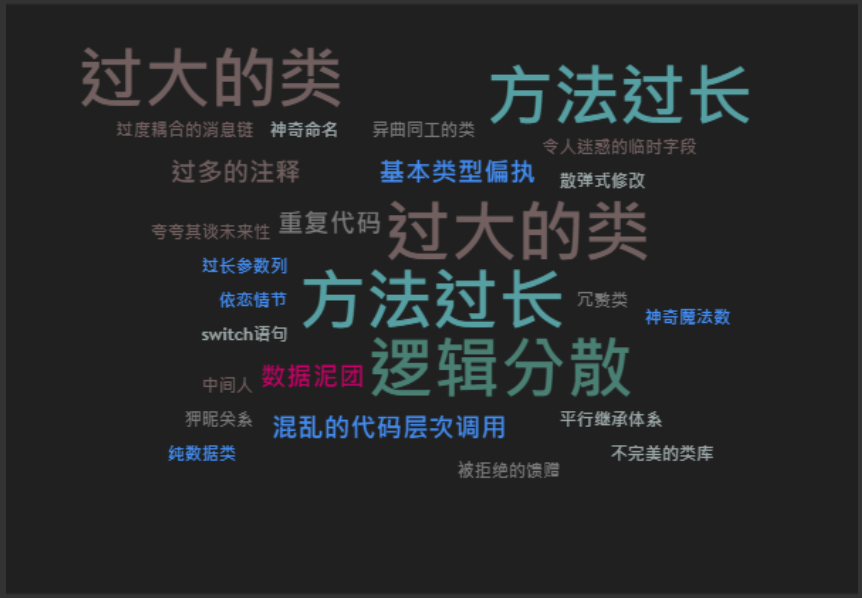

# 1. 引言

## 1.1 背景

代码开发：


一个月后：


后面**有时间了**改一改吧（放心，不会有时间的，有时间了也不会改）。

六个月后：


如上，是任何一个开发者都会经历的场景：早期的代码根本不能回顾，不然一定会陷入深深的怀疑，这么烂的代码真是出自自己的手吗？

更何况，目前大部分系统都是协同开发，每个程序员的命名规范、编码习惯都不尽相同，就导致了一个系统代码，多个味道的情况。


# 2 坏味道代码

## 2.1 坏味道类型有哪些

所谓坏味道，就是指代码的表面的混乱，和深层次的腐化现象。

在《重构-改善既有代码的设计》一书中，讲述了这二十多种坏味道情况，我们下面将挑选最常见的几种来介绍。

### 1）方法过长

方法过长是指在一个方法里面做了太多的工作，常常伴随着方法中的语句不在同一个抽象层级，比如 dto 和 service 层代码混合在一起，即逻辑分散。

除此之外，方法过长还容易带来一些额外的问题。

#### 问题1：过多的注释

方法太长会导致逻辑难以理解，需要大量的注释，如果 10 行代码需要 20 行注释，代码很难阅读。特别是读代码的时候，常常需要记住大量的上下文。

#### 问题2：面向过程

面向过程的问题在于当逻辑复杂以后，代码会很难维护。相反地，我们在代码开发时常常用面向对象的设计思想，即把事物抽象成具有共同特征的对象，后文会详细解释。

#### 解决思路

解决方法过长时，我们遵循这样一条原则：每当感觉要写注释来说明代码时，就把这部分代码写进一个独立的方法里，并根据这段代码的意图来命名。

> 方法命名原则：可以概括要做的事，而非怎么做。


### 2）过大的类

一个类做了太多的事情，比如一个类的实现既包含商品逻辑，又包含订单逻辑。在创建时就会出现太多的实例变量和方法，难以管理。

除此之外，过大的类还容易带来两个问题。

#### 问题1：冗余重复

当一个类里面包含两个模块的逻辑时，两个模块容易产生依赖。这在代码编写的过程中，很容易发生 “你带着我，我看着你” 的问题。即在两个模块中，都看到了和另一个模块相关的程序结构或相同意图的方法。

#### 问题2：耦合结构不良

当类的命名不足以描述所做的事情时，大概率产生了耦合结构不良的问题，这和我们想要编写 “高内聚，低耦合” 的代码目标相悖而行了。

#### 解决思路

将大类根据业务逻辑拆分成小类，如果两个类之间有依赖，则通过外键等方式关联。当出现重复代码时，尽量合并提出来，程序会变得更简洁可维护。


### 3）逻辑分散

逻辑分散是由于代码架构层次或者对象层次上有不合理的依赖，通常会导致两个问题：

#### 发散式变化

某个类经常因为不同的原因，在不同的方向上修改。

#### 散弹式修改

发生某种变化时，需要多个类中修改。


### 4）其它坏味道

#### 数据泥团

数据泥团是指很多数据项混乱地融合在一起，不易复用和扩展。

当许多数据项总是一起出现，并且一起出现时更容易分类。我们就可以考虑将数据按业务封装成数据对象。反例如下：

``` go
func AddUser(age int, gender, firstName, lastName string) {}
```

修改：

``` go
type AddUserRequest struct {
    Age int
    Gender string
    FirstName string
    LastName string
}
func AddUser(req AddUserRequest) {}
```


#### 基本类型偏执

在大多数高级编程语言里面，都有基本类型和结构类型。在 Go 语言里面，基本类型就是 int、string、bool 等。

基本类型偏执是指我们在定义对象的变量时，常常不考虑变量的实际业务含义，直接使用基本类型。

反例如下：

``` go
type QueryMessage struct {
	Role        int         `json:"role"`
	Content  string    `json:"content"`
}
```

修改：

``` go
// 定义对话角色类型
type MessageRole int

const (
	HUMAN     MessageRole = 0
	ASSISTANT MessageRole = 1
)

type QueryMessage struct {
	Role        MessageRole   `json:"role"`
	Content  string               `json:"content"`
}
```

这是 ChatGPT 问答时的请求字段，我们可以看到对话角色为 int 类型，且 0 表示人类，1 表示聊天助手。当直接使用 int 来表示对话 Role 时，没办法直接从定义里知道更多信息。

但是用 `type MessageRole int` 定义后，我们就可以根据常量值很清晰地看出对话角色分为两种：HUMAN & ASSISTANT.


#### 混乱的代码层次调用

我们一般的系统都会根据业务 service、中转控制 controller 和数据库访问 dao 等进行分层。一般 controller 调用 service，service 调用 dao。

如果我们在 controller 直接调用 dao，或者 dao 调用 controller，就会出现层次混乱的问题，就可以进行优化了。


### 5）坏味道带来的问题

上述我们介绍了代码编写中，最常见的几种坏味道情况。

> 说说这些坏味道代码会带来什么样的影响？

#### 四个难

难以理解：新来的开发同学压根看不懂看人的代码，一个模块看了两个周还不知道啥意思。或许不是开发者的水平不够，可能是代码写的太一言难尽。

难以复用：要么是读都读不懂，或者勉强读懂了却不敢用，担心有什么暗坑。或者系统耦合性严重，难以分离可重用部分。

难以变化：牵一发而动全身，即散弹式修改。动了一处代码，整个模块都快没了。

难以测试：改了不好测，难以进行功能验证。命名杂乱，结构混乱，在测试时可能测出新的问题。


## 2.2 它们是怎么出现的

软件架构在开发时，往往是一个可控制的整体，它有着完善的分层，每个模块各尽其责，相互配合井井有条。

但是，随着需求增多，项目演进中若没有人为控制代码的质量，代码架构就会朝着分崩离析的方向发展。

化学名词来解释这个现象就是 “熵增”，社会学就是 “合久必分”，生活里最常见的就是自己房间的整洁程序，老是会不知不觉混乱起来。

在编码中，出现坏味道代码一般是由以下几个原因造成的：

1. 开发前：缺乏行之有效的编码规范，和层次设计；
2. 开发时：由于对开发成本和迭代周期的考量，在原有功能上堆砌式编程；
3. 开发后：缺乏有效的代码 review 机制。

开发前，可能是程序员经验和水平不足，所以只关注功能，不关注代码质量。

开发时，可能是赶需求，编码像叠方块一样往老代码直接加，代码总有一天会倒塌。

开发后，如果没有开发经验充足的人来检查，那系统的整体质量就得不到保证。

由于开发过程中充斥了各种问题，最终会导致坏味道代码越来越多，整体的软件架构岌岌可危。


## 2.3 重构类型

这时，每一个有责任心（代码洁癖）的程序员，都会考虑代码重构。就像收拾房间一样，我们一般会按照习惯的方法进行清理。

而对于重构问题，业界已经有比较好的思路：通过持续不断地重构将代码中的 "坏味道" 清除掉。

根据重构规模的分类有两种，大型和小型重构。

对顶层代码设计的**大型重构**：

- 范围：整个系统、多个模块、代码整体架构、类和类的关系
- 手段：分层、模块化、解耦、抽象出可复用组件
- 工具：设计思想、原则和模式
- 影响：改动大，影响广，难度大，耗时长，引入 bug 风险高

对代码细节的**小型重构**：

- 范围：类、函数、变量
- 手段：消除超大类或函数、规范命名和注释、提取重复代码等
- 工具：重构手法、统一的编码规范
- 影响：改动简单，操作性强，耗时短，引入 bug 风险小

代码**重构的时机**：功能新增，修 bug，代码 review 发现代码坏味道，就应该及时重构。持续小型重构，能够降低重构和预测的成本。


# 3. 如何重构

### 1）命名规范

一个好的命名规范应该符合：

- 精准描述所做的事情
- 格式符合通用惯例

#### 约定俗成的惯例

我们拿华为公司内部的 Go 语言的开发规范来举例：

| 场景     | 约束                                                  | 示例                    |
| -------- | ----------------------------------------------------- | ----------------------- |
| 项目名   | 全部小写，多个单词时用中划线 '-' 分隔                 | user-order              |
| 包名     | 全部小写，多个单词时用中划线 '-' 分隔                 | config-sit              |
| 结构体名 | 首字母大写                                            | Student                 |
| 接口     | 采用 Restful API 的命名方式，路径最后一部分是资源名词 | 如 [get] api/v1/student |
| 常量名   | 首字母大写，驼峰命名                                  | CacheExpiredTime        |
| 变量名   | 首字母小写，驼峰命名                                  | userName，password      |


### 2）重构手法

1. 类/方法提炼：将共同的逻辑提取出来，分别引用，单一职责；
2. 以函数对象取代函数：局部变量为类参数，大型函数因此可以分解为多个小型函数；
3. 引入参数对象：当变量过多时，传入对象；
4. 查询修改分离：任何有返回值的方法，都不应该有副作用；
5. 移除不必要的临时变量：临时变量只用一次，或者取值逻辑成本很低的情况；
6. 引入解释性变量：将复杂表达式的结果放进一个临时变量，来解释表达式的用途；
7. 使用卫语句：减少 else 的使用，if xx == n {return}；
8. 多态代替条件判断：比如含有大量“+-*/”的操作，可以分别指定一个对象，通过符号创建，在代码中会减少“+-*/”的判断语句；
9. 优先使用模板/工具类：减少重复代码，专注业务逻辑；
10. 分离对象的创建和使用：依赖注入、工厂方法模式；


### 1）SOLID 原则


#### 单一职责SRP

- 定义：一个接口/方法只负责完成一个职责或功能，不要存在多于一种导致类变更的原因，类允许多个职责；
- 原理：高内聚松耦合，避免设计大而全的接口/方法，将不相关的功能耦合在一起，影响代码的可维护和扩展性。

#### 开放-关闭原则OCP（工厂方法、策略）

- 定义：对扩展开放，对修改关闭。添加一个功能，应该是在已有代码的基础上扩展代码（新增类、方法、属性等），而非修改现有代码的方式来完成；
- 原理：基于接口抽象而非具体实现编程，常用方法：多态、依赖注入。它的目的是提高代码的扩展性，尽量以最小的代价来完成新功能的开发。大部分设计模式（例如，装饰、策略、职责链、状态）；
- 对测试影响：原有代码仍然正常运行，我们只需要对扩展的代码进行测试即可；

**工厂方法模式**

定义：创建对象时引入工厂类，其中工厂父类负责定义创建产品对象的公共接口，工厂子类负责生成具体的产品对象，目的是将产品类的实例化操作延迟到工厂子类中完成，通过工厂子类来确定究竟实例化哪一个具体的产品类。

代码：Product 抽象产品，ConcreteProduct 具体产品，Factory 抽象工厂，ConcreteFactory 具体工厂。


时序图：


**策略模式**

定义：定义一系列的算法，把它们封装起来，让它们可以相互替换。

解决：当实现某个功能有多个途径时，比如排序算法，可以把它们都放入一个类的多个方法中。每次获取一个算法时，服务端采用 if else 判断需要哪个算法，然后返回对应的算法方法。带来的问题：扩展性弱，每次需要修改代码。当算法比较多时，代码复杂难以维护。

应用：有多种算法相似的情况下，使用 if else 会使代码较复杂而难以维护。策略模式让系统免于陷入重复判断的问题，扩展性良好。

代码：通过 context 环境类设置策略，strategy 抽象策略类，concreteStrategy 实现具体的策略。

#### 里式替换原则LSP

- 定义：子类对象可以替换程序中父类对象出现的任何地方，并且保证原有的程序逻辑不受影响。
- 原理：子类扩展父类功能，但不能改变父类原有的功能。

#### 接口隔离原则ISP

- 定义：细化接口的能力，将其行为减少。分治思想，降低复杂性，让系统更可控。
- 原理：判断标准是如果调用者只使用了部分接口或者接口的部分功能，那接口的设计就不够职责单一。

#### 依赖反转原则DIP（适配器）

定义：高层模块不应该依赖低层模块，两者都应该依赖抽象。抽象不应该依赖细节，细节应该依赖抽象。以减少类间的耦合，使系统更容易维护和扩展。


（图来源：维基百科）

应用：Java 开发的数据库访问层模块代码并不直接依赖数据库驱动，而是依赖 JDBC 这个抽象，不同的数据库驱动都实现了 JDBC。这里面：

- 数据库访问 DAO 层为高层模块；
- 具体的数据库驱动比如 MySQL、Oracle 为低层模块；
- JDBC 就是实现的抽象。

通过三层解耦，让高层模块不直接依赖数据库驱动，让数据库驱动需要变更时改动量不那么大，利于系统需求的变更和扩展。

**适配器模式**

定义：引入一个适配器类（JDBC/orm框架）来重用现有的适配者类（数据库驱动），而无须改变原有的代码。

优点：增加了类的透明和复用性，具体实现封装在适配者类中，对于客户端透明。灵活性和扩展性，可以很方便更换适配器，符合依赖反转和开闭原则。

代码：Target 目标抽象类，Adapter 适配器类，Adaptee 适配者类，Client 客户类。


除此之外，还有一个**迪米特法则**，也称为“最少知道原则”：一个类对依赖的类知道的越少越好，降低类之间的耦合，和单个类的复杂性。


### 2）设计模式

设计模式是软件开发人员在软件开发过程中，面临的一般问题的解决方案。它们经过众多开发人员长时间的实践总结出，每种模式都描述了一个常见的设计问题，以及问题的核心解决方案。

业界常见的有三类，23 种设计模式。

- 创建型：创建对象、封装复杂对象的创建过程，**解耦对象的创建和使用**代码
- 结构型：通过类或者对象的不同组合，解耦**不同功能**的实现
- 行为型：解决类或对象之间**交互行为**的耦合

| 创建型                   | 结构型                                       | 行为型                                                       |
| ------------------------ | -------------------------------------------- | ------------------------------------------------------------ |
| 单例、工厂、建造者、原型 | 代理、装饰者、适配器、桥接、门面、组合、享元 | 观察者、模板、策略、状态、职责链、迭代器、访问者、备忘录、命令、解释器、状态、 |


### 3）代码分层

《阿里巴巴Java开发》中描述的分层模型：


Web：业务过滤，鉴权，接口处理

Service：不多说明，具体业务逻辑的封装层；

Manager：

1. 对第三方平台封装的层，预处理返回结果及转化异常信息
2. 对 Service 层通用能力的下沉，如缓存方案、中间件通用处理
3. 与 DAO 层交互，如多个 DAO 的组合复用

可以将 Manager 理解为通用逻辑的封装，避免 Service 与 Service 相互调用，以及对通用逻辑的管理。

DAO：数据访问对象，用于对数据库的访问。比如 MySQL、Redis、ElasticSearch、HBase 都可以在 DAO 层访问。

除此之外，还可以加一些独立的层级：

Utils：基础工具层，它和 Manager 的区别在于 Utils 不涉及业务，比如当需要存储业务的 ID 是随机生成的，可以加 AccountIDGenerator 方法中用雪花算法生成；计算排名分数的逻辑放在 RankCalculator 中。

DTO：数据传输对象层，给业务层向外传输的响应对象。比如某个业务需要多次查询不同的数据对象进行拼接，可以将它们的字段合并放入一个对象中，包名为 dto。

Query：这不是一个单独的分层，可以是一个单独包，用来存放请求 Body 体，以 GetxxxRequest 命名。


## 4. 软件质量如何保证

1. 测试驱动开发


知乎：https://zhuanlan.zhihu.com/p/371635036

https://bbs.huaweicloud.com/blogs/371691

腾讯云25种坏味道：https://cloud.tencent.com/developer/article/1835315

简书22种坏味道：https://www.jianshu.com/p/80eec4147835

思否编码成长（剧情）：https://segmentfault.com/a/1190000040173635

InfoQ烂代码变好：https://www.infoq.cn/article/vckes7xg4ez21wxdq8rd

Java指南（重构）：https://javaguide.cn/system-design/basis/refactoring.html#%E4%BD%95%E8%B0%93%E9%87%8D%E6%9E%84

重构总结（三颗心脏）：https://www.cnblogs.com/wmyskxz/p/10990059.html