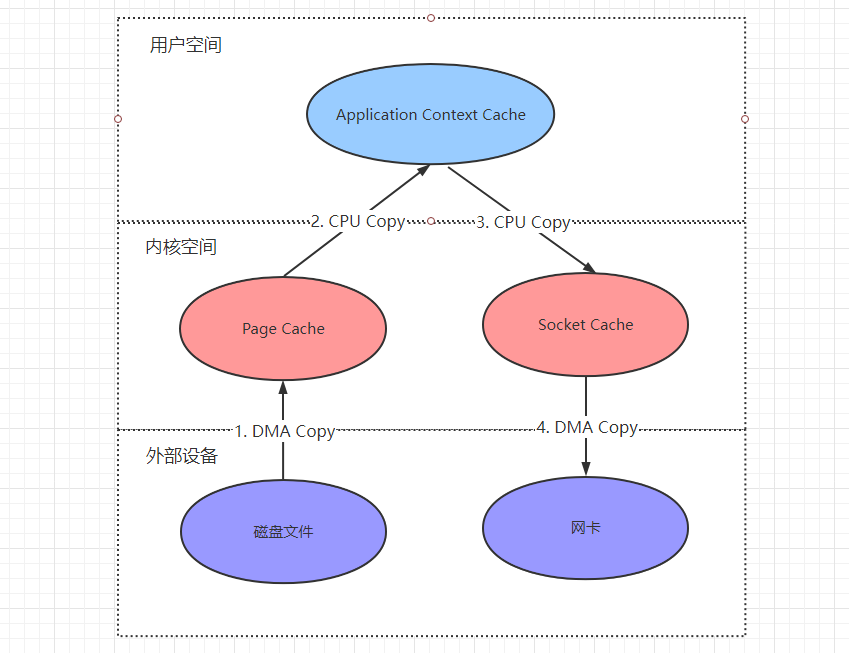
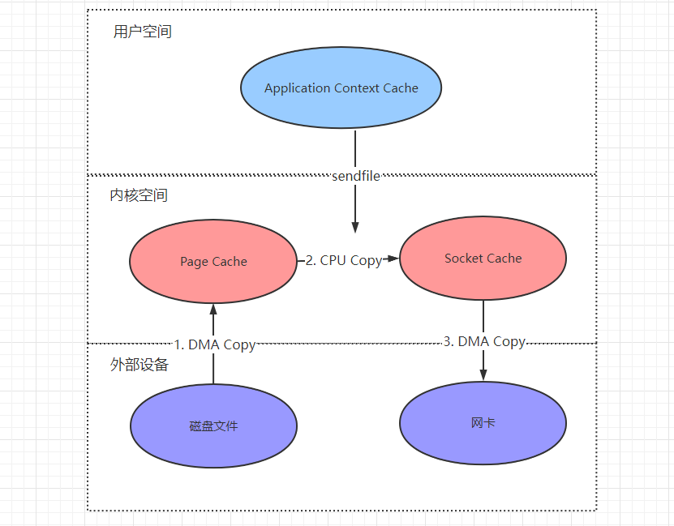
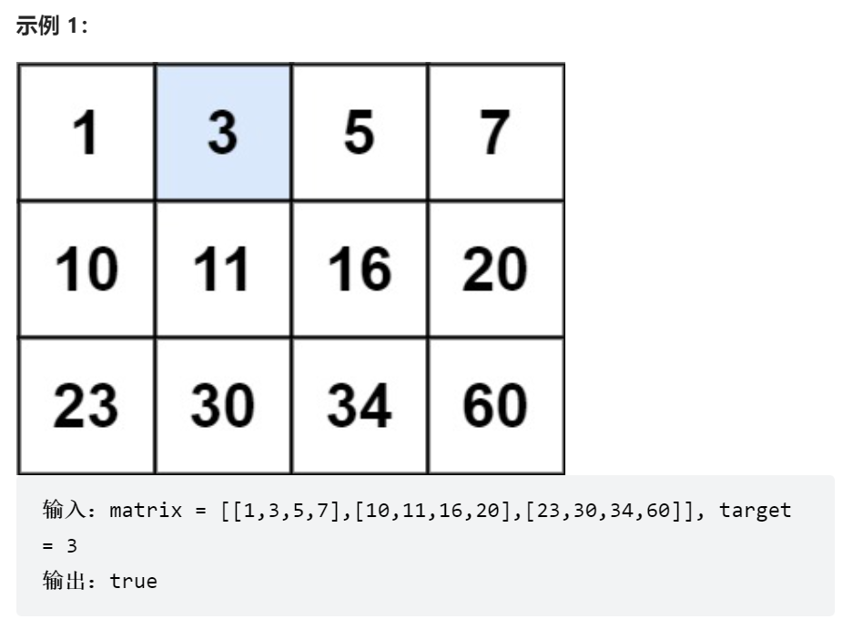

目录

> 1. 背景
> 2. 自我介绍&过往经历
> 3. Go语言知识点
> 4. 操作系统&计算机组成原理
> 5. 中间件原理考察
> 6. 网络&分布式
> 7. 算法与数据结构
> 8. 小结


## 1. 背景

### 1.1 个人情况

本科毕业，后端开发 4 年，Go 语言练习时长两年半。喜欢唱跳、Rap、篮球等 :dog:

主要编程语言是 Go 和 Java，工作中涉及的技术栈有 MySQL、Oracle、Redis、RabbitMQ、Kafka、SpringBoot、设计模式、网络、微服务、分布式等。

面试目的：寻找几个经验丰富的面试官，看看自己的水平，也了解下市场情况。


### 1.2 面试岗位

这次面的是后台开发工程师（Golang），岗位信息如下：

职位诱惑：

1. 互联网行业，给出高于同行的待遇，根据绩效等情况对标 16 薪；
2. 核心岗位，发展空间巨大；

岗位职责：

1. 参与公司互联网产品的设计和开发，架构设计；
2. 配合公司战略，完成公司和部门 OKR 任务；
3. 跟进行业前沿技术，持续进行技术建设；

任职要求:

1. 本科及以上学历，拥有 2 年及以上 Golang 语言编程开发经验；
2. 熟悉 Linux 的常用命令，有基本的 shell 脚本编写能力；
3. 熟练掌握 Go 语言基础，熟悉网络编程接口，熟悉 TCP/IP、UDP 协议，对网络通信编程模型有较深刻的理解；
4. 熟练掌握常用设计模式，熟练掌握面向对象程序设计方法，具有一定设计能力；
5. 熟练使用 MySQL，良好的数据库设计和丰富的优化经验；
6. 熟悉 NoSQL 技术（Redis，Memcached等）；
7. 良好的技术架构能力和项目经验，善于发现技术问题和提出解决方案；
8. 有较强的学习能力，有良好沟通能力以及团队协作精神，能够承担工作压力。

从上不难看出，岗位和福利待遇等信息写的很全，这样的候选公司和 HR 都挺加分的:dog:。


## 2. 自我介绍&过往经历

由于是在职状态，所以面试都是晚上面的，一面约在了晚上 8 点。

面试官可能在家里，就没有开摄像头，和我说明了一下（这点很加分，希望候选公司的面试官都这样礼貌，否则会降低被面试通过的概率:dog:）。


候选公司的面试官：你好，我是 xx 公司的面试官，这次面试的内容主要是技术栈考察和一些编程题，你可以先做个自我介绍吗？

自我介绍：嗯，好的。然后大概说一下自己的毕业学校，专业，时间，项目，擅长技能，3~5 分钟。

> PS：候选公司的面试官尽量开摄像头，如果实在不能开的，最好说明一下。面试开始时可以先做个自我介绍，也会比较加分，即使是简单的说明。
>
> 以下为节省问答字数，候选公司的面试官和人选回答采用一问一答的形式，即 Q&A


Q：项目 1 的细节，做了哪些优化（自我介绍时说做了系统优化）

A：MySQL 高端 CRUD 操作，Redis 狂飙缓存，Kafka 延时 Bug 等，八股文备好：<a href="https://mp.weixin.qq.com/s?__biz=MzI5Nzk2MDgwNg==&mid=2247484042&idx=1&sn=1620b3df43419745708f6f4c60a9ad9a&chksm=ecac5683dbdbdf95197214ec82fe119ce0bc64c95b6806a8124a381f2c01131d41d6678b87e6&token=443585135&lang=zh_CN#rd">MySQL 总结</a>


Q：项目 2 的具体职责，为什么换工作？

A：项目 2 的背景是...，给用户提供什么价值，我负责了哪些模块，具体职责是什么，有什么效果或者贡献，最终结果怎么样。可以**用 SMART 原则阐述，职责分明，目标清晰，效果理想**。

换工作的原因是，目前所在业务已经趋于稳定，想要更多成长机会，贵公司这块技术和文化比较吸引我...，其它随便扯，**突出一个字：夸！**

夸对方 NB，顺便准备下为什么跳槽的话术，是因为个人发展，工作地域问题？还是说有技术追求，想学习更多业务和技术场景？总之不能说一些敏感原因，比如 “事多钱少，领导傻吊” 等等。

> 虽然不打算换工作，但在面试前也需要考虑好自己的跳槽原因，让面试官知道你是 “有备而来”，否则就只能 “耗子尾汁”。


## 3. Go语言知识点

Q：说一下 Go 语言里面 make 和 new 的区别？

A：在 Go 语言里面，make 和 new 是的两个很常用的关键字，它们区别如下：

* make 只能用来分配及初始化类型为 slice、map 以及 chan 的数据；new 可以分配任意类型的数据；
* new 分配返回的是指针，即类型 *Type；make 返回引用，即 Type；
* new 分配的空间被清零，而 make 分配空间后，会进行初始化。


Q：介绍一下 Goroutine 的调度模型

A：这篇文章给出了很好的回复：<a href="https://mp.weixin.qq.com/s?__biz=MzI5Nzk2MDgwNg==&mid=2247484182&idx=1&sn=6d3f54eea5622a2d7f6323cbb553fdd8&chksm=ecac571fdbdbde09cc8beb982e5df0caafdf5c87587cd3fbd69ca86c33724e9368ab957beac3&token=443585135&lang=zh_CN#rd">GPM调度</a>


Q：读写一个已经关闭的 chan，会发生什么

A：会产生 panic，这道题考察 chan 的基本使用，需了解 chan 产生 panic 的三种情况：

* 对空 Chan 进行 Close
* 对已经 Close 的 Chan 再次 Close
* 对已经 Close 的 Chan 发送数据


Q：切片的底层结构

A：切片是一个长度可变的数组，其数据结构定义如下：

```go
type slice struct {
	array unsafe.Pointer
	len   int
	cap   int
}
```

其中，Pointer 是一个指向数组的指针，len 代表当前切片的长度，cap 是当前切片的容量，并且 cap>=len.


## 4. 操作系统&计算机组成原理

Q：为什么进程切换的开销比线程切换的开销要大

A：进程是资源分配的基本单位，进程切换时会涉及到堆区内存的刷新，页表全局目录的更换，以及虚拟地址空间的切换。

而线程本质上只是一批共享资源的进程，因此一个进程的所有线程会共享虚拟地址空间，可以**节省虚拟地址空间的切换**。并且，在存储内存上下文时，线程只需要保存**寄存器和程序计数器**的数据即可。

> 如果还不了解进程和线程的区别，继续看这篇文章：<a href="https://mp.weixin.qq.com/s?__biz=MzI5Nzk2MDgwNg==&mid=2247484182&idx=1&sn=6d3f54eea5622a2d7f6323cbb553fdd8&chksm=ecac571fdbdbde09cc8beb982e5df0caafdf5c87587cd3fbd69ca86c33724e9368ab957beac3&token=443585135&lang=zh_CN#rd">GPM调度</a>


Q：用户空间和内核空间有什么区别

A：内核空间是**操作系统内核**访问的区域，在访问磁盘、网卡等外部设备时，必须先把数据加载到内核空间，所以内核空间是受保护的内存空间。

而**用户空间是普通应用程序都可访问的内存区域**，不能直接加载外部设备的数据。

早期操作系统不分内核与用户空间，这样一来，应用程序（比如我们自己随便写个脚本）就能访问任意的内存空间，会带来一些安全隐患：比如你写了个 for 循环发送数据就可能会把整台服务器的磁盘网络等资源耗尽！


Q：Linux 下 send 和 sendfile 两个数据传递函数的区别

A：这是 Linux 系统下的网络 IO 问题。其中，send 采用基于数据拷贝的传统标准 IO 方式，当客户端进行数据传输时需要调用如下函数：

``` java
buffer = File.read;
Socket.send(buffer)
```

send 函数调用时，计算机共需 4 步操作来获取数据并传输到网络：



1. 将磁盘数据通过 DMA Copy 操作，复制到内核空间的缓冲区页缓存；
2. 将内核空间的数据通过 CPU Copy 操作，复制数据到用户空间的应用程序缓存；
3. 将用户空间的内存数据通过 CPU Copy 操作，复制到内核空间的 Socket 网络发送缓冲区；
4. 将 Socket Cache 的数据，通过 DMA Copy 操作复制到网卡，由网卡进行网络传输。

由上可知，send() 发送传输时需要进行 4 次上下文切换，两次 DMA 和 CPU 数据拷贝操作，比较浪费资源，效率也很低下。

而 sendfile() 是**零拷贝**技术的一种实现，当应用程序（用户空间）不需要访问传输过程中的数据时，就避免数据 Copy 到用户空间（上图中 2、3 两步），而是直接在内核空间进行 CPU Copy。

> 零拷贝：指计算机传输数据时，为了节省数据拷贝和共享总线操作的次数，消除了一些不必要的数据拷贝操作，从而提高数据传输的效率。



Linux 在 2.1 版本中引入 sendfile()，就是为了提升数据传输的效率，从上图可知，数据传输过程中通过零拷贝的方式，使整体调用流程由 4 步缩短为 3 步，并且减少了内核空间和用户空间的上下文切换。

但是，数据传输时仍然需要在内核空间 Copy，这一步能不能也省略掉呢？

答案是肯定的！Linux 在 2.4 版本中，通过 DMA Gather（带有收集功能的 DMA）的技术，让 sendfile() 把 CPU Copy 操作也省略了（上图第 2 步），真正意义上实现了零拷贝。


## 5. 数据库知识考察

Q：什么是幻读，什么情况下会出现，如何解决

A：幻读是可重复读（RR）隔离级别下的主要问题，但除了**可串行化（Serializable）**以外，其余隔离级别下都会出现。解决幻读可以将 MySQL 的隔离级别改为可串行化，但这个隔离级别下的事务只能依次执行，代价较高，性能很低，一般很少使用。

<<<<<<< HEAD:acticles/面经/互联网大厂的技术一面会问些什么.md
虽然可串行化解决了脏读、不可重复读和幻读的问题，但是代价较高，性能很低，一般很少使用。解决幻读的另一个办法是使用间隙锁（gap lock）或者临键锁（next-key lock）。

> 不熟悉隔离级别可以看这篇文章：<a href="https://mp.weixin.qq.com/s?__biz=MzI5Nzk2MDgwNg==&mid=2247484042&idx=1&sn=1620b3df43419745708f6f4c60a9ad9a&chksm=ecac5683dbdbdf95197214ec82fe119ce0bc64c95b6806a8124a381f2c01131d41d6678b87e6&token=443585135&lang=zh_CN#rd">MySQL 总结</a>，关于 MySQL 锁的知识点，会在公众号后续的文章里补上。
=======
解决幻读的另一个办法是在**当前读**下使用间隙锁（gap lock）或者临键锁（gap lock + record lock），或者**快照读**下使用多版本并发控制（MVCC）。

在 MySQL 的 InnoDB 下，除了 `select xx from table` 这类非阻塞查询语句为快照读，其余都是当前读，比如：

`select + for update`

`select + lock in share mode`

`udpate/insert/delete...`

> 不熟悉 MySQL 隔离级别和 MVCC 的可以看这篇文章：<a href="https://mp.weixin.qq.com/s?__biz=MzI5Nzk2MDgwNg==&mid=2247484042&idx=1&sn=1620b3df43419745708f6f4c60a9ad9a&chksm=ecac5683dbdbdf95197214ec82fe119ce0bc64c95b6806a8124a381f2c01131d41d6678b87e6&token=443585135&lang=zh_CN#rd">MySQL 总结</a>，关于 MySQL 锁的知识点，会在公众号后续的文章里补上。
>>>>>>> 630a353e8a697acf37cd37a9344c3390aa640e27:acticles/面经/大厂技术面试会问什么.md


Q：分布式锁知道吗，如何用 Redis 做分布式锁

A：多线程的环境下，为了保证一块代码在同一时间只能由一个线程访问，如果是单机服务，我们可以用本地锁的方式解决。但在分布式的场景下，比如部署了 3 台服务器，如何保证定时任务只能由一台服务器的一个线程完成呢？

答案就是分布式锁，分布式锁会在线程访问代码区时加锁，访问完成后再释放锁，它一般有如下几个特点：

* 互斥性：同一时刻，只能有一个线程持有锁；
* 可重入性：同一个节点的线程如果已经获取锁了，在未释放期间就可以重复获取锁；
* 避免死锁：即使加锁的服务器宕机，也要保证锁能够释放；
* 高性能、高可用：高效加锁和解锁，并保证高可用性，防止分布式锁失效。

Redis 实现分布式锁是通过 SET 命令设置过期时间来实现的，相当于 SETNX 命令：

``` go
set key value [EX seconds][PX milliseconds][NX][XX]
```

* EX seconds: 设定过期时间，单位为秒
* PX milliseconds: 设定过期时间，单位为毫秒
* NX: 仅当 key 不存在时设置值
* XX: 仅当 key 存在时设置值

Redis 为了保持分布式锁的几个特点，实现时需注意：

* 互斥性：value 必须要有唯一性；
* 可重入性：根据不同线程的特征，比如多个服务器执行了同一块代码，就可以用服务器的信息（比如 IP）作为锁唯一的 value，让服务器根据 value 信息判断是否可重入；
* 避免死锁：给锁添加过期时间，即便执行代码的服务器崩了，Redis 的该条数据也会定期删除；
* 高性能、高可用：Redis 使用集群模式，多节点部署保证高可用；Redis 的分布式锁方式比起 MySQL 或者 zookeeper 的加锁方式性能更好。


## 6. 网络&分布式

Q：介绍一下 TCP 的滑动窗口

A：当客户端和服务端在进行 TCP 传输时，为了增加传输的效率，所以引入了**窗口**的概念，即：**确认应答不以每个最大消息段来进行传输，而是以窗口的方式进行确认**。

我们知道，当通信双端在进行数据传输时，TCP 为了保证数据不被丢弃，所以每个消息段都需要接收方进行确认后，发送方才可以继续发送下一个消息段，相当于**无缓冲的阻塞等待**。但是，由于通信两端的发送和消费频率不同，导致通信的性能很低。

滑动窗口机制解决了这一问题，其中窗口大小就是发送端可以继续发送数据的最大值。滑动窗口的实现，采用了缓冲机制，可以对多个段同时进行确认，相当于加了一个缓冲区，可以让发送端一次发送多个消息段，消费端没那么繁忙了再进行处理。

而且，有了滑动窗口机制以后，当发送多个数据段时，如果接收到了某个数据段的应答，说明之前的数据段也已经处理成功了。比如：当客户端发送 100,101,102 三个数据段时，**如果收到服务端 101 的 ACK 应答，说明 102 之前的数据已经接收完毕了**，这可以避免一端没收到 ACK 应答时，重复发送数据段的问题。


Q：介绍一下 HTTPs

A：可以看这篇文章，介绍得非常清楚：<a href="https://mp.weixin.qq.com/s?__biz=MzI5Nzk2MDgwNg==&mid=2247484330&idx=1&sn=95b0ed6637ad7dcea0983fa1b7abe662&chksm=ecac57a3dbdbdeb53c6b264a9e91abd4e90b4cad33b09b8cedc9b4ce771ad458c3e8066f2d68&token=443585135&lang=zh_CN#rd">告诉老默，我想用 HTTPs 了</a>


Q：浏览器上有很多不明身份的证书，如果我们点了信任，会有什么风险？

A：会有**中间人攻击**的风险。比如，一个别有用心的程序，可能会在暗地里添加根证书，我们点了信任以后它会截获 TLS 握手的请求，然后将自己签名的一个临时证书下发给客户端，然后再伪装成浏览器客户端去和服务器创建连接，并做后续的秘钥协商。


Q：对称加密和非对称加密

A：对称加密，即信息的双方用同一个密钥去加解密信息，使用了对称密码编码技术。由于算法公开，所以密钥不能对外公开。它的计算量小，加密速度快，缺点是不安全，密钥管理困难，如 AES，IDEA。

非对称加密，只能由成对的公私钥进行加解密，一般是公钥加密，私钥解密。过程：甲方生成一对密钥，并将其中一把作为公钥公开出去。乙方拿到公钥，对数据加密后发送给甲方，甲方用专用私钥进行解密。非对称加密相对比较安全，但加密速度较慢，如 RSA 算法（RSA 支持私钥加密，公钥解密）。


Q：Raft 协议了解吗，介绍一下

A：Raft 协议将分布式节点分为三类，分别是：

- 领头结点 Leader
- 从节点 Follower
- 候选节点 Candidate

当 raft 协议工作时，有三个重要的场景。

**1）Leader 变为 Candidate**

每个 Follower 都会接收 Leader 周期性的心跳，一般为 150~300ms，如果一段时间之后还未收到心跳包，Follower 就变为 Candidate。

**2）Candidate 竞选 Leader**

Follower 变为 Candidate 后，开始发送投票消息给其它所有存活节点，其它节点会对其请求进行回复，如果超过半数的节点回复了竞选请求，那么该 Candidate 就会变成 Leader 节点。如果平票，则每个节点设置一个随机时间后开始竞选，所有节点重新进行投票。

**3）新 Leader 开始工作**

新 Leader 周期性发送心跳包给 Follower，Follower 收到心跳包以后重新计时。这时，Leader 如果接收到了客户端请求，会将数据变更写入日志中，并把数据复制到所有 Follower。当大多数 Follower 进行修改后，将数据变更操作提交。然后，Leader 会通知所有的 Follower 让它们提交修改，此时所有节点的数据达成一致。


## 7. 算法与数据结构

Q：快速排序的时间复杂度是多少

A：O(nlogn) ~ O(n^2)

> 不了解快速排序，可以看这篇文章：<a href="https://mp.weixin.qq.com/s?__biz=MzI5Nzk2MDgwNg==&mid=2247484200&idx=1&sn=5ea830216cf99ae87ff82f55978ef7a1&chksm=ecac5721dbdbde37d01b069b1dd61cf417aed5ca4e8caac5ac572ac5d375c43de96f42f70868&token=443585135&lang=zh_CN#rd">高效排序算法之快排</a>


Q：快排什么情况下时间复杂度最差

A：最坏的情况是，每次选的中间数都是当前序列的最小或者最大元素，这使得递归次数和数组长度一样多。


Q：给定一个 mxn 的二维矩阵，编写一个高效算法来判断矩阵中是否存在目标值，该矩阵里的元素有如下特点：

* 元素逐行递增，比如[1,3,8]
* 元素逐列递增，比如[2,5,9]



A：这道题不难，其实就是二分查找的“矩阵版本”，也是 LeetCode 原题第 74 题，Go 语言实现：

``` go
func searchMatrix(matrix [][]int, target int) bool {
    if len(matrix) == 0 || len(matrix[0]) == 0 {
        return false
    }
    m, n := len(matrix), len(matrix[0])
    // sort.Search, Golang自带的二分查找库函数
    i := sort.Search(m*n, func(i int) bool { 
        return matrix[i/n][i%n] >= target 
    })
    return i < m*n && matrix[i/n][i%n] == target
}
```


Q：给一个数组，把数组的元素打乱一下，每个元素出现的位置完全随机（每个位置出现的概率完全相等）。要求空间复杂度为 O(1)，时间复杂度为  O(n).

比如：[1, 2, 3, 4, 5] ==> [2, 4, 1, 5, 3]，元素出现在每个位置的概率是一样的。

A：Go 代码实现：

``` go
func randSort(arr []int) {
    n := len(arr)
    for i:=0; i<n; i++ {
        rd := i+rand.Intn(n-i)
        arr[i], arr[rd] = arr[rd], arr[i]
    }
}
```


Q：给定一个单向链表，判断链表里是否有环

A：LeetCode 原题-环形链表，Go 语言代码实现：

``` go
type Node struct {
	Value int
	Next  *Node
}

func hasCycle(head *Node) bool {
	slow, fast := head, head
	for fast != nil && fast.Next != nil {
		slow = slow.Next
		fast = fast.Next.Next
		if fast == slow {
			return true
		}
	}
	return false
}
```


## 8. 小结

可以看出来，一面都是相对比较基础的问题，像涉及到网络、组原以及分布式的问题都聊得不深，特别是算法题，基本上就是 LeetCode 简单或中等难度的题目。但这也是**大厂技术面试的特点，可能都不深，但是比较全面。**

但是，对于候选人来说，有时候在某个知识点上卡住了，后续的问答可能就会比较吃力，因为有的大厂面试官会抓住你薄弱的点，不停地问到你不会为止。最重要的是，如今的互联网行情大家都懂的，答的再好，可能都会被 KPI 掉。

所以，我们在面试前更得抓紧时机好好准备，在技术面试时**尽量答出亮点，尽可能答的全面，并且能举一反三**。比如：在问到进程与线程时，可以就 Go 的协程提一下，把三者底层机制的区别聊出来。在问到内存管理时，可以就 Go 本身的实现机制聊一下（TCMalloc等），再结合工作中的问题聊一聊内存溢出，优化等场景。

> 不了解内存分配的同学，可以看这篇文章：<a href="https://mp.weixin.qq.com/s?__biz=MzI5Nzk2MDgwNg==&mid=2247484428&idx=1&sn=732ab17abcb07262d48b5bec64bdb8d6&chksm=ecac5005dbdbd9132424f59f0cf6188ce5412c75083fc781b2bc3c68592759c1a1b0542635cf&token=80928938&lang=zh_CN#rd">Go内存管理</a>

这样，面试官在对比不同的候选人时，根据技术的深度、广度等方面一考量，咱们是不是就能脱颖而出了呢:)


**参考文献**

零拷贝技术实现：https://juejin.cn/post/7016498891365302302

Go设计与实现：https://draveness.me/golang/docs/part2-foundation/ch05-keyword/golang-make-and-new/