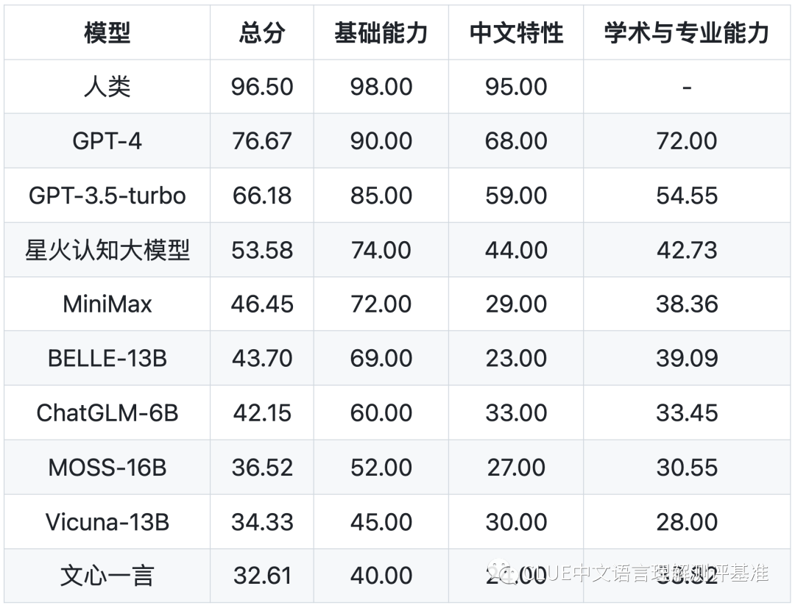
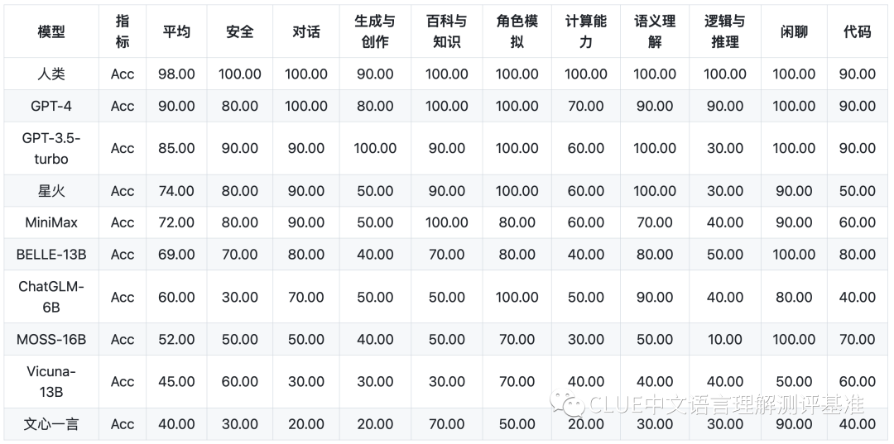
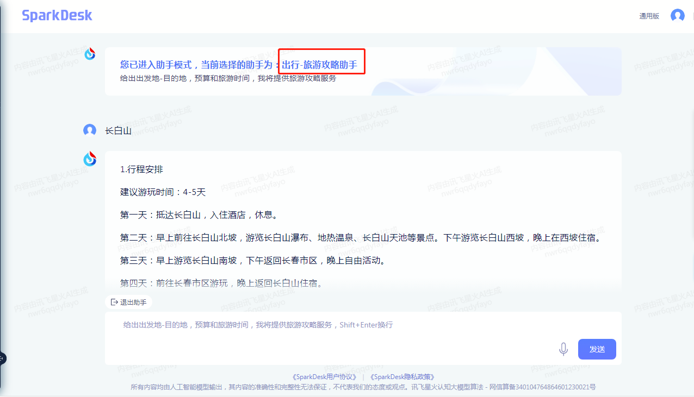
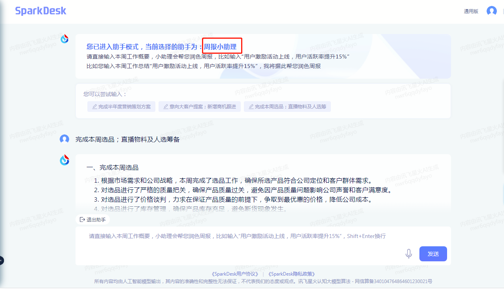
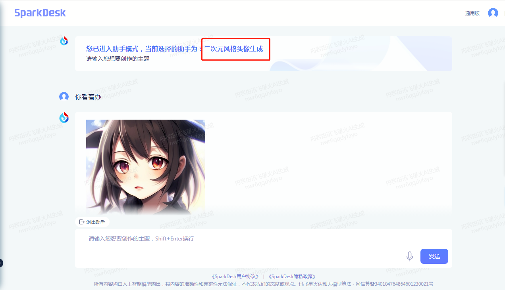

大家好，我是小❤

### 引言

距离 GPT4 发布已经半年多了，相信很多小伙伴都或多或少了解过。

但一方面 OpenAI 对国内的使用限制，包括台湾、香港节点都是禁止访问 GPT 官网的。

另一方面国内大模型的能力也参差不齐，很容易出一些牛头不对马嘴的问答笑话，或者干脆就是一本正经的胡说八道。

### 从测评出发，寻国产大模型

由于之前一直在玩国内的大模型，结合日常的使用，和专业测评方面，小❤发现：大模型的问答质量可以从模型的基础能力、专业能力以及中文特性能力三个维度 70 余项子能力来评估。

下面是专业评测机构 `SuperCLUE` 的评测结果：

图：CLUE 中文语言理解测评基准三项基础能力，侵删

总榜单如下：

图：CLUE 中文语言理解测评基准总榜单，侵删

榜单里的大模型小❤大部分都用过，今天我就从体验感上说一说自己的感受吧！

首先，从榜单中不难看出，科大讯飞的`星火认知大模型`在国内 GPT 的第一梯队里成绩都是非常好的。

### 技术原理

星火大模型背后的核心技术包括**深度学习、自然语言处理（NLP）、语音识别、计算机视觉**等领域。这些技术的完美融合，使得星火大模型在多个任务上表现卓越。

#### 1. 多模态融合

星火大模型采用了多模态融合的方法，可以同时处理文本、图像和语音数据。

这意味着它可以在多种应用中提供更全面的解决方案，包括自然语言处理、计算机视觉、多模态能力等等。

#### 2. 大规模无监督预训练

星火大模型的另一个亮点是其大规模无监督预训练技术。这种方法允许模型从大量的未标记数据中学习，提高了其在各种任务中的性能。这也是为什么星火大模型在多个领域都能傲视群雄的原因。

而这款大模型现在也发布了最新的 V2.0 版本，我自己也使用过，体验感首屈一指，可以说是效率神器了。

### 效率神器——星火认知大模型

打开首页面，可以看到有很多热门推荐功能：

小❤体验了下，星火大模型不仅集成了基本的写作，公众号爆款文案生成，以及出行攻略等能力：

而且在代码生成和 BUG 修复方面也绝不含糊，并且，打工人最烦的周报日报它也信手拈来：

最主要的是，星火 V2.0 在 AIGC 方面也比较出色，不仅可以按照我们的喜好来生成图片：

而且视频生成后还可以更换背景、变更形象：

### 厚积薄发：科大讯飞的认知智能领域实力

在使用之前，我一直没想到国产 GPT 目前可以做到这个地步。

后来详细了解一下，才知道原来科大讯飞一直以来都致力于在人工智能领域取得领先地位，星火大模型就是其最新力作，尤其是 V2.0，已经满足了大部分场景下的 AI 需求。

#### 1）令人惊叹的速度

一旦用户向讯飞星火提出问题，它的响应速度之快令人难以置信，几乎是瞬间完成。

与使用其他智能助手时的繁琐体验相比，讯飞星火的响应毫不拖延。如果你曾经因为其他工具的延迟而感到沮丧，那么讯飞星火将为你带来全新的使用体验。

#### 2）精准的逻辑

速度虽然重要，但只有快速而准确才能真正满足用户需求。从实际操作中可以看出，讯飞星火的响应逻辑性非常强大。

它内置了各种智能模型，让普通用户能够轻松获取高质量的响应，尤其是在细分的专业领域，这种精准度使讯飞星火在提供有针对性的解决方案方面表现卓越。

除此之外，讯飞星火的用户界面设计简洁，交互流畅高效。加之科大讯飞多年来在认知智能领域的深耕，已经注定了它在业内的领先地位。

科大讯飞的 AI 团队通过数十年的研究和创新，成功地打破了多项技术难关，将星火大模型打磨得如此精湛，以至于它能够胜任广泛的任务和应用。

### 福利

这两天，小❤为大家申请了一些内测体验名额，长按下面的内测二维码，点击**“申请注册”**即可：

**通过我的二维码注册：可以免费使用，秒通过审核**

打不开二维码的也可以直接点击注册链接：https://xinghuo.xfyun.cn/?ch=yyI4xjY，效果是一样的。

通过争取，从小 ❤ 的链接注册后还可以获得比常规注册渠道**多 30% 的 API 额度：200 万 V1.5 版本 Tokens、200 W 最新 V2.0 版本 Tokens，累计 400 万讯飞星火大模型 API 使用权益。**

### 小结

星火大模型在多个应用领域都展现了强大的潜力，而它的未来发展前景更是令人振奋。随着科大讯飞团队不断推进研究，星火大模型将不断升级和优化，以满足不断增长的 AI 需求。

此外，星火大模型的开放性也值得一提。科大讯飞鼓励开发者和合作伙伴积极参与，共同探索其潜力，这将为 AI 领域的创新带来更多机会和可能性。

对此，小❤对国内的大模型发展也开始持有了乐观的态度。

就像某国的技术封禁一样，**落后就会挨打，这是亘古不变的真理！**

所以，我们得不断训练自己的 AI 大模型问答工具，并且将它们做大做好。

在不久的未来，这些 AI 工具会成为我们的生产力，而那些认真做研发的企业和技术人员，也会成为科技创新的布道者。

有一位名人曾经说过：**AI 不会让人失业，反而会创造更多的岗位需求。而 AI 时代，熟悉 AI 工具的人无论在哪个行业，必定都会飞得更高，走得更远。**

未来，已来！