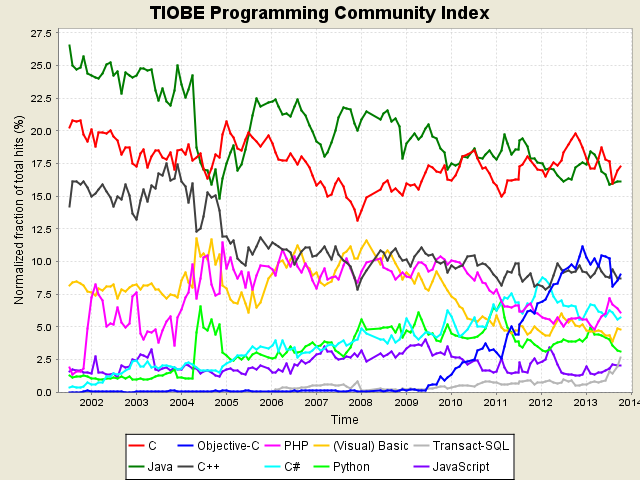
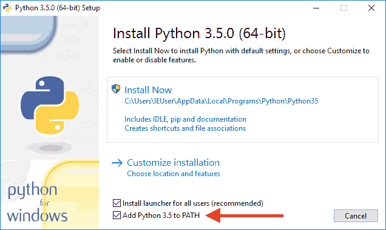
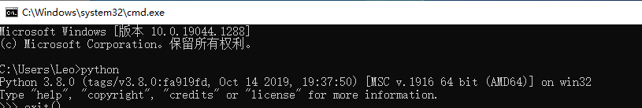
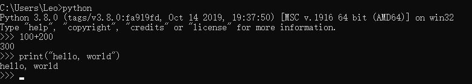
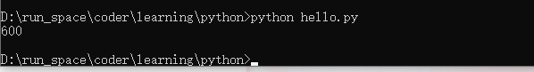

## 1. 入门

### 1.1 简介

Python可以做什么？

做日常任务，比如自动备份你的MP3；可以做网站，很多著名的网站包括YouTube就是Python写的；可以做网络游戏的后台，很多在线游戏的后台都是Python开发的。总之就是能干很多很多事啦。

Python当然也有不能干的事情，比如写操作系统，这个只能用C语言写；写手机应用，只能用Swift/Objective-C（针对iPhone）和Java（针对Android）；写3D游戏，最好用C或C++。


Python是著名的“龟叔”Guido van Rossum在1989年圣诞节期间，为了打发无聊的圣诞节而编写的一个编程语言。

现在，全世界差不多有600多种编程语言，但流行的编程语言也就那么20来种。如果你听说过TIOBE排行榜，你就能知道编程语言的大致流行程度。这是最近10年最常用的10种编程语言的变化图：




总的来说，这几种编程语言各有千秋。C语言是可以用来编写操作系统的贴近硬件的语言，所以，C语言适合开发那些追求运行速度、充分发挥硬件性能的程序。而Python是用来编写应用程序的高级编程语言。

当你用一种语言开始作真正的软件开发时，你除了编写代码外，还需要很多基本的已经写好的现成的东西，来帮助你加快开发进度。比如说，要编写一个电子邮件客户端，如果先从最底层开始编写网络协议相关的代码，那估计一年半载也开发不出来。高级编程语言通常都会提供一个比较完善的基础代码库，让你能直接调用，比如，针对电子邮件协议的SMTP库，针对桌面环境的GUI库，在这些已有的代码库的基础上开发，一个电子邮件客户端几天就能开发出来。

Python就为我们提供了非常完善的基础代码库，覆盖了网络、文件、GUI、数据库、文本等大量内容，被形象地称作“内置电池（batteries included）”。用Python开发，许多功能不必从零编写，直接使用现成的即可。

除了内置的库外，Python还有大量的第三方库，也就是别人开发的，供你直接使用的东西。当然，如果你开发的代码通过很好的封装，也可以作为第三方库给别人使用。


### 1.2 安装

因为Python是跨平台的，它可以运行在Windows、Mac和各种Linux/Unix系统上。在Windows上写Python程序，放到Linux上也是能够运行的。

要开始学习Python编程，首先就得把Python安装到你的电脑里。安装后，你会得到Python解释器（就是负责运行Python程序的），一个命令行交互环境，还有一个简单的集成开发环境。

#### 安装Python 3.8

目前，Python有两个版本，一个是2.x版，一个是3.x版，这两个版本是不兼容的。由于3.x版越来越普及，我们的教程将以最新的Python 3.8版本为基础。请确保你的电脑上安装的Python版本是最新的3.8.x，这样，你才能无痛学习这个教程。

#### 在Mac上安装Python

如果你正在使用Mac，系统是OS X>=10.9，那么系统自带的Python版本是2.7。要安装最新的Python 3.8，有两个方法：

方法一：从Python官网下载Python 3.8的[安装程序](https://www.python.org/downloads/)，下载后双击运行并安装；

方法二：如果安装了[Homebrew](https://brew.sh/)，直接通过命令`brew install python3`安装即可。

#### 在Linux上安装Python

如果你正在使用Linux，那我可以假定你有Linux系统管理经验，自行安装Python 3应该没有问题，否则，请换回Windows系统。

对于大量的目前仍在使用Windows的同学，如果短期内没有打算换Mac，就可以继续阅读以下内容。

#### 在Windows上安装Python

首先，根据你的Windows版本（64位还是32位）从Python的官方网站下载Python 3.8对应的[64位安装程序](https://www.python.org/ftp/python/3.8.0/python-3.8.0-amd64.exe)或[32位安装程序](https://www.python.org/ftp/python/3.8.0/python-3.8.0.exe)，然后，运行下载的exe安装包：



特别要注意勾上`Add Python 3.8 to PATH`，然后点“Install Now”即可完成安装。


### 1.3 运行Python

安装成功后，打开命令提示符窗口，敲入python后，会出现两种情况：

情况一：



看到上面的画面，就说明Python安装成功！

你看到提示符`>>>`就表示我们已经在Python交互式环境中了，可以输入任何Python代码，回车后会立刻得到执行结果。现在，输入`exit()`并回车，就可以退出Python交互式环境（直接关掉命令行窗口也可以）。

情况二：得到一个错误：

这是因为Windows会根据一个`Path`的环境变量设定的路径去查找`python.exe`，如果没找到，就会报错。如果在安装时漏掉了勾选`Add Python 3.8 to PATH`，那就要手动把`python.exe`所在的路径添加到Path中。


### 1.4 第一个Python程序

在命令行模式下输入 Python，进入交互模式。

Python的交互模式和直接运行`.py`文件有什么区别呢？

直接输入`python`进入交互模式，相当于启动了Python解释器，但是等待你一行一行地输入源代码，每输入一行就执行一行。

直接运行`.py`文件相当于启动了Python解释器，然后一次性把`.py`文件的源代码给执行了，你是没有机会以交互的方式输入源代码的。

用Python开发程序，完全可以一边在文本编辑器里写代码，一边开一个交互式命令窗口，在写代码的过程中，把部分代码粘到命令行去验证，事半功倍！前提是得有个27'的超大显示器！


在交互模式的提示符`>>>`下，直接输入代码，按回车，就可以立刻得到代码执行结果。现在，试试输入`100+200`，看看计算结果是不是300：

```
>>> print('hello, world')
hello, world
```



同时，命令行模式下可以用 `python hello.py` 运行一个 `.py` 文件。


比如：hello.py 为

> print(100+200+300)

执行结果：




#### 1.4.1 直接运行py文件

有同学问，能不能像.exe文件那样直接运行`.py`文件呢？在Windows上是不行的，但是，在Mac和Linux上是可以的，方法是在`.py`文件的第一行加上一个特殊的注释：

``` python
#!/usr/bin/env python3

print('hello, world')
```

然后，通过命令给`hello.py`以执行权限：

``` shell
$ chmod a+x hello.py
```

就可以直接运行`hello.py`了，比如在Mac下运行：


#### 1.4.2 输入

python 用 input() 来让用户输入，比如输入用户名字：

```
>>> name = input()
Leo
```

输入完成后，又回到命令行，这时，我们直接查看 `name` 变量：

``` shell
>>> name #或者print(name)
Leo
```


输入提示：

``` python
name = input("please input your name:")
print('hello, ', name)
```


## 2. Python语法

Python使用缩进来组织代码块，请务必遵守约定俗成的习惯，坚持使用4个空格的缩进。

在文本编辑器中，需要设置把Tab自动转换为4个空格，确保不混用Tab和空格。


#### 1）数据类型

**整数、浮点数**

十六进制：0xff00，

`_` 分隔：很大的数，由于难数清楚 0 的个数，比如 100000000，Python 允许在数字中间以 `_` 分隔，比如：10_000_000_000，十六进制也可以 0xa5b3_c3d。

Python 的整数没有大小限制，

Python 的浮点数也没有大小限制，但是超出一定范围后就直接表示为 `inf`（无限大）。


**字符串**

字符串内部既包含 `'` 又包含 `"` 时，可以用转义字符 `\` 来标识引号，比如：

``` python
'I\'m\"OK\"!', 即：I'm "OK"!
```

**不转义**

Python 还用了 `r''` 表示 `''` 内部的字符串默认不转义：

``` python
>>> print('\\t\\')
\    \
>>> print(r'\\\t\\')
\\\t\\
```

**换行的另一种表达**

如果字符串内部有很多换行，用 `\n` 写在一行不好阅读，可以用 `'''...'''` 的格式表示多行内容：

``` python
>>> print('''line1
...line2
...line3''')
line1
line2
line3
```

如果写成 Python 文件，就是：

``` python
print('''line1
line2
line3''')
```

多行字符串 `'''...'''` 还可以在前面加上 `r` 使用，转义符会失效，但 `'''...'''` 生效了：

``` python
>>> print(r'''hello,\n
...world''')
hello,\n
world
```


**布尔值**

Python 用  `True/False` 来表示布尔：

``` python
>>> True
True
>>> False
False
>>> 3 > 2
True
>>> 3 > 5
False
```

布尔值可以用 `and`、`or`和`not` 运算：

``` python
>>> True and True
True
>>> True and False
False

>>> True or True
True
>>> True or False
True

>>> not False
True
>>> not 1 > 2
True
```


**空值**

Python 的空值用 `None` 表示。


**变量**

变量不仅可以是数字，还可以是任意数据类型。变量在程序中用变量名表示，**变量名**必须是大小写英文、数字和 `_` 的组合，且不能用数字开头，比如：

``` python
a = 1
t_007 = 'T007'
Ans = True
```

Python 中的变量名可以反复赋值，而且可以是不同数据类型的变量：

``` python
a = 123
print(a)
a = 'ABC'
```


**动态语言与静态语言**

这种变量本身类型不固定的语言称之为*动态语言*，与之对应的是*静态语言*。静态语言在定义变量时必须指定变量类型，如果赋值的时候类型不匹配，就会报错。例如 Java 是静态语言，赋值语句如下（// 表示注释）：

```
int a = 123; // a是整数类型变量
a = "ABC"; // 错误：不能把字符串赋给整型变量
```

和静态语言相比，动态语言更灵活，就是这个原因。

编程语言中，赋值语句的等号和数学的等号不一样，比如：

``` python
x = 10
x = x+2
```

从数学理解就不成立！


**变量存储**

变量是存储在计算机的内存中：

``` python
a = 'ABC'
b = a
```

在赋值时，Python 解释器干了 3 件事：

1. 在内存中创建一个 `ABC` 的字符串
2. 在内存中创建一个名为 `a` 的变量，并把它指向 `ABC`
3. 在内存中创建一个名为 `b` 的变量，并把它指向 `a` 所指向的对象，也就是 `ABC`


**常量**

Python 是动态语言，所以没有常量的表示，仅仅是通常用大写的变量名表示，比如：

``` python
PI = 3.1415926
```


**除法**

Python 两种除号，分别为 `/` 和 `//` ：

``` python
>>> 10/3
3.333333
>>> 9/3
3.0
>>> 10//3
3
```

`//` 为地板除，也就是向下取整。

取余和别的语言一致，为 `%`：

``` python
>>> 10%3
1
```


#### 2）字符串和编码

**ASCII**

计算机是美国人发明的，所以最早就只有 127 个字符被编码到计算机里，也就是大小写英文字母、数字和一些符号，这个编码表被称为`ASCII`编码，比如大写字母`A`的编码是`65`，小写字母`z`的编码是`122`。

**多国语言编码**

但是 ASCII 码要处理中文显然一个字节是不够的，至少需要两个字节，而且还不能和 ASCII 编码冲突，所以，中国制定了`GB2312`编码，用来把中文编进去。

你可以想得到的是，全世界有上百种语言，日本把日文编到`Shift_JIS`里，韩国把韩文编到`Euc-kr`里，各国有各国的标准，就会不可避免地出现冲突，结果就是，在多语言混合的文本中，显示出来会有乱码。

**Unicode**

因此，Unicode字符集应运而生。Unicode把所有语言都统一到一套编码里，这样就不会再有乱码问题了。

Unicode标准也在不断发展，但最常用的是UCS-16编码，用两个字节表示一个字符（如果要用到非常偏僻的字符，就需要4个字节）。现代操作系统和大多数编程语言都直接支持Unicode。

现在，捋一捋ASCII编码和Unicode编码的区别：ASCII编码是1个字节，而Unicode编码通常是2个字节。其中：

* 字母`A`用ASCII编码是十进制的`65`，二进制的`01000001`；
* 字符`0`用ASCII编码是十进制的`48`，二进制的`00110000`，注意字符`'0'`和整数`0`是不同的；
* 汉字`中`已经超出了ASCII编码的范围，用Unicode编码是十进制的`20013`，二进制的`01001110 00101101`。

如果把ASCII编码的`A`用Unicode编码，只需要在前面补0就可以，因此，`A`的Unicode编码是`00000000 01000001`。

**UFT-8**

新的问题又出现了：如果统一成Unicode编码，乱码问题从此消失了。但是，如果你写的文本基本上全部是英文的话，用Unicode编码比ASCII编码需要多一倍的存储空间，在存储和传输上就十分不划算。

所以，本着节约的精神，又出现了把Unicode编码转化为“可变长编码”的`UTF-8`编码。UTF-8编码把一个Unicode字符根据不同的数字大小编码成1-6个字节，常用的英文字母被编码成1个字节，汉字通常是3个字节，只有很生僻的字符才会被编码成4-6个字节。如果你要传输的文本包含大量英文字符，用UTF-8编码就能节省空间：

| 字符 | ASCII    | Unicode           | UTF-8                      |
| :--- | :------- | :---------------- | :------------------------- |
| A    | 01000001 | 00000000 01000001 | 01000001                   |
| 中   | x        | 01001110 00101101 | 11100100 10111000 10101101 |

从上面的表格还可以发现，UTF-8编码有一个额外的好处，就是ASCII编码实际上可以被看成是UTF-8编码的一部分，所以，大量只支持ASCII编码的历史遗留软件可以在UTF-8编码下继续工作。

所以，目前计算机通用的字符编码工作方式是：

* 在计算机内存里，统一使用 Unicode 编码；
* 当需要保存到硬盘或者传输时，转换为 UTF-8 编码。


#### 3）Python的字符串

在 Python3 中，字符串是以 Unicode 编码的，支持多语言：

``` python
>>> print('包含中文的str')
包含中文的str
```


**字符与整数转换**

Python 提供 `ord()` 获取字符串的整数表示，`chr()` 把编码转换为字符：

``` python
>>> ord('A')
65
>>> ord('中')
20013
>>> chr(66)
'B'
>>> chr(25991)
'文'
```

如果知道字符从整数编码，还可以用十六进制这么写 `str`：

``` python
>>> '\u4e2d\u6587'
'中文'
```


**传输时需要转换为字节**

由于 Python 的字符串类型是 `str`，在内存中以 Unicode 表示，一个字符对应若干个字节。

所以，若要在网络传输，或者保存到磁盘，就需要把 `str` 变为以字节为单位的 `bytes`。

Python 提供了带 `b` 前缀的单引号或双引号转换为 `bytes`：

``` python
x = b'ABC'
y = 'ABC'
```

注意区分 `x` 和 `y`，后者是 `str`，前者是 `bytes`，虽然内容显示一样，但 `bytes` 的每个字符都只占用一个字节。

以 Unicode 表示的 `str` 通过 `encode()` 方法，可以编码为指定的 `bytes`：

``` python
>>> 'ABC'.encode('ascii')
b'ABC'
>>> '中文'.encode('utf-8')
b'\xe4\xb8\xad\xe6\x96\x87'
>>> 'ABC'.encode('utf-8')
b'ABC'
```

纯英文的`str`可以用`ASCII`编码为`bytes`，内容是一样的，含有中文的`str`可以用`UTF-8`编码为`bytes`。含有中文的`str`无法用`ASCII`编码，因为中文编码的范围超过了`ASCII`编码的范围，Python会报错。

反过来，如果我们从网络或磁盘上读取了字节流，那么读到的数据就是`bytes`。要把`bytes`变为`str`，就需要用`decode()`方法：

```
>>> b'ABC'.decode('ascii')
'ABC'
>>> b'\xe4\xb8\xad\xe6\x96\x87'.decode('utf-8')
'中文'
```

如果`bytes`中包含无法解码的字节，`decode()`方法会报错：

``` python
>>> b'\xe4\xb8\xad\xff'.decode('utf-8')
Traceback (most recent call last):
  ...
UnicodeDecodeError: 'utf-8' codec can't decode byte 0xff in position 3: invalid start byte
```

如果 `bytes` 只有一小部分无效字节，可以传入 `errors='ignore'` 忽略错误的字节：

``` python
>>> b'\xe4\xb8\xad\xff'.decode('utf-8', errors='ignore')
'中'
```


**len() 计算长度**

如果变量为 `str`，计算的是字符数；如果换成 `bytes`，计算的就是字节数：

``` python
>>> len(b'ABC')
3
>>> len(b'\xe4\xb8\xad\xe6\x96\x87')
6
>>> len('中文'.encode('utf-8'))
6
```

在操作字符串时，我们经常遇到`str`和`bytes`的互相转换。为了避免乱码问题，应当始终坚持使用UTF-8编码对`str`和`bytes`进行转换。

由于Python源代码也是一个文本文件，所以，当你的源代码中包含中文的时候，在保存源代码时，就需要务必指定保存为UTF-8编码。当Python解释器读取源代码时，为了让它按UTF-8编码读取，我们通常在文件开头写上这两行：

``` python
#!/usr/bin/env python3
# -*- coding: utf-8 -*-
```

第一行注释是为了告诉Linux/OS X系统，这是一个Python可执行程序，Windows系统会忽略这个注释；

第二行注释是为了告诉Python解释器，按照UTF-8编码读取源代码，否则，你在源代码中写的中文输出可能会有乱码。


申明了UTF-8编码并不意味着你的`.py`文件就是UTF-8编码的，必须并且要确保文本编辑器正在使用UTF-8 without BOM编码：


如果`.py`文件本身使用UTF-8编码，并且也申明了`# -*- coding: utf-8 -*-`，打开命令提示符测试就可以正常显示中文。


**格式化输出**

Python 中，格式化方式与 C 语言一致，用 `%` 实现：

``` python
>>> 'Hello, %s' % 'world'
'Hello, world'
>>> 'Hi, %s, you have $%d.' % ('Michael', 1000000)
'Hi, Michael, you have $1000000.'
```

你可能猜到了，`%`运算符就是用来格式化字符串的。在字符串内部，`%s`表示用字符串替换，`%d`表示用整数替换，有几个`%?`占位符，后面就跟几个变量或者值，顺序要对应好。如果只有一个`%?`，括号可以省略。

常见的占位符有：

| 占位符 | 替换内容     |
| :----- | :----------- |
| %d     | 整数         |
| %f     | 浮点数       |
| %s     | 字符串       |
| %x     | 十六进制整数 |

其中，格式化整数和浮点数还可以指定是否补0和整数与小数的位数：

``` python
>>> print('%3d-%02d' % (3, 1))
  3-01
>>> print('%.2f' % 3.1415926)
3.14
```


**format()**

另一种格式化字符串的方法是使用字符串的`format()`方法，它会用传入的参数依次替换字符串内的占位符`{0}`、`{1}`……，不过这种方式写起来比%要麻烦得多：

```
>>> 'Hello, {0}, 成绩提升了 {1:.1f}%'.format('小明', 17.125)
'Hello, 小明, 成绩提升了 17.1%'
```


**f-string**

最后一种格式化方法，如果字符串包含引号中的变量，如 `{xxx}`，就会将对应的变量替换：

``` python
>>> r = 2.5
>>> s = 3.14 * r ** 2
>>> print(f'The area of a circle with radius {r} is {s:.2f}')
The area of a circle with radius 2.5 is 19.62
```

上述代码中，`{r}`被变量`r`的值替换，`{s:.2f}`被变量`s`的值替换，并且`:`后面的`.2f`指定了格式化参数（即保留两位小数），因此，`{s:.2f}`的替换结果是`19.62`。


### 4）list和tuple

**list 数组**

```python
>>> classmates = ['Michael', 'Bob', 'Tracy']
>>> classmates
['Michael', 'Bob', 'Tracy']
```

`len()` 函数可以获取列表的元素个数：

``` python
>>> len(classmates)
3
```


Python 数组越界只会出现在超出范围时，负数表示倒数第 n 个数：

``` python
>>> classmates[-1]
'Tracy'
```


**数组操作（append，insert，pop）**

append，元素插入到数组尾端

``` python
>>> classmates.append('Adam')
>>> classmates
['Michael', 'Bob', 'Tracy', 'Adam']
```


insert，元素插入到数组指定位置

``` python
>>> classmates.insert(1, 'yfx')
>>> classmates
['Michael', 'yfx', 'Bob', 'Tracy', 'Adam']
```


pop 可指定删除下标，不指定默认删除最后一个元素

``` python
>>> classmates.pop()
'Adam'
>>> classmates
['Michael', 'yfx', 'Bob', 'Tracy']

>>> classmates.pop(0)
'Michael'
```


数组赋值操作

``` python
>>> classmates[0] = 'yfx'
>>> classmates
['yfx', 'yfx', 'Bob', 'Tracy']
```


和别的语言不同，Python 列表里的元素可以是不同数据类型：

``` python
>>> l = ['app', 123, True]
```

list 元素也可以包含别的 list：

``` python
>>> s = ['python', 'java', ['asp', 'php'], 'golang']
>>> len(s)
4
#要想获取php，可以用s[2][1]
```

空 list：

``` python
>>> L = []
>>> len(L)
0
```


**tuple 元组**

和 list 不同的是，tuple 一旦初始化，就不能修改：

``` python
>>> classmate = ('zhangs', 'lis', 'wangw')
```

tuple 没有 append、insert、pop 这样的方法，也没有赋值操作。

不可变的元组 tuple 的意义是：代码更安全。如果可能，能用 tuple 代替 list 就尽量用 tuple。


tuple 陷阱，定义多元素和空元素时无歧义：

``` python
>>> t = (1, 2)
>>> t
(1, 2)

>>> t = ()
>>> t
()
```


但是，定义一个元素时：

``` python
>>> t = (1)
>>> t
1
```

定义的不是 tuple，而是 `1` 这个数！这是因为括号`()`既可以表示tuple，又可以表示数学公式中的小括号，这就产生了歧义，因此，Python规定，这种情况下，按小括号进行计算，计算结果自然是`1`。


所以，只有1个元素的tuple定义时必须加一个逗号`,`，来消除歧义：

```
>>> t = (1,)
>>> t
(1,)
```


**可变的 tuple**

第一种情况，tuple重新指向：

``` python
>>> t = (1,2)
>>> t
(1, 2)
>>> t = (1,)
>>> t
(1,)
```

第二种情况，里面包含 list：

``` python
>>> t = ('a', 'b', ['A', 'B'])
>>> t[2][0] = 'X'
>>> t[2][1] = 'Y'
>>> t
('a', 'b', ['X', 'Y'])
```

表面上看 tuple 元素确实变了，但 tuple 一开始指向的 list 并没有改成别的 list，tuple 也可以重新指向。

所以，tuple 的不变，是指里面的每个元素指向永远不变。即指向`'a'`，就不能改成指向`'b'`，指向一个list，就不能改成指向其他对象，但指向的这个list本身是可变的！

理解了“指向不变”后，要创建一个内容也不变的tuple怎么做？那就必须保证tuple的每一个元素本身也不能变。


### 5）条件判断

#### if、else、elif

``` python
age = 3
if age >= 18:
    print('adult')
elif age >= 6:
    print('teenager')
else:
    print('kid')
```

注意冒号不能省略，并且，Python 没有 {} 代码块，以缩进为代码块来执行。


**条件简写**

``` python
if x:
    print('True')
```

只要 `x` 是非零数值，非空字符串，非空 list 等，就判断为 `True`，否则为 `False`。


**字符串转 int，int()**

``` python
s = input('birth: ')
birth = int(s)
if birth < 2000:
    print('00前')
else:
    print('00后')
```

`int()` 输入必须得是一个合法数字，否则会崩溃退出。

同理，想要转浮点数，可以用 `float()`。想要转字符串，可以用 `str()`。想要转布尔值，可以用 `bool()`。


**交作业环节**

根据身高和体重计算 BMI 值，判断该输入的体型：

``` python
# _*_ coding: utf-8 _*_

H = float(input('请输入身高:'))
W = float(input('请输入体重:'))

bmi = W/(H**2)
if bmi < 18.5:
    print('过轻，BMI为%.2f' % bmi)
elif bmi <= 25:
    print('正常，BMI为%.2f' % bmi)
elif bmi <= 28:
    print('过重，BMI为%.2f' % bmi)
elif bmi <= 32:
    print('过重，BMI为%.2f' % bmi)
else:
    print('严重肥胖，BMI为%.2f' % bmi)
```


### 6）循环

**for 循环**

Python 有两种循环 `for` 和 `while`，其中，`for...in`：

``` python
names = ['b', 'a', 'c']
for name in names:
    print(name)
```

`for x in ...`，将每个元素代入变量 `x`，然后指向缩进代码块的语句：

``` python
sum = 0
for x in [1,2,3,4,5]:
    sum = sum+x
print(sum)
```


**range()生成序列**

如果要计算 1-100 的和，写出来非常麻烦，Python 提供了一个 `range(n)` 函数，可以生成 `0~n-1` 的整数：

``` python
>>> print(range(10))
range(0, 10)
>>> print(list(range(5)))
[0, 1, 2, 3, 4]
```

通过 `list()` 转换，就可以得到一个整数序列数组。

``` python
sum = 0
for x in range(101):
    sum = sum+x
print(sum) #5050
```


**while循环**

只要条件满足，就不断循环，否则退出循环。比如，计算 100 以内的所有奇数之和：

``` python
sum = 0
num = 99
while num>0:
    sum = sum+num
    num = num-2
print(sum)
```


**break、continue**

Python 中，`break` 可以提前退出循环：

``` python
n = 1
while n <= 100:
    print(n)
    n = n + 1
print('END')
```

`continue` 可以忽略缩进块后续的逻辑：

``` python
x = 0
while x<=100:
    x = x+1
    if x%2 == 1:
        continue
    print(x)
```

break 和 continue 这两个语句通常都*必须*配合`if`语句使用。

要特别注意，不要滥用`break`和`continue`语句。`break`和`continue`会造成代码执行逻辑分叉过多，容易出错。大多数循环并不需要用到`break`和`continue`语句，上面的两个例子，都可以通过改写循环条件或者修改循环逻辑，去掉`break`和`continue`语句。

有些时候，如果代码写得有问题，会让程序陷入“死循环”，也就是永远循环下去。这时可以用 `Ctrl+C` 退出程序，或者强制结束 Python 进程。


**交作业环节**

写一个猜数字游戏，生成 (0-100) 的随机数，可以输入 5 次猜数字：

``` python
# _*_ coding: utf-8 _*_

import random
num = random.randint(0,100)
x = 0
n1 = 0 #记录猜的最近数
n2 = 100 #记录猜的最近数的距离

while x<5:
    x = x+1
    n = int(input('随机输入一个数：'))
    if n == num:
        print('你真聪明，只用了%d次就猜对了，答案是%d'%(x, num))
        break
    elif n>num:
        print('太大了！')
        if n-num<n2:
            n2 = n-num
            n1 = n
    else:
        print('太小了！')
        if num-n<n2:
            n2 = num-n
            n1 = n        
print('都猜错了！答案是%d，你猜的数%d很接近了，下次努力！'%(num,n1))
```


### 7）dict和set

字典 dict，在其他语言中也成称为 map，使用 k-v 存储方式，具有极快的查找速度。

``` python
>>> d = {'Michael': 95, 'Bob': 75, 'Tracy': 85}
>>> d['Michael']
95
```

也可以通过赋值操作完成：

``` python
>>> d['tom'] = 100
>>> d['tom']
100
```

如果 key 不存在，dict 就会报错。

避免 key 不存在，一种是通过 `in`，一种是通过 dict 提供的 `get()` 方法，如果 key 不存在，可以返回 `None`，或者指定的 value：

``` python
>>> 'yfx' in dict
True

>>> dict.get('yfx')
>>> dict.get('yfx', -1)
-1
```

**注意：**返回 `None` 的时候 Python 交互环境不显示结果。

删除 key，用 `pop(key)` 方法，对应的 value 也会从 dict 中删除：

``` python
>>> d.pop('Bob')
75
>>> d
{'Michael': 95, 'Tracy': 85}
```

**注意：**dict 内部存放顺序和 key 放入的顺序没有关系，也就是说，dict 是无序的。


**dict和list对比**

和list比较，dict有以下几个特点：

1. 查找和插入的速度极快，不会随着key的增加而变慢；
2. 需要占用大量的内存，内存浪费多。

而list相反：

1. 查找和插入的时间随着元素的增加而增加；
2. 占用空间小，浪费内存很少。

所以，dict是用空间来换取时间的一种方法。


**key不可变**

dict可以用在需要高速查找的很多地方，在Python代码中几乎无处不在，正确使用dict非常重要，需要牢记的第一条就是dict的key必须是**不可变对象**。

在 Python 中，字符串、数字等都是不可变的，而 list 是可变的，不能作为 key。


**set由list转换**

```python
>>> s = set([1, 1, 2, 2, 3, 3])
>>> s
{1, 2, 3}
```

set 也是无序的，且重复元素会被自动过滤。

`add(key)` 方法可以添加元素，重复元素会被自动过滤。

`remove(key)` 删除元素。

set 可以看成数学上无序、无重复元素的集合，因此两个 set 可以做数学意义上的交集、并集等操作：

``` python
>>> s1 = set([1, 2, 3])
>>> s2 = set([2, 3, 4])
>>> s1 & s2
{2, 3}
>>> s1 | s2
{1, 2, 3, 4}
```

和 dict 一样，set 也不能放入可变对象，比如 list。


**再议不可变对象**

对于可变对象 List，其内部的内容会发生变化，比如排序：

``` python
>>> a = ['c', 'b', 'a']
>>> a.sort()
>>> a
['a', 'b', 'c']
```

而不可变对象，比如 str：

``` python
>>> a = 'abc'
>>> a.replace('a', 'A')
'Abc'
>>> a
'abc'
```

其中，a 是变量，'abc' 是字符串对象，不可变指的是变量指向的内容不可变。

`replace` 方法只是创建了一个新字符串 `Abc` 了，这时，如果我们用变量 `b` 指向该新字符串，就容易理解了。

``` python
>>> a = 'abc'
>>> b = a.replace('a', 'A')
>>> b
'Abc'
```

所以，对于不变对象来说，调用对象自身的任意方法，也不会改变该对象自身的内容。相反，这些方法会创建新的对象并返回，这样，就保证了不可变对象本身永远是不可变的。


**tuple 是不可变对象，但是不总是可以作为 dict 的 key**

``` python
>>> tp = (1,2,3)
>>> dict = {tp:'a tuple'}
>>> dict
{(1,2,3):'a tuple'}

>>> tp = (1,[2,3])
>>> dict = {tp:'a tuple'}
SyntaxError: closing parenthesis ')' does not match opening parenthesis '('
```


## 3. 函数

### 3.1 函数调用

Python 内置了很多函数，我们可以直接调用。比如 `abs` 求绝对值，可以用 `help(abs)` 查看 `abs` 函数的帮助信息。

函数名其实是指向函数对象的一个引用，可以把函数名赋给一个变量，相当于给函数起了个“别名”。

``` python
>>> a = abs
>>> a(-1)
1
```

用内置的 `hex()` 函数，把一个整数转换成十六进制表示的字符串：

``` python
n = 1000
print(str(hex(n)))
```


### 3.2 函数定义

在Python中，定义一个函数要使用`def`语句，依次写出函数名、括号、括号中的参数和冒号`:`，然后，在缩进块中编写函数体，函数的返回值用`return`语句返回。

``` python
def my_abs(x):
    if x>=0:
        return x
    else:
        return -x
print(my_abs(int(input('请输入一个整数：'))))
```

在 Python 交互环境定义函数时，会出现 `...` 的提示，缩进需要手动打 4 个空格。函数定义结束后，按两次回车重新回到 `>>>` 提示符下：

``` python
>>> def my_abs(x):
...     if x>=0:
...         return x
...     else:
...         return -x
...
>>> my_abs(-9)
9
```


**函数导入**

如果你已经把`my_abs()`的函数定义保存为`abstest.py`文件了，那么，可以在该文件的当前目录下启动Python解释器，用`from abstest import my_abs`来导入`my_abs()`函数，注意`abstest`是文件名（不含`.py`扩展名）：

``` python
# _*_ coding: utf-8 _*_

from abstest import my_abs
print(my_abs(int(input('请输入一个整数：'))))
```


**空函数**

定义空函数用 `pass` 语句：

``` python
def nop():
    pass
```

`pass` 语句的作用是占位符，比如函数定义好之后，暂时没想好怎么写代码，可以先放一个 `pass`，让函数能运行起来。

`pass` 还可以用在其他语句里，比如：

``` python
if age>=18:
    pass
```

缺少了`pass`，代码运行就会有语法错误。


**参数检查**

调用函数时，如果参数的个数不对，Python 解释器会自动检查出来，并抛出 `TypeError`，但如果参数类型不对，Python 解释器就无法帮我们检查。

因此，我们需要用 `isinstance(x, type)` 来检查参数类型，用 `raise` 关键字抛出异常：

``` python
def my_abs(x):
    if not isinstance(x, (int, float)):
        raise TypeError('bad operand type')
    if x>=0:
        return x
    else:
        return -x
```

这时，如果传入错误的参数类型，函数就可以抛出一个错误：

``` python
>>> my_abs('A')
Traceback (most recent call last):
  File "<stdin>", line 1, in <module>
  File "<stdin>", line 3, in my_abs
TypeError: bad operand type
```


**返回多个值**

Python 返回多值时，是 tuple 类型的，但是不需要括号将返回参数包起来。

比如在游戏中经常需要从一个点移动到另一个点，给出坐标、位移和角度，就可以计算出新的坐标：

``` python
import math

def move(x, y, step, angle):
    i = x + step * math.cos(angle)
    j = y + step * math.sin(angle)
    return i,j
```

`import math`语句表示导入`math`包，并允许后续代码引用`math`包里的`sin`、`cos`等函数。

然后，我们就可以同时获得返回值：

``` python
>>> x, y = move(100, 100, 60, math.pi / 6)
>>> print(x, y)
151.96152422706632 70.0
```

虽然，print 打印出来的是两个值，但其实这只是一种假象，Python函数返回的仍然是单一值：

``` python
>>> r = move(100, 100, 60, math.pi / 6)
>>> print(r)
(151.96152422706632, 70.0)
```

返回值是一个tuple！但是，在语法上，返回一个 tuple 可以省略括号，**而多个变量可以同时接收一个 tuple，按位置赋给对应的值**，所以，Python的函数返回多值其实就是返回一个tuple，但写起来更方便。


**小结+练习**

函数体内部可以用`return`随时返回函数结果；

函数执行完毕也没有`return`语句时，自动`return None`。

定义一个函数，接收 3 个参数，返回一元二次方程 ax^2 + bx + c = 0 的两个解。

``` python
import math

def quadratic(a,b,c):
    a1,b1,c1 = not isinstance(a,(int,float)), not isinstance(b,(int,float)), not isinstance(c,(int,float))
    if a1:
        raise TypeError('a[%s]格式不正确'%a)
    if b1:
        raise TypeError('b[%s]格式不正确'%b)
    if c1:
        raise TypeError('c[%s]格式不正确'%c)
    if a==0:
        return None
    
    delta = b**2 - 4*a*c
    if delta<0:
        return ()
    else:
        print('delta:%s'%delta)
        x1 = (-b+math.sqrt(delta))/(2*a)
        x2 = (-b-math.sqrt(delta))/(2*a)
        return x1, x2
```


### 3.3 函数的参数

一个传参的函数定义如下：

``` python
def power(x):
    return x*x
```

两个传参：

``` python
def power(x,n):
    s = 1
    while n>=1:
        n = n-1
        s = s*x
	return s
```


#### 1）默认参数

这时，如何兼容之前一个值传参的调用呢？答案就是默认参数。

``` python
def power(x, n=2):
    s = 1
    while n>=1:
        n = n-1
        s = s*x
	return s
```

这样，当我们调用 `power(3)` 时，相当于调用 `power(3,2)`。


#### 2）默认参数注意事项

**默认参数可以有多个，但默认参数只能在必选参数的后面**，否则 Python 的解释器会报错；

使用默认参数的好处是？最大的好处是能降低函数调用的难度。

多个默认参数时，可以只传某一个（**要加参数名**）：

``` python
def enroll(name, gender, age=6, city='Beijing'):
    print('name:', name)
    print('gender:', gender)
    print('age:', age)
    print('city:', city)
>>> enroll('yfx', 'M', 18)
>>> enroll('yfx', 'M', city='shenzhen')
```


**默认参数不能指向可变对象**

比如，当我们的默认参数为 list 可变对象时：

``` python
def add_end(L=[]):
    L.append('END')
    return L
```

函数会在 list 后面添加一个 'END'：

``` python
>>> add_end()
['END']
>>> add_end()
['END', 'END']
```

发现没，L 指向的对象 `[]` 下次调用时，指向的内容就变了。

**用 None 来替换可变对象**

如果要用 list 作为默认参数，我们可以加一个 `None` 初始化的操作（None 和 str 一样，是不变对象）：

``` python
def add_end(L=None):
    if L is None:
        L=[]
    L.append('END')
    return L
```


#### 3）可变参数

第一种方式，传入 list 或 tuple：

``` python
def calc(nums):
    sum = 0
    for n in nums:
        sum = sum+n*n
    return sum
```

调用时，需要先组装出一个 list 或 tuple：

``` python
>>> calc([1,2])
>>> calc((1,2))
```

而**可变参数**就可以省略这步，直接调用：

``` python
def calc(*nums):
    sum = 0
    for n in nums:
        sum = sum+n*n
    return sum
```

调用：

``` python
>>> calc(1,2)
5
```


那如果我们已经组装好了一个 list 或者 tuple，怎么调用呢？

第一种方式，按下标传入：

``` python
nums = [1,2,3]
calc(nums[0], nums[1], nums[2])
```

第二种方式，直接加 *：

``` python
calc(*nums)
```


#### 4）关键字参数

可变参数是将传入的 0 或多个参数自动组装为 tuple，而**关键字参数**是传入 0 或多个**含参数名的参数**，自动组装为 dict。

``` python
def person(name, age, **kw):
    print('name:', name, ', age:', age, ', other:', kw)
```

调用时：

``` python
>>> person('Michael', 30)
name: Michael age: 30 other: {}
>>> person('Adam', 45, gender='M', job='Engineer')
name: Adam age: 45 other: {'gender': 'M', 'job': 'Engineer'}
```

和可变参数一样，也可以先组装 dict，再用 `**` 的方式加入：

``` python
>>> dict = {'city':'sz', 'edu':'lz', 1:3}
>>> person('yfx',18,**dict)
TypeError: person() keywords must be strings
>>> dict.pop(1)
3
>>> person('yfx', 18, **dict)
```

`person()` 函数里关键字参数的 key 只能为 string，且 `kw` 获取的 dict 是一个拷贝，所以对其改动不会影响到函数外的传参 dict。

**注意：**使用`*args`和`**kw`是Python的习惯写法，当然也可以用其他参数名，但最好使用习惯用法。


#### 5）命名关键字参数

函数内部可以对传入的关键字进行检查：

``` python
def person(name, age, **kw):
    if 'city' in kw:
        pass
    if 'job' in kw:
        pass
    print('name:', name, ', age:', age, ', other:', kw)
```

或者，直接**命名关键字参数**：

``` python
def person(name, age, *, city, job):
    print(name, age, city, job)
```

命名关键字参数时，需要加一个特殊的分隔符 `*`，其后面的参数被视为命名关键字参数，如：city、job。

**注意：命名关键字参数时，必须传入关键字，否则会报错：**

``` python
>>> person('yfx',18,'shenz','it')
TypeError: missing required keyword-only argument
```

除非使用默认值：

``` python
def person(name, age, *, city='Beijing', job):
    print(name, age, city, job)

>>> person('Jack', 24, job='Engineer')
Jack 24 Beijing Engineer
```


如果函数定义时，已经有了一个可变参数，后面的命名关键字参数就不需要加特殊分隔符 `*` 了：

``` python
def person(name, age, *args, city):
    print(name, age, args, city)
```

使用命名关键字参数时，要特别注意，如果没有可变参数，就必须加一个`*`作为特殊分隔符。如果缺少`*`，Python解释器将无法识别位置参数和命名关键字参数：

``` python
def person(name, age, city, job):
    # 缺少 *，city和job被视为位置参数
    pass
```

命名的关键字参数是为了限制调用者可以传入的参数名，同时可以提供默认值。


#### 6）参数组合

在 Python 中，五种参数可组合使用。但是，**参数定义的顺序必须是：必选参数、默认参数、可变参数（list/tuple）、命名关键字参数、关键字参数（dict）**。

比如，定义一个函数，包含若干个参数：

``` python
def f1(a,b=0,*c,city,job,**kw):
    print(a,b,c,city,job,kw)
>>> f1(1,2,[3,4],city='sz',job='it',work='proj')
1 2 [3,4] 'sz' 'it' {'work':'proj'}
```


有趣的是，使用 tuple 和 dict，也可以调用多参数的函数：

``` python
>>> def f2(a, b, c=0, *, d, **kw):
    print('a =', a, 'b =', b, 'c =', c, 'd =', d, 'kw =', kw)
>>> args = (1, 2, 3)
>>> kw = {'d': 88, 'x': '#'}
>>> f2(*args, **kw)
a = 1 b = 2 c = 3 d = 88 kw = {'x': '#'}
```

并且，对于任意函数，都可以通过类似 `func(*args, **kw)` 的方式调用，无论它们的参数是如何定义的。


### 3.4 递归函数

递归，即函数内部调用本函数，那这个函数就是递归函数，如阶乘计算函数：

``` python
def fact(n):
    if n==1:
        return 1
    return n * fact(n-1)
```

递归优点是定义简单，逻辑清晰。

但递归需要注意防止栈溢出。在计算机中，函数调用是通过栈来实现的，每进入一个函数调用，栈就会加一层栈帧，每个函数返回，栈就会减一层栈帧。

所以，递归调用 次数过多，会导致栈溢出。


#### 3.4.1 尾递归

尾递归是指，在函数返回时，调用自身本身。并且，return 语句不能包含表达式。这样，编译器或者解释器就可以把尾递归做优化，使**递归本身无论调用多少次，都只占用一个栈帧，不会出现栈溢出的情况**。

相当于迭代的思想，用一个数记录乘积的大小：

``` python
def fact(n):
    return fact_iter(n, 1)
    
def fact_iter(n,x):
    if n==1:
        return x
    return fact_iter(n-1, n*x)
```

可以看到，`return fact_iter(n-1, n*x)` 仅返回递归函数本身，`num - 1` 和 `num * product`在函数调用前就会被计算，不影响函数调用。


#### 3.4.2 练习

[汉诺塔](http://baike.baidu.com/view/191666.htm)的移动可以用递归函数非常简单地实现。

请编写`move(n, a, b, c)`函数，它接收参数`n`，表示3个柱子A、B、C中第1个柱子A的盘子数量，然后打印出把所有盘子从A借助B移动到C的方法，例如：

``` python
def move(n, a, b, c):
    if n == 1:
        print(a, '-->', c)
```


## 4. 高级特性

在 Python（任意语言）中，代码不是越多越好，而是越少越好。代码不是越复杂越好，而是越简单越好。


### 4.1 切片

和 Go 语言类似，用 `L[m:n]` 取出数组 `m...n-1` 这 m-n 个元素，且 m 和 n 都可省略，默认为 0 和 ` len(L)-1`。

同时，切片也支持倒数索引，比如 `L[-3:-2]`，倒数下标默认为 `-len(L)+1` 和 -1：

``` python
>>> L = [1,2,3]
>>> L[:0]
0
>>> L[:-1]
[1, 2]
>>> L[:3]
[1, 2, 3]
```

其中，`L[-10:]` 代表取后 10 个数；`L[:10]` 代表取前 10 个数。

tuple 也是一种 list，但 tuple 不可变，因此 tuple 也可以用切片操作，只是操作的结果仍是 tuple：

``` python
>>> (0, 1, 2, 3, 4, 5)[:3]
(0, 1, 2)
```

字符串 `'xxx'` 也可以看成是一种 list，每个元素就是一个字符。因此字符串也可以用切片操作：

```
>>> 'ABCDEFG'[:3]
'ABC'
>>> 'ABCDEFG'[::2]
'ACEG'
```

其中，`m:n:x` 代表切片从 m（包含）到 n（不包含），步长为 x。


==练习==

利用切片，实现一个 `trim()` 函数，去除字符串首尾空格，注意不要调用 str 的 `strip()` 方法。

``` python
def trim(s):
    if len(s) == 0:
        return ''
    while s[0] == ' ':
        s = s[1:]
        if len(s) == 0:
            return ''
    while s[-1:] == ' ':
        s = s[:-1]
        if len(s) == 0:
            return ''
    return s
```


### 4.2 迭代

Python 的迭代可以用在 list、tuple、dict 等类型上，其中根据 key 迭代：

``` python
>>> d = {'a':1, 'b':2, 'c':3}
>>> for key in d:
    	print(key)
a
c
b
```

dict 是无序存储，因此每次迭代顺序可能不一致。

字符串迭代：

``` python
>>> for k in 'abc':
    	print(k)
```

同时，dict 还可以对 value 和两者同时迭代，分别用 `values()` 和 `items()`：

``` python
for v in d.values():
    print(v)

for k,v in d.items():
    print(k,v)
```


**判断是否可迭代**

通过 `collections.abc` 模块的 `Iterable` 判断：

``` python
>>> from collections.abc import Iterable
>>> isinstance('abc', Iterable)
True
```


**下标循环**

Python 内置 `enumerate` 函数，可以把一个 `list` 变成索引-元素对：

``` python
for i,v in enumerate(['a', 'b', 'c']):
    print(i,v)
```

同时，两个变量同时引用，在 Python 里也是很常见的：

``` python
>>> for x, y in [(1, 1), (2, 4), (3, 9)]:
...     print(x, y)
```


**练习**

定义一个函数，通过迭代的方式获取 list 的最小值和最大值：

``` python
from collections.abc import Iterable

def findMinAndMax(L):
    if not isinstance(L, Iterable):
        raise TypeError('L is not Iterable')
    if not L:
        raise TypeError('list is empty')
    if len(L) == 1:
        return L[0], L[0]
    min, max = L[0], L[0]
    for k,v in enumerate(L):
        if v<min:
            min = v
        if v>max:
            max = v
    return min, max
```

用函数的方式实现：

``` python
from collections.abc import Iterable

def findMinAndMax(L):
    if not isinstance(L, Iterable):
        raise TypeError('L is not Iterable')
    miv,mav = min(L, default=None), max(L, default=None)
    return miv,mav
```


### 4.3 列表生成式

#### 1）range生成式创建

列表生成式，即 List Comprehensions，是 Python 内置的生成式创建方式。

``` python
>>> list(range(1,11))
[1, 2, 3, 4, 5, 6, 7, 8, 9, 10]
```

其中，`range` 函数也是 [a, c)，即包含 a 但不包含 b。

#### 2）列表生成

列表生成式还有一个用法，即在一行语句中代替循环。比如，我要生成`[1x1, 2x2, 3x3, ..., 10x10]`怎么做？方法一是循环：

``` python
L = []
for x in range(1,11):
    L.append(x*x)
print(L)
```

循环用了 4 行代码，略微繁琐，而列表生成式一行语句即可：

``` python
>>> [x*x for x in range(1,11)]
```

写列表生成式时，把要生成的元素`x * x`放到前面，后面跟`for`循环，就可以把list创建出来，十分有用，多写几次，很快就可以熟悉这种语法。

for循环后面还可以加上if判断，这样我们就可以筛选出仅偶数的平方：

``` python
>>> [x * x for x in range(1, 11) if x % 2 == 0]
[4, 16, 36, 64, 100]
```

还可以使用两层循环，生成全排列：

``` python
>>> [m + n for m in 'ABC' for n in 'XYZ']
['AX', 'AY', 'AZ', 'BX', 'BY', 'BZ', 'CX', 'CY', 'CZ']
```

三层和三层以上的循环就很少用到了。


运用列表生成式，可以写出非常简洁的代码。例如，**列出当前目录下的所有文件和目录名**，可以通过一行代码实现：

``` python
>>> import os
>>> [d for d in os.listdir('.')]
```

`os.listdir` 可以列出文件和目录


列表生成式还可以用两个变量来生成 list：

``` python
>>> d = {'x': 'A', 'y': 'B', 'z': 'C' }
>>> [k + '=' + v for k, v in d.items()]
['y=B', 'x=A', 'z=C']
```


把一个 list 中的所有字符串变为小写：

``` python
>>> L = ['Hello', 'World', 'IBM', 'Apple']
>>> [s.lower() for s in L]
['hello', 'world', 'ibm', 'apple']
```


#### 3）if else

前面说过，可以用 if 来筛选偶数输出：

``` python
>>> [x for x in range(1,11) if x%2 == 0]
```

但是，我们不能在最后的`if`加上`else`：

```python
>>> [x for x in range(1, 11) if x % 2 == 0 else 0]
  File "<stdin>", line 1
    [x for x in range(1, 11) if x % 2 == 0 else 0]
                                              ^
SyntaxError: invalid syntax
```

这是因为跟在`for`后面的`if`是一个**筛选条件**，不能带`else`，否则如何筛选？

另一些童鞋发现把`if`写在`for`前面必须加`else`，否则报错：

```python
>>> [x if x % 2 == 0 for x in range(1, 11)]
  File "<stdin>", line 1
    [x if x % 2 == 0 for x in range(1, 11)]
                       ^
SyntaxError: invalid syntax
```

这是因为`for`前面的部分是一个**表达式**，它必须根据`x`计算出一个结果。因此，考察表达式：`x if x % 2 == 0`，它无法根据`x`计算出结果，因为缺少`else`，必须加上`else`：

```python
>>> [x if x % 2 == 0 else -x for x in range(1, 11)]
[-1, 2, -3, 4, -5, 6, -7, 8, -9, 10]
```

可见，在一个列表生成式中，`for`前面的`if ... else`是表达式，而`for`后面的`if`是过滤条件，不能带`else`。

如果都加上呢，即在 for 前面加表达式，后面加筛选条件：

``` python
>>> [x if x % 2 == 0 else -x for x in range(1, 11) if x % 2 == 0]
[2, 4, 6, 8, 10]
```


### 4.4 生成器

生成器 `generator` 的 Python 的一个独有特性，可以列表生成式的空间。试想一下，如果我们创建一个包含 100 万元素的列表，但是只需要访问前面几个元素，这样会占用了很大的存储空间，浪费内存。

创建一个 `generator` 有很多种方法，第一种很简单，只需要把一个列表生成式的 `[]` 改为 `()`：

``` python
>>> L = [x * x for x in range(10)]
>>> L
[0, 1, 4, 9, 16, 25, 36, 49, 64, 81]
>>> g = (x * x for x in range(10))
>>> g
<generator object <genexpr> at 0x1022ef630>
```

创建`L`和`g`的区别仅在于最外层的`[]`和`()`，`L`是一个list，而`g`是一个generator。

我们可以直接打印出list的每一个元素，但我们怎么打印出generator的每一个元素呢？

如果要一个一个打印出来，可以通过`next()`函数获得generator的下一个返回值：

``` python
>>> next(g)
0
>>> next(g)
1
...
>>> next(g)
81
>>> next(g)
Traceback (most recent call last):
  File "<stdin>", line 1, in <module>
StopIteration
```

我们讲过，generator保存的是算法，每次调用`next(g)`，就计算出`g`的下一个元素的值，直到计算到最后一个元素，没有更多的元素时，抛出`StopIteration`的错误。

使用 `next` 获取元素很少见，我们常用的是 `for` 循环，因为generator也是可迭代对象：

``` python
for n in g:
    print(n)
```

`generator` 可以实现列表生成无法完成的事情。

比如，函数实现一个斐波拉契数列：

``` python
def fib(max):
    n,a,b = 0,0,1
    while n<max:
        print(b)
        a,b = b,a+b
        n = n+1
    return 'done'
```

其中，赋值语句：

``` python
a,b = b,a+b
```

相当于：

``` python
t = (b,a+b)
a, b =t[0],t[1]
```

仔细观察，可以看出，`fib`函数实际上是定义了斐波拉契数列的推算规则，可以从第一个元素开始，推算出后续任意的元素，这种逻辑其实非常类似generator。

也就是说，上面的函数和generator仅一步之遥。要把`fib`函数变成generator函数，只需要把`print(b)`改为`yield b`就可以了：

``` python
def fib(max):
    n,a,b = 0,0,1
    while n<max:
        yield b
        a,b = b,a+b
        n = n+1
    return 'done'
```

这就是定义generator的另一种方法。如果一个函数定义中包含`yield`关键字，那么这个函数就不再是一个普通函数，而是一个generator函数，调用一个generator函数将返回一个generator：

``` python
>>> f = fib(6)
>>> f
<generator object fib at 0x104feaaa0>
```

这里，最难理解的就是generator函数和普通函数的执行流程不一样。普通函数是顺序执行，遇到`return`语句或者最后一行函数语句就返回。而变成generator的函数，在每次调用`next()`的时候执行，遇到`yield`语句返回，再次执行时从上次返回的`yield`语句处继续执行。

举个简单的例子，定义一个generator函数，依次返回数字1，3，5：

``` python
def odd():
    print('step 1')
    yield 1
    print('step 2')
    yield(3)
    print('step 3')
    yield(5)
```

调用该generator函数时，首先要生成一个generator对象，然后用`next()`函数不断获得下一个返回值：

```
>>> o = odd()
>>> next(o)
step 1
1
>>> next(o)
step 2
3
>>> next(o)
step 3
5
>>> next(o)
Traceback (most recent call last):
  File "<stdin>", line 1, in <module>
StopIteration
```

 请务必注意：调用generator函数会创建一个generator对象，多次调用generator函数会创建多个相互独立的generator。

``` python
>>> next(odd())
step 1
1
>>> next(odd())
step 1
1
```

原因在于`odd()`会创建一个新的generator对象，上述代码实际上创建了3个完全独立的generator，对3个generator分别调用`next()`当然每个都会返回第一个值。

正确的写法是创建一个generator对象，然后不断对这一个generator对象调用`next()`，或者用 for 循环来迭代获取。

回到 `fib` 的例子，如果我们在循环中不断调用 `yield`，就不会中断，导致无限数列出现。

但是用 `for` 循环调用 generator 时，发现拿不到 generator 的 return 语句返回值：

``` python
def fib(max):
    n,a,b = 0,0,1
    while n<max:
        yield b
        a,b = b,a+b
        n = n+1
    return 'done'
```

如果想要拿到返回值，必须捕获`StopIteration`错误，返回值包含在`StopIteration`的`value`中：

``` python
g = fib(6)
while True:
    try:
        x = next(g)
        print('g:', x)
    except StopIteration as e:
        print('Generator return value:', e.value)
        break
```

执行结果：

> g: 1
> g: 1
> g: 2
> g: 3
> g: 5
> g: 8
> Generator return value: done


#### 练习

生成器生成杨辉三角形：

``` python
def triangles(L):
    while 1:
        if len(L) == 0:
            L = [1]
        elif len(L) == 1:
            L = [1,1]
        else:
            l1, l2 = L[:-1], L[1:]
            L = [1]
            for i,v in enumerate(l1):
                L.append(v+l2[i])
            L.append(1)
        yield L
```

利用 `zip()` 函数实现更简洁的写法：

``` python
def triangles():
    L = [1]
    yield L
    while 1:
        L = [m+n for m,n in zip([0]+L, L+[0])]
        yield L
```

`zip()` 入参为多个 list，出参为 list 的拼接 tuple：

``` python
>>> for x in zip([1,2], [3,4]):
        print(x)
(1, 3)
(2, 4)
>>> for x in zip([1,2], [3,4], [5,6]):
        print(x)
(1, 3 ,5)
(2, 4, 6)
```


### 4.5 迭代器

前面已经说过，可以用于 `for` 循环的数据类型有：

> list、tuple、set、dict、str、generator

这些对象统称为可迭代对象：`Iterable`。

可以用 `isinstance()` 判断对象是否是 `Iterable` 对象：

``` python
>>> from collections.abc import Iterable
>>> isinstance(object, Iterable)
```

其中，生成器 `genetator` 不仅可以用 `for` 循环，还可以被 `next()` 函数调用并返回下一个值，直接最后抛出 `StopIteration` 错误表示结束。

可以被`next()`函数调用并不断返回下一个值的对象称为迭代器：`Iterator`。

可以使用`isinstance()`判断一个对象是否是`Iterator`对象：

``` python
>>> from collections.abc import Iterator
>>> isinstance((x for x in range(10)), Iterator)
True
```

生成器都是`Iterator`对象，但`list`、`dict`、`str`虽然是`Iterable`，却不是`Iterator`。

#### iter()

把`list`、`dict`、`str`等`Iterable`变成`Iterator`可以使用`iter()`函数：

``` python
>>> isinstance(iter([]), Iterator)
True
>>> isinstance(iter('abc'), Iterator)
True
```

你可能会问，为什么`list`、`dict`、`str`等数据类型不是`Iterator`？

这是因为Python的`Iterator`对象表示的是一个数据流，Iterator对象可以被`next()`函数调用并不断返回下一个数据，直到没有数据时抛出`StopIteration`错误。可以把这个数据流看做是一个有序序列，但我们却不能提前知道序列的长度，只能不断通过`next()`函数实现按需计算下一个数据，所以`Iterator`的计算是惰性的，只有在需要返回下一个数据时它才会计算。

`Iterator`甚至可以表示一个无限大的数据流，例如全体自然数。而使用list是永远不可能存储全体自然数的。


#### for循环的本质

Python的`for`循环本质上就是通过不断调用`next()`函数实现的，例如：

```
for x in [1, 2, 3, 4, 5]:
    pass
```

实际上完全等价于：

```
# 首先获得Iterator对象:
it = iter([1, 2, 3, 4, 5])
# 循环:
while True:
    try:
        # 获得下一个值:
        x = next(it)
    except StopIteration:
        # 遇到StopIteration就退出循环
        break
```


## 5. 函数式编程

函数是 Python 内建支持的一种封装，是面向过程的程序设计的基本单元。所谓面向过程设计，就是把大段代码拆分成函数，通过一层一层的函数调用，把复杂的任务分解成简单的任务。


### 5.1 高阶函数

在 Python 里面，函数名就是变量。函数名不仅可以指向一个函数，还可以通过赋值操作指向别的数据：

``` python
>>> abs = 10
>>> abs(-10)
Traceback (most recent call last):
  File "<stdin>", line 1, in <module>
TypeError: 'int' object is not callable
```

高阶函数是指：一个函数可以接收另外一个函数作为参数，这种函数就称之为高阶函数。

一个最简单的高阶函数：

``` python
def add(x, y, f):
    return f(x) + f(y)

print(add(-5, 6, abs))
11
```


#### 5.1.1 Map/Reduce

`map()` 函数接收两个参数，一个是函数，一个是 `Iterable`，`map`将传入的函数依次作用到序列的每个元素，并把结果作为新的`Iterator`返回。

``` python
>>> def f(x):
    return x*x
>>> r = map(f, range(1,10))
>>> list(r)
[1, 4, 9, 16, 25, 36, 49, 64, 81, 100]
```

`map()`传入的第一个参数是`f`，即函数对象本身。由于结果`r`是一个`Iterator`，`Iterator`是惰性序列，因此通过`list()`函数让它把整个序列都计算出来并返回一个list。

你可能会想，不需要`map()`函数，写一个循环，也可以计算出结果：

```
L = []
for n in [1, 2, 3, 4, 5, 6, 7, 8, 9]:
    L.append(f(n))
print(L)
```

的确可以，但是，从上面的循环代码，能一眼看明白“把f(x)作用在list的每一个元素并把结果生成一个新的list”吗？

所以，`map()`作为高阶函数，事实上它把运算规则抽象了，因此，我们不但可以计算简单的f(x)=x2，还可以计算任意复杂的函数，比如，把这个list所有数字转为字符串：

```
>>> list(map(str, [1, 2, 3, 4, 5, 6, 7, 8, 9]))
['1', '2', '3', '4', '5', '6', '7', '8', '9']
```

只需要一行代码。


https://www.liaoxuefeng.com/wiki/1016959663602400/1017268131039072

参考资料：

廖雪峰Python：https://www.liaoxuefeng.com/wiki/1016959663602400/1017075323632896

