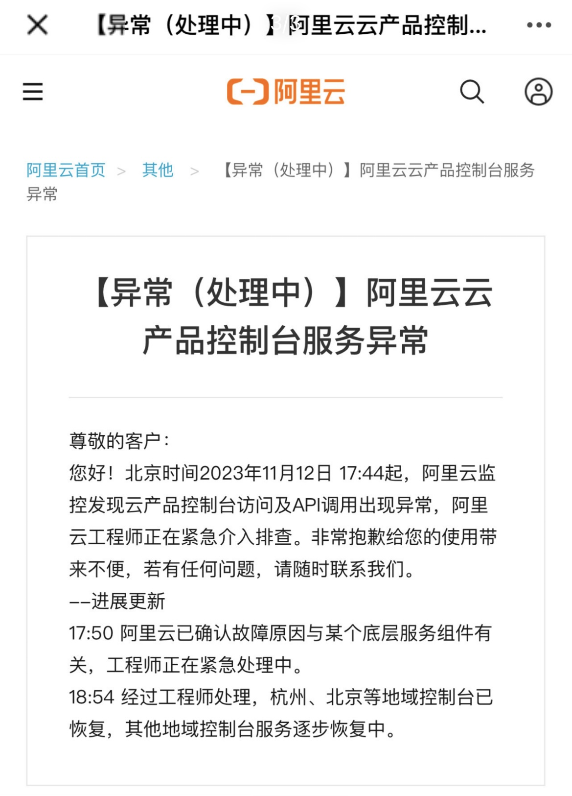
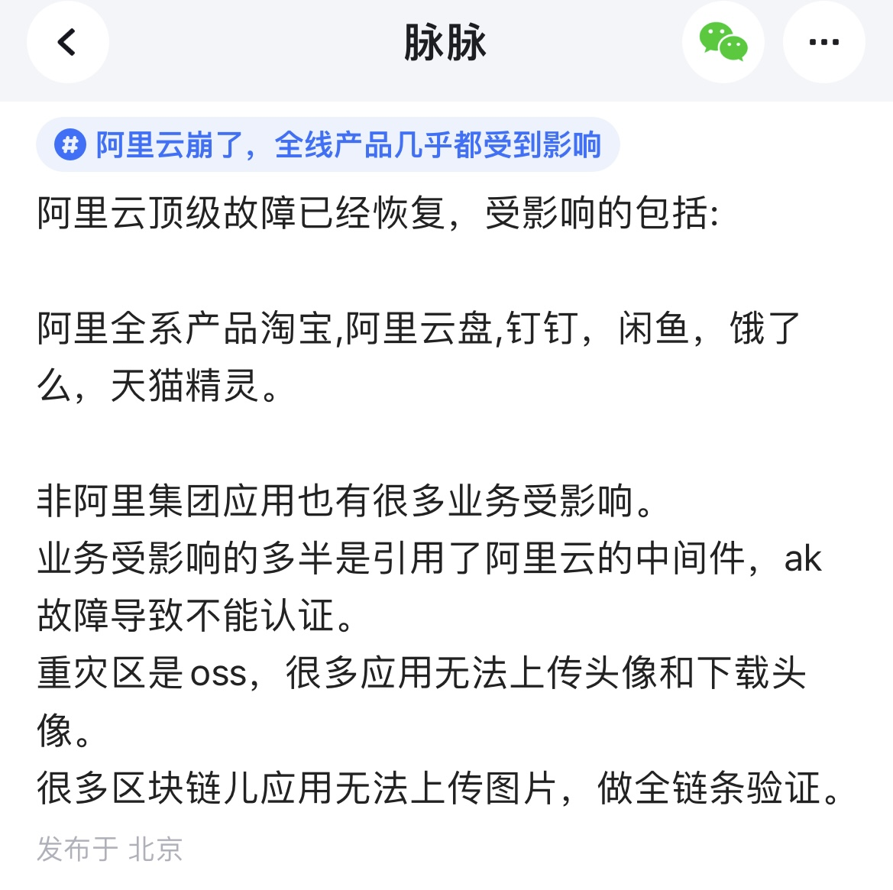
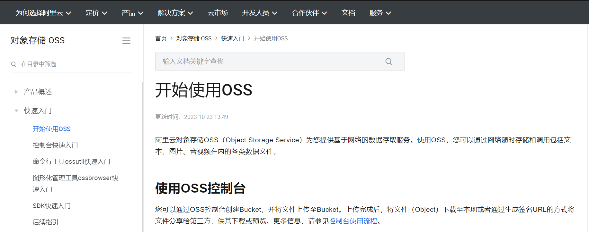
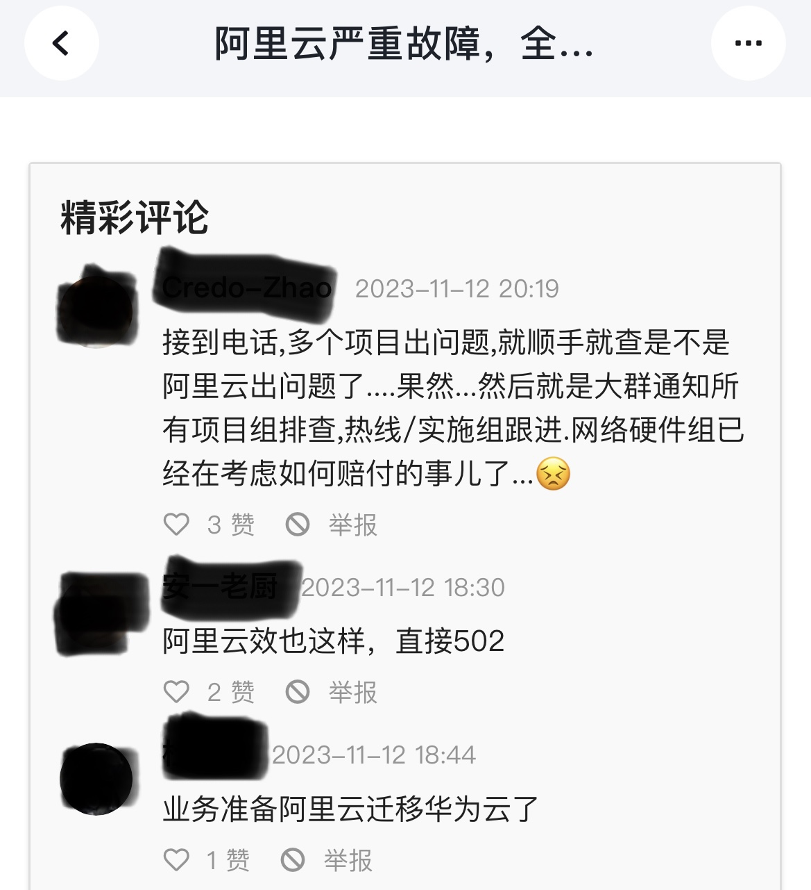

### 引言

大家好，我是小❤，距离上次阿里系产品语雀发生 P0 级故障不到一个月，阿里系产品又崩出了新高度。

> 时光穿梭机：
>
> * 谁懂啊，语雀故障的那7个小时我是怎么过来的

上次仅仅是语雀一个笔记软件，而这次，沾亲带故的应用都崩了，**包括但不限于：淘宝、咸鱼、阿里云等阿里系产品，还一度登上了微博热搜**：

图片来源：微博热搜，侵删

### 事故始末

从下午 17:44 发现 BUG 以来，阿里云工程师开始介入排查，逐步恢复，并持续发布问题进展：

图片来源：阿里云首页，侵删

在故障发生 `96min` 后，也就是 19:20，阿里云发布称工程师已经分批重启组件服务，绝大部分的地域控制台服务已恢复访问。

在三个多小时后，阿里云在 22:30 称：**受影响的云产品均已恢复，因故障影响部分云产品的数据（如监控、账单等）可能存在延迟推送情况，不影响业务运行。**

### 罪魁祸首：OSS

经过了解，阿里的这次顶级故障起源于阿里云的一款存储组件—— `OSS`（Object Storage Service，对象存储服务）。

图片来源：脉脉，侵删

当 OSS 组件出现 BUG 后，拒绝了所有调用请求，而不出意外的：**所有使用该组件的产品调用都出现了异常。**

下午崩溃期间，语雀访问时就出现了类似的报错提示：

图片来源：网络，侵删

### 可靠性评估

那 OSS 到底是啥呢？为啥它一崩，这么多阿里系的大型应用都受到了影响，有的甚至变为了不可用状态。

我们打开阿里云官网，看到里面的介绍：

图片来源：阿里云官网，侵删

原来，OSS 是一个对象存储服务，之前我们在很多架构设计的文章里都说过，当数据文件过大时，一般会将数据分成**元数据**和**对象文件数据**来分开存储。

> 想了解更多数据分离存储的场景，可以看我之前的这篇文章：听说你会架构设计？来，弄一个网盘系统

**为什么数据要分开存储呢？**

这是因为像 MySQL 这类**关系型数据库**，一般以表格的形式来存储易于索引的数据，支持复杂查询。而**非关系型数据库**更加灵活，适用于需求不断变化的内容：比如图片、视频、文档等**非结构化数据**。

而 OSS 就是阿里云提供存储非结构化数据的一个组件，以稳定可靠和易于扩展著称：

图片来源：阿里云官网，侵删

所谓高可靠性，是指在运行过程中可以正常提供服务的时间占比。一般大型应用都**至少要求 4 个 9 以上，即：99.99%，一年里服务出现的异常时间不超过 53min**。

而 12 个 9……感兴趣的小伙伴可以算一下，这次阿里云的 96min 故障时间超过了最大可异常时间的多少倍。

也有网友精准指出，阿里云的这波故障，今年的可用性冲上 3 个 9 都费劲了：

图片来源：脉脉，侵删

### 事件持续酝酿

虽然故障已经基本解决，但事件引发的轩然大波还在持续酝酿，毕竟阿里这次的故障范围太广：

图片来源：脉脉，侵删

在事故修复后的几个小时内，阿里系产品崩溃事件也一度占据热榜榜首位置：

### 用户体验

对于中小型应用来说，经历此次事件也可能是好事，大家都得清楚地知道，**服务高可靠是一个相对的概念，当底层组件出现问题时，没有什么系统可以独善其身**

这时候，才是真正考验服务的高可用的时间：比如服务降级、熔断、用户提示等机制。

比如，就有网友抨击阿里云盘的用户提示太 Low，根本看不懂写的什么内容：

图片来源：网络，侵删

其实，互联网应用就像人的身体一样，一帆风顺时都没啥，**一旦身体组件出问题了，才发现原来它们的作用这么大。**

这时候，脸色有多难看，别人可都看得见！

### 小结

最后，小❤想说，从一个架构师的角度来看：没有百分百可靠的系统，在一定的资源下，无限接近用户需求和体验的系统，就是一个好的系统。

所以如果大家的产品用了阿里云的组件，正好也挂了，那先不要着急！就像这位网友所说，项目出现问题时先不要慌，先找到问题，如果不是自己的问题，可以考虑追责和要求赔付：

图片来源：网络，侵删

如果是自己的问题呢？

我也不知道，咱们再一起看看阿里云后续怎么说吧！

毕竟，上次语雀一个应用挂了 7 个小时，就给所有个人用户充了一波 6 个月的会员。

> 详情见这篇文章：谁懂啊，语雀故障的那7个小时我是怎么过来的

而以阿里云的公关团队和处理策略，自然不可能太差吧，你们觉得呢？

