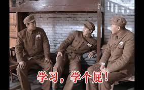
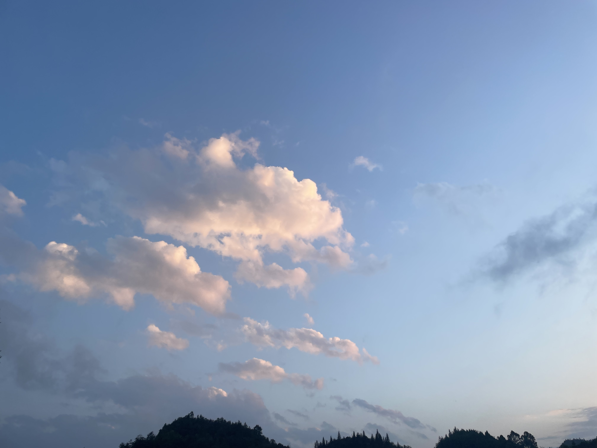
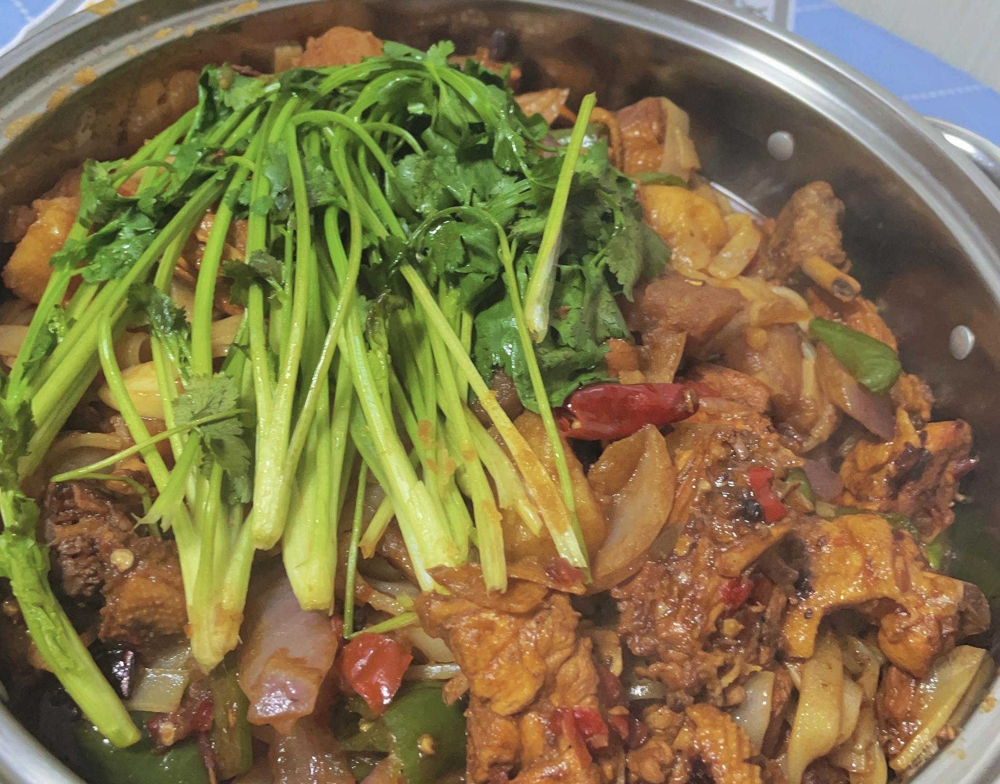
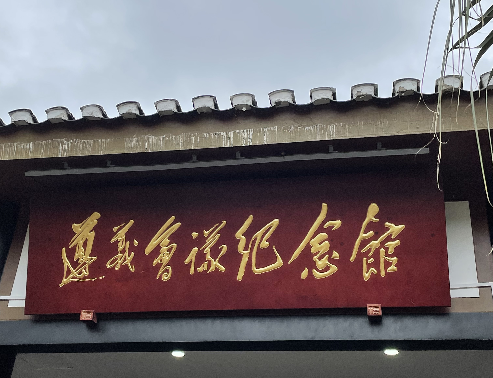
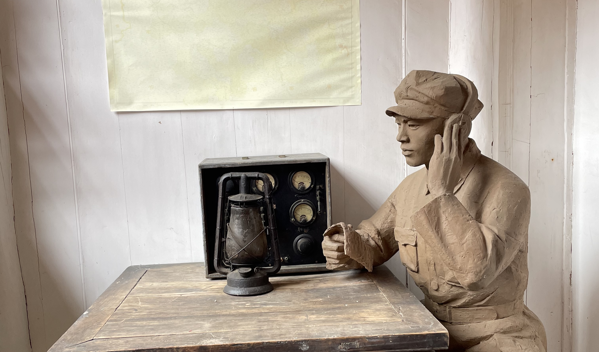
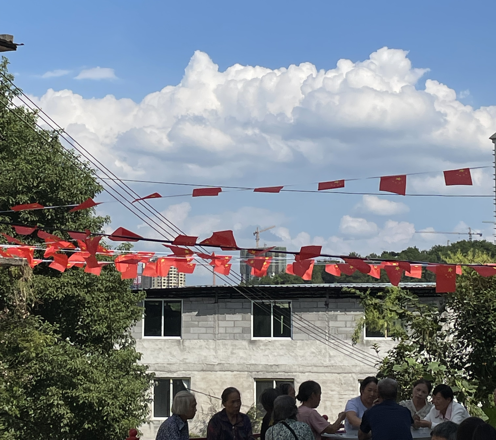
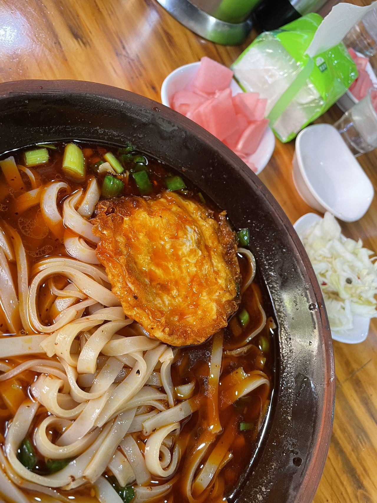

大家好，我是小❤。

国庆与中秋，过得太快了，不知道大家的假期规划完成了多少？

**反正对于我来说，只要回到家，学习和工作计划基本就告一段落了。**

不过这个假期也并非一无所获，在家待了几天陪了陪家人，吃了几顿流水席，打了几圈麻将，也在遵义会议会址重温了下红色历史。

和以往不同，这次是生病做手术结束后的第一次回家。可能在医院待过一段时间了，**家里流水席的喜庆和一家人围坐一起的温馨，尤其让我心动。**

#### 山上看夕阳，感受自由

国庆和中秋期间，我迫不及待地踏上回家的路程，首先选择了一个人的自由旅行，前往了附近的山上，追寻夕阳的美丽。

这是我每次回家必做的一件事，站在山巅，凉风拂面，去感受大自然的宁静与壮丽。

**夕阳西下，余晖映照山峦，仿佛天空、大地和群山为我上演了一场壮美的视觉盛宴。**

这个时刻，我感受到了自由的美好，也反思了生活中的点滴幸福。

#### 回家的温馨与聚会的欢乐

无论身在何处，回家永远是一种特别的感觉，仿佛是回到了生命的源头。

**家中的暖意和故乡的月亮都让我感到宾至如归。**

在回来的前两天，还与多年未见的大学室友聚在一起，谈笑风生，分享彼此工作后的生活点滴，彼此的成长经历。

还下厨做了一桌很辣的贵州菜招待朋友和亲人，这种友情和亲情，亦是时光无法割舍的珍贵财富。

#### 探索历史的足迹：遵义会议会址游玩

在家乡，我有了难得的机会去探寻遵义的历史遗迹。我们前往了遵义会议会址，这个地方承载着中国革命历史的光辉。

**站在那里，仿佛穿越回了那个关键时刻。**

遵义会议会址博物馆陈列着大量珍贵的历史文物和照片，让我更加深刻地了解了中国革命的艰辛过程。

不禁为那个特殊时期的伟大领袖们默默致敬，*他们在 88 年前的决策和胆识，改变了中国的命运。*

#### 美食盛宴：流水席的诱惑

国庆和中秋，少不了的当然是美食。在家乡，我们尝试了各种地道的贵州美食，其中最令人印象深刻的是流水席。

**这是一种传统的宴会方式，桌上摆满各式各样的菜肴，就像是一场视觉和味觉的盛宴。**

流水席上的酸汤鱼、黔菜、粉蒸肉等美味令人回味无穷。而丰盛的菜肴也像是我们家人和朋友之间的情感交流，每一道菜都是关心和呵护的表达。

当然，每次回到家总少不了一碗心心念念的羊肉粉（米皮）。

第一口进嘴，就能感受到那醇厚的羊肉汤底，仿佛一股温暖的潮流在口中蔓延。

而嫩滑的羊肉片，搭配上爽口的粉条/米皮，简直是味蕾的一大享受。调味的秘制酸萝卜/莲白更是锦上添花，让每一口都带来浓烈的满足感。

#### 告别双节，新的开始

国庆和中秋的假期总是短暂而充实的，不知不觉中已经结束。

提前一天，我踏上了回到深圳的旅程，准备迎接工作和生活的挑战。虽然假期已经结束，但是**那种充实而休闲的氛围永远留在了心中，这对于一个异乡打拼的年轻人来说，尤其珍贵。**

双节期间的快乐和温馨充实了我的心灵，让我更加珍惜平日里的工作和生活。

国庆和中秋的双节，不仅是家人的团聚，也是友情的升华，更是自我的成长。生过一场病以后，我反而能更纯粹地看待生命和生活了，这次国庆的经历，**让我明白了平淡里充斥着的精彩，感受到了平常家庭的幸福滋味。**

无论何时何地，都要珍惜这些美好时光，让它们成为生活的甜蜜回忆。国庆与中秋，是心灵的滋养，亦是前行的动力。