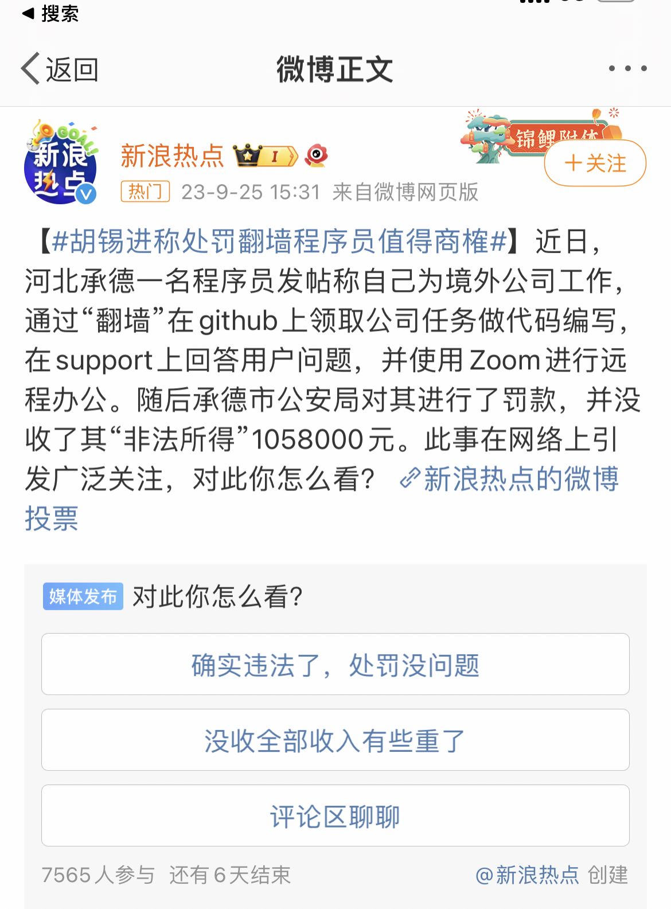
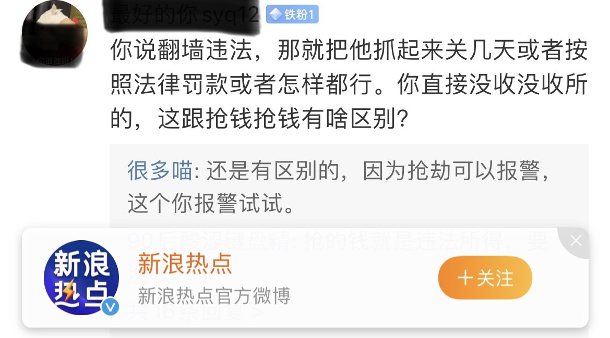
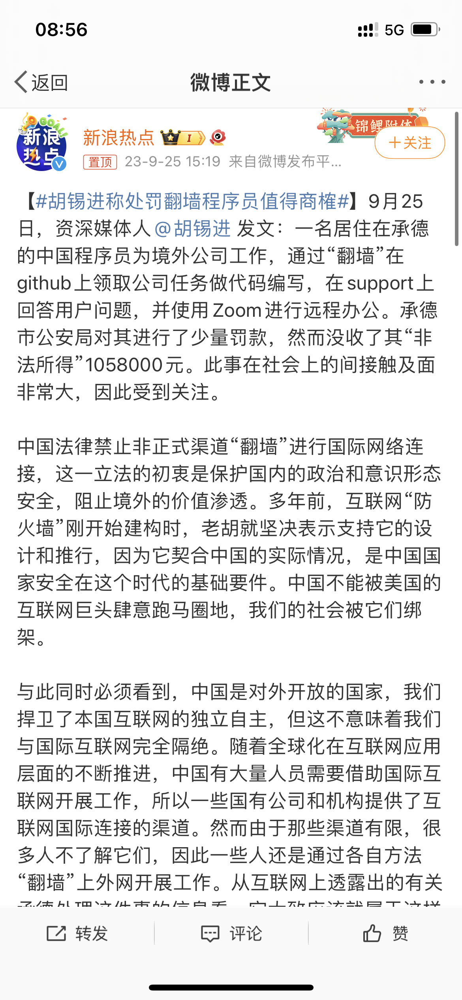
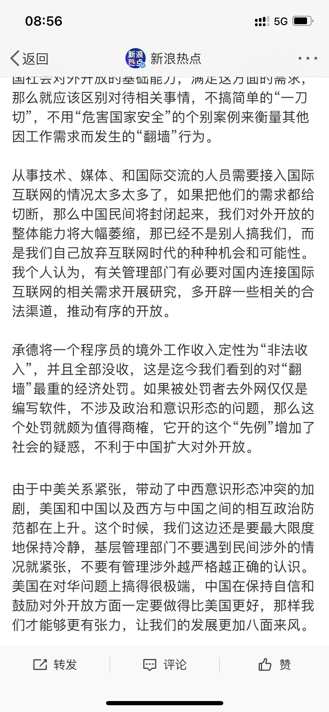
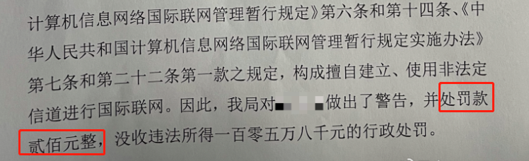
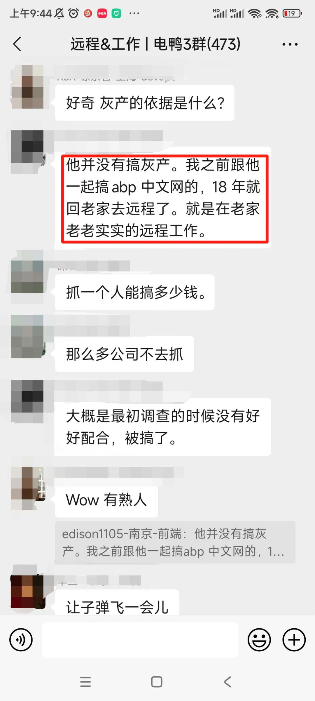
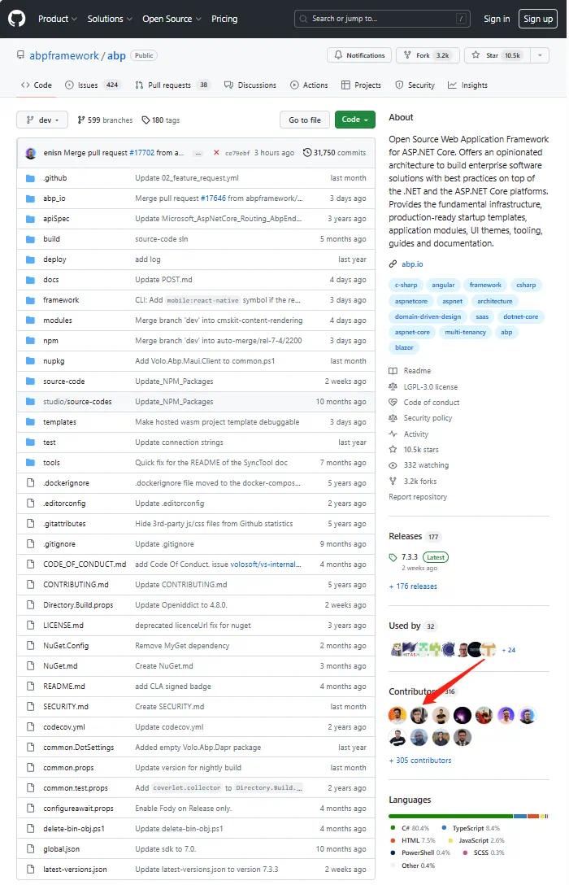
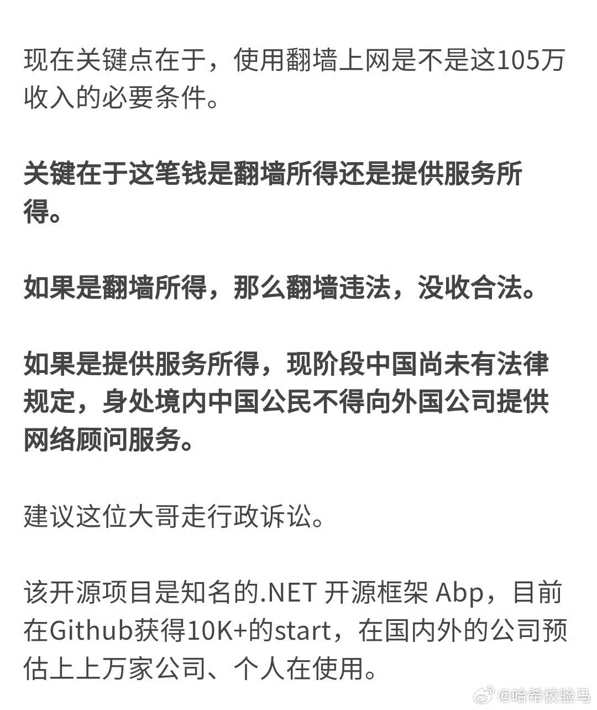

### 1. 翻墙处罚

最近，河北承德的一名程序员发帖，称自己为境外公司工作。通过 “翻墙” 在 GitHub 上领取公司任务做代码编写，在 support 上回答用户问题，并使用 Zoom 进行远程办公。

> 网络翻墙所指的 “墙”，指的是“国家公共网络监控系统”-GFW（The Great Fire Wall of China），俗称中国国家防火墙。
>
> 网络“翻墙”又称“破网”，是指通过虚拟专用网络（VPN）技术规避国家网络监管，突破IP封锁、内容过滤、域名劫持、流量限制等，非法访问被国家禁止的境外网站行为。

随后，承德市 GAJ 对其进行了罚款，**没收了其“非法所得”1058000元**。

图片来源：新浪微博，侵删

该程序员不服处罚的答辩状如下

图片来源：新浪微博，侵删

此事在网络上引发广泛关注和讨论，小❤也化身吃瓜群众，看了一下评论区。注意，接下来的观点来自微博评论，不代表个人观点。

### 2. 网友讨论

有网友说：**打黑车去上班，是要把上班的收入都罚没吗？**

图片来源：新浪微博，侵删

还有网友表示：处罚过于严重了。

图片来源：新浪微博，侵删

接下来，资深媒体人胡锡进也发文表示处罚或许过重。

图片来源：新浪微博，侵删

他还表示，技术人员需要接入国际互联网的情况太多太多了，有关管理部门有必要对相关需求开展研究，多开辟一些相关的合法渠道，推动有序开放。

图片来源：新浪微博，侵删

对待此事件，网上众说纷纭。主要**围绕两个问题讨论，该罚还是不该罚，收入所得该没收还是不该没收。**

接下来，我们先来给从《国家网络安全局的宣传文件》里面给大家普及一下翻墙小知识。

### 3. 从网络安全看“翻墙”

#### 翻墙的危害

我们都知道，翻墙有很多危害。主要有以下三点：

1. **泄露隐私**：使用“翻墙”软件时，发送与接收的数据都会通过提供商的机器，用户的账号密码，甚至一些银行账号信息等个人隐私极易被泄露。
2. **造成思想混乱**：境外网络和社交媒体上充斥着大量煽动性内容，部分人员政治鉴别力不够，热衷“政治野史”“惊天秘闻”，受反动思想渗透蛊惑、拉拢策反，易沦为错误观点的“二传手”、成为境外间谍情报机关的棋子。
3. **诱发问题案件**：长期“翻墙”上网浏览暴力、颓废和色情等有害信息，容易被违法犯罪分子所利用，引诱参与网络赌博、非法借贷、吸毒嫖娼，引发刑事案件和自杀问题。

#### 翻墙违法吗

所以，我国明确禁止个人“翻墙”行为。根据《中华人民共和国计算机信息网络国际联网管理暂行规定》第六条：

> 计算机信息网络直接进行国际联网，必须使用邮电部国家公用电信网提供的国际出入口信道。任何单位和个人不得自行建立或者使用其他信道进行国际联网。

#### 如何处罚

根据《中华人民共和国计算机信息网络国际联网管理暂行规定》第十四条规定：违反本规定第六条、第八条和第十条的规定的，由公安机关责令停止联网，给予警告，可以并处 15000 元以下的罚款；**有违法所得的，没收违法所得。**

### 4. 两个问题

#### 1）该不该罚

从法律和网络安全的角度来看，该程序员由于翻墙行为违法，所以该罚，对于这个应该没有争议。

#### 2）该不该没收个人所得

有网友称，该程序员是多年的技术开发者，这次没收的 105 万元也是他三年的正常工作所得。

图片来源：网络，侵删

而他在的开源项目是知名的 .NET 开源框架 Abp，目前经 GitHub 获得 10K+ 的 star。

既然不是灰色产业所得，那么关键点就在于，**这笔钱是翻墙带来的收入，还是提供服务所得的收入。**

如果是翻墙所得，翻墙违法，没收也合理。

但如果是提供服务所得，**目前中国没有明确的法律规定，身处境内的中国公民不得向外国公司提供网络顾问服务，就可能存在争议点。**

图片来源：新浪微博，侵删

该程序员也在网上称，会继续上诉直到获得一个合理的说法。对此大家怎么看呢？