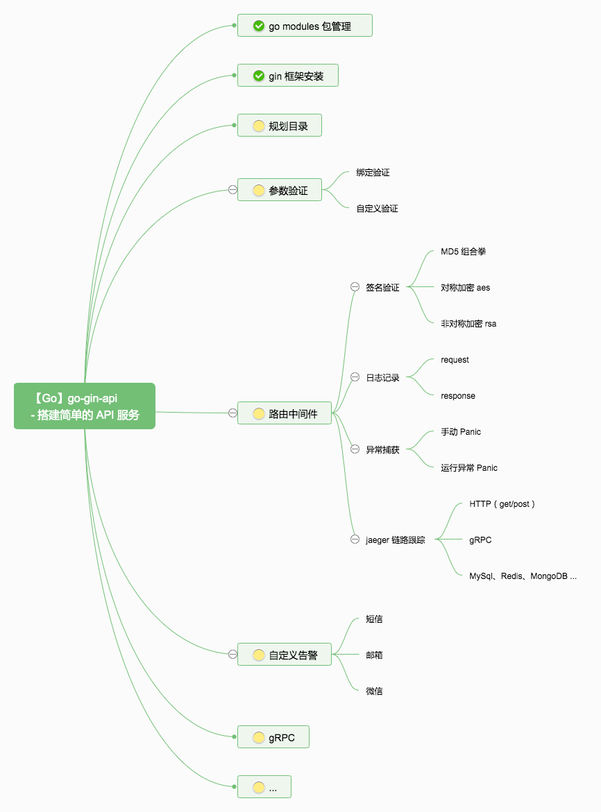

go-blog

从 0 到 1 搭建一个博客系统



## 安装 Go

网上很多教程，可以看这篇文章。


## 初始化

GOPATH 之外的地方，新建一个空白文件夹 go-blog。

``` sh
cd go-blog && go mod init go-blog
```

输出：

go: creating new go.mod: module go-blog

这时目录中多一个 go.mod 文件，内容如下：

```go
module go-blog

go 1.20
```

到这，go mod 初始化就完成，接下来新增 main 函数，并添加依赖包 - gin。


## 添加依赖包

在目录中创建一个 `main.go` 的文件，放上如下代码：

```
package main

import "github.com/gin-gonic/gin"

func main() {
	r := gin.Default()
	r.GET("/ping", func(c *gin.Context) {
		c.JSON(200, gin.H{
			"message": "hello world",
		})
	})
	r.Run() // listen and serve on 0.0.0.0:8080
}
```


这代码没什么特别的，就是官方的入门Demo。

接下来，开始下载依赖包。

```
go mod tidy
```


执行完成后，看一下 `go.mod` 文件：

```
module go-blog

go 1.20

require github.com/gin-gonic/gin v1.9.1
```

这时，看到新增一个 gin v1.9.1 的包，当前最新版本【北京时间：2023-09-25】。


参考：https://github.com/xinliangnote/Go/blob/master/03-go-gin-api%20%5B%E6%96%87%E6%A1%A3%5D/01-%5Bgo-gin-api%5D%20%E4%BD%BF%E7%94%A8%20go%20modules%20%E5%88%9D%E5%A7%8B%E5%8C%96%E9%A1%B9%E7%9B%AE.md