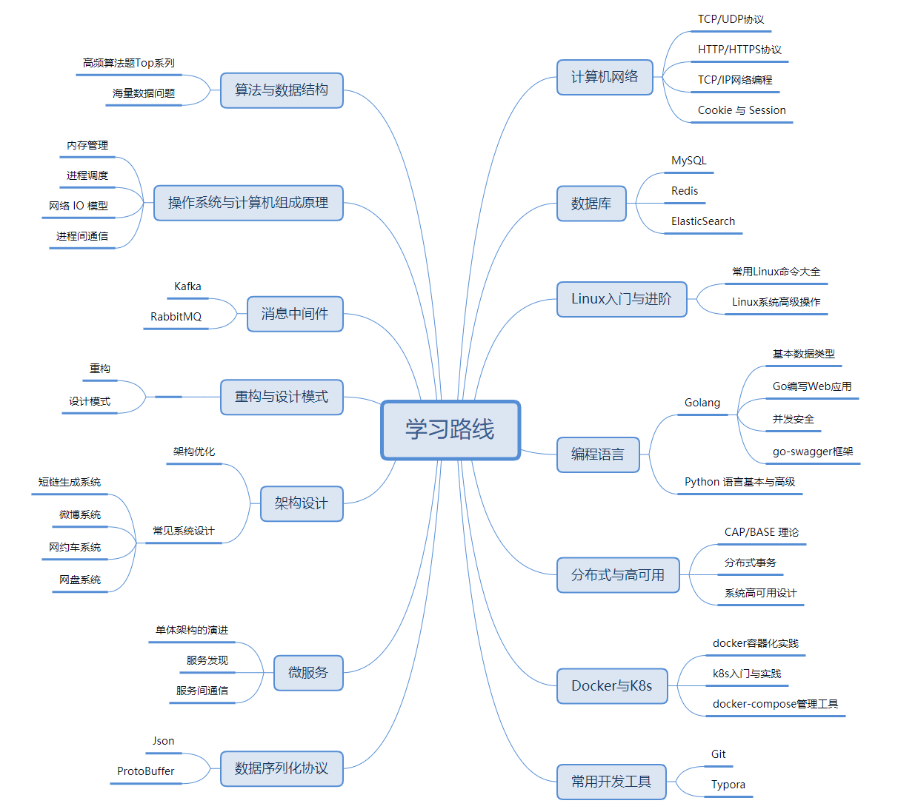
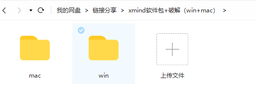
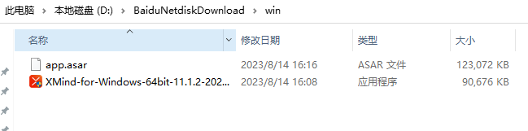
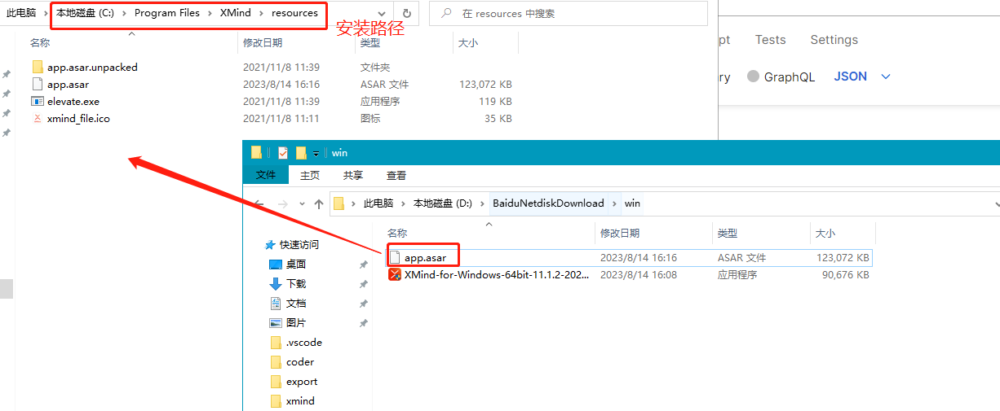

在学习，工作的时候，我们常常会做思维联想、目录整理的事情，这时，一款强大的思维导图软件，可以高效帮助我们实现目的。

xmind，就是这样一款强大的思维导图设计软件，用 xmind 画出来的开发者 **学习路线** 思维导图长这样：

图片来源：<a href="https://mp.weixin.qq.com/s?__biz=MzI5Nzk2MDgwNg==&mid=2247484332&idx=1&sn=4fb1eb8580d93dc4a0dff69b713cce1f&chksm=ecac57a5dbdbdeb3dc0816468c3986f66cc483a6adcd7f80e6b208ff945fef5e8b538322aed8&token=55044055&lang=zh_CN#rd">某自媒体账号</a>

> 遗憾的是，现在 xmind 各大官方版本都不是免费的。xmind 目前的官方价格是 388/年，有条件有能力的情况下建议支持正版。

由于经常在各个电脑上安装 xmind，而账号很难共享超过 2 台电脑，因此找了一个可以免费激活 `xmind` 思维导图软件的教程，分享给大家。

### 激活教程

#### 1. 软件及破解包下载（Windows+Mac）

官网下载链接：https://xmind.app/mindmapping/?ref=googlpa&gad=1&gclid=EAIaIQobChMI_p6E0YfggAMVDyaDAx2F2wWfEAAYASAAEgIwfvD_BwE

担心大家访问外网的速度比较慢，所以我已经把软件包下载好放百度盘子里了。

如果你担心软件包和激活脚本不适配，可以直接从我免费分享的网盘里获取 windows 和 mac 版本的软件包及破解脚本。

> 由于分享的百度网盘链接容易被封，目前暂不提供页面直接提取。

激活文件下载之后，将文件解压后建议放在 D 盘下面（**PS：放置的位置随意，只要记住路径，并且后续不删除就行**）

#### 2. 版本重置

如果你是 Windows 操作系统，可只下载 win，Mac 系统就只下载 mac 即可：

下载好之后，如果你之前安装过 xmind，建议完全删除以后再继续操作。这样能避免因为以前的激活补丁而导致永久激活失败，后期失效了又得折腾很麻烦。

#### 3. 安装

点击安装包，选择一个合适的安装路径【建议安装在 D 盘，防止以后电脑更新影响软件的使用】，记住这个安装路径。

> xmind 默认安装路径为：C:\Program Files\XMind\resources

安装完成后，**关闭 xmind 软件**，将下载的破解包 `app.asar` 替换：

替换脚本完成，重启 mxind 后，就可永久使用了。

> Mac 版的软件包，下载即是已经破解好了的，可直接安装使用。

