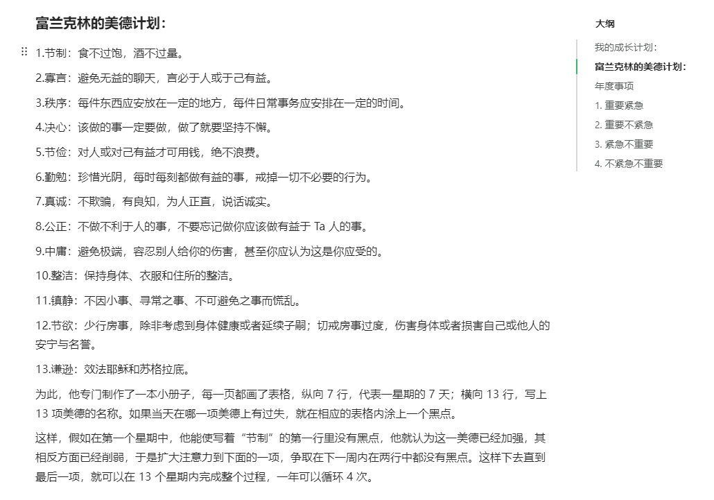
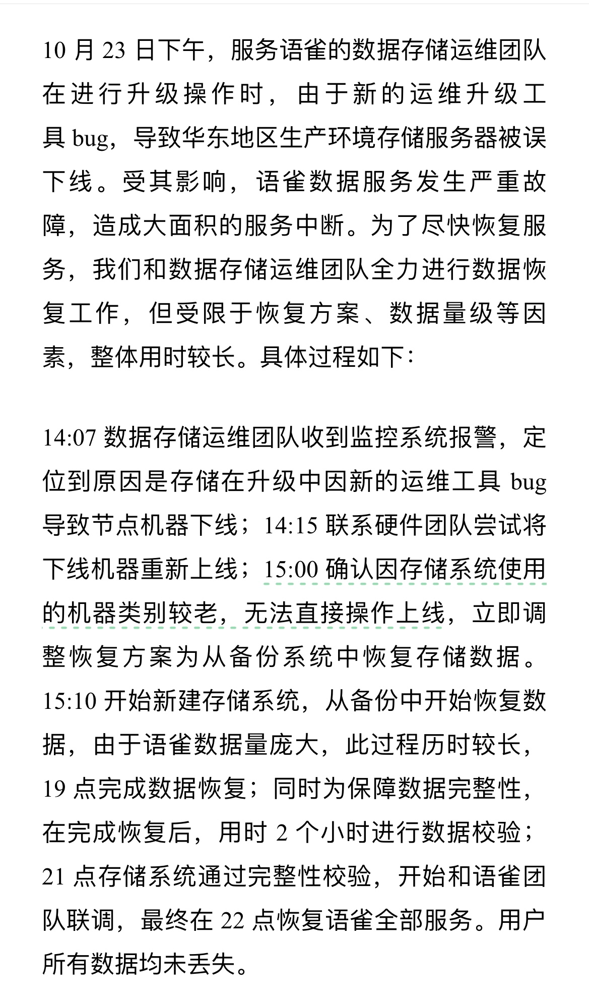
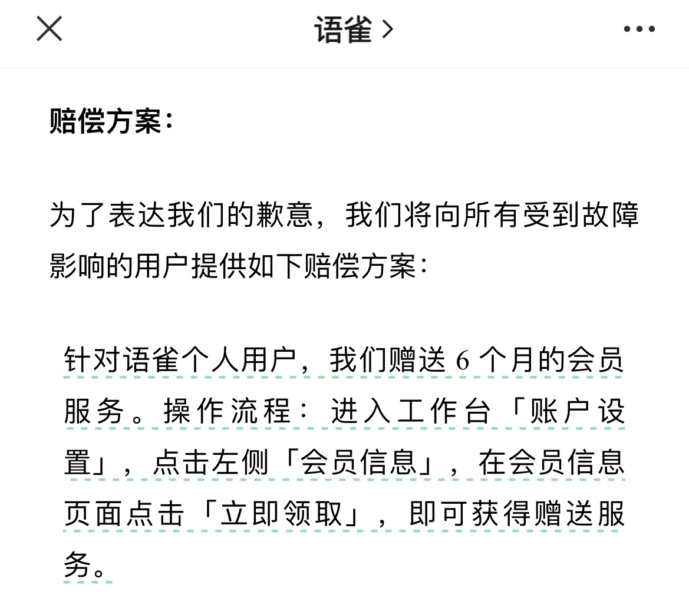
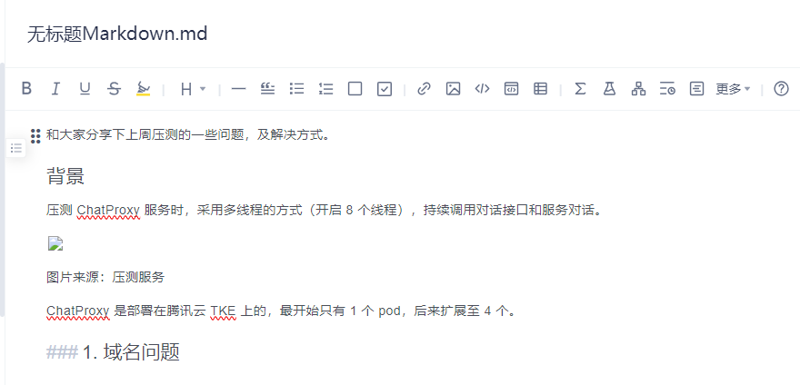
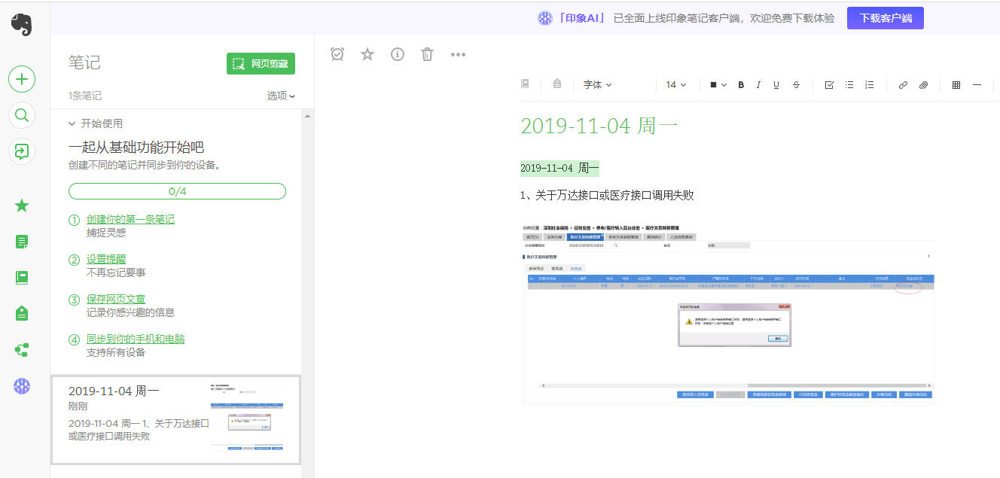
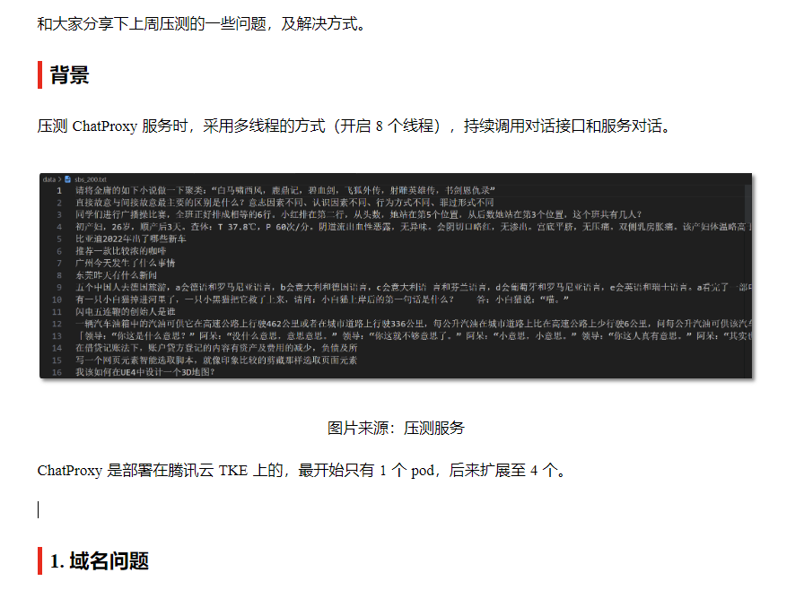
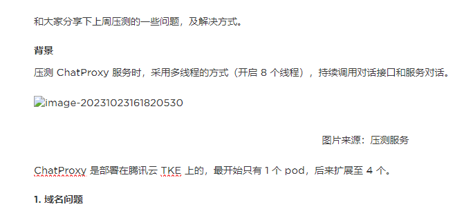
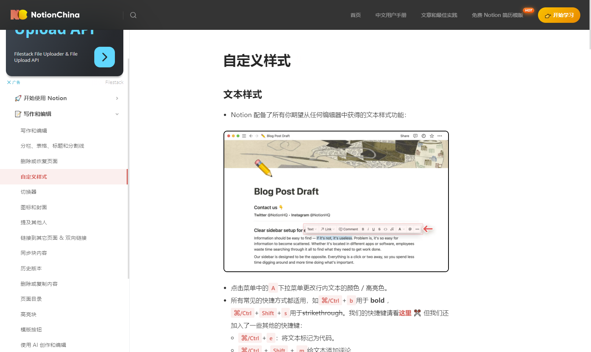
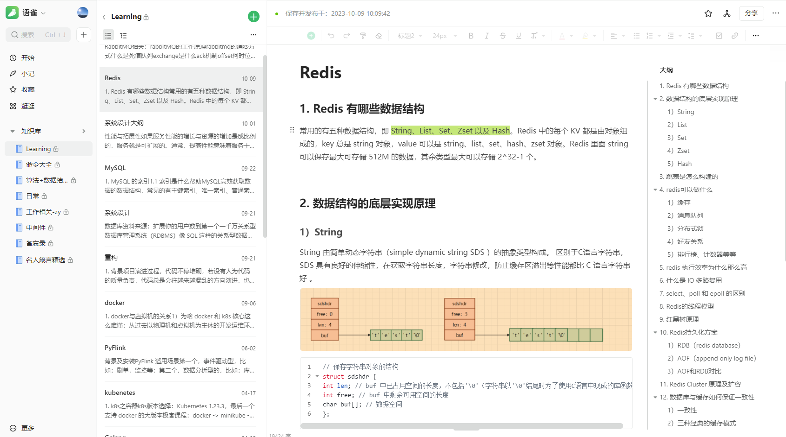
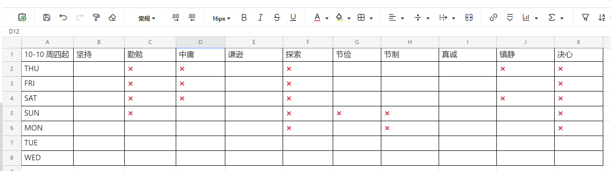

### 引言

大家好，我是小❤。

#### 语雀发生严重故障

最近**语雀**的这波 P0 级故障想必大家都有所耳闻，作为阿里旗下的产品，下线超过了 7 个多小时，下线期间，语雀的笔记、离线同步完全不可用。

这是非常罕见的，比如曾经腾讯微信就出现过短暂的不可用，但几分钟就解决了。

作为语雀的忠实用户，平时我的工作日常，读书笔记，收藏夹，账号密码等信息都同步在语雀云端。鬼知道我那 7 个小时是怎么挺过来的 T-T

多年以来，语雀期间也有过很多次小 bug，我还在网页端、手机端给语雀提过很多意见。而这次 bug 故障，算是语雀近年来最大的事故了。

语雀的此次故障事件，在第二天发布了详细的运维过程。

除此之外，为了补偿用户，语雀也拿出了满满的诚意。

用了这么多年笔记软件，终于白嫖了一次，内心之喜溢于言表。

希望语雀以后越做越好吧，尽量不要再出 bug 了！或者，下次会员到期之前再出个 P0 故障给我续一波会员，也是可行的（狗头 :dog:）。

#### 常见的笔记软件

除了语雀，小❤也在平时的学习和工作里用过很多款笔记软件，那么，**作为一个开发者，或者平时需要记录文档及知识体系的个人用户，有哪些笔记软件可以使用呢**？

业界常见的有 Notion、有道、飞书、印象笔记、语雀等。

为免先入为主的观念，能让大家能清晰的了解各款笔记&知识管理软件的功能，下面的笔记软件我先大概分析各主流笔记软件的特点和优缺点，最后结合个人用途来给出笔记软件选择的建议，希望大家耐心看完（注：广告位空缺）。

### 1. 有道笔记

有道笔记是网易公司 2011 年 6 月就推出的笔记软件。

其用户量还蛮大的，市场占有率较高，我也用过一段时间，主要记录一些简单的算法文档和编程语言书籍的读书笔记。

**有道算是对免费用户比较友好的一款 APP，有免费空间，功能强大且基本都免费**，可以让普通用户不花钱也用的舒服。

作为国内较早的笔记本代表，有道笔记在功能方面还是很丰富的。

它支持目录（文件夹）无限嵌套、支持协同表格、脑图、模板、Markdown、网页剪辑、截图、笔记加密、翻译等一系列很强大的功能。

其欠缺的地方，像整体设计、编辑器设计这些基础体验，与其它笔记软件相比，还是有一些差距，而且内部布局没那么紧凑，一些交互、设计细节没那么精致。

再就是只能导出为有道笔记格式，意思就是，来了就是自己人，功能相对没那么开放。

### 2. 印象笔记

印象笔记是 Evernote 于 2012 年 5 月正式推出的一款笔记软件，2018 年重组落地为中美合资的独立实体。

印象笔记是我朋友推荐的，那会找不到很好的笔记软件，就试用了一段时间。

整体来说，印象笔记结构简单，目录层次也就两三层。

在做一系列文档的复杂记录时，第一要规划好目录结构，第二要用好标签系统，否则你会觉得目录层次太浅，施展不开。

当然，这也可能是印象笔记的设计哲学，希望化繁于简，让用户专注于写作本身。

但是，对一个频繁使用分类笔记的使用者来说，印象笔记给我的感觉就是很多功能都像是半成品，多年来了功能一直很少。

从 Typroa 拷贝的文字，到印象笔记就变成了这样。

如截图所示，标题的大小和正文是一样的，看着难受，对 Markdown 的支持也是仅限于可以用。

**如果说你想要的是一款知识管理工具，那么印象笔记不适合你，因为它就只是一款笔记工具。**

### 3. Notion

有博主将 Notion 视为最强大、最自由的笔记软件，原因是它可以很轻松将笔记、待办、知识库等应用形式 All in one 到一个工具。

这款软件我用的很少，原因是村儿里面最近几年才联网，之前用笔记软件的时候还没有充分对接国际。

但是有一说一，Notion 的页面确实好看。

而且，国内像飞书、石墨文档等很多文档工具都有 Notion 的影子，还有几款国产类 Notion 软件，如 Wolai、FlowUs，基本都是照抄。但如果从笔记的细分功能来测评，差距还是不小。它们优点是基于国内服务器，速度快点，还有一些语言等本土化优势。

当然，Notion 也有一些弊端，它的入门成本稍高，与传统的笔记软件操作有较大差异，尤其是对没有学过编程的人来说。

国内访问稍慢，虽然现在已经有中文界面，但是在某些应用翻译就比较奇怪，使用习惯可能更偏向于国际化。

### 4. 语雀

一款阿里系笔记产品，2016 年诞生，据说是 10 万阿里员工的标配，看起来是知识库、文档协同和博客的结合体。

这也是小❤用的最多的一款笔记软件，其中的**个人知识库、协同知识库及知识小组等，可以很方便地做文档分享和系列文档的整合。**

与国内其它笔记软件相似，语雀近年来引入了不少类 Notion 的功能，如团队空间，基于团队存储、协作和分配文档权限，还引入了 Notion 风格的数据表、基于场景的模板等一些内容。

由于揉合了过多维度的功能，既考虑个人又考虑团队、商用，使得语雀的结构偏复杂，内容层次较深。

有博主评价语雀，觉得整体风格不是太协调，布局不算好看，但这些并不能否定语雀是一款功能强大的文档产品。

**如果大家具备结构化思维或对知识体系建设有想法，语雀是个挺好的平台，可以从不同维度记录与展现你的知识才华。**

### 5. 飞书

飞书是字节人的标配，它是字节 2016 年上线的管理平台，定位是一个集内部分享、沟通、音视频会议功能的企业协作平台，文档只是其生态里的一小块。

我也用过飞书文档，主要是看知识分享，很少在上面写文章、记录笔记。

飞书文档的核心优点在于**飞书生态**，其通过十分丰富的内置应用，俨然进化成一个小型的内部管理系统。

飞书文档，实质上和腾讯文档、石墨文档、金山文档的定位相似。此外，飞书的多维表格则对标 Airtable. 因此，飞书的办公产品实质上是 **飞书文档+飞书多维表格** 的模式。

如果你周围有很多字节范，可以考虑用飞书，在内容协作和多维文档办公上面，飞书优势很多。但单纯作为笔记或知识软件，飞书可能不是很多开发者的首选。

### 小结

入门一款云笔记软件，个人认为最重要的两个维度是基本功能和使用体验，笔记软件如果不满足日常需要，或者屏幕上充斥着大量的广告，都会让我们放弃。

从功能来说，使用者可能会有知识和笔记管理的类别区分：

* **知识管理：**一类客观的认知，只要包含有客观认知，且具有应用潜力，存在形式多样；
* **笔记管理：**由自己生产的信息，大部分情况下是文本。

上述需求中，如果你只需要记笔记，我推荐印象和有道笔记。

如果是知识管理，国际用户我推荐 Notion，国内用户我推荐语雀，如果是想从文档到企业协作管理的生态，飞书是个不错的选择。

以上就是我使用过的笔记软件了，还有一些未测评的包括腾讯文档、石墨文档等，都是属于类 Notion 的云笔记文档，功能相差不大。

希望这篇文章对大家挑选一款合适的云笔记&知识管理文档有帮助，我是小❤，我们下期再见。

