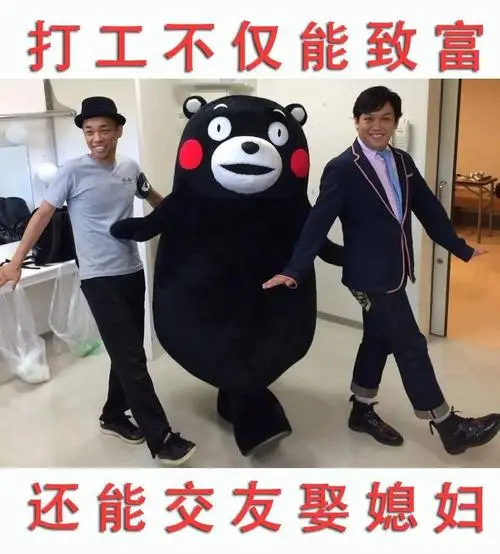
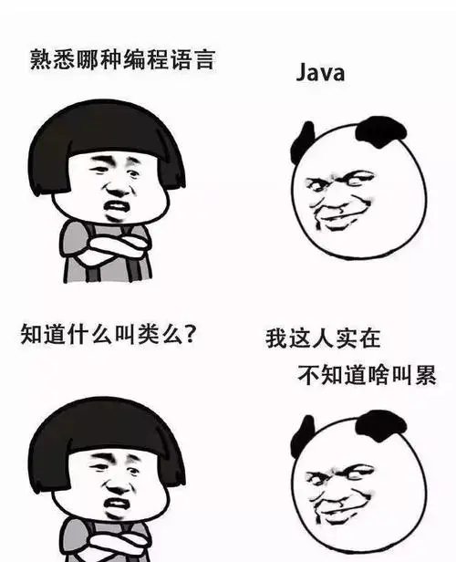
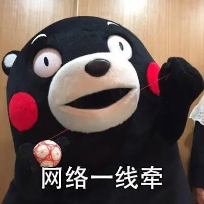
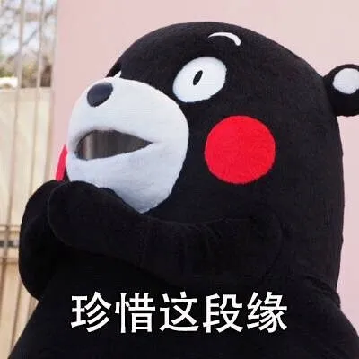
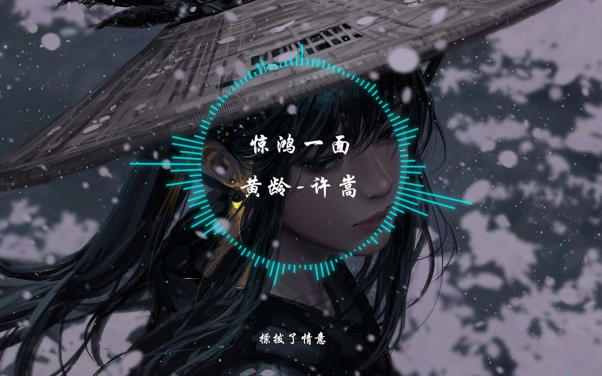
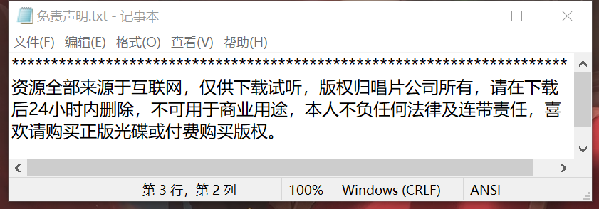

### 我是谁

嗨，大家好呀👋！我是你们的“知识小达人”小❤，也是一个自媒体人，一个新生代农民工，一个热爱知识和探索的互联网打工人🌟

在这个充满奇幻和机遇的数字世界里，我就像你们一样，一边写代码，一边挖掘更多的宝藏🌐

我曾沉浸在代码的海洋，也曾徜徉在文字的森林，感受过技术的激情，享受过知识的沐浴，也经历过社会的毒打🎁

我深知，每一次代码的构建都是一次惊心动魄的体验，每一本书的翻阅都是一次触及灵魂的探险🛤️

所以，我不仅带着技术的“武器”，还携带着文字的“魔法杖”向前冲刺，想和你一起解锁更多的可能性和未知领域✨🔓

在这里，我们不仅要探讨程序的奥秘，还要畅游在书籍的海洋，探寻资源的宝藏💎📚

或许你是为了升职加薪，或许你只是为了解答那颗好奇的心，又或许你只是匆匆一眼，只向往江湖过客和命中注定🔍

我相信，每一次分享，都像《三体》里的发射器一样，像太阳系发送了一次电波。但我更确信的是，互联网的世界不是黑暗森林，看到这篇文章的小伙伴们也不是没有情感的三体人😊

因为，每一个有好奇心的你，都是有着无限可能的探险家🚀有了你们，我的分享才变得更加有趣和有意义🙏

相遇即是缘分，咱们就从这里出发吧！扫一下下方的二维码，这里有我为你精心准备的免费资源，一起来看看吧！📚🎉

在公众号后台回复关键字，即可领取相应的免费资料。

### 编程相关

| 关键字 | 资料信息                                    |
| ------ | ------------------------------------------- |
| code   | 算法相关的 14 本经典电子书                  |
| go     | Go 语言从入门到进阶必看的 21 本的经典电子书 |
| python | Python 语言相关的 11 本经典书籍             |
| c++    | C++ 语言的 27 本入门进阶经典电子书          |

### 认知与成长

| 关键字 | 资料信息                             |
| ------ | ------------------------------------ |
| 写作   | 想学习写作，必读的入门到进阶经典书单 |
| 书籍   | 历史人文和励志型书单                 |

### 开发工具

| 关键字    | 资料信息                                                     |
| --------- | ------------------------------------------------------------ |
| JetBrains | 工具合集，包括 Goland、IDEA等，更多详情，请看JetBrains激活教程 |
| xmind     | 思维导图小能手。更多详情，请看 xmind软件包免费获取           |

### 其它资源

| 关键字 | 资料信息                  |
| ------ | ------------------------- |
| jay    | 亚洲天王-周杰伦的歌曲大全 |
| vae    | 音乐才子-许嵩的歌曲大全   |

请注意，网盘里所有资源均来源于网络整理，仅供下载试听，不可用于商业用途：

人生苦短，Let's Go！ヾ(◍°∇°◍)ﾉﾞ

