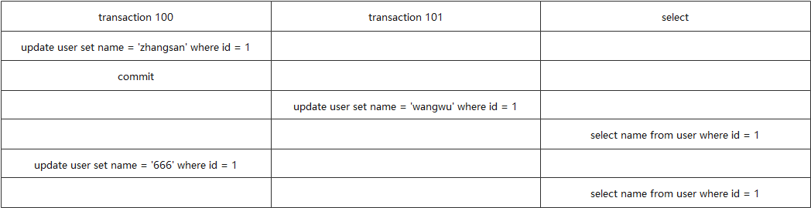

## 1. MySQL 的索引

### 1.1 索引特点

索引是帮助 MySQL 高效获取数据的数据结构，常见的有主键索引、唯一索引、普通索引、组合索引、全文索引等。

优势：

- 提高检索效率，减低磁盘 IO 的成本。
- 通过索引列对数据排序，可降低数据排序的成本和 CPU 的消耗。

劣势：

- 占据磁盘空间
- 做增删改操作时，会降低更新表的效率


### 1.2 MySQL的索引

#### 按索引类型分类

- 主键索引：索引列的值唯一，不允许有空值
- 唯一索引：索引列的值唯一，允许有空值
- 普通索引：没有特殊限制，允许重复值和空值
- 组合索引：即多个数据列组成的索引，B+树会按照从左到右的顺序建立搜索树。比如当组合索引为 (name, age, sex) 时，B+树会优先对比 name 来确定下一步搜索方向。组合索引需要遵循**最左匹配原则**（即构造索引时生成的B+树，从索引列的最左字段开始构造，一直到最后的字段）。当通过组合索引（A，B，C）查询数据时，条件里面存在（AB）或者（AC），都可以走组合索引查询数据，但查询条件只有（BC）时，不会走组合索引。一般，在条件允许的情况下，可将组合索引替代多个索引列使用。
- 全文索引：只能在文本类字段 CHAR, VARCHAR, TEXT 上创建，一般用于字段长度比较大时，创建普通索引在做 LIKE 模糊查询时效率低，此时可以创建全文索引。


#### 按组织形式分

- 聚集索引（聚簇索引）：聚集索引是一种索引组织形式，索引键值的**逻辑顺序决定了表数据行的物理存储顺序**（索引 --> 数据行）。InnoDB 的数据表是索引组织表，即表中的数据按主键顺序存放，**聚集索引的叶子节点存放了整张表的数据行记录**。每张表只能有一个聚集索引，默认为主键；若没有主键，则第一个唯一非空索引为聚集索引。不满足以上条件时，InnoDB 引擎内部会生成一个隐藏主键做聚集索引。
- 非聚集索引（非聚簇索引）：除聚集索引外，表中其它索引都是非聚集索引，又叫辅助索引。


### 1.3 为什么尽量选用自增列做主键

在 InnoDB 中，使用了聚集索引（默认为主键），数据表是索引组织表，即表中的数据按主键的顺序存放。

当主键的写入顺序是自增时，可以**避免数据插入过程中的聚集索引排序问题**。

比如：用身份证/学号做主键，每次插入主键的值接近于随机，新记录的插入都要被插入到现有索引页中间的某个位置。

此时，MySQL 为了将主键插入到合适的位置，不得不移动数据。而**频繁移动数据、分页操作会造成大量的碎片，增加过多开销。**


### 1.4 索引失效的情况

- 索引字段发生了**隐式类型转换**，比如 string 类型的字段 phone，用 `where phone = 123456` 查询；
- 查询条件中用了**表达式计算**，比如 `where 3*phone>123456`；
- 查询条件中有**函数表达式**；
- like 模糊查询中用了左模糊匹配，`where phone like '%xxx'`；
- Where 语句中用到 ` in, not in, or, !=` 等；
- 联合索引中，需要**最左匹配原则**，比如 [a,b,c]，如果只用 b 和 c 做条件查询，无法命中索引；
- 尽可能避免直接 NULL 值判断，且注意：**当查询量达到总表的 30% 及以上时，索引就会失效**。

由于索引是依赖于索引树在叶子节点上的顺序进行查找，因此以上几种情况可能导致索引字段的值在索引树上的位置发生未知的改变，也就是破坏了索引树中叶子节点的有序性。

当进行查询时，**SQL 语句执行器无法判断原来的索引树是否还能被检索使用**，就会导致 SQL 语句执行器不使用该索引了。


## 2. 索引的数据结构

### 1）Hash表

以键值对的形式存储，Key 为索引列。

当索引为聚簇索引时，Value 为存储的行记录。当索引为非聚簇索引时，Value 存储磁盘地址。

**Hash 做范围查询时可能会扫描全表，效率低下，所以它只适合做等值查询**。等值查询时，Hash 索引可以通过 O(1) 的时间复杂度直接获取数据。


### 2）B树

B 树（balanced tree of order m，又叫 B- 树），其特征为：

- 每个节点存储多个元素，是平衡多路查找树；
- 节点中包含键值和元素，节点中的键值从小到大排列；
- 可能在非叶子节点结束查询（最好情况下 O(1) 就能返回）；
- 叶子节点位于同一层，且具有相同的深度，叶节点之间没有指针连接。


**B 树中间节点存储的数据可能是行记录**，当数据表的字段很多时，行记录所占的空间会变大。此时，一个页中存储的数据量就会变少，树的高度就会变高。

而且 B 树不支持范围查找，每次查询时需要重新回到根节点进行查找。磁盘 IO 次数随着变多，所以 B 树有时候查询效率会很低。


### 3）B+树与B树有哪些优势

B+ 树是 B 树的升级版，它相比 B 树主要有两个特点：

1. 将数据全部移到叶子节点上保存，**中间节点只存储键值**；

2. **叶子节点通过链表连接起来**，由于叶子节点的数据都是有序的，所以在范围查询的时候可以顺着链表往下走，就可以直接返回一段数据，进而减少 IO 次数，提升查询性能。


### 4）为什么用 B+ 树而不用红黑树来做索引

#### 什么是红黑树

红黑树是一种近似平衡二叉树（不完全平衡），节点非黑即红的树。


所有的红黑树都满足如下性质：

1）每个节点要么是红色，要么是黑色的；

2）根节点和叶子节点（即 NIL 空节点）一定是黑色；

3）红色节点的父节点，或者子节点一定为黑色；

4）对每个节点，从该节点到叶子节点的所有路径上，包含的黑节点数目相同。

根据性质4，我们可以得出：**从根节点到叶子节点的可能路径，最长不超过最短路径的两倍。**

即树高最高不超过 `2*log(n)`，因此它查找时间复杂度为 `log(n)`，无论是增删改查，它的性能都比较稳定。

正是因为这些特点，红黑树在做元素删除和插入时不同于平衡二叉树追求绝对的平衡，它的旋转次数更少，插入最多两次旋转，删除最多三次旋转。

所以在对于频繁增删节点的情况下，红黑树的效率是优于平衡二叉树的。


#### B+树优势

但是，红黑树的本质还是二叉树，在数据量非常大时，需要访问和判断的节点数还是会比较多。同时，数据是存在磁盘上的，访问时需要磁盘 IO，导致效率较低。

而 **B+ 树是多叉的，可以有效减少磁盘 IO 的次数**。同时，B+ 树增加了叶子节点之间的连接，能保证范围查询时不用每次都回到根节点重复搜索的过程。

所以，如果使用红黑树来做索引的数据结构，会使索引树的高度变高，磁盘 IO 增多，也会在范围查询时多次从根节点开始搜索，导致查询效率极慢。

故 MySQL 中，如果没有特别说明，**默认都是使用 B+ 树做索引的数据结构**。


## 3. 如何创建高性能索引？

### 3.1） Index Condition Pushdown

简称 ICP，是 MySQL 使用索引从表中检索行数据的一种优化方式。

当启用 ICP 这个特性时，如果部分 WHERE 条件能使用索引中的字段，MySQL Server 就会把这部分下推到存储引擎层。存储引擎通过索引过滤，把满足的行从表中取出。

这样可以减少引擎层访问基表的次数，以及 MySQL Server 访问存储引擎的次数。


### 3.2） Multi-Range Read Optimization

简称 MRR，是一种将随机 I/O 转化为顺序 I/O 的优化方式。目的是减少磁盘的随机访问，以降低查询过程中 I/O 的开销。

当优化器根据二级索引返回的记录 “回表” 时，这个过程一般会有较多的随机 I/O，性能较低。

使用 MRR 优化后，不是每次通过辅助索引回表取记录，而是先把 rowid 缓存起来，排序后再回表访问。

这可以实现随机 I/O 到顺序 I/O 的转化，并减少 I/O 次数，大幅提升性能。


### 3.3）索引使用的原则

#### 主键

表一定要有主键，最好显式定义且采用与业务无关的列以避免修改。

上文提到，当主键的写入顺序是自增时，可以**避免数据插入过程中的聚集索引排序问题**。而 InnoDB 在有主键时会将主键设为聚集索引，所以建议采用自增列做主键。


#### 添加索引的原则

合理在**经常被查询的列，经常用于外连接的列，经常排序分组**的列上添加索引。不要在频繁更新的列上建索引，会影响更新性能。

创建索引前，需要查看索引的**选择性（不重复程度）**来判断这个字段创建索引是否合适。索引的选择性越接近于1，说明越容易定位到数据，非常适合创建索引。

反例：性别列不适合创建索引，因为其值的重复性高（一共就 3 种：男、女、不确定）。


#### 组合索引

当创建组合索引时，一般把选择性高的列放前面。组合索引列数不建议超过 5 个，每张表的总索引数也尽量控制在 5 个以内。

**最左匹配原则**：当创建复合索引时，B+ 树按照从左到右的顺序建立搜索树，比如创建组合索引 (name, age, sex)，B+ 树会优先对比 name 来确定下一步搜索方向；当根据 age, sex 查询时，不走组合索引。


#### 覆盖索引

合理使用覆盖索引，即查询列就是索引列，以减少回表次数。

避免使用 `SELECT *` 查询，主要有 3 点原因：

- 查询不需要的列会增加传输时间和网络开销；
- 可能会查询到 `text、varchar` 等类型的字段，增加 IO 操作（具体来说，当读取的字节数超过某个限制值时，会把额外的数据序列化到另外一个地方，因此读取这条记录会增加一次 IO）；
- 直接杜绝了 MySQL 覆盖索引优化策略的可能性。


## 4. 慢SQL语句优化

### 4.1 开启慢日志查询

slow_query_log 设置为 ON，设置慢 SQL 语句的执行时间。官方慢 SQL 语句为 10s，不过那已经算非常慢的情况了。

一般来说，只要未命中索引的查询都算是慢查询，一张表超过百万数据就需要严阵以待防止出现性能问题，当超过千万数据就已经很危险了。看业务量和用户需求，慢 SQL 执行时间一般设置在 0.5-1.5s 之间。


### 4.2 执行计划

抓取慢 SQL 语句后，比对执行计划，看是否符合预期的查询。

MySQL 通过 **EXPLIAN** 关键字获取 SQL 语句的执行计划，如 `EXPLIAN SELECT * FROM user`。

执行计划会显示一些比较重要的字段：

- **select_type[查询类型]**：simple简单查询，primary复杂查询，union联合查询，subQuery子查询；
- **type[索引类型]**：system 主键索引命中，且数据库只有一行数据；const 主键或唯一索引命中，数据行数为常数条；eq_ref（唯一索引）, ref（非唯一性索引）, range（范围查询）, index（整个索引树）, all（全表扫描）；
- **possible_keys**：可能命中的索引 key；
- **keys**：实际命中的索引 key，可能有多个；
- **rows**：SQL 语句查询到的表行数，是一个大概值；
- **filtered**：存储引擎返回的数据在server层过滤后，还剩多少满足查询的记录数量比例。


## 5. 存储引擎

### 5.1 什么是存储引擎

简单地理解，存储引擎就是指表的类型以及表在计算机上的存储方式。 

MySQL 使用的是可插拔存储引擎架构，可在运行的时候动态加载/卸载这些存储引擎，不同的存储引擎决定了数据库中的表可以用不同的方式来存储。

`show engines` 命令，可以显示当前支持哪些存储引擎。


### 5.2 常用的三种存储引擎

#### MyISAM

在 MyISAM 存储引擎中，表结构、数据和索引分别放在 `.frm、.myd 和 .myi` 文件里。

MyISAM 索引结构用的是 B+ 树，没有聚簇索引，所以索引树的叶子节点保存的是行记录的地址。

MyISAM 的 3 个缺点：

1. **MyISAM 不支持事务**，所以存储速度较快，但是不能保证数据的一致性；
2. 它只支持**表级锁**，因此对并发的支持较差；
3. 在写入和读取数据时，都会**阻塞写入**，所以不支持大量数据同时修改。 

如果你的读写操作允许有错误数据的话，只是追求速度，可以选择这个存储引擎。 


#### InnoDB

InnoDB 是 MySQL 默认的存储引擎，其表结构放在 `.frm` 文件中，数据和索引放在 `.ibd` 文件里。 

InnoDB**支持事务，外键以及行级锁**。其数据的物理组织形式是**聚簇表**，所有的数据按照主键来组织，即数据和索引放在一起，都位于 B+ 树的叶子节点上，这意味着通过主键做等值查询时可以直接返回数据。

InnoDB 还支持缓冲管理，通过缓冲池，将索引和数据全部缓存起来，加快查询的速度。


#### Memory

用 Memory 做存储引擎时，MySQL 会将数据存在内存。为了提高数据的访问速度，每一个表实际上和一个磁盘文件关联，文件后缀是 `.frm`。

Memory 默认使用 **Hash 索引**，默认为表级锁，这意味着访问量大时，很容易出现性能问题。由于它的数据是放在内存中的，一旦服务器故障，数据就会丢失。


## 6. 事务的四个特性

事务是 InnoDB 存储引擎的一个特质，它的四个特性是**原子性、一致性、隔离性和持久性**，简称 ACID。

### 原子性（Atomicity）

原子性是指**事务包含的操作要么全部成功，要么全部不成功**。

比如 A、B账户的初始余额为500元，100元。此时，A 向 B 转账 100 元，那么分解开来就是 A 账户减 100 元，B 账户加 100 元。

最终结果是 A 账户余额为 400 元，B 账户余额为 200 元。这两个账户余额更新的操作，要么全部执行，要么都不执行。


### 一致性（Consistency）

**事务执行前，和执行后都会保持一致性状态**。

A、B 账户在转账前和转账后，账户的总额都应该为 600 元，这就是前后一致性。


### 隔离性（Isolation）

隔离性是当多个用户并发访问数据库时，不管是不是操作同一个库、还是同一张表时，数据库为每一个用户开启的事务，不能被其他事务的操作所干扰，多个并发事务之间也要相互隔离。

比如，A 和 B 转账的时候，不管别人怎么转账，都不会影响他们的交易。


### 持久性（Durability）

**一个事务一旦被提交了，那么对数据库中的数据的改变就是永久性的**，即便是在数据库系统遇到故障的情况下也不会丢失提交事务的操作。 


### ACID之间的关系

事务的原子性、隔离性和持久性三大特性，都是为一致性服务的。

**一致性是事务最终需要呈现的结果，其余三个特性是保证一致性的关键。**


## 7. 事务的隔离级别

事务要保证前后一致性，是如何实现的呢？

需要通过隔离级别来做。分别有 RU、RC、RR 和可串行化这四种。

### RU - 读未提交（Read uncommitted）

如果一个事务开始写数据，则另外一个事务不允许同时进行写操作，但允许其他事务读取此行数据。

RU 可以“排他写”，但是不排斥读线程实现。

这种隔离级别可能会出现**脏读，即事务 B 读取到了事务 A 未提交的数据**；


### RC - 读已提交（Read committed）

该隔离级别在一个事务进行数据写入时，不允许别的事务对该行数据进行访问（包括读写）。这样就可以保证事务读到的数据一定是已经提交了的，**解决了脏读的问题**。

但是**会出现不可重复读**的问题，比如：事务 A 需要读取两次数据，在读取完第一次数据后，有另一个事务 B 对该数据进行的更新并提交事务。

此时事务 A 再次读取该数据时，数据已经发生了改变，即事务中两次读取的数据不一致。


### RR - 可重复读（ Repeatable read）

在同一个事务内，多次读取同一个数据，在这个事务还未结束时，其他事务不能访问该数据（包括读写）。

这种隔离级别下**解决了脏读和不可重复读**的问题，但是可能会出现**幻读**。

如事务 A 在多次读取数据时，有另一个事务 B 在数据行中间插入或删除了数据，此时事务 A 再次读取时，可能会发现数据的行数变了。

简单来说，RR - 可重复读可以保证当前事务不会读取到其他事务已提交的 `update` 操作，但无法感知其他事务的 `insert 和 delete` 操作。


### 可串行化（Serializable）

该隔离级别下，事务只能依次执行，**解决了脏读、不可重复读和幻读**的问题。但是代价较高，性能很低，一般很少使用。


## 8. MySQL 用了哪种默认隔离级别，实现原理是什么

**MySQL 的默认隔离级别是 RR - 可重复读**，我们可以通过`show variables like 'tx_isolation'`命令来查看 MySQL 中的默认隔离级别。

### MVCC 是什么

RR - 可重复读是基于**多版本并发控制**（Multi-Version Concurrency Control，简称 MVCC）实现的。

MVCC，在读取数据时通过一种类似**快照**的方式将数据保存下来，不同事务的 session 会看到自己特定版本的数据。

这样，当事务 A 对某条数据加了写锁之后，事务 B 还可以对这条数据进行读操作，即**一致性非锁定读**（也称为快照读）。

当某行数据被施加了写锁，但是另外的事务需要读取该行数据时，则不会等待该行锁的释放，而是会去读一个快照数据。


### MVCC 的实现原理

#### 回滚指针

在 InnoDB 存储引擎里，在有聚簇索引的情况下，每行数据都包含两个必要的隐藏列：

- **DB_TRX_ID**：记录某条数据的上次修改它的事务ID（**trx_id**）；
- **DB_ROLL_PTR**：回滚指针，指向这条记录的上一个版本。

我们每次对聚簇索引行进行修改时， 都会把老版本写入到 undo 日志里，这个指针就指向了老版本的位置，当需要进行回滚操作时， 事务就通过回滚指针以获取上一个版本的数据。

> 注意：插入操作的 undo 日志没有回滚指针， 因为它是新增的数据，没有老版本。
>
> 而已删除的信息会在 undo 日志记录的头信息中存一个 delete flag 标记，当该标记为 true 时， 表示已删除，则不返回数据。


#### 版本链

下图是一个简洁的版本链概念，InnoDB 中的 **undo 日志保存的就是一个版本链**：


除了版本链，我们在实现 MVCC 还用到了另一个概念：**read-view，一致性视图**。

我们在查询数据，使用 select 语句时，InnoDB 会自动生成一个当前活动的（即未提交的）事务 ID 数组，**read-view 就是由查询时所有未提交事务 ID 组成的数组**。

假设当前事务正在修改 `user` 表中的 `name` 值：

`update user set name = '小华'`

即事务 ID 为 102，所以在该事务还未提交时，一致性视图的数组为 [102]。

数组由最小的事务 ID `min_id` 和已创建的最大事务 ID `max_id` 组成，当数组中只有一个未提交事务时，比如 [102]，则它既是 min_id 又是 max_id。

当有别的事务来做查询时，需要另外事务的事务 ID 和 read-view 做比较从而得到快照结果的版本。


#### read-view如何工作

我们做查询时，会**获取当前事务的 trx_id，然后和 read-view 比对**。我们知道，事务 ID 是自增的，所以有以下 3 个规则：

1. 若 trx_id 比 read-view 中的 min_id 小，则该版本是已经提交的事务生成，一定可见；

2. 若 trx_id 比 read view 中的 max_id 大，则该版本是还未提交的事务生成，一定不可见；

3. 当 trx_id 在 read-view 列表中，即 `min_id <= trx_id <= max_id` 时，**如果 trx_id 在 read-view 的数组中，则还未提交，不可见**，但是当前事务是可见的（自己更新的，自己得认）；如果 trx_id 不在数组中，表明是已经提交的事务，则该版本可见。

当版本不可见时，需要通过 `DB_ROLL_PTR` 获取上一版本的 trx_id，再次比对，**直到版本数据可见时，返回结果**。

我们来举个例子，假设当前有一个 `user` 表，`name` 存储了用户的姓名，有两个事务【100、101】前后分别进行更新操作，事务 100 提交后有另一个查询事务来查询 name。


`select name from user where id = 1` 语句执行时，上一个已提交版本可以在 undo 日志中被找到，即 trx_id 为 100 的快照版本。


`select name from user where id = 1` 语句执行时，上一次更新 `id = 1` 这行数据的 trx_id 为 100，而且已经提交。

这时，未提交的事务 ID 为 101，所以将其加入 `read-view` 中，此时 read-view 中只有一个未提交的事务 ID：[101]。

假设当前 select 的 trx_id 为 102，read-view 中未提交的事务为 [101]，102 比 101 大，所以该版本的数据不可见【102之前没做过更新操作，所以不存在 read-view 中】。这时需要通过 DB_ROLL_PTR 获取上一版本的 trx_id 100。

而事务 ID 100 的这个版本小于 101，所以该版本是已经提交的事务生成，所以返回 `zhangsan`。


### 四种隔离级别与MVCC的关系

1. RC（读已提交）隔离级别在查询时，同一个事务多次查询，**每次会生成独立的 read-view**。

2. RR（可重复读）只在第一次查询时生成统一的 read view，之后的读取都复用之前的 read view。

3. RU（读未提交）是可以读取还没提交的数据，没有 undo 版本的概念。

4. 可串行化隔离级别在每次读取时都需要加锁控制，没法并发，所以通过版本的概念去控制并发也就没有意义。


### 为什么MySQL的隔离级别默认用RR



#### RC的底层原理

如上文所述，当使用 RC（读已提交）级别时，同一事务的两次 select 的 read-view 不一样。

比如上图中 `select` 一列，有两次查询。

第一次查询时是一致性视图为 [101]，而第二次查询时重新生成的一致性视图是 [100, 101]，由于两次的一致性视图版本不一样，所以两次查询读到的数据版本也可能不一样，所以 RC 可能会出现重复读的问题。

#### RR的底层原理

而用 RR 级别时，会复用第一次查询的 read-view，故多次查询的结果是一样的。

这也是 MySQL 的隔离级别默认用 RR - 可重复读的原因之一，不用重复生成 read-view，不仅提升数据库的操作性能，还规避了不可重复读的问题。

总结，**每次 select 数据时生成 read view 列表，再配合 undo 日志中的版本链，让不同的事务读-写，写-读操作可以并发执行，进而实现 MVCC。**


## 9. MySQL 中的锁

**锁是计算机为了协调多个进程或线程，并发访问某一资源的机制（避免资源争抢）。**

### 从属性分类

基于锁的属性，有共享锁（读锁）和排它锁（写锁）。

#### 共享锁

共享锁，又称作读锁。

当一个事务为数据加上读锁之后，其他事务只能对该数据加读锁， 直到所有的读锁释放以后才能加写锁。

共享锁就是为了保证数据读取的时候， 该数据不被其他事务进行修改，避免出现脏读和重复读的问题。

#### 排它锁

排它锁，又称作写锁。

当一个事务为数据加上写锁之后，其他事务只不能对数据加任何锁， 直到该写锁释放。

排它锁的目的是在数据修改的时候，不允许其他事务同时修改， 也不允许读取，避免出现脏读的问题。


### 从粒度分类

基于锁的粒度，有表级锁（InnoDB、MyISAM 支持）、行级锁（InnoDB 支持）、页级锁（BDB 引擎支持）、记录锁、间隙锁和临键锁，最后三种锁其实都是行级锁。

#### 表级锁（table lock）

事务上锁的时候锁定整张表，当下一个事务访问该表时，需要等待前一个事务把表锁释放以后才能访问。

表锁的锁粒度大，资源消耗少，加锁快，不会出现死锁，但出现锁冲突的概率最高， 并发性能较低。

#### 行级锁（row lock）

行级锁，即锁定表数据的某一行或多行记录，其他事务访问同一张表时，除了被锁住的行记录不能访问，其余的记录可正常访问。

行锁锁粒度小，不容易发生锁冲突，可以最大程度的支持并发处理，当然开销也最大。

其加锁较慢，且可能会出现死锁，同时行锁只在 InnoDB 存储引擎层进行实现。

**行锁释放时机**

在 InnoDB 中，行锁是需要的时候才加上的，但并不是不需要了就立即释放，而是要等事务结束时才释放。 

所以，如果你的事务需要锁多个行，尽量把可能影响并发的锁往后放。 

**删除数据时考虑行锁影响**

另外，如果要删除大量数据时，有三种方案可挑选：

- delete from t limit 100000
- 开启 20 个连接，执行 delete from table limit 500;
- 同一连接连续开启 20 次事务，执行 delete from table limit 500;

我们应该选择哪种作为删除方案呢？

答案就是第三种。

第一种锁住范围大，容易冲突，且一次性锁住 10w，其它事务被阻塞的概率大。

第二种多个事务容易产生冲突，互相阻塞浪费资源。

第三种只有一个连接，锁住范围小，不容易冲突。

**行锁的注意事项**

1. 行锁在 InnoDB 中是基于索引实现的，一旦某个加锁操作没有使用索引， 那么该锁就会退化为表级锁（当不用索引时，不会对表里数据加行锁里的记录锁，只会在各个行之间加间隙锁，就相当于锁住了全表）。
2. 当根据某个非索引字段查询/更新时，如果加了 limit 1，扫描会在扫描到主键索引树第一条记录后停止，可适当减少查询时间。


#### 页级锁（page lock）

页锁即一次锁定相邻的一组记录，是一种粒度介于行锁和表锁之间的锁，锁开销不大不小， 会出现死锁，并发度一般。


#### 记录锁（record lock）

记录锁是属于行锁的一种，只不过记录锁的范围只是表中的某一条记录。

 注意：记录锁命中的条件字段一定是唯一索引或主键列，同时查询条件需要精准命中，即 = 查询， 不能为 like, <, >等，否则会退化为临键锁。 

主动加锁语句例子：`SELECT * FROM table WHERE id = 1 FOR UPDATE`，其中 id 列为主键列或唯一索引列，记录锁在 RC、RR 隔离级别下都支持。

> PS：InnoDB 查询默认不上锁，增删改默认加行级写锁。
>
> 想要对 SELECT 语句加锁，可以使用 SELECT... FOR UPDATE


#### 间隙锁（gap lock）

间隙锁也是行锁的一种，事务加锁后其锁住的是表记录的一个区间，即表记录相邻ID之间出现的空隙。

比如，表里的数据 ID 有【1,5,15】，加间隙锁后会形成以下几个区间：(负无穷, 1), (1,5), (5,15), (15,正无穷) 。

**间隙锁基于非唯一索引，查询条件必须未命中记录，间隙锁可以在 RR-可重复读的事务隔离级别下解决幻读的问题。**

加锁语句例子：假设 `age` 列为非唯一索引列，且 `age` 有 1 和 10 两条记录，`update table set age='18' WHERE age > 1 and age < 10 `。

加了间隙锁后，所有 age 在（1，10）区间内的记录行都会被锁住， **所有 age 为【2-9】的数据行的插入会被阻塞**， 但是 1 和 10 两条记录行并不会被锁住。


#### 临键锁（next-key lock）

临键锁，属于行锁的一种，是 InnoDB 中默认的加锁方式。

临键锁可以理解为是间隙锁和记录锁的结合， 当事务持有某一行记录的临键锁时，会锁住一段左开右闭的数据。

 比如，表里的数据ID有 【1,5,15】，加临键锁后会形成以下几个区间： (负无穷, 1], (1,5], (5,15], (15,正无穷(mysql默认的一个不存在的最大值)]。

**临键锁需要范围查询，必须用到索引并命中**。

临键锁是 RR 隔离级别下支持的行锁，在范围查询时，**可以阻止其他事务在锁定区间内插入或删除数据，解决了脏读、不可重复读和幻读的问题**。


### 从性质分类

从锁的性质，分为自旋锁、乐观锁与悲观锁。

#### 自旋锁

自旋锁可以理解为循环语句，锁会不停地尝试，直到目标达成。

它不像互斥锁那样，得不到锁就进入阻塞。 

**自旋锁优点**

循环获取锁，让线程始终处于 Runnable 状态，节省了线程状态切换带来的开销。

**自旋锁缺点**

如果长时间拿不到锁“钥匙”，会白白浪费 CPU 资源。 

**适用场景**

自旋锁适用并发度不高的场景，以及临界区比较短小的情况。这时，我们可以避免线程切换来提高效率。

若临时区很大，很久才释放锁，则不适合自旋，一直循环占用CPU，消耗大量资源。


#### 乐观锁

乐观锁假设不会发生并发冲突，只在提交的时候检查数据是否安全，适用于写操作比较少的情况。

实现方式：版本号机制和 **CAS 算法**。

CAS（compare and swap）算法是一种不需要通过阻塞，就能避免多线程安全问题的算法。它可以不使用锁保证线程安全，因此是一种**无锁算法**。

实现过程：CAS 维护了三个变量，当前值V，旧的预期值A，即将用到的新值B。

```plain
while V!=A{} // 判断值V是否有变化，若没有变化则假设过程中没有改动，更新V为B
V=B
```

算法漏洞：

1）ABA问题，仅当内存中的值 V 等于预期值 A 时，才更新 V 的值为新值。但是如果 A 已经变过了，由 A -> B -> A，这时，CAS 算法没法检测出 A 变动过。所以，加入版本号机制，每次变量更新时让版本号+1，即 1A -> 2B ->3A，就可以检测出 A 的版本不一致了。

2）空循环时间长，会导致 CPU 开销很大。

3）操作多个变量时，循环就无法保证操作的原子性，所以不能用 CAS 算法，只能用锁保证。


#### 悲观锁

悲观锁假设会发生并发冲突，在读取的时候也会加锁，直到事务提交，适用于写操作比较多。实现方式，使用数据库中的锁机制。


### 死锁

MySQL 里的死锁是指多个事务访问资源时，每个事物都在占用资源，同时请求另一事务锁定的资源，导致相互阻塞。

死锁常见的三种解决方法：

1）如果不同程序会并发访问表，尽量以同样的顺序访问；

2）尽量在事务一开始就锁定所需的资源；

3）对应非常容易死锁的业务，可选择表级锁来访问资源，可以避免发生死锁。


## 10. 加 gap 锁和 record 锁（以下称行锁）的时机

1）走主键查询（显式或隐式）时，若 where 语句全部命中，则不会加 gap 锁，只会行锁；反之，要加行锁和 gap 锁；

Session A : 若数据库存在normal_key= 9 的这一条数据，delete from table where normal_key= 9; 

Session B：由于 A where条件全部命中，normal_key= 10 的记录并没有给锁住，insert into table values(10, abc);


2）走辅助键会在两个空间（通过辅助键找主键，通过主键找内容）加行锁（疑问，不是说查询默认不加锁吗？这里加锁应该并非快照读），若 where 语句全命中，则不会加 gap 锁；反之，至少要在两个空间加行锁和辅助键上加 gap 锁；

例子：

| nomal_key   | 2    | 6    | 9    | 9    | 11   |
| ----------- | ---- | ---- | ---- | ---- | ---- |
| primary_key | h    | c    | b    | d    | a    |

Session A：以下sql会在 normal_key (6-11] 加gap锁，delete * from table where normal_key= 9; 

Session B：因为gap锁的存在，以下sql会给bloack住，insert into table values(8,c); 

Session C：在gap锁外插入数据，成功，insert into table values(12,c);

gap 锁的边际情况：

// gap锁边际：插入【6】 // 成功 因为 normal_key = 6 对应 primary_key = c; bb 首字母排序 < c 可以在(6,c)的左边插入 insert into table values(6,bb);  // 失败 因为 normal_key = 6 对应 primary_key = c; dd 首字母排序 > c 只能在(6,c)的右边插入 insert into table values(6,dd); 

gap锁的边际，由主键的大小决定，同样要满足区间的限制。

当(6,bb)尝试插入时，能预想到：不会破坏原来gap锁区间的**主键索引**物理（顺序）结构

当(6,dd)尝试插入时，能预想到： 破坏了原来gap锁区间的**主键索引**物理（顺序）结构


3）若不走索引，所有的间隙都上 gap 锁，相当于加了表锁。查询不走索引时，每次查询 where key = x 都会进行全部扫描，会锁住整个表，性能大大地浪费了。

Session A : // 若 数据库存不存在这条数据 delete from table where normal_key= 7; Session B： // 由于 A where条件全部未命中，整个表给锁住 insert into table values(10, abc) // 这条sql会给block住


## 11. InnoDB 四种隔离级别的原理

### RU、RC、RR、可串行化分别是怎么实现的，原理是什么？

- RU，读未提交，网上资料众说纷纭，有说没加锁的，有说加了锁的。我在本地测试了一下，先将隔离级别设置为 RU，然后开启事务，并不让其自动提交。


在新开的窗口里面，查询是能查到未提交的值。但是 UPDATE 的时候阻塞超时了


所以，结论是 RU 级别在读的时候没加锁，写的时候加了排它锁。

- RC，读已提交，上面已经说过了，用了 MVCC 实现，并在事务中多次读取时，都创建了 read-view 一致性视图；
- RR，可重复读，MVCC 实现，一个事务中多次读取时，用了同一个 read-view；
- 可串行化，读的时候加了共享锁，允许一起读；写的时候加了排它锁，其它事务不能访问。


### 如何防止幻读

#### 积极做法

可重复读（REPEATABLE-READ） 隔离级别下采用间隙锁。

- 查询走唯一索引时（主键索引也属于唯一索引），使用 next-key 锁 （gap锁 + 行锁），按 where 条件的命中情况分类讨论；
- 查询走非唯一索引（也属于辅助键）的当前读中（dml + select for update + select lock in share mode）

> 在 MySQL 中，更新、删除和插入操作都属于当前读，SELECT + FOR UPDATE 也属于当前读。
>
> 不加锁的非阻塞 SELECT 读为快照读。


#### 消极做法

不考虑性能，直接采用可串行化（SERIALIZABLE）事务隔离级别。


## 12. 分库分表的问题

### 分布式事务

事务是一个抽象概念，它将某个事件进行的所有操作纳入到一个不可分割的执行单元，组成事务的所有操作必须同时执行以保证数据的一致性。

本地事务（比如 MySQL 的 InnoDB 引擎下的事务）遵循 ACID 的原则，是通过多种日志和锁来保证的。其中：

- I，隔离性通过数据库锁实现；
- D，持久性通过 redo log 和 binlog 实现；
- A/C，原子性和一致性通过 undo log 实现。

分布式事务就是指事务的参与者（支持事务的服务器、资源服务器及事务管理器）分别位于不同的分布式节点上，简单来说就是事务的各个操作由不同的应用节点去执行，分布式事务就是为了保证不同节点的数据一致性。


### 联合

联合（或按功能划分）是指将数据库按对应功能分割。

例如，你可以有三个数据库：**论坛**、**用户**和**产品**，而不仅是一个单体数据库，从而减少每个数据库的读取和写入流量，减少复制延迟。

较小的数据库意味着更多适合放入内存的数据，进而意味着更高的缓存命中几率。没有只能串行写入的中心化主库，你可以并行写入，提高负载能力。

#### 缺点

- 如果你的数据库模式需要大量的功能和数据表，联合的效率并不好。
- 你需要更新应用程序的逻辑来确定要读取和写入哪个数据库。
- 联合需要更多的硬件和额外的复杂度。


### 非规范化

非规范化试图以写入性能为代价来换取读取性能。在多个表中冗余数据副本，以避免高成本的联结操作。

当数据使用诸如联合或分片等技术被分割，进一步提高了处理跨数据中心的联结操作复杂度。非规范化可以规避这种复杂的联结操作。

#### 缺点

- 数据会冗余。
- 约束可以帮助冗余的信息副本保持同步，但这样会增加数据库设计的复杂度。
- 非规范化的数据库在高写入负载下性能可能比规范化的数据库差。

在多数系统中，读取操作的频率远高于写入操作，比例可达到 100:1，甚至 1000:1。需要复杂的数据库联结的读取操作成本非常高，在磁盘操作上消耗了大量时间。

#### 1.1.5.1. 不利之处：非规范化

- 数据会冗余。

- 约束可以帮助冗余的信息副本保持同步，但这样会增加数据库设计的复杂度。

  


## 13. 几种日志

### redo log

重做日志文件，用于记录 InnoDB 引擎下事务的日志。InnoDB 支持崩溃数据自修复，就是用 redo log 来保证的。

当进行增删改操作时，MySQL 会先更新缓冲池中的缓存页数据，然后记录一条对应操作的 redo log 日志（prepare阶段），再告诉 MySQL Server 数据已经提交，可以执行了。

于是 Server 层就把数据写入 bin-log 日志，再告诉引擎层数据已经写入。于是 redo log 改为 commit 状态。

后续再发生 MySQL 宕机或者断电时，如果有缓存页的数据还没来得及刷入磁盘，那么当 MySQL 重新启动时，可以根据 redo log 日志文件，进行数据重做，将数据恢复到宕机或者断电前的状态。


### undo log

回滚日志，如果事务回滚，则需要依赖 undo 日志进行回滚操作。

MySQL 事务操作时，会记录事务修改数据前的信息到 undo 日志中（它记录了某条语句的逆 SQL 语句），一旦需要回滚，就可以根据 undo 日志回滚到事务发生前的状态。


### binlog

二进制日志，记录了 MySQL Server 层对数据库执行的所有更改操作，用于数据归档，数据备份（主从）。


### redo 和 binlog 区别

与 binlog 不同的是，redo log 中记录的是物理日志，是 InnoDB 引擎记录的。

而 binlog 记录的是逻辑日志，是 MySQL 的 Server 层记录的。什么意思呢？

binlog 中记录的是 SQL 语句(实际上并不一定为 SQL 语句，这与 binlog 的格式有关，如果指定的是 STATEMENT 格式，那么 binlog 中记录的就是 SQL 语句)，也就是逻辑日志。

而 redo log 中则记录的是对磁盘上的某个表空间的某个数据页的某一行数据的某个字段做了修改，修改后的值为多少，它记录的是对物理磁盘上数据的修改，因此称之为物理日志。


## 14. InnoDB 存储引擎体系结构

### 1) 缓冲池


InnoDB 存储引擎有各种缓冲池（buffer pool），这些缓冲池组成了一个大的 InnoDB 存储引擎内存池。内存池维护所有进程/线程需要访问的数据结构、磁盘上的数据，同时对磁盘文件修改之前进行缓存，redo 日志缓存等等；

后台线程主要负责刷新内存池中的数据，保证数据是最新的，还将已修改的数据刷新到磁盘文件，保证数据库异常后 InnoDB 能恢复到正常运行的状态。


### 2）change buffer

change buffer 主要目的是将二级索引的增删改（IDU）操作缓存下来，以减少随机 I/O，达到操作合并的效果。由于唯一索引需要立即 IO 到磁盘，保证数据不冲突，因此没有 change buffer 机制。

工作原理：比如，当非聚集索引插入时，数据会按主键的顺序存放，所以叶子节点可能需要离散地访问数据索引页，插入性能较低。

此时，插入缓冲（insert buffer）生效，先判断聚集索引页是否存在于缓冲池中，如果有，直接插入；如果不在，先放入一个插入缓冲区进行排序，再以一定的频率合并（merge）更新索引页。

MySQL 5.5 之前，只支持 insert buffer，后来逐渐加入了更多的缓冲类型，统一叫 change buffer.


如图所示，change buffer 避免了大量的随机 I/O 产生，将多次操作合并起来，减少为少量的 I/O 操作。


### 3）自适应哈希索引

InnoDB 中索引被存在 B+ 树中，某个索引的查找次数取决于 B+ 树的高度，一般为 3~5 层，而哈希索引只需要查找一次就可以找到对应的索引数据。

InnoDB 存储引擎会监控二级索引的查找，如果发现某个二级索引被频繁访问，该二级索引就成为热点数据。如果观察到建立哈希索引可以带来速度上的提升，则建立哈希索引，由于这个过程是 InnoDB 自动完成的，因此称之为 “自适应哈希索引“。

​	自适应哈希索引通过缓冲池的 B+ 树构造而来，因此建立速度很快。但它会占用 InnoDB buffer pool 的空间，且只适用于等值查询。


### 4) 二次写

不常用。


## 15. MySQL主从复制

主从复制是指数据可以从一个 MySQL 数据库主节点复制到另外的一个或多个从节点中，主要用作数据实时备份，读写分离，高可用、高性能的企业级业务场景中。

### 复制过程

主要依赖主节点的 binlog 日志和三个线程：


#### 主节点 log dump 线程

当从节点连接主节点时，主节点会为其创建一个 log dump 线程，用于读取和发送 bin-log 内容。在读取 bin-log 中时，log dump 线程会对主节点上的 bin-log 加锁，直到读取完成，锁释放。主节点会为自己的每一个从节点创建一个 log dump 线程。


#### 从节点 I/O 线程

当从节点执行 'start slave' 命令以后，会创建一个 I/O 线程用来连接主节点，请求主库中的 bin-log。当主库的 log dump 线程发送的日志被监听到以后，I/O 线程会把日志保存到 relay-log（中继日志）中。


#### 从节点执行 SQL 线程

SQL 线程负责监听并读取 relay-log 中的内容，解析成具体的操作并进行重放，使其和主数据库保持一致，完成后相关线程会进行休眠，等待下一次唤醒。

从库会在一定时间间隔内探测主库的 bin-log 日志是否发生变化，如有变化，则开启 IO 线程，继续执行上述步骤。


### 主从复制的方式

#### 全同步复制

master 主库提交事务，直到事务在所有的 slave 从库都已提交以后，才会返回客户端事务执行完毕信息。

优点是确保将数据都实时复制到从库，缺点是完成一个事务延迟高，会影响主库的更新效率。


#### 异步复制

master 将事务写入 binlog，提交事务，立即返回客户端。

优点是效率高，缺点是难以保证从库接收到写信息。

MySQL5.5 之前，主从复制是异步的，主库和从库都有一定的延迟，这样就存在一个问题：当主库写入事务并提交成功时，从库尚未收到主库推送的 binlog 日志，或者还没写入到 relay 中继日志中。

此时主库宕机，从库就丢失这个事务持久化的数据了，主从不一致出现，所以 MySQL5.5 引入半同步复制机制。


#### 半同步复制

基于以上两种复制方式，半同步复制是当从库接收到写信息，并将其写入到relay-log 后，再反馈给主库。

主库接收到至少有一个从库反馈时，便提交事务，返回客户端事务成功信息。

其优点是不必等待所有从库，提高了效率；缺点是仍有一定的延迟，至少是一个 TCP/IP 往返时间。

MySQL5.5 之后默认使用半同步复制，若出现等待超时的情况，半同步复制会转换为异步复制，以保证主库业务的正常更新。


## 16. 事务是怎么进行回滚的

当事务执行失败（比如 事务锁，外键等限制）或者 MySQL 服务器崩溃，导致事务二阶段写未完成的情况时，都可能发生回滚操作。

事务执行失败就直接拿到 undo log 日志，通过 undo 日志的版本链，用回滚指针拿到上一条操作的 SQL 语句，执行逆操作语句回滚事务。

二阶段写分为两种情况：

1. 如果 redo log 里的事务是完整的，也就是有了 commit 标识，则直接提交；
2. 如果 redo log 只有完整的 prepare，则判断 binlog 是否存在并完整？若是，则提交；否则，回滚。


## 17. MySQL 持久化方式

MySQL 的 binlog 日志有三种格式：

- STATEMENT
- ROW
- MIXED

### STATEMENT

statement 是基于 sql 语句的复制，每一条会修改数据的 sql 语句会记录到 binlog 中。

- 优点是产生的 binlog 日志比较少，减少了磁盘IO，提高性能；
- 缺点是在某些情况下会导致 master-slave 中的数据不一致(如 sleep()函数，last_insert_id()等)。


### ROW

row 是基于行的复制。不记录每一条SQL语句的上下文信息，仅需记录哪条数据被修改成什么样子：

- 优点是不会出现某些特定情况下的存储过程，函数的调用和触发器无法正确被复制的问题；
- 缺点是会产生大量的日志，尤其是执行 alter table 这类 DML 语句的时候会让日志暴涨。


### MIXED

mixed 是混合模式复制（全称是 mixed-based-replication，简称 MBR），是以上两种模式的混合使用，一般的复制使用 statement 模式保存，对于 statement 模式无法复制的操作使用 row 模式。


## 18. 大库DDL怎么做比较好

1）前提：MySQL5.6 之前，只有 Copy table 和原表锁表操作。5.6 以上版本已经可以支持 Online DDL，但对于一些 alter 操作（增加/删除自增列，添加全文索引，增加/删除主键，改变数据类型等）仍需要重建。

2）在执行 DDL 时，一定选业务量少的时候；

3）执行前，先看一些库中是否有未提交的事务，information_schema.innodb_trx 表；

4）随时关注服务器的日志状况，已有问题要先行解决，show processlist 也可以发现一些问题；

5）危险的操作一定要先在预生产环境或测试环境验证，评估风险；

6）在新建表时，多评审几次，对于不确定字段的表，多建几个预留字段，避免 DDL 操作；

7）尽量避免 kill 会话进程，可能造成数据问题。


## 19. MySQL 的高可用方案

我们在考虑MySQL数据库的高可用的架构时，主要要考虑如下几方面：

- 如果数据库发生了宕机或者意外中断等故障，能尽快恢复数据库的可用性，尽可能的减少停机时间，保证业务不会因为数据库的故障而中断。
- 用作备份、只读副本等功能的非主节点的数据应该和主节点的数据实时或者保持最终一致性。
- 当业务发生数据库切换时，切换前后的数据库内容应当一致，不会因为数据缺失或者数据不一致而影响业务。


### 1）Keepalived 实现虚 IP

MySQL 高可用的方案有很多，包括 Cluster、MHA，及分布式协议保证等。这些方案各有优劣，但都比较复杂，安装有一定的难度，对线上库实施动静比较大。所以，综合考虑，我们选了对架构影响最小的主从+Keepalived 实现。

其中，keepalived 的作用是检测服务器状态，如果有一台服务出现故障或者宕机，keepalived 会把这台机器从系统中剔除，同时使用其它服务器来代替它工作。当服务器正常后，keepalived 会自动将它加入系统服务群中，这些流程都不需要人工参与，我们只需要修复故障机器即可。

keepalived 使用单个虚拟 IP（VIP），动态检测多个入口节点的可用性并切换 VIP 指向，从而达到高可用，它是通过 VRRP 协议实现的（VRRP：虚拟路由冗余协议，解决静态路由单点故障问题）。

每当 keepalived 启动，keepalived 启动选举策略，挑选出一台热备服务器做 master 机器，这台 master 机器会分配到一个指定的虚拟 IP，外部程序可通过这个 IP 来访问该服务器。当 master 服务器出现断网、宕机等故障时，keepalived 会从其它备份机器上重选一台机器来充当 master 并分配同样的虚拟 IP，以此完成故障转移。


### 2）主从复制+读写分离

客户端通过 Master 对数据库进行写操作，Slave 端进行读操作，并可以备份。当 Master 节点出现问题时，可以手动将应用切换到 Slave 端。

使用双节点数据库，搭建单向或者双向的半同步复制。在5.7以后的版本中，由于 lossless replication、logical 多线程复制等一些列新特性的引入，使得 MySQL 原生半同步复制更加可靠。

常见架构如下：


通常会和 proxy、keepalived 等第三方软件同时使用，即可以用来监控数据库的健康，又可以执行一系列管理命令。如果主库发生故障，切换到备库后仍然可以继续使用数据库。

优点：

- 架构比较简单，使用原生半同步复制作为数据同步的依据；
- 双节点，没有主机宕机后的选主问题，直接切换即可；
- 双节点，需求资源少，部署简单；

缺点：

- 完全依赖于半同步复制，如果半同步复制退化为异步复制，数据一致性无法得到保证；
- 需要额外考虑 haproxy、keepalived 的高可用机制。


### 3）MHA + 多节点集群


MHA Manager会定时探测集群中的master节点，当master出现故障时，它可以自动将最新数据的slave提升为新的master，然后将所有其他的slave重新指向新的master，整个故障转移过程对应用程序完全透明。

MHA Node运行在每台MySQL服务器上，主要作用是切换时处理二进制日志，确保切换尽量少丢数据。

优点：

可以进行故障的自动检测和转移;
可扩展性较好，可以根据需要扩展MySQL的节点数量和结构;
相比于双节点的MySQL复制，三节点/多节点的MySQL发生不可用的概率更低。

缺点：

至少需要三节点，相对于双节点需要更多的资源;
逻辑较为复杂，发生故障后排查问题，定位问题更加困难;
数据一致性仍然靠原生半同步复制保证，仍然存在数据不一致的风险;
可能因为网络分区发生脑裂现象;


### 4）POAXS 分布式协议

Paxos 算法解决的问题是一个分布式系统如何就某个值（决议）达成一致。这个算法被认为是同类算法中最有效的。Paxos 与 MySQL 相结合可以实现在分布式 MySQL 数据的强一致性。常见架构如下：


优点：

多主写入，无延迟复制，能保证数据强一致性；
有成熟理论基础；
自动故障转移，自动添加、剔除节点；

缺点：

只支持innodb储存引擎
至少三节点；


**5）高可用资料：**

腾讯云：https://cloud.tencent.com/developer/article/1433046，

掘金：https://juejin.cn/post/7105949658308050952#heading-2


## 20. UPDATE 语句的执行过程

先来看一张图，我们逐条分析：


首先，客户端会与 MySQL Server 连接，并发送增删改查语句，Server 收到语句后会创建一个解析树，进行优化。

优化器优化语句时，会**评估各种索引的代价，选择合适的索引**，然后通过执行器调用 InnoDB 引擎的接口来执行语句。

####  具体执行流程如下


### 1. 连接器（Connection Manager）

MySQL 的执行流程始于连接器。当客户端请求与 MySQL 建立连接时，连接器负责处理这些连接请求。

它验证客户端的身份和权限，然后分配一个线程来处理该连接。**MySQL 每个连接线程会创建一个会话（session）**，在这个会话中，客户端可以发送 SQL 语句进行增删改查等操作。


### 2. 分析器（Parser）

一旦连接建立，客户端可以发送待执行的 SQL 语句。

这些 SQL 语句首先被送到分析器，分析器的任务是**解析 SQL 语句，确定其语法是否正确**，并将其转化为一个内部数据结构，以供 MySQL 后续使用。

如果 SQL 语句有语法错误，分析器将返回错误信息给客户端。


### 3. 优化器（Optimizer）

一旦 SQL 语句被成功解析，接下来进入优化器的领域。

优化器的任务是评估该 SQL 语句不同的执行计划，并选择最优的执行计划。它会考虑哪些索引可用，哪种连接方法效率最高，以及如何最小化查询的成本。


### 4. 执行器（Executor）

执行器接收到优化器生成的执行计划后，它开始执行实际的查询操作。

执行器会按照执行计划中的步骤，调用 InnoDB 引擎层的逻辑并从数据表中获取数据，然后进行**排序、聚合、过滤**等操作。

最终，执行器将结果返回给客户端。


### 5. 写 undo log


当执行器执行修改数据的操作时，MySQL 的 InnoDB 引擎首先会开启事务，为这些修改生成 undo log（也叫回滚日志）。

回滚日志用于**记录修改前的数据，以便在事务回滚时恢复原始数据**。如果事务执行失败，MySQL 可以使用undo log 来撤销已经进行的修改。


### 6. 记录缓存（Record Cache），查找索引

MySQL 使用记录缓存来存储从数据表中读取的数据行，这个**缓存可以加速对频繁读取的数据的访问，避免了每次都要从磁盘读取的开销**。

当数据存在于内存中时，只需要更新内存即可；反之则可能需要从磁盘中读取数据，再更新磁盘数据。

这取决于 MySQL 的索引类型，可分为两种：

- 唯一索引：索引列的值唯一，非主键的唯一索引允许有空值，主键索引不允许空值；
- 普通索引：没有特殊限制，允许重复值和空值；

当 SQL 操作数据到达这一步时，InnoDB 首先会判断数据页是否在内存中：

- 在内存中，判断更新的索引是否是唯一索引。如果是唯一索引，则判断更新后是否破坏数据的一致性，不会的话就直接更新内存中的数据页；如果是非唯一索引，**直接更新内存中的数据页**。
- 不在内存中：判断更新的索引是否是唯一索引。如果是唯一索引，由于需要保证更新后的唯一性，所以需要立即把数据页从磁盘加载到内存，然后更新数据页；如果是非唯一索引，则将数据更新的操作**记录到 change buffer，它将在在空闲时异步更新到磁盘**。

#### change buffer

**change buffer 是 InnoDB 引擎的特性之一**，在 MySQL 5.5 之前，change buffer 的主要作用是提高数据插入的性能，又被称作 insert buffer。

我们知道，当非聚集索引插入时，数据会按主键的顺序存放，所以**叶子节点可能需要离散地访问数据索引页，每次索引页更新时，都需要刷新磁盘**。而每次读写磁盘的时间都会很久，故而导致插入性能较低。

而 insert buffer 开启后，会先判断聚集索引页是否存在于缓冲池中，如果有，直接插入；如果不在，先放入一个插入缓冲区进行排序，再以一定的频率合并（merge）更新索引页。


如图所示，insert buffer 将多次操作合并起来，以减少随机 I/O，减少和磁盘交互的操作，从而提升整体的性能。

MySQL5.5 之后，逐渐加入了数据删除和修改的缓冲类型，统一叫 change buffer。

**一言概之，change buffer 主要作用是将二级索引的增删改（IDU）操作缓存下来，以减少随机 I/O，达到操作合并的效果。**

由于唯一索引需要立即 IO 到磁盘，以保证数据不冲突，因此唯一索引没有 change buffer 机制。


### 8. 写 redo log

在 SQL 执行的过程中，InnoDB 还会记录所有的数据修改操作到 redo log（重做日志）中。

重做日志是一个循环写入的日志文件，它记录了事务的每个步骤，以确保数据的持久性。如果系统崩溃， InnoDB 可以根据 redo log 来恢复未提交的事务，以保持数据的一致性。

注意，**redo log 分为 prepare 和 commit 两个状态**。在事务执行的过程中，InnoDB 把数据页的更改写入到 redo log 时，其状态为 prepare 状态。


### 9. 写 binlog，提交事务

除了 redo log，MySQL 还会记录 binlog（二进制日志）。

二进制日志记录了所有执行的 SQL 语句，而不仅仅是数据修改，这对于数据复制和恢复非常重要，因为它可以确保不仅数据的状态被恢复，连同执行的SQL操作也能被还原。

当 InnoDB 引擎层写好 redo log 后，会通知 MySQL Server 层已将更新操作已经执行完成。这时，MySQL Server 将执行的 SQL 写入到 binlog，然后通知 InnoDB 将 redo log 置为 commit 状态，事务提交成功。

注意，一个**事务提交成功的判断依据在于是否写入到 binlog 日志中**。若已写入，即便 MySQL Server 崩溃，之后也可以根据 redo log 和 binlog 进行恢复。


## 3. redo log 和 binlog

上面说到了，当事务提交时，分为两个阶段，我们总结一下：

1. 数据更新时，先更新内存中的数据页，将更新操作写入到 redo log 中，此时 redo log 进入 prepare 状态。并通知 MySQL Server 更新执行完了，随时可以提交；
2. MySQL Server 根据持久化的模式是 STATEMENT 还是 ROW，决定将更新的 SQL 还是数据行写入到 binlog，然后调用 InnoDB 的接口将 redo log 设置为 commit 状态，更新完成。

细心的同学可能会问了，为什么 binlog 只需要提交一次，而 redo 要提交两次？而已经有 redo log了，还需要 binlog 干啥？

要解答这个问题，得从两种日志的本质区别说起。


### redo log

用于记录 InnoDB 引擎下事务的日志，支持崩溃数据自修复。

**如果只写 binlog，而不写 redo log，当 MySQL 发生故障宕机时，就可能会丢失最近执行的事务数据。**


### binlog

binlog 记录了 MySQL Server 层对数据库执行的所有更改操作，用于数据归档、数据备份及主从复制等。

如果写了 redo log 直接提交，不经过 prepare 阶段，那么这个过程在发生故障时，如果 MySQL 部署了主从节点，**主节点可以根据 redo log 恢复数据，但从节点就无法同步这部分数据**。


## 21. 分库分表

首先明确原则：能不拆就不拆，能少拆不多拆。分库分表主要解决两个问题：

1. 数据量太大导致访问慢的问题，这里的访问其实是查询和更新操作，因为只读的查询可以通过缓存和主从分离来解决。而解决数据库访问慢，只要减少每次访问的数据总量就可以了，也就是说，分表就可以解决问题。
2. 应对高并发的问题，一个数据库实例撑不住，就把并发请求分散到多个实例中去，所以，解决高并发问题是需要分库的。

简单来说，数据量大，就分表；并发高，就分库。而一般的场景下，方案都需要同时做分库分表。


MySQL表字段的说明（Char、VarChar等，架构设计可能有用）：https://blog.csdn.net/yinjinshui/article/details/102496340