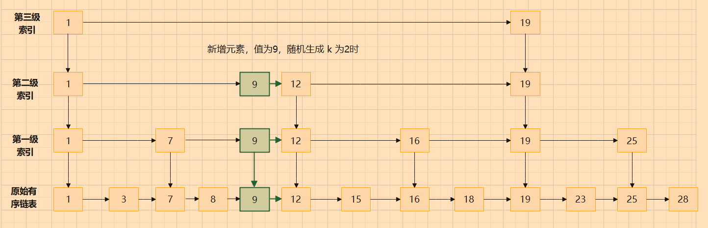
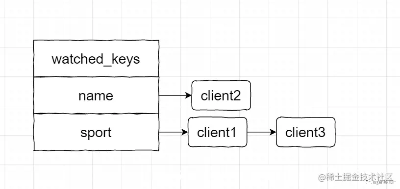
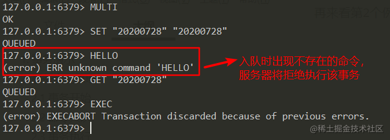
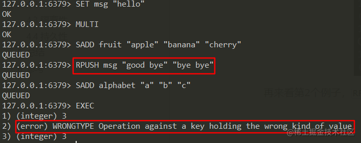

#### 目录

> 1. Redis有哪些数据结构
> 2. 数据结构的底层实现原理
> 3. 跳表是什么构建的
> 4. Redis可以做什么
> 5. Redis执行效率为什么这么高
> 6. 什么是IO多路复用
> 7. select、poll和epoll的区别
> 8. Redis的线程模型
> 9. 红黑树原理
> 10. Redis持久化方案
> 11. Redis Cluster原理及扩容
> 12. 如何保证数据库和缓存一致性
> 13. 三种分布式锁的优缺点
> 14. Redis穿透、击穿和雪崩问题
> 15. Redis如何保证高可用
> 16. Redis是否存在线程安全问题
> 17. Redis缓存的删除策略
> 18. Redis主从同步
> 19. Redis事务
> 20. keys和scan指令的区别
> 21. Redis大key和热key问题
> 22. 渐进式rehash

## 1. Redis 有哪些数据结构

常用的有五种数据结构，即 **String、List、Set、Zset 以及 Hash**。

**对象：**在 Redis 里，每个 KV 都是由对象组成的。其中 key 总是 string 对象，value 可以是 string、list、set、hash、zset 对象。

**最大值：**Redis 里面 string 可以保存最大可存储 512M 的数据，其余类型最大可以存储 2^32-1 个。


## 2. 数据结构的底层实现原理

### 1）String

String 由简单动态字符串（simple dynamic string SDS ）的抽象类型构成。 区别于C语言字符串，SDS 具有良好的伸缩性，在获取字符串长度，字符串修改，防止缓存区溢出等性能都比 C 语言字符串好 。


```go
// 保存字符串对象的结构 
struct sdshdr { 
int len; // buf 中已占用空间的长度，不包括'\0'（字符串以'\0'结尾时为了使用C语言中现成的库函数）
int free; // buf 中剩余可用空间的长度 
char buf[]; // 数据空间 
};
```

### 2）List

在 Redis3.2 之前，List 底层采用了 ZipList 和 LinkedList 实现的，在 3.2 之后，List 底层采用了 QuickList。 

Redis3.2 之前，初始化的 List 使用的 ZipList，List 满足以下两个条件时则一直使用 ZipList 作为底层实现，当以下两个条件任意一个不满足时，则会被转换成 LinkedList：

- List 中存储的每个元素的长度小于 64byte
- 元素个数小于 512


**ZipList 的实现原理：**


ZipList 是由一块连续的存储空间组成，从图中可以看出 ZipList 没有前后指针。

各部分作用说明：

- zlbytes：表示当前 list 的存储元素的总长度。
- zllen：表示当前 list 存储的元素的个数。
- zltail：表示当前 list 的头结点的地址，通过 zltail 就是可以实现 list 的遍历。
- zlend：表示当前 list 的结束标识。
- entry：表示存储实际数据的节点，每个 entry 代表一个元素。

- - previours_entry_length: 表示当前节点元素的长度，通过其长度可以计算出下一个元素的位置。
  - encoding：表示元素的编码格式。
  - content：表示实际存储的元素内容。


ZipList 的优缺点比较

- 优点：内存地址连续，省去了每个元素的头尾节点指针占用的内存。
- 缺点：对于删除和插入操作比较可能会触发连锁更新反应，比如在 list 中间插入删除一个元素时，在插入或删除位置后面的元素可能都需要发生相应的移动操作。


**LinkedList 的实现原理：**


LinkedList 是由一系列不连续的内存块通过指针连接起来的双向链表。	

各部分作用说明：

- head：表示 List 的头结点；通过其可以找到 List 的头节点。
- tail：表示 List 的尾节点；通过其可以找到 List 的尾节点。
- len：表示 List 存储的元素个数。
- dup：表示用于复制元素的函数。
- free：表示用于释放元素的函数。
- match：表示用于对比元素的函数。

LinkedList 的优缺点和 ZipList 正好相反。


**QuickList 的实现原理：**


在 Redis3.2 版本之后，Redis 集合采用了 QuickList 作为 List 的底层实现，QuickList 其实就是结合了 ZipList 和 LinkedList 的优点设计出来的。

各部分作用说明：

- 每个 listNode 存储一个指向 ZipList 的指针，ZipList 用来真正存储元素的数据。
- ZipList 中存储的元素数据总大小超过 8kb（默认大小，通过 list-max-ziplist-size 参数可以进行配置）的时候，就会重新创建出来一个 ListNode 和 ZipList，然后将其通过指针关联起来。

### 3）Set

set 底层实现采用了整数和字典两种实现方式，当满足：

- set 集合中所有元素都为整数
- set 集合中的元素个数 <= 512 （默认 512个，可以通过修改 set-max-intset-entries 配置调整集合大小） 

两个条件时，set 采用整数集合实现。否则，用字典实现。

**整数：**


**字典：**


### 4）Zset

Zset 底层实现采用了 ZipList 和 SkipList 两种实现方式，当满足：

- Zset 中保存的元素个数小于 128（可通过修改 zset-max-ziplist-entries 配置来修改）
- Zset 中保存的所有元素长度小于 64byte（通过修改 zset-max-ziplist-values 配置来修改）

两个条件时，Zset 采用 ZipList 实现。否则，用 SkipList 实现。

**ZipList：**


其中，ZipList 和 List 的底层实现有些相似，对于 Zset 不同的是，其存储是以键值对的方式依次排列，键存储的是实际 value，值存储的是 value 对应的分值。 

**SkipList：**


SkipList 分为两部分，dict 部分是由字典实现（其实就是 HashMap，里面放了成员到 score 的映射），zset 部分使用跳跃表实现（存放了所有的成员，解决了 HashMap 中 key 无序的问题）。从图中可以看出，dict 和跳跃表都存储的数据，实际上 dict 和跳跃表最终使用指针都指向了同一份成员数据，即数据是被两部分共享的，为了方便表达将同一份数据展示在两个地方。 


### 5）Hash

Hash 底层实现采用了 ZipList 和 HashTable 两种实现方式，当满足：

- Hash 中存储的所有元素的 key 和 value 的长度都小于 64byte（通过修改 hash-max-ziplist-value 配置调节大小）
- Hash 中存储的元素个数小于 512（通过修改 hash-max-ziplist-entries 配置调节大小）

两个条件时， 采用了 ZipList 实现，一旦有一个条件不满足时，就会被转码为 HashTable 进行存储。 

**ZipList 的实现原理：** Hash 和 Zset 的 ZipList 实现逻辑几乎相同，此处不再赘述。 


**HashTable 的实现原理：**


HashTable 实现底层采用了数组+链表的方式实现，其中键存储的 field 内容为在数组中，值存储的 value 存在链表里。当发生 Hash 冲突时，用的是 "拉链法" 解决，即在链表后用 Next 指针指向下一个 value 值。


## 3. 跳表是怎么构建的

上面我们说到，当 Zset 的个数大于 128 或者元素长度大于 64 byte 时，Zset 由跳表实现。那么跳表是怎么构建的呢？有哪些好处，接下来一一解答。


**跳表构建原理：**

首先，提到链表，大家都不会陌生，它和数组是两个重要的底层数据结构。它的优点是在增删改某一个元素时，只需要 O(1) 的时间复杂度，这是一个链表：


我们发现，即使是一个有序链表，我们在获取其中某个元素时，也只能通过 Next 指针遍历一遍。所以，链表查询的时间复杂度为 O(n)，其中 n 为链表元素的个数。

当链表元素很多时，查询的效率就变得很低。所以跳表出现了，跳表在原先的有序链表上加了多级索引，查询时可以通过索引来快速查找。原理和 MySQL 数据库添加索引是一样的，区别就是 MySQL 中用的是平衡多叉树，而跳表使用了多级索引层：


比如：当查询值为 23 的元素时，只需要在在索引层一次遍历：1、12、19、25、23，就找到了目标值。我们也可以发现，如果只加一层索引，遍历的次数比加两层索引的次数要多。所以，即使在链表元素很多的情况，构建多级索引层，查询效率的提升会非常明显。


**跳表的时间复杂度：**

前面已经提到，在一个单链表中查询的时间复杂度是 O(n)，现在分析一下跳表的情况。首先，我们按照每两个节点抽出一个节点作为上一级索引的节点，那么第一级索引节点大约是 n/2 个，第二级的索引大约是 n/4 个，以此类推，第 k 级索引的节点个数是第 k-1 级索引的节点个数的 1/2，那么第 k 级索引点的个数：n/2^k。假设索引一共有 h 级，最高级为 1 个节点。那么 2^h = n ——> h = log2n


**跳表的空间复杂度：**

假设原始链表的长度是 n，第一级索引大约是 n/2，第二级索引大约是 n/4，以此类推，每一层减少一半，直至剩下一个点，其实就是一个等比数列，计算可以得到：n+n/2+n/4+...+1 = 2n-1，所以跳表的空间复杂度是 O(n)。也就是说，如果将 n 个节点的单链表，以每两个节点抽取一个节点到上一级索引构成跳表，一共约需要 2n 个节点。


**跳表的动态更新：**

我们发现，跳表的查询时间复杂度从单链表的 O(n) 进化成了 O(logn)，但是我们在对链表做更新的时候，如果不及时更新索引，链表后续的查询效率也会变差。比如：


当我们只在一个索引段里添加元素时，极端情况下，跳表的时间复杂度可能会退化到 O(n)。因此，我们在更新元素（添加或删除）时，索引也要一起更新，达到索引和原始链表的平衡。


**跳表的平衡策略：**

跳表是通过随机函数来维护平衡的。当我们在跳表中插入数据的时候，通过选择同时将这个数据插入到部分索引层中。跳表是如何选择索引层的呢，一般会通过一个随机函数来决定这个节点插入到哪几级索引中。

比如：新增元素时，随机生成了 k，那么就将这个索引加入到第一级到第 k 级索引中：




**跳表的思想：**

跳表是空间换时间的思想，通过构建多级索引，实现基于链表层面的 “二分查找“（当构建索引的节点为多个时，还可实现多分查找）。跳表是一种动态的数据结构，支持快速查询以进行插入，更新和删除操作，时间复杂度为 O(logn)，空间复杂度为 O(n)。


## 4. redis可以做什么

### 1）缓存

是 redis 被使用最多的场景之一，业务数据一般存在磁盘中，当我们要读写数据时，直接去磁盘里面访问就可以。但磁盘 IO 一直是业务性能提升的一个重要瓶颈，且并发量很高的情况下，数据库承受不了访问压力甚至还会宕机。

而缓存就是为了应对这些场景产生的，当用到缓存时，先把一部分业务数据从 MySQL 写到 redis 中，用户在访问业务数据时，先到 redis 中拿数据；如果不存在，再到 MySQL 中拿，接着把访问过的数据写入 redis 中：


- 用 redis 作缓存时，访问速度快，且 redis 提供持久化机制，可以保证服务宕机之后，缓存数据依旧可以恢复。

### 2）消息队列

上篇文章中我们已经说到，Redis 中的 list 数据结构可以用 LinkedList 双向链表实现 。它可以很轻松地实现消息队列（生产者/消费者模型）。

消息的生产者只需要通过 lpush 命令将消息放入 list，消费者可以通过 rpop 取出该消息，并且保证消息的有序性。


- 如果需要实现带有优先级的消息队列也可以选择 **sorted list**。

### 3）分布式锁

在实现了高可用的业务场景中，假设现网的某个服务运行在三台服务器上。当客户端进行业务访问时，每台服务器被访问的概率一致。

这种情况下，想要控制只能由一台服务器去执行某些操作时（比如定时任务防止并发，抢占式消费等等），就可以用到分布式锁。简单来说，分布式锁就是**为了保证多台服务器在执行某一段代码时保证只有一台服务器执行**，它需要满足以下几点：

- 互斥性。在任何时刻，保证只有一个客户端持有锁。
- 不能出现死锁。如果在一个客户端持有锁的期间，这个客户端崩溃了，也要保证后续的其他客户端可以上锁。
- 可重入：保证上锁和解锁都是同一个客户端。 

Redis 实现分布式锁主要利用了 setnx 命令，setnx 即 SET if not exists (如果不存在，则 SET) 的简写：

```go
127.0.0.1:6379> setnx lock value 1 #在键lock不存在的情况下，将键key的值设置为value1 
(integer) 1
127.0.0.1:6379> setnx lock value 2 #试图覆盖lock的值，返回0表示失败 
(integer) 0
```

- 当某个客户端执行时，对某一段代码用 setnx 命令进行加锁。不存在则保存，并返回 1 表示加锁成功；如果已经存在则返回 0，加锁失败，代表该段代码已被加锁。

### 4）好友关系

redis 的 sinter 命令可以很方便地对两个 set 取交集，所以在维护好友关系的朋友圈时，把 A 关注的人放到 A:foller 集合中，B 关注的人放到 B:foller 中。当 A 访问 B 时，就可以通过交集的方式获得 A 和 B 同时关注的好友。

### 5）排行榜、计数器等等


## 5. redis 执行效率为什么那么高

- redis 提供丰富的数据结构，对数据存储进行相应的优化，我们可根据业务场景选择合适的操作对象。具体请看上一篇文章：redis 的数据结构及底层实现
- Redis 是纯内存数据库，一般都是简单的存取操作，线程占用的时间很短，所以访问起来也非常快。
- 单线程操作，避免了线程切换和竞态产生的消耗。注意，此处的单线程是指在接收客户端 IO 请求响应进行读写时是单线程操作；redis 本身是存在多线程使用场景的，比如：异步删除，持久化以及集群同步。
- 高性能的 IO 多路复用模型：redis 采用 epoll 作为 IO 多路复用技术的实现，一个线程可以处理多个客户端连接，并通过事件监听和回调的机制，避免了 redis 一直轮询关注是否有事件产生，节省了性能的消耗。


## 6. 什么是 IO 多路复用

首先了解下网络套接字（socket）的概念，可以把它简单理解为 TCP 网络层中应用层和传输层之间的一个抽象层：客户端和服务端建立抽象的网络连接时，TCP/IP 层需要做很多操作，如各种报文，消息头以及消息结构的封装。而 socket 把这些复杂的操作，抽象成了几个简单的接口，供应用层来调用以实现进程在网络中通信。


socket 网络通信协议层


TCP/IP 只是一个抽象的协议栈，网络连接时要具体实现，同时还得对外提供具体的接口，这就是 socket 接口。当一个请求连接到服务端时，可以把这个连接看作是 socket 节点连接。

举个例子，模拟一个服务器处理 3 个 socket 连接，在没有 IO 多路复用之前，我们的客户端与服务端是这么进行连接的：


- 一次只能连接 1 个 socket
- 永久阻塞直到 socket 连接有数据可读


不难发现，如果一个服务器有数以万计的请求时，处理效率将非常低下。这时，IO 多路复用登场了，首先给出一个故事来帮助我们理解什么是 IO 多路复用。

假设你是一个老师，让 30 个学生（代表服务端的 30 个连接请求）解答一道题目，然后检查学生做的是否正确，你有下面三个选择：

第一种选择：学生开始做题之前，由自己判断可能会先做完题目，然后举手。你负责检查先举手的学生，等着这个学生把题目做完，中间哪也不去，直到这个学生完成题目后，再检查下一位举手的学生。这时，如果有一位学生解答不出来，全班都会被耽误。这就是没有 IO 多路复用的情况。

第二种选择：你创建 30 个分身，每个分身检查一个学生的答案是否正确。 这种类似于为每一个用户创建一个进程或者线程处理连接。这种方式看起来效率也很高，但连接数很多时，频繁创建进程或线程，资源十分有限。

第三种选择，你站在讲台上等，谁解答完谁举手。这时 C、D 举手，表示他们解答问题完毕，你下去依次检查 C、D 的答案，然后继续回到讲台上等。此时 E、A 又举手，然后去处理 E 和 A... 

这就是 IO 复用模型，Linux下的select、poll 和 epoll 就是这样做的。比如，epoll 实现时，首先将用户 socket 对应的文件描述符（file descriptor，简称 fd）注册进 epoll，然后 epoll 帮你监听哪些 socket 上有消息到达，这样就避免了大量的无用操作。

此时的 socket 应该采用非阻塞模式，即收发客户消息不会阻塞（可以理解为大部分时间下，老师不再监听某个特定的学生做作业）。这样，整个过程只在调用 select、poll、epoll 这些调用的时候才会阻塞，整个进程或者线程就被充分利用起来。

**为什么需要 IO 多路复用**

由于 Redis 是内存操作，所以 Redis 的瓶颈不在 CPU，而在内存大小和网络 IO 上，优化的重点也在网络 IO 上。而它面临的最大问题就是一个线程如何处理多个客户端的连接请求，高效的 IO 多路复用机制正好可以满足这种需求。

**IO 多路复用的原理**

Redis 的 IO 多路复用，是指一个线程处理多个 IO 流，就是我们常听到的 select/epoll 机制。简单来说，Redis 运行单线程时允许内核监听多个 socket 套接字，一旦有请求到达，就交给 Redis 线程处理。同时，Redis 线程不会长时间阻塞在某一个特定的套接字上，以提升并发度。


## 7. select、poll 和 epoll 的区别

接下来从源码的角度看一下它们实现有哪些区别。

**select：**客户端操作服务器时会生成三种文件描述符 fd：readfds（读）、writefds（写）和 exceptfds（异常）。

```c
int select(     
    int maxfd,     
    fd_set *readset,     
    fd_set *writeset,     
    fd_set *exceptset,     
    struct timeval *timeout );  
返回值：     
    Ready_fd -> Ready_fd num // 当调用select时，返回就绪的fd数量     
    Timeout -> 0 // 超时返回0     
    Error -> -1 // 错误返回-1
```

当遍历函数 select() 执行时，会阻塞当前线程（老师啥也不做，等着看哪个学生举手了），以监视这 3 类文件描述符，等有数据可读、可写或者产生异常时，就会返回。返回后通过遍历 fdset 整个数组来找到已就绪的 fd，然后进行相应的 IO 操作。

优点：几乎所有的平台都支持；

缺点：

- 单个进程打开的 fd 限制数量为 1024 个（32位机器），可通过宏定义修改，但是效率依旧很慢；
- 每次调用 select() 时，需要把 fd 数据从用户态拷贝到内核态，频繁复制开销很大；
- 轮询方式遍历，会随着套接字 fd 的数量增多，性能下降。且每次都需要全部遍历，浪费CPU 时间，时间复杂度为 O(n)。


**poll：**基本原理与 select 一致，也是轮询 + 遍历，区别是 poll 中 fd 没有最大数量的限制（使用链表的方式存储 fd）。

```c
int poll (     
    struct pollfd *fds, // 链表存储     
    unsigned long nfds,     
    int timeout 
); 
返回值：     
    Ready_fd -> Ready_fd num     
    Timeout -> 0     
    Error -> -1      
    struct pollfd {     
        int fd; // file descriptor，文件描述符     
        short events; // events to look for，不变     
        short revents; // events returned，返回 
    }
```


**epoll：**没有 fd 个数限制，且 fd 集合从用户态到内核态只需要一次，使用事件通知机制来触发。通过 epoll_ctl 注册 fd，一旦 fd 就绪就会通过回调地址来激活对应的 fd，进行相关的 IO 操作。

```c
int epoll_create(int size); 
int epoll_ctl (     
    int epfd,     
    int op,     
    int fd,     
    struct epoll_event *event 
); 
int epoll_wait (     
    int epfd,     
    struct epoll_event *events,     
    int maxevents,     
    int timeout 
)      
    typedef union epoll_data {     
    void *ptr;     
    int fd;     
    uint32_t u32;     
    uint64_t u64; 
}
epoll_data_t;  
struct epoll_event {     
    uint32_t events;   // epoll events     
    epoll_data_t data; // user data variable 
}
```

epoll 之所以性能高是得益于它的三个函数：

- epoll_create() 系统启动时，在 Linux 内核里创建 epoll 实例（申请一个红黑树 rbTree 和就绪链表 readyList），以便存放 socket 节点；
- epoll_ctl() 每新建一个连接，都通过该函数操作 epoll 对象，在这个对象的红黑树里增、删、改对应的 socket 节点，绑定一个回调函数；
- epoll_wait() 轮询所有的回调集合，并完成对应的 IO 操作。相应分三步：

- - 阻塞线程
  - 内核查找红黑树中准备好的 socket，放入就绪链表 rdlist
  - 就绪列表中的内容复制到 events（从内核态复制到用户态），准备循环处理这些已就绪的 socket 节点

示例：

```c
int fds[] = ...; 
int efd = epoll_create(...); //内核态创建epoll实例（包含红黑树rbTree和就绪链表readyList） 
for (int i=0; i<fds.count; i++) {     
    epoll_ctl(efd, ..., fds[i], ...); //对红黑树操作，添加所有的socket节点 
} 
struct epoll_event events[MAX_EVENTS];  
while(true) {     
    /*         
    1.阻塞线程         
    2.内核查找红黑树中准备好的socket，放入就绪链表rdlist         
    3.就绪列表中的内容复制到events     
    */     
    int n=epoll_wait(efd, &events, ...);      
    if (n>0) {         
        for (i=0; i<n; i++) {
            // 这里有所有需处理的socket，不需要像select和poll那样全部遍历
            events[i].data.fd;      
        }     
    } 
}
```

优点：

- 没有 fd 限制，所支持的 fd 上限时操作系统的最大文件句柄数，1G 内存大概支持 10 万个句柄；
- 效率高，采用回调通知而不是轮询的方式，即使 fd 数目增加，时间复杂度仍为 O(1)；
- 用户与内核空间基于一种内存映射文件的方法，使它们可以共享内存空间，减少文件从用户态移动到内核态带来的性能消耗。

|             | select       | poll                 | epoll                     |
| ----------- | ------------ | -------------------- | ------------------------- |
| fd 数量     | 1024/2048    | 无限制               | 无限制                    |
| fd 状态感知 | 轮询 [O(N)]  | 轮询 [O(N)]          | 事件通知 [O(1)]           |
| 重置原数据  | 需要         | 不需要(event/revent) | 不需要(只通知就绪的)      |
| 运行模式    | 条件触发(LT) | 条件触发(LT)         | 条件触发(LT)/边缘触发(ET) |

LT 和 ET：

- LT，level triggered，水平触发，又叫条件触发。当被监控的 fd 上有可读写的事件时，epoll_wait() 会通知处理程序去读写。如果这次没有把数据一次性全部读写完，那么下次调用 epoll_wait() 时，它还会通知你上次没有读写完的 fd，可继续读写。即便是不需要读写的 fd，它也会一直通知你。
- ET，edge triggered，边缘触发。当被监控的 fd 上有可读写事件时，epoll_wait() 会通知处理程序去读写。如果这次没有把数据全部读完，下次将不再通知。
- 学过计算机组成原理的应该知道脉冲信号，其实 ET 和 LT 的原理和电信号的变化差不多。LT 就是只有高电平(1)或低电平(0)时才触发通知，只要在指定的状态上，就会得到通知；ET 是只有电平发生变化时(从高电平到低电平，或者从低到高)，才触发通知。


**三者实践对比：**

例如，100w 个连接，里面有 1w 个活跃连接。

select：不修改宏定义时，默认把 1024 个 fd 放到同一个进程。则需要 100w/1024 = 977 个进程才可以支持，会使得 CPU 性能特别差；

poll：没有最大文件描述符限制，100w 个连接则需要 100w 个 fd，遍历特别慢不说，还有空间拷贝还会消耗大量的资源；

epoll：请求进来时就创建 fd 并绑定一个回调地址，当活跃连接发起请求 IO 操作时，epoll_wait() 函数只需要遍历这 1w 个活跃连接，进行相应的额操作即可，既高效又不用做内存拷贝。


## 8. Redis的线程模型

​	1）文件事件处理器：使用了 IO 多路复用来监听套接字。当监听的套接字中有新的操作，比如读取、写入、异常等操作发生时，文件事件处理器就会调用每个套接字关联好的事件处理器（包括命令请求处理器、命令回复处理器）来处理。

文件事件处理器以单线程运行，但通过 IO 多路复用来监听多个套接字。既实现了高性能的网络通信模型，又可以很好地与 redis 服务器中其他同样以单线程方式运行的模块进行对接，这保持了 redis 内部单线程设计的简单性

​	2）线程模型：redis 客户端对服务器每次调用都会经历请求命令、执行命令、返回结果三个过程。执行命令阶段，由于 redis 是单线程处理命令，所以到达服务端的命令不会立即执行，而是进入一个队列，然后逐个被执行。虽然，客户端发送的执行命令的处理顺序不一定是有序的，但可以确定的是不会有两条命令同时被执行，也不会产生并发问题，这个就是 redis 单线程的基本模型。


## 9. 红黑树原理

红黑树（Red Black Tree）是一种平衡的排序二叉树，如图：


所有的红黑树都满足如下性质：

1）每个节点要么是红色，要么是黑色的；

2）根节点和叶子节点（即 NIL 空节点）一定是黑色；

3）红色节点的父节点，或者子节点一定为黑色；

4）对每个节点，从该节点到叶子节点的所有路径上，包含的黑节点数目相同。

根据性质4，我们可以得出：从根节点到叶子节点的可能路径，最长不超过最短路径的两倍。正是因为这些特点，红黑树在做元素删除和插入时不同于平衡二叉树追求绝对的平衡，它的旋转次数更少，插入最多两次旋转，删除最多三次旋转。所以在对于频繁增删节点的情况下，红黑树的效率是优于平衡二叉树的。

如果用哈希表的话，需要维护一个桶，桶大小决定着哈希冲突的长度；桶过小，会导致冲突变多；桶过大，会造成内存浪费。而哈希表存储数据变化的时候，会根据数据量而改变自己的桶大小，而每次桶大小的变更都需要重新计算所有数据项的归属，这是一笔巨量的运算。因此，综合对比，epoll 采用红黑树作为底层的数据结构，且红黑树可以判断是否是重复的 fd。

内核态需要维护一个长久存放 fd 的数据结构，而 fd 的变动十分频繁，且需要支持快速查询，所以红黑树很适合（稳定）。


红黑树的主要应用场景：

1）java8 hashmap 中链表转红黑树

优势：时间复杂度从O(n) --> O(logn)，且自旋开销较其他树较低（不用整体平衡）。

2）epoll 在内核中的实现，用红黑树管理 fd 文件描述符。

3）Linux 进程调度 Completely Fair Scheduler，用红黑树管理进程控制块；nginx 中，用红黑树管理 timer 等 。


## 10. Redis持久化方案

### 1）RDB（redis database）

快照模式，是 Redis 默认的数据持久化方式。它实际上是 Redis 内部的一个定时器事件，每隔一段时间就去检查当前数据发生改变的次数和时间频率，看它们是否满足配置文件中规定的触发条件。

当条件满足时，Redis 通过操作系统调用 fork() 函数创建一个子进程，和父进程享有同一个地址空间。Redis 通过子进程遍历整个内存空间，将数据集拷贝到一个临时文件，当拷贝完成后通知父进程将新的 RDB 文件替换掉原有的文件，以完成数据持久化的操作。

而且，在持久化过程中，主进程仍然可以对外提供服务，父子进程通过操作系统的多进程 COW（copy and write）机制实现了数据段分离，从而保证父子进程之间互不影响。

**优缺点总结**：

我们知道，在 RDB 持久化的过程中，子进程会把 Redis 的所有数据都保存到新建的 dump.rdb 文件中，这是一个既消耗资源又浪费时间的操作。因此 Redis 服务器不能过于频繁地创建 rdb 文件，否则会严重影响服务器的性能。

RDB 持久化的最大不足之处在于，最后一次持久化的数据可能会出现丢失的情况。我们可以这样理解，在 持久化进行过程中，服务器突然宕机了，这时存储的数据可能并不完整，比如子进程已经生成了 rdb 文件，但是主进程还没来得及用它覆盖掉旧的 rdb 文件，这样最后一次持久化的数据就会丢失。

RDB 数据持久化适合于大规模的数据恢复，并且还原速度快，如果对数据的完整性不是特别敏感（可能存在最后一次丢失的情况），那么 RDB 持久化方式非常合适。

### 2）AOF（append only log file）

又被称为追加模式，或日志模式。它会记录服务器执行的所有写操作命令，并且只记录对内存有过修改的命令，存储在 appendonly.aof 文件中。在服务器启动时，重新执行 AOF 文件来还原数据集，这个过程被称为 “命令重演”。

**A) 写入机制**

Redis 在收到客户端修改命令后，先进行相应的校验，如果没问题，就立即将该命令存进缓冲区，再以一定的速率将缓冲区数据追加到 .aof 文件中。这样就算遇到了突发的宕机情况情况，也只需将存储到 aof 文件中的命令，进行一次“命令重演”就可以恢复到宕机前的状态。

在上述执行过程中，有一个很重要的环节就是命令的写入，这是一个 IO 操作。Redis 为了提升写入效率，它不会将内容直接写入到磁盘中，而是将其放到一个内存缓存区（buffer）中，等到缓存区被填满时才真正将缓存区中的内容写入到磁盘里。

**B) 重写机制**

Redis 在长期运行的过程中，aof 文件会越变越长。如果机器宕机重启，“重演”整个 aof 文件会非常耗时，导致 Redis 长时间无法对外提供服务，因此就需要对 aof 文件做一下“瘦身”。为了让 aof 文件的大小控制在合理的范围内，Redis 提供了 AOF 重写机制，手动执行 BGREWRITEAOF 命令，或者配置策略实现自动重写。

**C) AOF持久化策略**

在上述介绍写入机制的过程中，如果遇到宕机前，缓存内的数据未能写入到磁盘中，那么数据仍然会有丢失的风险。服务器宕机时，丢失命令的数量，取决于命令被写入磁盘的时间，越早地把命令写入到磁盘中，发生意外时丢失的数据就会越少。AOF持久化策略分三种：

- Always：服务器每写入一个命令，就调用一次 fsync 函数，将缓冲区里面的命令写入到硬盘。这种模式下，服务器出现故障，也不会丢失任何已经成功执行的命令数据，但是其执行速度较慢；
- Everysec（默认）：服务器每一秒调用一次 fsync 函数，将缓冲区里面的命令写入到硬盘。这种模式下，服务器出现故障，最多只丢失一秒钟内的执行的命令数据，通常都使用它作为 AOF 配置策略；
- No：服务器不主动调用 fsync 函数，由操作系统决定何时将缓冲区里面的命令写入到硬盘。这种模式下，服务器遭遇意外停机时，丢失命令的数量是不确定的，所以这种策略，不确定性较大，不安全。

由于是 fsync 是磁盘 IO 操作，所以它很慢！如果 Redis 执行一条指令就要 fsync 一次（Always），将会严重地影响到 Redis 的性能。

在生产环境的服务器中，Redis 通常是每隔 1s 左右执行一次 fsync 操作（ Everysec），这样既保持了高性能，也让数据尽可能的少丢失。最后一种策略（No），让操作系统来决定何时将数据同步到磁盘，这种策略存在许多不确定性，所以不建议使用。


注意：sync 和 fsync 函数是内核里面防止“延迟写”造成的缓存和文件的数据不一致，操作系统提供的两个函数。sync 将修改过的数据放入缓存写队列中就返回，不等待 IO 操作结束；而 fsync 会等待 IO 操作结束再返回，它会确保修改过的块立即写到磁盘上，来保证文件数据和缓存一致。即，Linux 系统的 fsync() 函数可以将指定文件的内容从内核缓存刷到硬盘中。

### 3）AOF和RDB对比

| RDB持久化                                                    | AOF持久化                                  |
| ------------------------------------------------------------ | ------------------------------------------ |
| 全量备份，一次保存整个数据库                                 | 增量备份，一次只保存一个修改数据库的命令   |
| 每次执行持久化操作的间隔时间较长                             | 保存的间隔默认为一秒钟（Everysec）         |
| 数据保存为二进制格式，其还原速度快                           | 使用文本格式还原数据，所以数据还原速度一般 |
| 执行 SAVE 命令时会阻塞服务器，但手动或者自动触发的 BGSAVE 不会阻塞服务器 | AOF持久化无论何时都不会阻塞服务器          |

如果进行数据恢复时，既有 RDB 文件，又有 AOF 文件，我们应该先通过 AOF 文件来恢复数据，这能最大程度地保证数据的安全性。


## 11. Redis Cluster 原理及扩容

**1）背景**

大数据高并发场景下，写请求全部落在 master 节点上，导致存储、CPU、内存和 IO 都存在瓶颈。如果我们采用纵向扩展（扩容内存），会导致 RDB 文件过大，从而在 fork 子进程进行持久化时阻塞时间较长。此时，Redis Cluster 集群方案应运而生。

**2）简介**

Redis Cluster（简称 RC，下同）是 Redis 原生的数据分片实现，可以自动在多个节点上分布数据，不需要依赖任何外部的工具。

**3）原理**

RC 采用的是虚拟槽分区，一个集群共有 16384（2^14）个 hash 槽。集群中所有的 key 会被分派到这些 hash 槽上，这些 slot 又会被指派到多个 Redis 节点上，每个节点的槽个数为 16384/N 个。

**4）扩容机制**

假设我们有三个主节点（A：6379，B：6380，C：6381），三个从节点 A'，B'，C'（6382,6383,6384）从节点。随着业务发展过快，需进行扩容。此时新增一个主节点 D：6385，D'：6386.

【注意：添加新节点时，尽量采用 Redis-trib 工具的命令，而不要用 Cluster meet，因为 trib 工具会去检查新节点的状态，保证新节点没有数据，也还未加入其它集群】


步骤一：为了保证各节点的 hash 槽数量尽可能相同，扩容时我们采用分批迁移。分别从 A ，B，C 节点上，迁移 4096 个槽（2^14/4 = 4096）之后的槽位到新增的 D 节点上。

步骤二：确定了迁移槽之后，开始迁移，主要有以下几个步骤：


1. 对目标节点（这里是新节点 D：6385）发送 cluster setslot {slot} importing {sourceNodeld} 命令，让目标节点准备导入槽数据；
2. 对源节点（A，B，C节点）发送 cluster setslot {slot} migrating {targetNodeld} 命令，让源节点准备迁出槽数据；
3. 源节点上循环执行 cluster getkeysinslot {slot} {count} 命令，获取 count 个数据槽 {slot} 的 key；
4. 在源节点上执行 migrate {targetIp} {targetPort} key 0 {timeout} 命令将指定的 key 进行迁移。

重复 3,4 步骤直到槽下所有的键值数据迁移到目标节点。

步骤三：向集群内所有主节点发送 cluster setslot {slot} node {targetNodeID} 命令，通知槽已经分配给目标节点。


**5）缩容机制**

缩容的三种情况：下线迁移槽、忘记节点、关闭节点。其中槽迁移和扩容是一样的。


**6）key迁移的原子性**

由于 migrate 命令是同步阻塞的（同步发送和同步接收），在迁移过程中会阻塞该引擎上对该 key 的所有读写，只有在迁移响应成功以后，才会将本地的 key 删除。因此在 redis-cluster 中迁移是原子的，一个 key 不会存在正在迁移时被读写的情况。


**7）ASK 和 MOVED**

Redis 客户端在发起 key 命令请求时有如下操作：

- 计算 key 的 slot 值；
- 获取 slot 的节点位置（先到本地 slot -> node **映射缓存**获取）；
- 对指定节点发起请求。

但是，如果该 key 对应的 slot 已经被迁移：

- 如果迁移过程已经结束，但客户端本地的映射缓存还未更新，就会出现 **MOVED** 重定向；
- 如果 slot 正在迁移，客户端本地缓存未更新，就会出现 **ASK** 重定向。

当请求的 slot 发生迁移时，redis-cluster 作如下处理：

1. 客户端根据本地 slots 缓存发送命令到源节点，如果存在 key 对象则直接返回结果给客户端；
2. 如果 key 对象不存在，但 key 所在的 slot 属于本节点，则可能存在于目标节点。这时源节点回复 ASK 重定向异常，例如 (error) ASK：
3. 客户端收到 ASK 异常后提取出目标节点的信息，发送 asking 命令到目标节点打开客户端连接标识，再执行 key 命令：如果存在则执行返回数据，不存在则返回不存在信息；

如果第 2 步中 key 所在的 slot 不属于本节点，也就是迁移已经完成了，则返回 MOVED 重定向，例如 (error) MOVED。然后客户端再根据 MOVED 异常返回的目标节点信息，直接去目标节点请求 key 数据，并且之后同一个 key 的数据都去目标节点上请求。

MOVED 和 ASK 重定向和网络请求里的 301、302 类似，是永久重定向和临时重定向的区别。


## 12. 数据库与缓存如何保证一致性

### 1）一致性

- 强一致性：各节点之间保证数据一直是相同的，它要求系统读出和写入的数据任何时刻都保持一致，用户体验很好，但实现起来往往对系统性能的影响很大；
- 弱一致性：系统尽可能保证各个节点的数据保持一致，不承诺立即读取和写入的值相同，可能会在某个时间级别（比如：秒极）后，数据可以达到一致性状态；
- 最终一致性：是弱一致性的一个特例，系统保证在一定时间内，数据可以达到一致性的状态。它是弱一致性中比较推崇的一种一致性方式，也是业界在大型分布式系统中常用的策略。

### 2）三种经典的缓存模式

- Cache Aside Pattern，旁路缓存模式
- Read-Through/Write-Through，读写穿透
- Write Behind，异步缓存写入


**第 1 种缓存模式：旁路缓存**

旁路缓存模式，平时常用的缓存模式，适合读请求比较多的场景。当数据请求：

- 读（Read）数据时，若缓存未命中，则先读 DB，从 DB 中取出数据，放入缓存，同时返回响应；
- 写（Write）数据时，先更新 DB，再删除缓存。

Q1：为什么写数据时，不先删缓存，再更新 DB？

A1：会出现缓存和 DB 中数据不一致的情况，比如以下场景：

- 请求 1 更新数据时，先把缓存中的数据删除；
- 请求 2 访问该数据，从 DB 中读取老数据，新增缓存；
- 请求 1 更新 DB，导致新数据和缓存不一致，但后续请求只会读取到缓存里的老数据。

有杠精面试官会接着问，那如果业务要求必须先删除 cache 呢？那咱们也别怕，还可以用“延时双删”策略，即：

- 先删除 cache
- 再更新 DB
- 休眠一会（比如 1 秒），再删除缓存

Q2：怎么保证缓存删除一定成功？

A2：多删除几次，即引入 删除缓存重试机制，有两种常用的方法：

1. 引入消息队列来保存删除失败的 key，将未删除的 key 消费再删除，如图所示


1. 读取 binlog 异步删除缓存

重试删除也不错，但可能会导致很多业务代码入侵。所以，可以试试 MySQL 的 binlog 来异步淘汰 key，如图：


可以使用阿里的 canal 将 binlog 日志采集，发送到 MQ 队列中，然后通过 ACK 机制确认处理这条更新消息，删除缓存，保证数据一致性。


Q3：那，先更新 DB，再删除缓存就一定没问题吗？

A3：理论上来说也可能会出现数据不一致的情况，比如以下场景：

- 缓存不存在时，请求 1 访问数据，先读取 DB；
- 请求 2 更新数据，DB 写入了新数据；
- 请求 1 新增缓存，但缓存中是 DB 的老数据。

但是，A3 这种情况出现的概率非常小，因为缓存的写入速度比 DB 的写入速度快很多。

旁路缓存的缺陷和解决方案：

缺陷 1：首次请求数据一定不在 cache；

方案：缓存预热。

缺陷 2：当系统中的数据更新很快时，缓存删除频繁，会影响缓存的命中率；

方案 1：如果需要缓存和 DB 数据保持强一致性，则在更新 DB 时也更新一下缓存，若是在分布式场景下需要加锁来保证 Redis 的线程安全问题；

方案 2：可以短暂允许缓存和 DB 不一致时，更新 DB 时也更新缓存，不加锁但是缓存设置时间短一点，这样即使产生了数据不一致，影响也比较小。


**第 2 种缓存模式：读写穿透**

这种模式下服务器把 cache 当成主要的数据存储，从中读取数据并直接写入到 cache 中。由 cache 服务器负责将数据写入 DB，从而减轻了应用程序的职责。

不常用，抛去性能影响，大概率因为我们用的 Redis 不支持将 cache 数据写入 DB。


**第 3 种缓存模式：异步缓存写入**

这种模式下，通过批量异步更新的方式来让节省 IO 的开销，和 MySQL 的 InnoDB Buffer Pool 机制比较类似：

这种模式下的 DB 写性能很高，非常适合一些数据经常变化且对数据一致性没那么高的场景。它的缺点也很明显，当 cache 出现断电或者宕机时，数据可能还没异步更新到 DB，就会丢失。


## 13. 三种分布式锁的优缺点

分布式锁要求：

- 保证在分布式部署的应用集群中，同一时间点只有一个线程持有锁；
- 这把锁需要是可重入的（防止死锁）；
- 最好是一把非阻塞锁（根据业务需求考虑要不要这条，比如：临界区长短，加锁时长）；
- 高性能，高可用，无单点问题；


1）MySQL 实现排他锁

首先创建一张简单表，在某一个字段上创建唯一索引（保证多个请求新增字段时，只有一个请求可成功）

CREATE TABLE `user` (   `id` bigint(20) NOT NULL AUTO_INCREMENT,   `uname` varchar(255) DEFAULT NULL,   PRIMARY KEY (`id`),   UNIQUE KEY `name` (`uname`) USING BTREE ) ENGINE=InnoDB AUTO_INCREMENT=4 DEFAULT CHARSET=utf8mb4


获取锁：

INSERT INTO `user` (uname) VALUES ('methodName');

当多个请求提交 insert 语句时，只有一个请求可成功。


问题：

1. 锁强依赖于数据库的可用性，若数据库为单点。一旦 DB 挂掉，则会导致业务系统不可用；
2. 锁没有失效时间，若解锁操作失败，则锁记录会一直存在于数据库中，其他线程将无法拿到锁；
3. 这把锁是非阻塞的，数据库因被加锁而 insert 失败后，会直接报错；
4. 这把锁是非重入的，同一个线程在没有释放锁之前无法获得该锁。


解决方案：

1. 数据库主从同步，一旦主库挂掉快速切到从库；
2. 做一个定时任务，每个一段时间把数据库中的超时数据清理一遍；
3. 搞一个 while 循环，直到 insert 成功再返回；
4. 在数据库表加个字段，保存拿到锁的节点实例信息。下次抢锁前，先查询数据库，若当前节点的实例信息在数据库可查到，直接把锁分配给这个节点。


优点：直接借助数据库，容易理解；

缺点：

1）考虑失效时间和可重入等问题，会让整个方案变得越来越复杂；

2）操作数据库性能开销大；

3）使用数据库的行级锁不一定靠谱，尤其当我们锁表并不大的时候。


2）redis 实现分布式锁

setnx命令实现

```go
const (   
    // key 为本台机器的IP，一个服务实例部署在一台机器时，该加锁方式可以防止多实例运行此段代码   
    lockKey = getLocalIP() 
) 
func getLock() {     
    methodName := "getLock"     
    val, err := conn.Do("set", lockKey, time.Now(), "nx", "ex", 100) 	
    if err != nil {         
        zaplog.Errorf("%s redis error, %s", methodName, err)
        ReportAlarmToMAS(MQPublishMessageFail, fmt.Sprintf("%s get redis key failed", methodName)) 	
    }     
    if val == nil { 		
        zaplog.Infof("%s get redis lock error", methodName)         
        return 	
    } 
}
```

问题：

1. 早期版本的 redis 没有 setnx 命令在写 key 时直接设置超时参数，需要用 expire 命令单独对锁设置过期时间，会导致死锁问题。比如，设置锁的过期时间执行失败了，导致后来的抢锁都会失败；
2. 后期版本的 redis 可设置超时时间，但存在加锁超时，锁自动释放，导致并发问题。比如，加锁时间为 5 秒，但 A 线程加锁时超时，用了 10 秒。导致想要阻塞的时间和实际阻塞的时间不一样；
3. 除了上面那种情况，还有一种情况会导致误删除；A 在获取锁 value 准备删除的时候，锁到期被删除了，B 再获取锁。此时 A 可能会误删除锁，B 业务就懵逼了；
4. 若 redis 用了主备模式：当客户端 A 从 master 节点获取到了锁，master 节点将锁同步到 slave 之前，master 宕机，slave 晋升为 master 主节点。此时客户端 B 来获取锁，由于加锁还未同步，所以依旧可以拿到锁。


解决方案：

1. 用 setnx 解决；
2. value 设置为当前线程的唯一标识，当另一个线程来操作时，先判断是不是自己线程的锁。若不是，则不能操作；
3. 用 LUA 脚本，来保证 redis 操作的原子性；
4. **Redlock**，Redis Distributed Lock，即 Redis 实现的分布式锁。当客户端抢锁时，需要从多个节点去申请锁，当从一半以上的节点上获取成功时，锁才算获取成功。

优点：非阻塞，相对其它方案性能高。

缺点：

- 锁释放的时间不好把控；
- 非阻塞，操作失败后，需要轮询，会占用 CPU 资源；


3）基于 zookeeper 实现

Zookeeper 是一个为分布式应用提供一致性服务的中间组件，其内部是一个分层的文件系统目录树结构，规定其某一个目录下只能有唯一的一个文件名。其分布式锁的实现方式如下：

1）创建一个目录 mylock；

2）节点 A 想要获取锁，就得再该目录下创建一个临时顺序节点；

3）获取 mylock 目录下所有子节点，获取比自己小的兄弟节点。若无，则取得锁；

4）线程 B 创建的节点不是最小的节点，于是监听比自己次小的节点 A；

5）线程 A 释放锁后，删除 A 创建的节点；此时，线程 B 监听到变更事件，再次获取该目录下的最小节点，若是自己的节点，则获取锁；否则，继续监听比自己节点次小的节点。

优点：集群、无单点问题，可重入，可避免锁无法释放。

缺点：性能不如 Redis，主要是写操作（获取和释放锁）都需要在 leader 上执行，同步给 follower。


## 14. Redis穿透、击穿和雪崩

**缓存雪崩：**Redis 数据库的 key 大面积同时过期，刚好有大量的请求进来，直接打到数据库层，导致数据库阻塞或者直接宕机。

解决方法：

- 事前：

- - Redis 高可用：主从+哨兵，Redis cluster，避免全面崩溃；
  - 原有的缓存失效时间加上一个随机值，比如 1~5 分钟；
  - // 缓存预热；
  - 热点 key 永不过期；

- 事中：本地 ehcache 缓存，对 MySQL 的访问进行 hystrix 限流&降级，避免 MySQL 被打崩；
- 事后：Redis 做持久化，一旦重启，自动从磁盘上拉取数据，快速恢复缓存。


**缓存穿透：**指查询一个缓存和数据库都不存在的值，尽管不存在却每次都去 MySQL 查询，在访问量大时就可能导致数据库挂掉。如果有不良用户大量访问数据库不存在的 key，就会形成安全漏洞。

解决方法：

- 如果访问的 key 在缓存和数据库都不存在，我们仍然把它缓存起来，值设置为空，过期时间可以短一点；
- 接口层添加校验，用户鉴权，以及请求参数的基本校验（比如 id 必须大于 0）；
- 采用布隆过滤器，将所有的数据 Hash 到一个大的 bitMap 中（会有一定的出错率）。


**布隆过滤器**相当于 HashSet，可以快速判断一个元素在集合中是否存在，不存在就直接返回。

核心思想：

- 通过 Hash 函数，将元素映射到位阵列中的一个点；
- 多次 Hash ，增加随机性，减少 Hash 碰撞的概率；
- 扩大数组范围，使 Hash 值均匀分布，并继续减少 Hash 碰撞的概率。

优势：查询速度极快，千万级量级的数据查询只需 0.2 秒，查询不存在的数只需 0.05 秒。


**缓存击穿：**击穿和雪崩的区别是量级上不同，雪崩是大面积缓存同时失效，击穿是单个 key 值缓存的过期失效。

解决方法：

- 若缓存数据基本不会更新，可以设置热点数据永不过期；
- 加锁保证只有一个线程可以打到数据库，并重写缓存，后面的线程走缓存；
- 若缓存的数据更新频率，或者刷新频率的时间过长的情况下，可以利用定时线程在缓存过期前重新构建缓存，或者延迟缓存过期的时间，来保证所有的请求可以一直访问到缓存数据。


## 15. Redis如何保证高可用

高可用是通过设计，减少系统不能提供服务的时间，是分布式系统的基础也是保障系统可靠性的重要手段。Redis 通过以下 4 个手段来保证：

1. 数据持久化：Redis4.0 之后提供 RDB 和 AOF **混合持久化**的方式来保证数据宕机不丢失；
2. 主从数据同步（主从复制）：

1. 1. 从从模式，是指一级从节点下面还可以拥有更多的从节点；
   2. 主从模式，可实现数据的读写分离，减轻主节点的运行压力。当主节点宕机以后，可以迅速把从节点提升为主节点，实现了 Redis 的高可用，还防止数据丢失的风险。

1. Redis 哨兵模式（Sentinel）：

1. 1. 哨兵监听主从服务器，当主节点宕机时，哨兵的心跳机制可以发现节点发生了故障，并将其标记为主观下线状态。
   2. 接下来，如果有足够数量（quorum配置值）的哨兵证实该服务器为主观下线，将其被标记为客观下线。
   3. 然后，所有的哨兵会选举出领头哨兵，领头哨兵节点对 Redis 主节点进行故障转移操作，整个过程都不需要人工干预。

1. Redis 集群（Cluster）：见 Redis Cluster 原理。


## 16. Redis是否存在线程安全问题

### 1）Redis 服务端层面

Redis-Server 本身是一个线程安全的 K-V 数据库，服务端在执行指令时，用的是主线程来处理，不需要任何同步机制，它也不会存在任何安全问题。

### 2）客户端层面

从 Redis 的客户端来说，虽然 Server 中的指令操作是原子的，但如果有多个 Client 同时执行多个指令的情况，产生了多线程情况下共享资源访问的竞争问题，就无法保证原子性。

这时，我们可以使用 Redis 里的原子指令，或者对于多个客户端的资源访问加分布式锁，再或者我们可以通过 LUA 脚本，来实现多个指令的执行操作，从而满足它的原子性。

### 3）CPU/IO密集型程序

**CPU 密集型**

一个计算为主的应用程序，被称作 **CPU 密集型**程序。这类程序的特点是需要完成大量的运算，所以在多线程或者多进程跑的时候，可以充分利用起所有的 CPU 核心数来工作。

比如 8 核的 CPU，可以同时跑 8 个线程的运算任务，此时是最大效率。但是，如果线程/进程数远远超过 CPU 核心数，反而会使得任务的效率下降，因为频繁地切换线程/进程也是要消耗时间的。

**IO 密集型**

一个磁盘操作或者网络通信为主的程序，被称作 **IO 密集型**程序，这类程序的特点是线程/进程会经常阻塞等待（IO 操作和网络通信比较耗时）。当一个线程/进程处于 IO 等待的时候，就可让另一个线程/进程就可以在 CPU 里面跑，进而充分利用 CPU 的效率。

而单线程/进程的话，就会持续等待一直到数据返回，效率就比较低。因此，在 IO 密集型程序里，线程数可以是 CPU 的数倍，添加一个线程就可能极大地增加性能。

### 4）为什么 Redis 是单线程的

通过 CPU/IO 密集型系统的特点，不难看出，由于Redis 在接收客户端的读写请求时是内存操作，几乎不涉及 IO 处理和网络通信，所以用单线程来避免线程切换和竞态产生的消耗。而 Redis 服务器的异步删除、持久化和集群同步等可能有 IO 阻塞的操作是**采用多线程/进程操作**的。


## 17.Redis 缓存的删除策略

### 1）立即删除

Redis 持续遍历所有被设置了过期时间的 key，来检测 key 是否过期，如果过期立即对其删除。立即删除可以保证内存中数据一点都不浪费，但持续遍历/删除都会占用 CPU，如果刚好遇到 CPU 很忙的时候，就会给 CPU 造成额外的压力，产生极大的性能消耗。

总结：对内存友好，对 CPU 不友好。

### 2）惰性删除

数据过期后，不做处理，等下次访问该数据的时候判断一下：如果过期了，就删除这个 key，并返回不存在。惰性删除策略下的 key，已经过期但不进行访问的情况下，它们会一直存在于内存中，可能永远也不会删除。

总结：对 CPU 友好，对内存不友好，甚至可能造成内存泄漏。

### 3）定期删除

定期删除是一种折中处理，每隔一段时间执行一次删除过期 key 的操作。定期轮询 Redis 库中的时效性数据，采用随机抽取的策略，抽到过期的 key 就删除。

特点：

- CPU 性能占用设置有峰值，检测时长和频率可自行控制；
- 内存压力不大，长期占用内存的冷数据会被持续清理。

缺点：

- 定期删除执行的时长和频率很难界定，如果太频繁就会和立即删除策略一样，消耗 CPU 过多；如果执行太不频繁，就会和惰性删除策略一样，出现浪费内存的情况；
- 可能会有一直没抽查到的 key（漏网之鱼）存在。

### 4）Redis 缓存淘汰策略

打开 redis 的配置文件，搜索 'maxmemory-policy'，会发现默认淘汰策略是 `noeviction`，什么都不淘汰。

Redis 的缓存淘汰策略：

1. noeviction：不会淘汰任何 key
2. allkeys-lru：对所有 key 使用 LRU 算法进行删除
3. allkeys-random：对所有 key 随机删除
4. allkeys-lfu：对所有 key 进行 LFU 算法进行删除
5. volatile-lru：对所有设置了过期时间的 key 使用 LRU 进行删除
6. volatile-random：对所有设置了过期时间的 key 随机删除
7. volatile-lfu：对所有设置了过期时间的 key 使用 LFU 删除
8. volatile-ttl：删除马上要过期的 key

两个常用的页面置换算法：

- LRU：Least Recently Used，最近最少使用算法，强调最近未使用的 key；
- LFU：Least Frequently Userd，最近最不频繁使用算法，强调最近使用频率最少的 key；

淘汰策略的选取：

1. 如果是一般的冷热数据缓存，推荐使用 allkeys-lru，其中一部分 key 经常被读写的热数据不能删除，被淘汰的冷数据如果再次访问，可以通过业务代码重新放入缓存中；
2. 如果各个 key 访问频率差不多，则可以使用 allkeys-random 策略，随机选取一部分数据删除；
3. 如果要让 redis 根据 TTL 来筛选要删除的 key，则采用 volatile-ttl 策略；
4. volatile-lru 和 volatile-random 的应用场景是：服务中既有过期 key，又有需要持久存在的 key。但对于这种场景，我们一般使用两个 Redis 节点。


## 18.Redis 主从同步（复制）

Redis 复制功能分为三步：

1. SLAVE OF 127.0.0.1 6379 发起 socket 连接，发送 PING 命令检查是否可用；
2. 同步：从服务器发送 PSYNC 命令，先将从服务器的状态更新至主服务器的状态；
3. 传播：当主从服务器状态一致以后，如果这时主服务器执行写操作使自己的状态改变，则导致主从状态不一致。传播会将主服务器刚才执行的写操作命令，传送到从服务器，使主从服务器数据库回到一致的状态。

### 1）同步

当客户端执行 SLAVEOF 命令，要求从服务器复制主服务器时，从服务器开始执行同步操作：


- 从服务器向主服务器发送 PSYNC 命令；
- 主服务器收到命令以后，执行 BGSAVE 操作，在后台生成一个 RDB 文件，并使用一个缓冲器记录开始执行 BGSAVE 之后的所有写命令；
- 主服务器完成 BGSAVE 命令以后，将新生成的 RDB 文件发送给从服务器；从服务器接收并载入这个 RDB 文件，将自己的数据库状态置为主服务器执行 BGSAVE 命令时候的状态；
- 主服务器将执行 BGSAVE 时缓冲区的所有写命令发送给从服务器，从服务器执行这些命令（此时从服务器由于在载入 RDB 文件，所以是阻塞状态，不能执行其余的命令），从服务器执行所有命令以后，主从复制就完成了。

### 2）传播

同步完成以后，主从服务器的状态一致。此时，如果主服务器执行了新的写命令，那么主服务器的状态会改变，主从服务器状态又不一致了。

为了让从和主服务器状态一致，主服务器需要对从服务器执行命令传播的操作：

- 主服务器将新执行的写命令发送给从服务器；
- 从服务器收到命令后执行，主从状态再次一致。


## 19. Redis 的事务

### 1）事务控制的几个命令

Redis 作为一个数据库使用时，本身也提供了事务机制。事务执行期间，Redis 服务器会先将事务所有命令执行完毕以后，再处理客户端的其它命令请求。

Redis 事务主要通过几个命令实现：

| 命令    | 描述                                       |
| ------- | ------------------------------------------ |
| MULTI   | 开启事务                                   |
| EXEC    | 执行事务                                   |
| WATCH   | 监视事务执行过程中的 key，以字典的形式保存 |
| DISCARD | 取消事务，放弃执行事务块中的所有命令       |
| UNWATCH | 取消 WATCH 对事务中的 key 的监视           |

### 2）事务执行过程

Redis 事务实现的一个核心结构是事务队列，当服务器执行 MULTI 开启事务状态后，会根据收到的命令执行不同操作：

- 如果是 MULTI、EXEC、WATCH 和 DISCARD 中的任意一个，服务器会立即执行；
- 如果非上述四个命令，服务器就将其放入到事务队列中，然后向客户端返回 QUEUED 回复，表示命令已经入队，等待执行；
- 当执行 EXEC 时，服务器会遍历事务队列，执行队列中的所有命令，将结果返回给客户端。

### 3）WATCH 控制

WATCH 命令会在事务过程中监视任意数量的 key，将它们保存到 watched_keys 字典中，字典的 key 就是被监视的 key 值，value 是监视该键的所有客户端。



其中，所有的客户端都会维护一个 REDIS_DIRTY_CAS 标识，只要监视的 key 发生了改变，客户端的 REDIS_DIRTY_CAS 标识就会被打开。

REDIS_DIRTY_CAS 用乐观锁实现，只有当事务 EXEC 执行时，Redis 会检查 watched_keys 中监视 key 所有客户端的 REDIS_DIRTY_CAS 标识是否打开：如果客户端的该标识有一个被打开过了，说明 key 已被修改，服务器会拒绝执行事务，并向客户端返回事务执行失败的空回复；都没修改，则成功执行事务。

### 4）Redis 事务的 ACID

**原子性**

事务中的命令要么全部执行，要么都不执行，主要由 MULTI/EXEC/WATCH 命令来实现。 Redis 总是保证原子性的，先从 Redis 的两种事务执行（EXEC）异常来看：

1. **命令入队时报错**

执行 EXEC 前，事务中的某个命令本身存在错误（比如语法错误，使用了不存在的命令），在命令入队时就会 Redis 检测出来了，比如：



这种情况下，虽然我们还能再事务中提交命令。但是，当执行 EXEC 时，Redis 会拒绝执行所有的命令，返回事务失败的结果，此时的事务可以保证原子性。


1. **命令在执行期间报错**

当事务中出现了命令和操作的数据类型不匹配时，由于没有语法错误，所以事务入队时不会报错，但是在 EXEC 后 Redis 执行这条错误的命令时，会报错。但其它正确的命令可以继续执行，不受错误的命令影响：



Redis 不支持回滚，即便事务中包含出错命令，也不影响其它正确命令的执行。这种情况下，虽然一些命令成功一些命令失败，但事务中的命令都是都执行或者都不执行的结果，所以 Redis 事务满足原子性。

其余三种性质：

- 一致性：Redis 事务在各种出错的情况下都可以保证一致性（一致性即数据库状态和数据都不发生异常），不管是执行成功还是失败，数据库的前后一致性都满足；
- 隔离性：EXEC 命令执行后，由于 Redis 事务总是串行执行，所以不存在隔离问题；在事务中，通过 WATCH 机制保证不出现并发问题；
- 持久性：如果 Redis 采用 RDB 持久化模式，那在一个事务执行后，下一次的 RDB 快照还未执行前，Redis 服务器意外宕机，事务修改后的数据可能会丢失；AOF 只有 always 可以保证数据不丢失，no、everysec 都会存在数据丢失的情况。因此，事务的持久性只有 AOF 机制下的 always 策略可以满足。

Redis 的事务机制可以保证原子性、一致性和隔离性，只有在持久化机制为 always 时才能满足。但是 Redis 是基于内存操作，everysec 最多丢失一秒的数据也可以承受。


## 20. keys 和 scan 指令

假设在一亿 Redis 数据中找出 10w 条前缀相同的数据，可以使用 keys 指令扫出指定模式的 key 列表。但是，keys 指令会让单线程的 Redis 阻塞一段时间，导致线上服务停顿。

所以，我们可以用 scan 指令去无阻塞地取出指定模式的 key 列表，但是会有一定的重复概率，需要我们在客户端或者程序里做一次去重操作。scan 指令总体花费时间会比 keys 长一些，但对服务器的影响更小。


## 21. 大 key 和热 key 问题

由于 Redis 是单线程处理请求的，所以当操作某些大 key 数据时，由于耗时过长，就会让后面的请求长时间排队。业务端感知到延迟增大，性能急剧下降。

**大 key：**

- key 本身的数据量过大：一个 string 类型的 key，值为 5MB；
- 成员数过多，比如一个 ZSET 的 key，成员数量 1w 个；
- value 值过大：比如 Hash 类型 key 成员数量不多，但总大小超 100MB。

除此之外，当一些经常访问的 key 占用 CPU 资源时，也会影响整体性能降低。若是在集群架构下，一个热点 key 可能造成访问倾斜，导致某个分片的数据被大量访问，最终产生此分片资源耗尽等问题。或者，在抢购或者秒杀场景下，某个 key 请求量过大产生缓存击穿等问题。

**热 key：**

- QPS 集中在特定 key：比如 Redis 集群总 QPS 为 1w，单个 key 为 7k；
- CPU 使用时间过长：比如一个有数万个成员的 key（ZSET类型）持续发送大量的 ZRANGE 请求。

**大 key 优化：**

- 拆分为多个小 key
- 监控 Redis 内存水位，阈值提醒
- 过期 key 定时清理

**热 key 优化：**

- 拆分为多个 key，放到不同分片上，比如：key1, key2, key3；
- 主从读写分离架构实现，当性能不够时，可以增加从节点；


## 22. 渐进式rehash

redis 扩展或收缩哈希表时，会将 ht[0] 里的键值对 rehash 到 ht[1] 里面，考虑到一次迁移对系统的影响太大，卡顿可能过长，所以这个过程是分多次、渐进式完成的。

具体步骤：

1. 给 ht[1] 分配空间，让字典同时持有 ht[0] 和 ht[1] 两个哈希表；
2. 在字典中维持一个索引计数器变量 rehashidx，并将之设置为 0，表示 rehash 工作正式开始；
3. rehash 期间，每次对字典进行增删改查，都会顺带在 ht[0] 在 rehashidx 索引上的所有键值对 rehash 到 ht[1]，并让 rehashidx 的值增一；
4. 当 rehash 完成后，rehashidx 置为 -1，表示 rehash 结束。

注意：渐进式 rehash 时，字典的删改查操作可能会在 ht[0] 和 ht[1] 两个哈希表上进行，增加的键值对则直接添加到 ht[1] 中，保证 ht[0] 的键值对数量只减不增，直到 rehash 结束变成空表。


## 参考资料

Redis热Key问题：https://help.aliyun.com/document_detail/353223.html

C语言中文网：http://c.biancheng.net/redis/lua-scripts.html