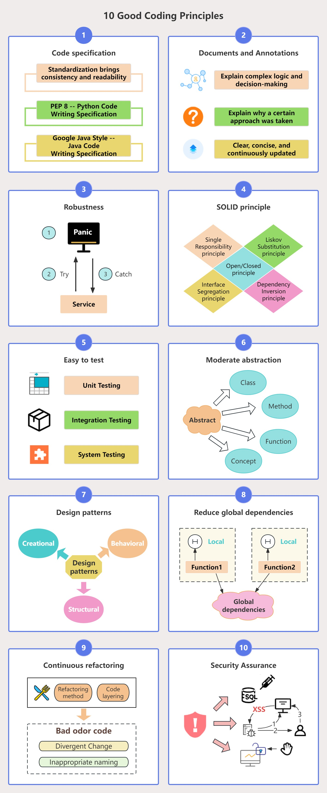

软件开发要有良好的设计和编码原则，在编写代码时，我们需要遵循哪些好代码原则呢？

# 01 遵循代码规范

编写代码时遵循业界成熟的规范至关重要，无论是 `PEP 8`、`Google Java Style` 还是其它，坚持一套约定俗成的代码规范，可以保证代码质量的一致性与可读性。

# 02 文档和注释

好的代码应该编写清晰的文档和注释来解释复杂的逻辑和决策，注释应该解释为什么采取某种做法（`Why`），而不是解释具体做什么（`What`，这是代码内容应该做的）。文档和注释应该清晰、简洁，并持续更新。

# 03 健壮性

好的代码应该能够处理各种预期外的情况和输入，而不会发生崩溃或产生不可预测的结果，最常见的做法就是使用 `try、recover` 等机制捕获并处理异常。

# 04 遵循SOLID原则

单一职责（`Single Responsibility`）、开闭原则（`Open/Closed`）、里氏替换（`Liskov Substitution`）、接口隔离（`Interface Segregation`）和依赖反转（`Dependency Inversion`）——这五大原则（简称 SOLID）是编写扩展性强且容易维护代码的基石。好的代码应该遵循这些准则来改进代码的设计弹性，可维护性和其他软件质量特征。

# 05 易于测试

软件的可测试性尤为重要，特别是线上代码。好的代码应该易于测试，一方面需要努力降低每个函数和组件的复杂度，让测试变得简单直观；另一方面应该支持自动化测试，以确保其行为符合预期。

# 06 适度抽象

抽象需要我们抽取最核心的逻辑，隐藏复杂性，从而让代码更加灵活和通用。好的代码应该找到适中的抽象层次，既不过度设计，也不应忽视长远的可拓展性和可维护性。

# 07 利用设计模式，但不要过度设计

设计模式是前人编码的经典指南，它能帮助我们解决一些常见问题。但是，每一种模式都有它的应用场景，过度使用或错误地使用设计模式，可能会让你的代码变得更加复杂和难以理解。

# 08 减少全局依赖

全局变量和实例可能会让我们陷入依赖的泥沼，让状态管理变得扑朔迷离。好的代码应当依靠局部状态和参数传递，务求清晰的依赖关系，尽量做到函数的纯净无副作用。

# 09 持续重构

好的代码是可维护的，也是可扩展的。持续重构可以尽早发现并修正问题，减少技术债务。

# 10 安全是头等大事

好的代码应该考虑安全性，避免常见的安全漏洞。尤其是金融类应用的代码，一定不能出现 SQL 注入、跨站脚本（XSS）和数据泄露等问题。