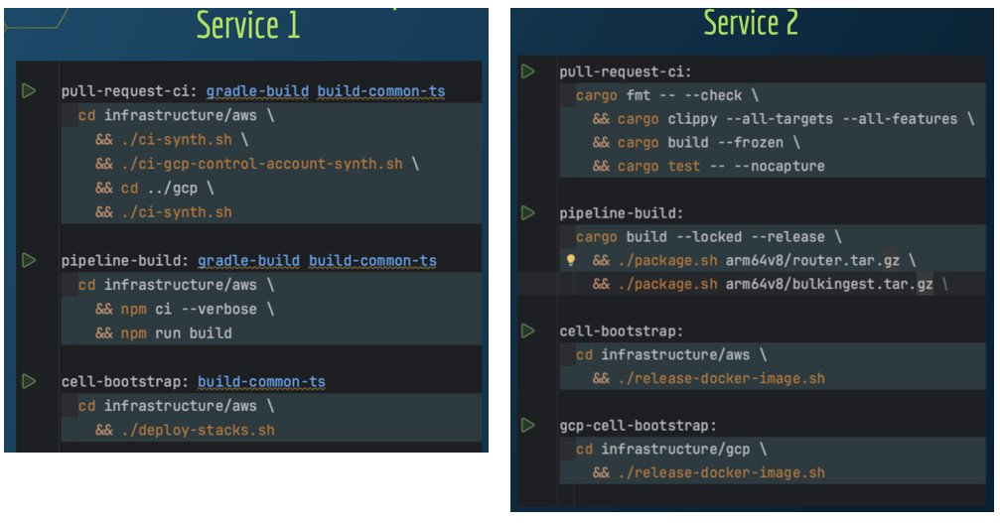

### 关键点提要
蜂窝架构（Cellular Architecture）为客户和企业带来诸多显著好处，例如增加可用性、弹性，以及提高工程速度。
自动化蜂窝基础设施需要解决关键问题：隔离性、新单元的创建、部署、权限管理以及监控。
依赖有效的请求路由和监控来实现高可用性目标是蜂窝架构的核心。
通过基础设施即代码（Infrastructure as Code, IaC）和构建管道实现自动化，采用标准化的应用组件可以简化这一过程。
然而，并不存在适用于所有情况的解决方案。个体可以根据自己的需求选择最合适的工具，并确定实施自动化的程度。

### 蜂窝架构是什么？
蜂窝架构是一种设计模式，旨在提升多租户应用的高可用性。其设计目标是使你能够将应用的所有组件部署入一个独立的“单元”中，这个单元是完全自给自足的。然后，你可以创建这些“单元”的多个独立部署，彼此之间没有依赖关系。

每个单元都是一个完全运行的、自治的应用实例，准备好处理请求，不依赖或与其他单元交互。

用户的流量可以在这些单元之间分配，如果一个单元发生故障，它只会影响该单元中的用户，而其他单元仍然可以完全正常运作。这最大限度地减小了任何服务中断的“冲击范围”，并帮助确保大部分用户的服务级别协议（SLA）不受影响。

组织单元的策略有很多种，决定哪些流量应该路由到哪个单元也有多种方法。如果你想了解更多关于蜂窝架构的好处和不同策略的例子，强烈推荐你查看Peter Voshall在2018年re:Invent的演讲：“如何最小化AWS的失败影响范围”。

管理许多独立单元的应用可能令人望而却步。因此，为创建和维护单元必需的共同基础设施任务构建尽可能多的自动化非常有价值。在本文的其余部分，我们将更多地关注蜂窝架构的“如何”而不是“为什么”。如果想了解“为什么”，请查看Peter的演讲和文章末尾额外资源部分的链接！

### 自动化您的蜂窝架构
在自动化蜂窝基础设施的追求中，需要解决五个关键问题：
- **隔离性**：我们如何确保我们的单元之间有明确的界限？
- **新单元**：我们如何一致高效地将它们上线？
- **部署**：我们如何将最新的代码变更部署到每个单元？
- **权限**：我们如何确保单元的安全，并有效管理其进出权限？
- **监控**：操作员如何一目了然地确定所有单元的健康状态，并轻松识别受影响的单元是哪些？

有许多工具和策略可以用来解决这些问题。在这篇文章中，我们将讨论在Momento公司使用的工具和解决方案。

在解决这些具体问题之前，我们将简要讨论一下标准化的重要性。

### 标准化
为应用中所有组件的构建/测试/部署生命周期的某些部分进行标准化，将大大简化围绕它们构建通用自动化的过程。通用化您的自动化将使其更容易在所有需要部署到每个单元的组件中重用您的基础设施代码。

值得注意的是，我们讨论的是标准化，而非同质化。现代云应用通常不是同质的。你的应用可能包括在不同平台（如Kubernetes、AWS Lambda和EC2）上运行的五种不同的微服务。为了为这些不同类型的组件构建通用自动化，我们只需要标准化它们生命周期的一些具体部分。

#### 标准化 - 部署模板
那么，我们需要标准化什么呢？让我们想想典型的将代码更改推送到生产环境中的步骤：

开发人员将代码更改提交到版本控制仓库。
我们构建包含最新更改的二进制工件；这可能是一个Docker镜像、一个JAR文件、一个ZIP文件或其他工件。
工件被发布或发布：Docker镜像被推送到Docker仓库，JAR文件被推送到Maven仓库，ZIP文件被推送到云存储的某个位置等等。
工件被部署到你的生产环境(们)。这通常涉及在蜂窝环境中串行地部署到每一个单元。
因此，对于我们应用的任何一个组成部分来说，这就是我们希望部署过程看起来的大致模板：

图 1: 最小部署模板

实际上，我们希望在部署流程中添加一些保护措施，使得如果我们发现问题，我们可以停止部署更改，直到我们解决了问题。因此，我们可能要先部署到一个“暂存”单元，并在部署到后续单元之间设定一个“烘焙”时期。在烘焙期间，我们可以监控指标和警报，并在出现问题时停止部署。所以现在我们的部署模板可能看起来更像这样：

图 2: 带有“烘焙”阶段的部署模板

现在，我们的目标是要通用化我们的自动化，使得对于任何应用组件达到这一系列部署步骤变得容易，不论该组件建立在哪种技术之上。

有许多工具可以自动化上面的步骤。在本文的其余部分，我们将使用基于Momento选择的工具的一些示例，但你可以使用最适合你的特定环境的工具来实现这些步骤。

在Momento，我们的大部分基础设施都部署在AWS上，因此我们倾向于使用AWS工具。所以，对于一个在EC2上运行并通过CloudFormation部署的应用组件，我们使用：

AWS CodePipeline定义和执行阶段
AWS CodeBuild执行各个构建步骤
AWS Elastic Container Registry为组件发布新的Docker镜像
AWS CloudFormation部署到每个单元的新版本
AWS Step Functions在“烘焙”步骤中监控警报，并决定是否安全地部署到下一个单元

图 3: 部署阶段实现 - CloudFormation风格

对于一个基于Kubernetes的组件，我们可以通过只做很小的变动来实现相同的步骤：不使用CloudFormation，而是使用AWS Lambda进行API调用到k8s，将新镜像部署到单元。

图 4: 部署阶段实现 - Kubernetes风格

希望你能看到我们的目标；尽管构成我们应用的组件的技术栈不同，我们可以定义一个通用模板，说明推出新更改所涉及的步骤。然后，我们主要可以使用相同的工具链来实现这些步骤，对于特定步骤只做轻微的修改。在我们所有组件的构建生命周期中标准化一些事项将允许我们以一种通用方式构建这些步骤的自动化，意味着我们可以在所有组件中重用很多基础设施代码，并且我们的部署将在所有组件中保持一致和可识别。

#### 标准化 - 构建目标
那么，我们如何在各种组件之间标准化所需的步骤呢？一个有价值的策略是定义一些标准化的构建目标，并在所有组件中重用它们。在Momento，我们使用了一个经过验证的技术：Makefiles。

Makefiles非常简单，而且存在已久。它们完全适合这个目的。

图 5: 使用Makefiles标准化构建目标

在左侧，你可以看到一个Makefile的片段，用于我们的一项Kotlin微服务。右侧是一个Rust服务的Makefile片段。构建命令非常不同，但重要的是我们有完全相同的目标列表。

例如，我们有一个pipeline-build目标，它控制着部署过程中构建步骤的发生。然后我们有一些目标用于“单元引导”和“GCP单元引导”，因为我们可以把部署放在AWS单元或GCP单元中。Makefile目标名称是相同的；这意味着我们的基础设施中的其他部分，当我们在部署时，现在都知道它们可以依赖这些组件内部存在的这个共同的生命周期。

#### 标准化 - 单元注册
帮助我们标准化自动化的另一个构建块是“单元注册”。这只是一种机制，让我们拥有我们创建的所有单元的列表和关于它们的一些基本元数据。

图 6: TypeScript模型用于单元注册

在Momento，我们用TypeScript构建了我们的单元注册。我们有大约100行TypeScript，定义了一些简单的接口，我们可以用这些接口来代表关于我们单元的所有数据。我们有一个CellConfiguration接口，这可能是最重要的一个；它捕获关于给定单元的所有关键信息。这是生产单元还是开发单元？它在什么地区？这个单元的端点的DNS名称是什么？它是AWS单元还是GCP单元？

我们还有一个MomentoOrg接口，其中包含一组CellConfigurations。所以，org只是一种跟踪所有现有单元的方式。

使用这些接口提供的模型，我们可以编写更多的TypeScript代码来实例化这些接口并创建关于我们单元的所有实际数据。这里是那段代码的一个片段：

图 7: 我们“alpha”单元的单元注册数据

这就是我们“alpha”单元的数据可能看起来的样子。我们有一个单元名称、一个账户ID、所在区域、DNS配置等等。现在，每当我们想增加一个新单元时，我们可以进入这个单元注册代码，并在这个数组中添加一个新条目。

既然我们拥有了关于我们单元的所有这些数据，我们需要将其发布到某个地方，以便我们的其余基础设施可以访问它。根据你的需求，你可能会做一些复杂的事情，比如把数据放入一个你可以查询的数据库。我们不需要任何复杂的东西，所以我们只是把数据存储为S3上的JSON。

单元注册的最后一个组成部分是一个小的TypeScript库，它知道如何从S3检索这些数据并将其转换回TypeScript对象。我们将这个库发布到一个私有的npm仓库，然后我们可以从我们的基础设施代码的任何其他地方使用它。这可以让我们开始构建一些通用模式，覆盖我们所有的基础设施自动化；我们可以遍历所有的单元并为每一个配置相同的自动化。

#### 标准化 - 单元引导脚本
要通用化我们的自动化的最后一块标准化是使用“单元引导脚本”。将一个应用的所有组件部署到一个新单元可能非常具有挑战性，耗时且容易出错。然而，一个单元引导脚本可以简化这个过程并确保从一个单元到下一个单元的一致性。

假设每个应用组件的源代码都存储在一个git仓库中，那么引导一个新单元的逻辑就像这样简单：

图 8: 单元引导脚本

使用这五行代码，此脚本提供了一种通用且可扩展的解决方案，用于部署应用的新单元。如果你向应用中引入新的组件，这个脚本仍然适用，确保部署过程简单且一致。

### 把所有组件放在一起
现在我们已经定义了一些标准化的构建块，以帮助我们组织关于单元的信息并通用化应用组件的各种生命周期任务，是时候回顾我们需要解决的五个问题，以便在所有单元中自动化我们的基础设施。

**隔离**
在AWS环境中确保单元之间的隔离最简单的方式是为每个单元创建一个单独的AWS账户。起初，如果你不习惯管理多个账户，这可能看起来有些令人生畏。然而，AWS的工具现在非常成熟，使得这一过程比你想象的要简单。

在专用的AWS账户中部署一个单元可确保从默认情况下与其他单元隔离。你需要设置复杂的跨账户IAM策略，一个单元才能与另一个交互。相反，如果你将多个单元部署到一个单一的AWS账户中，你需要设置复杂的IAM策略来防止单元之间的互动。IAM策略管理是与AWS工作中最具挑战性的部分之一，所以任何时候你可以避免这种需求，都将节省你的时间和减少头痛。

使用多个账户的另一好处是，你可以使用AWS Organizations将账户链接在一起，然后使用AWS Cost Explorer按单元查看和分析你的成本。如果你选择将多个单元部署到一个单一的AWS账户中，你必须仔细标记每个单元相关的资源以查看每个单元的成本。使用多个账户使这一过程变得更简单。

**新单元的创建**  
创建新的单元应该是一个自动化且一致的过程。确保这一点的一种方式是使用脚本或基础设施作为代码工具来定义单元的资源和配置。在AWS上，这可以通过使用CloudFormation或Terraform来完成，这些工具可以允许你预先定义网络设置、服务器实例、存储配置和其他必需的服务。例如，每当需要新的单元时，可以简单地运行相应的CloudFormation模板，自动化地构建出一个配套的环境。

**部署**  
对于部署到各个单元的代码和应用程序包的更新，可以使用CI/CD管道来自动化这一进程。通过自动化测试和部署步骤，我们可以减少人为错误，并确保所有单元都运行相同版本的软件。可以利用如AWS CodeDeploy这样的服务来管理部署策略，如蓝绿部署或滚动更新，以验证新版本在全面部署之前的性能。

**权限管理**  
权限管理也应通过自动化的方式进行。在初始化一个新单元或部署新服务时，使用模板化的IAM角色和策略可以确保每个单元拥有适当的权限。使用精细的访问控制可以确保单元之间的隔离，并防止潜在的数据泄漏或不必要的互相干扰。

**监控**  
有效的监控是维护高可用性的关键。监控系统需要能够跨所有单元收集和聚合数据，并对异常情况进行警报。用于监控的工具应当支持在单元之间隔离观测数据，同时提供中央管理的界面，以便快速识别和响应潜在的问题。AWS CloudWatch 和 AWS X-Ray 是支持这些功能的两个例子，它们可以帮助团队监控应用的健康并追踪请求穿过微服务架构的路径。

### 结论
蜂窝架构为企业提供了一种增强应用可用性和扩展能力的方法。通过将应用分布到独立的运行中单元，每个单元都可以独立于其他单元管理，并且单个单元的失败不会影响整体服务的持续运行。随着单元数量的增加，如何有效地管理它们变得至关重要。通过自动化的创建、权限管理、部署和监控，组织可以降低操作复杂性，同时保持系统的稳定性和安全性。

蜂窝架构不是银弹，但对于需要高可用性、按需扩展和弹性的互联网应用而言，这种架构提供了一种可行的解决方案。最终，选择正确的策略和工具，以及在整个生命周期中标准化自动化和流程，将决定这种架构实现的成功与否。