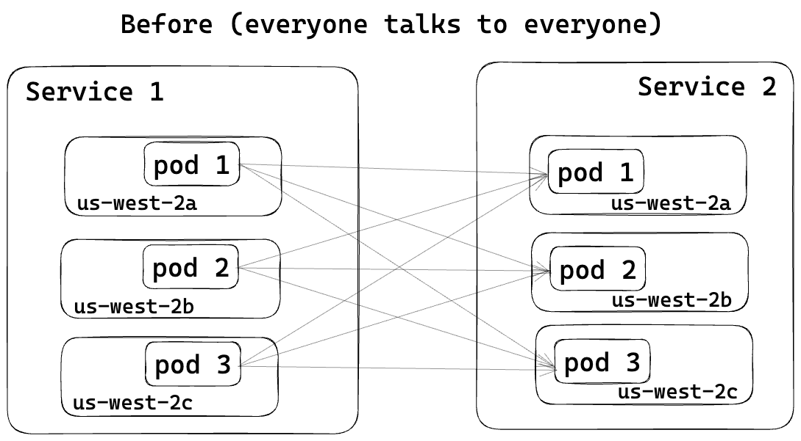
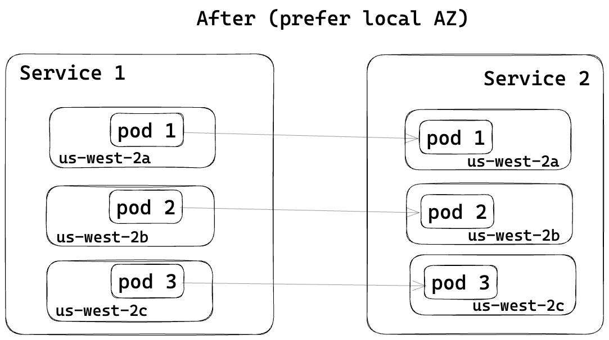
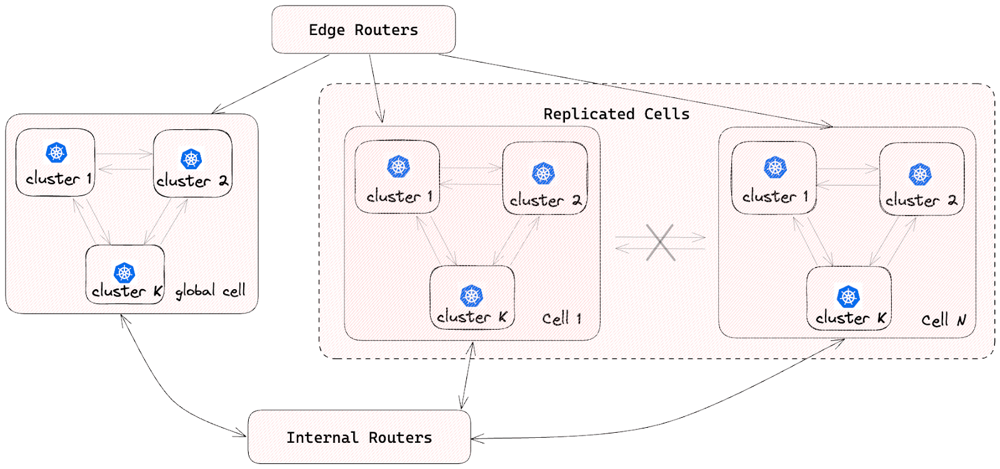

最近，DoorDash显著优化了其云基础设施成本。该公司在转向微服务架构时面临跨可用区（AZ）数据传输成本的增加。为了大幅降低这一成本，DoorDash利用基于Envoy的服务网格实施了识别区域的路由技术，并利用其蜂窝架构（Cell-Based Architecture）取得成功。

在基于Envoy的服务网格中，DoorDash实施识别区域的路由至关重要，这有助于减少云基础设施的成本。这一实践使得DoorDash能够高效地将流量直接引导至同一可用区内，从而最小化更昂贵的跨可用区数据传输。

利用Envoy的识别区域路由功能，调用服务优先向同一可用区内的被调用服务发送流量，从而降低了跨可用区的数据传输成本。下图的“之前”阶段显示的是，使用简单的循环负载均衡器在跨可用区的 Pod 之间如何通信，这会带来额外的费用。相比之下，“之后”的图示显示了如何通过识别区域的路由来优先选择同一区域内的服务。



pod之间的简单循环负载平衡



为了实现区域感知路由，DoorDash修改了其内部定制服务网格控制平面，为Envoy提供每个节点的AZ信息，如下例所示：

``` shell
resources:
 - "@type": type.googleapis.com/envoy.config.endpoint.v3.ClusterLoadAssignment
   cluster_name: payment-service.service.prod.ddsd
   endpoints:
     - locality:
         zone: us-west-2a
       lb_endpoints:
         - endpoint:
             address:
               socket_address:
                 address: 1.1.1.1
                 port_value: 80
     - locality:
         zone: us-west-2b
       lb_endpoints:
         - endpoint:
             address:
               socket_address:
                 address: 2.2.2.2
                 port_value: 80
     - locality:
         zone: us-west-2c
       lb_endpoints:
         - endpoint:
             address:
               socket_address:
                 address: 3.3.3.3
                 port_value: 80
```

DoorDash的蜂窝架构在此次优化中发挥了重要作用。蜂窝架构源于船体中的防水壁设计，通过垂直隔板将船舱内部分为独立的、防水的舱室。“软件架构师采用这种模式对复杂系统进行划分，实现故障隔离。故障隔离边界将故障影响限制在少数几个组件内，并保证边界以外的组件不受影响。

Slack 最近展示了其蜂窝架构的使用情况，以减轻灰色故障的影响。

在DoorDash的蜂窝架构中，每个蜂窝由多个Kubernetes集群组成，每个微服务独家部署在给定蜂窝中的某个集群。DoorDash的工程师将每个Kubernetes集群部署在多个可用区中，以增强可用性和容错能力。



通过在这些蜂窝内启用识别区域的路由，DoorDash有效地将流量本地化，进一步减少了跨可用区的数据传输。这种方法不仅优化了网络效率，还提高了系统的整体弹性，因为它最小化了任何单一蜂窝内部的故障影响，从而增强了DoorDash的微服务生态系统的鲁棒性。

文章的作者Hochuen Wong和Levon Stepanian虽然没有透露具体节省的百分比，但他们表示：“这些措施使DoorDash的数据传输成本大幅减少……以至于我们的云服务供应商联系我们，询问是否遇到了与生产相关的事件。”他们总结道：

* 云服务供应商的数据传输定价比最初看起来更复杂。投资时间以理解定价模型，以便构建正确的效率解决方案是值得的。
* 建立对所有跨可用区流量的全面理解/视图颇具挑战。尽管如此，结合不同来源的网络字节指标足以识别热点，解决这些热点时，可以在使用量和成本上产生实质性的影响。
* 在微服务调用图中随着跳数的增加，跨可用区传输数据的可能性增大，确保所有跳数都支持识别区域路由的复杂性增加。

作者建议拥有基于微服务的系统的所有者研究他们的数据传输成本，并考虑服务网格不仅因其流量管理功能，还因其可能带来更大效率的潜力。