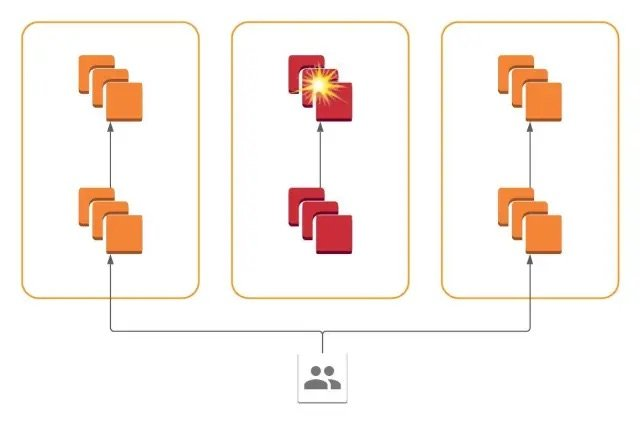
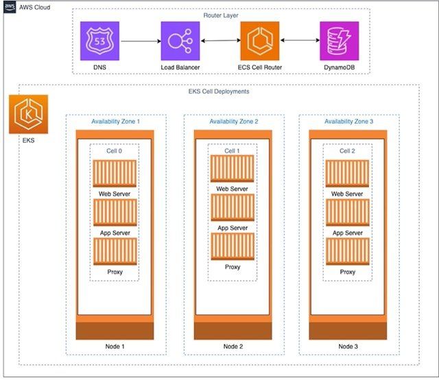

Slack在过去1.5年内将大多数关键的面向用户服务从单体架构迁移到了蜂窝架构。这一举措是由单一可用区的网络中断触发的，这种中断会导致影响用户的服务降级。新架构允许在5分钟内逐步将所有流量从受影响的可用区排空。

Slack具有全球基础设施布局，但其核心平台托管在美国东海岸地区（us-east-1）。公司使用可用区（AZs）进行故障隔离，但仍偶尔会经历灰色故障，即间歇性问题使得在分布式环境中确定组件可用性成为挑战，进而影响最终用户。2021年6月30日，就发生了这样的事件，当时一个可用区的网络设备出现间歇性故障。

Slack的高级工程师员工Cooper Bethea解释说，为什么分布式系统中的故障检测会有问题：

> “事实证明，检测分布式系统中的故障是一个难题。用户的单一Slack API请求（例如，在频道中加载消息）可能会扩展为数百个RPC以服务后端，每个后端都必须完成才能向用户返回正确的响应。我们的服务前端不断尝试检测并排除失败的后端，但在我们能排除失败服务器之前，必须记录一些故障！”

Slack的团队决定采用蜂窝式方法，其中每个AZ包含一个完全隔离的后端部署，组件限制在单个AZ内。流量由使用Envoy/xDS的层引入AZ范围的蜂窝。这种隔离方法在某种程度上是由于Slack平台的异质性所激发，平台中使用了多种语言栈和服务发现接口，因此在后端服务之间引入复杂的路由逻辑将非常繁琐。

有了新架构，公司可以在配置更改在几秒内传播后，迅速将流量从遇到问题的蜂窝中转移出来。流量的转移可以逐步（以1%的粒度）并且优雅地进行（所有进行中的请求都在被排空的蜂窝中完成）。

Slack的做法遵循了AWS提出的指导，并在云原生架构系列中进行了进一步探讨，作者们在其中介绍了不同的工具和技术，以提高云工作负载的可扩展性和弹性，利用基于容器的计算服务。AWS的架构师主张在云架构中建立强大的故障隔离界限，以应对黑天鹅事件并最小化意外故障的影响。

Slack采用蜂窝架构引发了社区中大量的讨论。在繁忙的HN线程中，大多数评论（其中大部分略微偏题），用户tedd4u指出，蜂窝架构至少已存在10年。另一位名为ignoramous的用户（自称前AWS员工）强调，关于蜂窝架构的指导是基于亚马逊和AWS为实现云中的弹性所做的努力。

最近，Roblox也分享了其向蜂窝架构过渡的旅程以及进一步提高平台弹性的未来计划。