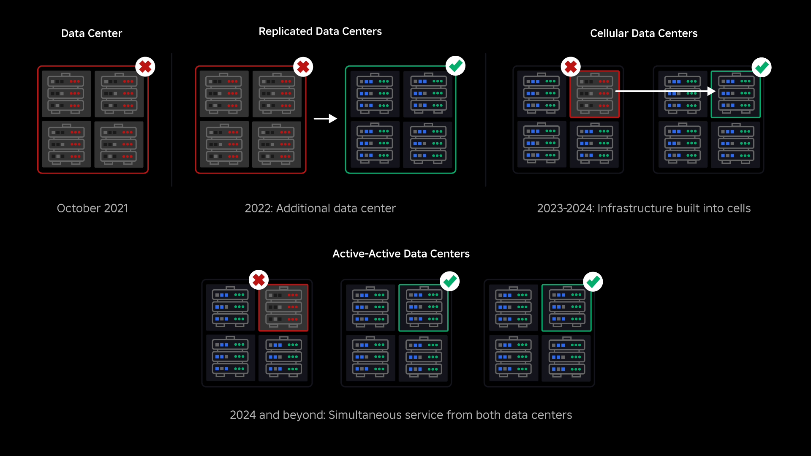

Roblox是一个在线游戏平台和创作系统，该公司详细介绍了如何使其基础设施变得更加高效和有韧性，以支持超过7000万日活跃用户参与沉浸式游戏体验的需求。一篇博客文章深入探讨了Roblox对可靠性的承诺、对2021年一次重大中断的响应，以及正在进行的基础设施转型，以提高效率和弹性。

2021年10月，Roblox面临一次系统范围的中断，持续了73小时，起因是一个数据中心的小问题迅速升级成大规模中断。事后分析促使团队加大努力，加固其基础设施以抵御各种故障因素，如流量激增、天气条件、硬件故障、软件错误和人为错误。重点是防止单一组件的问题扩散到整个系统，并确保网络或用户持续重试操作不会造成与负载相关的级联失败。

对2021年10月中断的直接响应中，Roblox最初在不同区域的一个新数据中心复制了其基础设施，采用活动-被动模式。这意味着一旦主数据中心发生重大故障，团队可以将整个系统故障转移到备份基础设施上。这提供了一种非常需要的弹性，但长期目标是从活动-被动数据中心设置过渡到活动-活动配置，其中两个数据中心同时处理工作负载。目标是实现更高的可靠性和近乎即时的故障转移。

Roblox还在实施蜂窝架构，以在数据中心内建立坚固的“防爆墙”，防止整个数据中心的故障。单元或机器群提供了冗余，并将故障限制在单一蜂窝内。Roblox的目标是将所有服务迁移到蜂窝中，以提高弹性和有效的工作负载管理，其中每个蜂窝（可能包含1400台服务器）都可以在必要时进行修复或完全重新配置。这个过程涉及确保一致性，要求服务进行容器化，并采用基础设施即代码的理念进行蜂窝管理。Roblox的新部署工具会自动确保服务分布在各个蜂窝中，免去服务所有者考虑复制问题。

Roblox将蜂窝比作防火门，将故障限制在单一蜂窝内。目标是使蜂窝可互换，以便在出现问题时快速恢复。然而，管理蜂窝间的交叉沟通带来了挑战，因为核心需求是防止查询重试引发级联故障的“死亡查询”。该平台正在实施短期解决方案，如在每个计算蜂窝部署计算服务的副本，以及跨蜂窝的流量负载均衡，以减少此类情况。

长期计划包括为服务发现引入下一代服务网格，及一种将依赖请求引导至与原调用者相同蜂窝中的服务的方法。这将降低故障从一个蜂窝传播到另一个蜂窝的风险。目前70%的后端流量由蜂窝处理，目标是达到100%。接近30,000台服务器正在运行蜂窝，这不到总服务器量的10%。

在不干扰用户的情况下迁移一个繁忙的“始终在线”平台的复杂性显著。Roblox通过创造性地使用一小部分备用机器，战略性地建立新蜂窝逐步迁移工作负载，然后再利用这些现已空闲的机器进行下一次迁移，而不是进行重大的资本支出来购买全新服务器来运行蜂窝基础设施。这在不同数据中心厅之间造成了一些理想的蜂窝分裂，增加了蜂窝内的弹性。该公司预计到2025年完成迁移，强调了在不扰动用户的情况下部署平衡服务的强大工具的需要，及为确保在蜂窝架构中运行的新服务的兼容性进行彻底测试的重要性。

Roblox的早期努力已证明是成功的，但对蜂窝的工作仍在进行中。随着继续扩展，该平台致力于提高效率和弹性。主要成就包括建立第二个数据中心，在活动和被动数据中心创建蜂窝，将超过70%的后端服务流量迁移到蜂窝，并建立实现一致性的要求。2023年9月，Roblox启动了跨数据中心的活动-活动实验，以提高可靠性和最小化故障转移时间。成功的结果导致了全面活动-活动基础设施的计划，识别了改进的系统设计模式。该平台对推动效率和弹性持续兴奋，将自己设想为为数百万用户提供可靠、高性能服务的工具，并旨在实时连接十亿人。

目前基础设施运行在近145,000台服务器上——两年内增加了三倍，并主要在私有混合云上运行。总之，Roblox当前努力转型其基础设施，使平台为数百万用户提供更大的弹性和效率，为持续增长和创新奠定了基础。