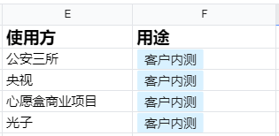
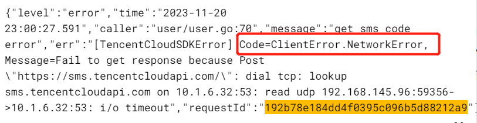
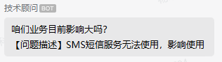
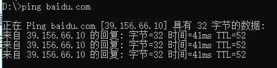
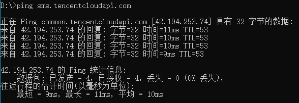
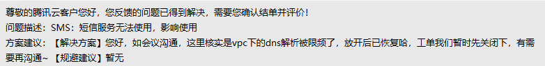

大家好，我是小❤，一个漂泊江湖多年的 985 非科班程序员，曾混迹于国企、互联网大厂和创业公司的后台开发攻城狮。

### 引言

这天，小❤晚上九点多下班，回到家看会书，洗漱好之后就十一点多了，正准备睡觉时，领导一个电话打进来：“小❤，线上服务怎么不可用了，赶紧看下！”

“好的，那我先看日志排查下”。此时我内心 OS，打工人的 24 小时 oncall 真的扛不住啊，开发都快被逼成运维了！

白天开会撕逼，输出各种文档，然后拉通对齐。

晚上抽时间写两行代码被 reviewer 反复折磨，下班了还得排查线上故障，**“新时代农民工” 的小日子可真难过呀**！

但是今天，小❤支棱起来了，因为我大胆预测：**故障肯定不是服务问题，先不急！**

这倒不是对我写的代码质量非常有信心，主要是最近没发版，而且晚上那会还是正常的，突然就不可用了？

**那大概率是环境问题**，就像上次阿里云一样。

来自公众号文章：《【Error】阿里全系产品崩了》

而我们的服务都部署在腾讯云集群，所有的中间件也都是腾讯云的，包括 CLS 日志服务、 SMS 短信服务、MySQL、Redis 等等。

根据链路法则，**服务没问题，那一定是腾讯云出问题了(*￣︶￣)**

### 短信不可用

此时，领导发消息说目前看到的情况是用户登录时无法接收验证码，每次点击获取验证码时，前端就会报一个 **服务内部错误**。

而这，更加证明了我的猜想。

由于后台服务有一套完善的错误码设计体系，所以我们在接口返回中，会报出详细的错误类型和说明。

**而 “服务内部错误”，几乎都是和环境、以及组件依赖相关的，比如 MySQL、SMS 等云端应用**。

> 不了解如何做错误码设计的，可以看我之前的这篇文章：[Go语言错误码设计与管理实践](https://mp.weixin.qq.com/s?__biz=MzI5Nzk2MDgwNg==&mid=2247484618&idx=1&sn=e6c36c497df7acac9239747e6fe36142&chksm=ecac50c3dbdbd9d57d3662b840a9f653f2bca931909ab01a751aa374a31e25e3f0e7d905afd4#rd)

### 权限问题

当然，除了组件本身的问题，还有可能是权限访问问题。

我们做的这个项目是今年上半年刚起步，当时服务刚搭建，所以还没有运维人员。

每次申请账号权限就**默认给自己一个管理员权限，并且在系统里也是用了自己的账号密钥，去管理 SMS 短信、MySQL 等依赖。**

后来，随着团队扩大，商业化步伐逐渐走向正轨，就新增了运维管理。

之前就出过一次问题：运维同学在发版时为了规范流程，把我们开发人员的 SMS 短信服务的管理员**权限回收**了，开了个只读权限，导致服务连不上 SMS 影响了线上使用。

这次，估计又是运维同学搞事情，把我们开发的账号权限回收了吧！

### 呼他手机

这时，领导拉起了一个排查问题的小群，声称目前**开发、测试和正式环境都出了问题，需要赶紧解决**，不然可能要故障升级了。

排查问题的群聊

并且补充了一句：“今晚有几个客户可能会来使用我们的系统！”

由于是在内测阶段，所以客户大多都是有意向合作的甲方爸爸，而我们目前的商业用户主要是 `ToB（面向企业）`的，所以，**影响一个客户的使用可能就会影响了几千万甚至上亿的订单额**，形式有些危急起来了！

系统的内测用户清单

这时，领导似乎想起了什么，问我：“之前 SMS 短信服务是不是也崩过一次，上次不可用是什么原因来着？”

我回应了说是运维回收了权限导致的，并且已经给咱们公司的运维老大发消息了，但是他还没有回应。

领导想也没想：“我拉个语音会议，**呼他手机！**”

### 日志排查

运维负责人进了会议后，第一时间反馈**没有修改任何权限，并且最近都没动腾讯云的账号了**。

“不是权限问题，那可能是什么原因呢”，领导又发话了。

这时，我通过日志的错误类型定位到了具体报错信息：

从日志来看，是访问腾讯云 SMS 短信服务时返回了错误信息：`ClientError.NetworkError，网络异常`。

我赶紧把日志截图发到了群里，并同步到了**腾讯云技术支持群**：

> 腾讯云技术支持群，是腾讯云团队专门给甲方客户创建的群聊，我们公司几乎所有的组件都是用的腾讯云产品，所以是 VIP 贵宾级甲方。

同时，又有同事在 VIP 群里反馈，`cos 对象存储服务也用不了`。

此时，已经快晚上十一点半了，我想起了之前阿里云事故：作为重灾区的对象存储服务不可用后，直接导致了淘宝、闲鱼等一系列应用的崩溃。

> 时光穿梭机：[【Error】阿里全系产品崩了](https://mp.weixin.qq.com/s?__biz=MzI5Nzk2MDgwNg==&mid=2247485382&idx=1&sn=b914f23bf0d68cbf0e80683ed774da04&chksm=ecac53cfdbdbdad98b93b260e02ea2e5a0577c70da3e24a81bd7faa323db956d936eb75e5c7a#rd)

而这次，腾讯云也要重蹈覆辙了吗？！

### 技术支持

两个腾讯云产品同时出现问题，而且还是 VIP 甲方爸爸的问题，腾讯云的技术支持也坐不住了，很快在技术支持群里做出了响应：

我也立即在群里回复：“是的，正式环境有客户用，急，需要立刻解决！”

同时，**领导已经把腾讯云的负责人拉进了语音群聊，问题再一次得到了升级**。

腾讯云负责人本来睡意朦胧，已经快睡着了，但看到群消息后立马清醒了过来，并果断拉了四个腾讯的运维人员到语音群里，招呼着进行排查。

首先，从日志出发看到是网络问题，于是腾讯的运维人员让我们从**集群、以及非集群的云服务器上，看下是否可以 ping 通 SMS 短信服务的域名。**

我在集群 pod 里试了下，不出意外地，访问不通：

同时，运维人员排查了腾讯云的整体网络链路，但是并没有发现问题。

这时，已经晚上十二点过了。

### 集群域名解析问题？

网络没有问题？那不应该 ping 不通啊，**就像我们可以在本地正常访问百度一样，任何一台联网的计算机都可以正常 ping 通互联网上任意一个未隔离的公网域名**，就像这样：

诶？等等，未隔离，腾讯云 SMS 短信服务面向全球用户，肯定不会对某台计算机进行隔离，那我本地应该也可以访问通啊，试一下：

果然可以，**那为啥我们线上的集群访问不通呢？**

这时，我想到之前有一次也出过类似的问题，当时我们的开发环境、测试和正式三个环境的所有系统都部署在了一个集群里，整个集群的节点数近 300 个，但是 `coredns（在 k8s 中提供域名解析、服务发现等能力）`只有 2 个副本。

所以出现了 **coredns 请求量过大，负载过高**的问题，导致我们后台服务请求腾讯云资源时，域名解析都非常慢，造成大批量访问超时！

而我们集群是部署在腾讯云上海地区的，为了验证是不是集群带宽的问题，我从集群外找了一台上海地区的云服务器，尝试访问腾讯云 SMS：

还是访问不通！

这时，我们的运维老大说：“**广州地区的云服务器可以 ping 通腾讯云 SMS 短信服务，但是上海地区的机器都不行**”。

### VPC问题

腾讯云的运维人员听到这个反馈，赶紧做了地区网络排查，但是发现**上海地区的网络环境良好**，访问腾讯云应用也是正常的。

“难道是我们自己的 `VPC（Virtual Private Cloud，私有网络）`有问题吗” ？ 我提出了心中的疑问。

可是腾讯运维人员也没有我们的 VPC 机器啊，于是，运维老大说可以给出一台空闲的 VPC 机器，让腾讯运维人员多次访问抓包看一下。

这时，已经是凌晨十二点半了！

经过运维人员的多次访问和抓包，发现**有很小几率可以正常访问**，但是大部分请求都会超时。

“那可能不是网络问题，而是限流问题，和我们上次的 coredns 问题一样” ？我们运维老大说。

果不其然，运维人员查看了下内部限流策略，是我们公司 **VPC 下的 dns 解析被腾讯云限制访问频率了**。

### 爬虫流量过大被限制

又经过一番排查，腾讯的运维人员发现，在我们公司的 VPC 上有个爬虫服务，在一个小时前开启了压测，正在高并发爬取外部网络域名，所以占用了大量的 dns 资源。

于是，**腾讯云的限流策略将这个 VPC 节点当成了不良用户，把整个 VPC 的 dns 解析都限频了**，所以当服务调用腾讯云域名时，由于排队时间太久 & dns 资源不足，所以报了网络错误的异常。

当腾讯运维人员把限频解除，等了两三分钟后，短信服务、对象存储服务等应用终于恢复正常。

### 小结

后来，腾讯云的负责人召集运维人员做了紧急复盘，确认目前 dns 限频和爬虫封禁的策略未公开，而**同一个 VPC 下的服务节点 dns 限流时可能会影响别的线上业务**，所以需要我们也关注一下。

这时，已经凌晨 1 点多了~

然后，困意朦胧的我艰难起身，写下了这篇文章。

非常感谢各位读者耐心看完我这平淡的陈述，**排查问题时的惊心动魄难以言语，但屏幕前的各位同道中人应该理解的！**

如果觉得文章有所启发或收获，不妨点赞、分享，加入在看，这对我是最大的鼓励！

ღ( ´･ᴗ･` )比心

如果你有任何问题或想了解更多，也随时在评论区提问，谢谢你的阅读！

我是小❤，我们下期再见。

点个在看** 你最好看

经过这件事过后，爬虫和压测类的服务，我们都用上了**弹性资源，并且与线上服务做了进一步 VPC 地区隔离**，希望能避免类似的问题。